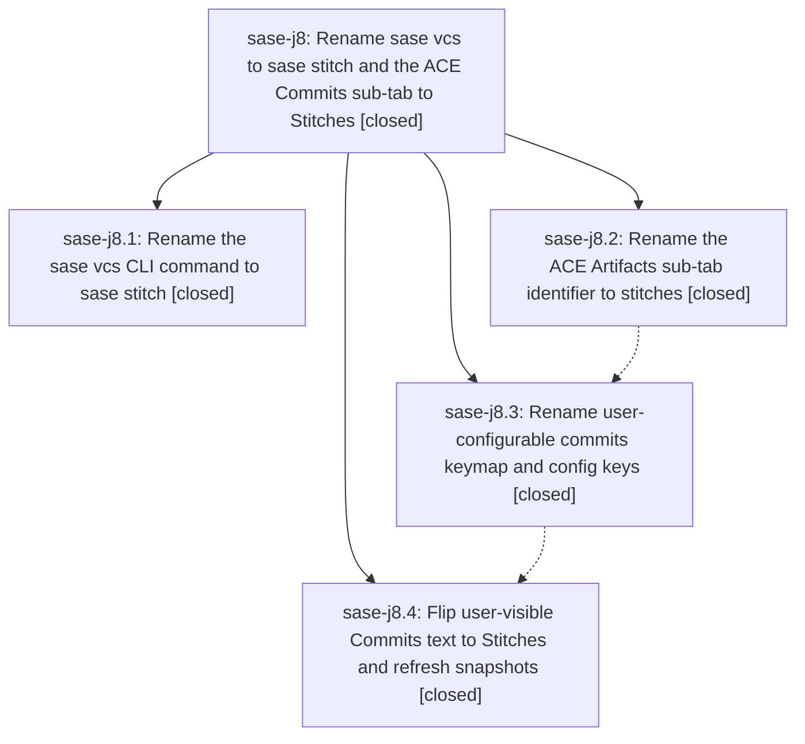

# Bead: sase-j8 — Rename sase vcs to sase stitch and the ACE Commits sub-tab to Stitches

[Bead Pages](../README.md) / sase-j8

**Status:** ✓ closed · **Resolution:** done · **Type:** ▸ plan · **Tier:** epic
**Owner:** `bryanbugyi34@gmail.com` · **Created by:** [bbugyi200.athena.xn](https://github.com/sase-org/sase--agents/blob/main/agents/bbugyi200.athena.xn/README.md) · **Assignee:** `sase-j8.land`
**Created:** 2026-08-10 16:17:50 EDT · **Closed:** 2026-08-10 20:17:38 EDT
**Plan:** [202608/stitch\_rename.md](https://github.com/sase-org/sase--plans/blob/main/202608/stitch_rename.md)

## Description

`sase stitch` is the CLI command for the repository constellation and cross-repo timeline (with `sase vcs` still accepted as a legacy alias), and the ACE Artifacts tab's second pane is named "Stitches" end to end — label, sub-tab identifier, DOM ids, keymap action ids, and config keys — with legacy keymap/config names still honored and warned about.

## Notes

[2026-08-11T00:17:38Z · sase-j8.land] Verified all four phases against the shipped code, not just their reports, then integrated the epic with everything that landed alongside it.

VERIFIED IN SOURCE (sase-j8.1 cli): sase stitch is canonical with vcs as a silent alias — parser_stitch.py/stitch_handler.py hold the implementation, parser_vcs.py/vcs_handler.py are star-reexport facade shims, register_vcs_parser/handle_vcs_command remain as exported symbol aliases, and _COMMAND_REGISTRARS carries both keys. Confirmed live: 'sase stitch --help', 'sase vcs --help', and the compact root help all render the stitch spelling. The only surviving 'sase vcs' strings in src/, docs/, and tests/ are the five deliberate legacy-alias mentions.

(sase-j8.2 subtab-id): artifact_tabs.py is stitches end to end (ArtifactsSubTab, ArtifactsPaneKey, DEFAULT_ARTIFACTS_SUBTAB, ARTIFACTS_SUBTAB_ORDER, ARTIFACTS_PANE_IDS, ARTIFACTS_ACCENTS with the #FFD700 accent preserved). No artifacts-commits-pane, commits-detail-scroll, or #commits-* DOM id survives in src/; styles.tcss's remaining 'commits' hits are only the unrelated PluginActionConfirmModal selectors and the revert-agent comment. The regression test lives at tests/ace/tui/test_artifacts_scaffold.py:500. artifact_ref_entries.py maps stitches->commit alongside the retained commits/commit legacy keys.

(sase-j8.3 config-keys): ten stitches_* app actions with ten matching _LEGACY_APP_KEY_ALIASES entries; artifacts_stitches copy group with a generalized {legacy: canonical} _LEGACY_COPY_GROUP_ALIASES table; ace.artifacts.stitches in default_config.yml and sase.schema.json with commits retained as a deprecated property, plus commit_config.py's fallback/precedence/warning logic. Every TODO(sase-j8.3) bridge that phase 2 left behind was removed — no sase-j8 marker remains anywhere in src/, tests/, docs/, tools/, or the Justfile.

(sase-j8.4 labels): tab-strip label, accent chip, placeholder copy, quickstart, help-modal section titles, Copy Mode header, and palette metadata (which keeps both 'stitches' and 'commits' as search aliases) all read Stitches; docs/cli.md anchors match docs/vcs.md's new headings; snapshot ids and PNGs were renamed artifacts_commits_* -> artifacts_stitches_* and copy_as_commits_* -> copy_as_stitches_*. Scope boundaries were honored: vcs_log/vcs_list engines, the commit: artifact-ref scheme, CommitsPane/CommitsTimeline module and class names, and per-row commit wording are untouched.

INTEGRATION (nine non-epic commits landed since 83e3d3c27, plus the linked repos):
1. Fixed 12 stale 'commits' sub-tab literals the rename phases missed across 9 test files (test_command_availability_scope.py, test_agents_zoom_panel_action.py, test_jump_all_entries_prs_subtab.py, test_jump_to_changespec.py, test_agents_panel_fold_mode.py, test_artifacts_copy_references.py, test_copy_targets.py, test_commits_pane_filters.py, test_commits_pane_collection.py). mypy only type-checks src/, so these were invisible: several assertions had gone vacuous by naming a sub-tab that no longer exists, and four pane-config tests were exercising the deprecated ace.artifacts.commits key instead of the canonical one.
2. Regenerated tests/ace/tui/visual/snapshots/png/snippet_save_confirm_diff_120x40.png. Commit 9edf68079 (sase-j3.land) added that golden at 19:32 EDT, four minutes before sase-j8.4 flipped the Artifacts strip label at 19:36, so it still rendered '1 Commits'. Confirmed by cropping expected vs actual before accepting; the only pixel change is Commits -> Stitches in the sub-tab strip. Full visual suite now 652 passed, 1 skipped.
3. Bumped the flake-baseline effective-after cutoff in tests/reproducible_flake_baseline.txt from 2026-08-10T16:50:24Z to 2026-08-10T23:36:35Z (one second past 9c46891c5). The gate was judging this epic's own pre-fix history for test_stitches_action_override_wins_over_legacy_commits_alias, which sase-j9.1's new '-' collapse_panel_folds default broke and sase-j8.4 already fixed by moving the override key from minus to f24. Same mechanism and precedent as commit 83bb8a6f7; no node IDs were added to or removed from the baseline list.
4. Checked and found nothing to change: the concurrent tale stitch_create_migration.md builds 'sase stitch create' explicitly on sase-j8.1's alias precedent; sase-j9.1's fold sweep touches no commits/stitches surface; the sase-j3 snippet-pane work is confined to the prompt stack; and linked repos sase-nvim and sase-core contain no 'sase vcs' or artifacts-commits references.

VERIFICATION: just check-full fully green (every lint gate, test cost, and the flake-baseline gate). just test-visual 652 passed / 1 skipped. just check green.

FOLLOW-UPS (all four PROPOSED FOLLOW-UP notes across the child beads):
- sase-j8.1's 'sase stitch list lists repos, not stitches, and overlaps sase repo list' -> filed as new task sase-jh (large, ready), with RELATED notes pointing at sase-je and this epic.
- The flake-baseline follow-up repeated on sase-j8.1/.2/.3 (test_logs_pane and test_plus_one_presentation) -> already tracked by open beads sase-jb and sase-j6; no duplicate filed. Since I only reproduced the gate report and not the underlying test failures, I recorded a context note on each bead rather than a +1, explaining that my cutoff bump drops their pre-cutoff evidence and that future full-lane runs will re-flag them if still live.
- sase-j8.4's stale Symvision --epic-symbol sase-j3(SnippetTriggerMatch) whitelist -> already fixed by commit 9edf68079 three minutes after the note was written; verified 'lint (symvision)' passes clean. Annotated the duplicate report sase-jg with that evidence and a close recommendation.
- Also annotated sase-jf (filed 13 minutes ago from a workspace one commit behind, reporting the minus/collapse_panel_folds collision) with proof that 9c46891c5 already fixed it.

[2026-08-11T00:19:06Z · sase-j8.land] Land verification: confirmed all four phases against shipped code, not just their reports. (1) CLI: 'sase stitch' canonical with 'vcs' a silent alias; parser_vcs.py/vcs_handler.py are star-reexport facades; register_vcs_parser/handle_vcs_command retained as exported aliases; verified live via 'sase stitch --help', 'sase vcs --help', and compact root help. (2) Sub-tab id 'stitches' end to end in artifact_tabs.py; no artifacts-commits-pane or #commits-* DOM id survives in src/; regression test at tests/ace/tui/test_artifacts_scaffold.py. (3) Config keys: ten stitches_* actions with ten legacy aliases, artifacts_stitches copy group, ace.artifacts.stitches with 'commits' retained as deprecated; every TODO(sase-j8.3) bridge from phase 2 removed. (4) Labels: strip, chip, placeholder, help modal, palette, docs, renamed snapshot ids/PNGs; scope boundaries (vcs engines, commit: refs, CommitsPane class names) honored.

Integration with post-start commits: fixed 12 stale 'commits' sub-tab literals across 9 test files that mypy could not catch (src-only checking) and that had left several assertions vacuous plus four pane-config tests exercising the deprecated ace.artifacts.commits key; regenerated PNG golden snippet_save_confirm_diff_120x40.png, which landed via 9edf68079 four minutes before j8.4 flipped the label and still rendered '1 Commits' (confirmed by cropped expected-vs-actual before regenerating); bumped the reproducible flake baseline cutoff past 9c46891c5 so the gate stops judging the epic's own pre-fix history for the minus/collapse_panel_folds collision j8.4 already fixed (same precedent as 83bb8a6f7, no baseline entries added or removed). Checked clean: concurrent 'sase stitch create' work builds on j8.1's precedent; sase-nvim and sase-core carry no 'sase vcs' references.

Verification: 'just check-full' fully green, 'just test-visual' 652 passed / 1 skipped, 'just symvision' clean.

Follow-ups: filed sase-jh (large, ready) for 'sase stitch list' listing repos and overlapping 'sase repo list'. The repeated flake follow-up already had beads sase-jb/sase-j6, so no duplicate was filed; I recorded context notes rather than a +1 because I reproduced the gate report but not the underlying test failures. The Symvision whitelist follow-up was already fixed by 9edf68079, so I annotated the duplicate report sase-jg and sase-jf (filed from a workspace one commit behind) with proof that 9c46891c5 fixed it.

## Phases

| Bead | Title | Status | Size | Created | Agents | Commits |
|---|---|---|---|---|---:|---:|
| [sase-j8.1](sase-j8.1.md) | Rename the sase vcs CLI command to sase stitch | ✓ closed | medium | 2026-08-10 | 1 | 1 |
| [sase-j8.2](sase-j8.2.md) | Rename the ACE Artifacts sub-tab identifier to stitches | ✓ closed | medium | 2026-08-10 | 1 | 1 |
| [sase-j8.3](sase-j8.3.md) | Rename user-configurable commits keymap and config keys | ✓ closed | medium | 2026-08-10 | 1 | 1 |
| [sase-j8.4](sase-j8.4.md) | Flip user-visible Commits text to Stitches and refresh snapshots | ✓ closed | medium | 2026-08-10 | 1 | 1 |

## Lineage

## Agents

| Agent | Bead | Commits |
|---|---|---:|
| [bbugyi200.athena.sase-j8.1](https://github.com/sase-org/sase--agents/blob/main/agents/bbugyi200.athena.sase-j8.1/README.md) | [sase-j8.1](sase-j8.1.md) | 1 |
| [bbugyi200.athena.sase-j8.2](https://github.com/sase-org/sase--agents/blob/main/agents/bbugyi200.athena.sase-j8.2/README.md) | [sase-j8.2](sase-j8.2.md) | 1 |
| [bbugyi200.athena.sase-j8.3](https://github.com/sase-org/sase--agents/blob/main/agents/bbugyi200.athena.sase-j8.3/README.md) | [sase-j8.3](sase-j8.3.md) | 1 |
| [bbugyi200.athena.sase-j8.4](https://github.com/sase-org/sase--agents/blob/main/agents/bbugyi200.athena.sase-j8.4/README.md) | [sase-j8.4](sase-j8.4.md) | 1 |
| [bbugyi200.athena.sase-j8.land](https://github.com/sase-org/sase--agents/blob/main/agents/bbugyi200.athena.sase-j8.land/README.md) | [sase-j8](README.md) | 2 |

## Commits

| Repo | Commit | Subject | Bead | Committed |
|---|---|---|---|---|
| sase | [`83e3d3c`](https://github.com/sase-org/sase/commit/83e3d3c274be7baf5f59d3d28040e1e1bcf0d383) | feat(cli): rename vcs command to stitch | [sase-j8.1](sase-j8.1.md) | 2026-08-10 17:07:34 EDT |
| sase | [`c69d163`](https://github.com/sase-org/sase/commit/c69d16378ce32661565654463c19f8dd03c2ac76) | refactor(ace): rename Artifacts commits sub-tab identifier to stitches | [sase-j8.2](sase-j8.2.md) | 2026-08-10 17:47:04 EDT |
| sase | [`7a4b4da`](https://github.com/sase-org/sase/commit/7a4b4daa788b3db9542b593cdd3b7cd7c3e96b69) | refactor(ace): rename commits\_\* keymap actions, artifacts\_commits copy group, and ace.artifacts.commits config to stitches | [sase-j8.3](sase-j8.3.md) | 2026-08-10 18:51:06 EDT |
| sase | [`9c46891`](https://github.com/sase-org/sase/commit/9c46891c5e43af06aee3fab1ffab7004000261f1) | feat(ace): rename Artifacts commits pane to Stitches | [sase-j8.4](sase-j8.4.md) | 2026-08-10 19:36:35 EDT |
| sase | [`2f85bf0`](https://github.com/sase-org/sase/commit/2f85bf025bf173bc336d5204e756fcf969b33aa8) | test(ace): update stale commits sub-tab references after Stitches rename | [sase-j8](README.md) | 2026-08-10 20:19:58 EDT |
| sase--plans | [`sase--plans@a56c8d7`](https://github.com/sase-org/sase--plans/commit/a56c8d743610c280e396a812c35cd6edf063a5ec) | docs(plans): mark stitch rename plan done | [sase-j8](README.md) | 2026-08-10 20:21:44 EDT |
