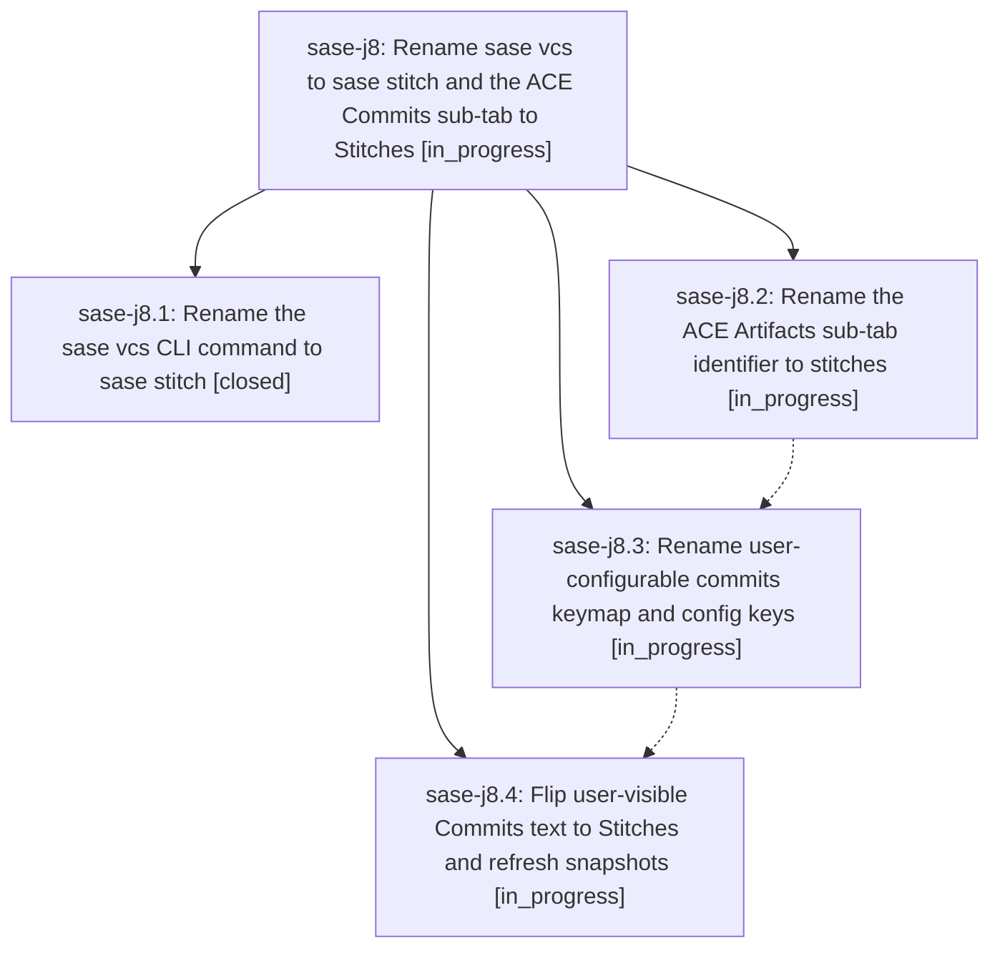

# Bead: sase-j8 — Rename sase vcs to sase stitch and the ACE Commits sub-tab to Stitches

[Bead Pages](../README.md) / sase-j8

**Status:** ◐ in_progress · **Type:** ▸ plan · **Tier:** epic
**Owner:** `bryanbugyi34@gmail.com` · **Created by:** [bbugyi200.athena.xn](https://github.com/sase-org/sase--agents/blob/main/agents/bbugyi200.athena.xn/README.md) · **Assignee:** `sase-j8.land`
**Created:** 2026-08-10 16:17:50 EDT
**Plan:** [202608/stitch\_rename.md](https://github.com/sase-org/sase--plans/blob/main/202608/stitch_rename.md)

## Description

`sase stitch` is the CLI command for the repository constellation and cross-repo timeline (with `sase vcs` still accepted as a legacy alias), and the ACE Artifacts tab's second pane is named "Stitches" end to end — label, sub-tab identifier, DOM ids, keymap action ids, and config keys — with legacy keymap/config names still honored and warned about.

## Phases

| Bead | Title | Status | Size | Created | Agents | Commits |
|---|---|---|---|---|---:|---:|
| [sase-j8.1](sase-j8.1.md) | Rename the sase vcs CLI command to sase stitch | ✓ closed | medium | 2026-08-10 | 1 | 1 |
| [sase-j8.2](sase-j8.2.md) | Rename the ACE Artifacts sub-tab identifier to stitches | ◐ in_progress | medium | 2026-08-10 | 1 | 0 |
| [sase-j8.3](sase-j8.3.md) | Rename user-configurable commits keymap and config keys | ◐ in_progress | medium | 2026-08-10 | 1 | 0 |
| [sase-j8.4](sase-j8.4.md) | Flip user-visible Commits text to Stitches and refresh snapshots | ◐ in_progress | medium | 2026-08-10 | 1 | 0 |

## Lineage

## Agents

| Agent | Bead | Commits |
|---|---|---:|
| [bbugyi200.athena.sase-j8.1](https://github.com/sase-org/sase--agents/blob/main/agents/bbugyi200.athena.sase-j8.1/README.md) | [sase-j8.1](sase-j8.1.md) | 1 |
| [bbugyi200.athena.sase-j8.2](https://github.com/sase-org/sase--agents/blob/main/agents/bbugyi200.athena.sase-j8.2/README.md) | [sase-j8.2](sase-j8.2.md) | 0 |
| [bbugyi200.athena.sase-j8.3](https://github.com/sase-org/sase--agents/blob/main/agents/bbugyi200.athena.sase-j8.3/README.md) | [sase-j8.3](sase-j8.3.md) | 0 |
| [bbugyi200.athena.sase-j8.4](https://github.com/sase-org/sase--agents/blob/main/agents/bbugyi200.athena.sase-j8.4/README.md) | [sase-j8.4](sase-j8.4.md) | 0 |
| [bbugyi200.athena.sase-j8.land](https://github.com/sase-org/sase--agents/blob/main/agents/bbugyi200.athena.sase-j8.land/README.md) | [sase-j8](README.md) | 0 |

## Commits

| Repo | Commit | Subject | Bead | Committed |
|---|---|---|---|---|
| sase | [`83e3d3c`](https://github.com/sase-org/sase/commit/83e3d3c274be7baf5f59d3d28040e1e1bcf0d383) | feat(cli): rename vcs command to stitch | [sase-j8.1](sase-j8.1.md) | 2026-08-10 17:07:34 EDT |
