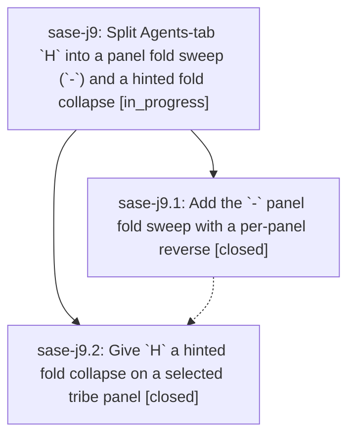

# Bead: sase-j9 — Split Agents-tab \`H\` into a panel fold sweep (\`-\`) and a hinted fold collapse

[Bead Pages](../README.md) / sase-j9

**Status:** ◐ in_progress · **Type:** ▸ plan · **Tier:** epic
**Owner:** `bryanbugyi34@gmail.com` · **Created by:** [bbugyi200.athena.xo](https://github.com/sase-org/sase--agents/blob/main/agents/bbugyi200.athena.xo/README.md) · **Assignee:** `sase-j9.land`
**Created:** 2026-08-10 17:20:11 EDT
**Plan:** [202608/agents\_panel\_fold\_sweep.md](https://github.com/sase-org/sase--plans/blob/main/202608/agents_panel_fold_sweep.md)

## Description

On the Agents tab, `-` collapses every open fold in the tribe panel that holds focus — from whole-panel focus or from a row inside it — and reverses itself when that panel has nothing left to collapse, while `H` on a selected tribe panel hints every collapsible fold and collapses exactly the one you pick.

## Notes

[2026-08-10T22:57:05Z · bryanbugyi34@gmail.com] NOTE FROM USER: Fix the '-' keymap so we only collapse agent clans / agent lanes, never panel groups like 'Done' or 'Running'.

[2026-08-10T22:57:19Z · bryanbugyi34@gmail.com] NOTE FROM USER: Fix the '-' keymap so we only collapse agent clans / agent lanes, never panel groups like 'Done' or 'Running'.

[2026-08-10T23:00:48Z · bryanbugyi34@gmail.com] The old behavior of folding one panel group at a time starting from the bottom, which used to happen when all agent clans / lanes were collapsed in the selected agent tribe panel, can be dropped.

## Phases

| Bead | Title | Status | Size | Created | Agents | Commits |
|---|---|---|---|---|---:|---:|
| [sase-j9.1](sase-j9.1.md) | Add the \`-\` panel fold sweep with a per-panel reverse | ✓ closed | medium | 2026-08-10 | 1 | 1 |
| [sase-j9.2](sase-j9.2.md) | Give \`H\` a hinted fold collapse on a selected tribe panel | ✓ closed | medium | 2026-08-10 | 1 | 1 |

## Lineage

## Agents

| Agent | Bead | Commits |
|---|---|---:|
| [bbugyi200.athena.sase-j9.1](https://github.com/sase-org/sase--agents/blob/main/agents/bbugyi200.athena.sase-j9.1/README.md) | [sase-j9.1](sase-j9.1.md) | 1 |
| [bbugyi200.athena.sase-j9.2](https://github.com/sase-org/sase--agents/blob/main/agents/bbugyi200.athena.sase-j9.2/README.md) | [sase-j9.2](sase-j9.2.md) | 1 |
| [bbugyi200.athena.sase-j9.land](https://github.com/sase-org/sase--agents/blob/main/agents/bbugyi200.athena.sase-j9.land/README.md) | [sase-j9](README.md) | 0 |

## Commits

| Repo | Commit | Subject | Bead | Committed |
|---|---|---|---|---|
| sase | [`62a4dde`](https://github.com/sase-org/sase/commit/62a4ddeb5feb6d5990921b113a0c776519df6096) | feat(ace): add \`-\` panel fold sweep with per-panel reverse | [sase-j9.1](sase-j9.1.md) | 2026-08-10 18:52:37 EDT |
| sase | [`9608b16`](https://github.com/sase-org/sase/commit/9608b163e98c3b207a7679eb57fe4c7106a580f7) | feat(ace): give H a hinted fold collapse on a selected tribe panel | [sase-j9.2](sase-j9.2.md) | 2026-08-10 20:03:16 EDT |
