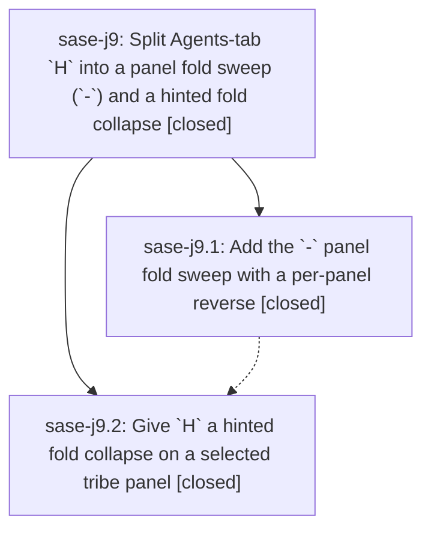

# Bead: sase-j9 — Split Agents-tab \`H\` into a panel fold sweep (\`-\`) and a hinted fold collapse

[Bead Pages](../README.md) / sase-j9

**Status:** ✓ closed · **Resolution:** done · **Type:** ▸ plan · **Tier:** epic
**Owner:** `bryanbugyi34@gmail.com` · **Created by:** [bbugyi200.athena.xo](https://github.com/sase-org/sase--agents/blob/main/agents/bbugyi200.athena.xo/README.md) · **Assignee:** `sase-j9.land`
**Created:** 2026-08-10 17:20:11 EDT · **Closed:** 2026-08-10 21:38:47 EDT
**Plan:** [202608/agents\_panel\_fold\_sweep.md](https://github.com/sase-org/sase--plans/blob/main/202608/agents_panel_fold_sweep.md)

## Description

On the Agents tab, `-` collapses every open fold in the tribe panel that holds focus — from whole-panel focus or from a row inside it — and reverses itself when that panel has nothing left to collapse, while `H` on a selected tribe panel hints every collapsible fold and collapses exactly the one you pick.

## Notes

[2026-08-10T22:57:05Z · bryanbugyi34@gmail.com] NOTE FROM USER: Fix the '-' keymap so we only collapse agent clans / agent lanes, never panel groups like 'Done' or 'Running'.

[2026-08-10T22:57:19Z · bryanbugyi34@gmail.com] NOTE FROM USER: Fix the '-' keymap so we only collapse agent clans / agent lanes, never panel groups like 'Done' or 'Running'.

[2026-08-10T23:00:48Z · bryanbugyi34@gmail.com] The old behavior of folding one panel group at a time starting from the bottom, which used to happen when all agent clans / lanes were collapsed in the selected agent tribe panel, can be dropped.

[2026-08-11T01:38:47Z · sase-j9.land] Landing sweep restricted `-` to structural agent lanes and clans only, integrated
concurrent commits-to-stitches keymap migration.

Epic commits: 62a4ddeb5 (sase-j9.1, `-` panel fold sweep), 9608b163e (sase-j9.2, hinted
`H` collapse). Landing sweep narrows `-` per user notes: it now sweeps/restores only
lane and clan structural folds, never grouping banners (Done/Running/project/etc); a
panel with only open banners reports nothing to collapse or restore. `H`'s hinted
collapse is unchanged and still targets banners too. PanelFoldSweepRecord dropped
group_keys/GroupKey; removed dead expanded_panel_level_zero_group_keys; rewrote
test_agent_panel_fold_sweep.py for the narrowed contract (15 tests, incl. new
group-only regression); resynced docs/ace.md, docs/agent_families.md, and footer/help
text. Verification also found and fixed a real bug: H's whole-panel-focus "collapse
fold" footer chip was incorrectly piggybacking on the narrowed `-` availability
predicate, suppressing the chip whenever a panel had only an open banner (no lane/clan).
Decoupled with a new panel_hint_collapse_available flag threaded through
_display_detail_footer.py -> _keybinding_modes.py -> _keybinding_bindings.py.

Post-start integration audit: commit 9c46891c5 (commits->stitches keymap migration)
changed test_stitches_action_override_wins_over_legacy_commits_alias to the unclaimed
f24 key; that test passes at current HEAD and was re-verified after all
snapshot/formatting updates. No post-start commit was reverted or duplicated.

Verification: just install; focused suites (fold sweep, hint collapse, footer, command
catalog/availability, keymaps defaults/loading/validation/help; 237 tests) all green;
just test-visual green (652 passed, 1 skipped) after regenerating 96 PNG goldens for
the narrowed `-` footer chip/reflow plus the H-availability fix; just check green (all
lint gates + scoped tests, 7236 passed); just check-full green except the pre-existing
historical flake-baseline meta-gate (3 already-tracked flakes: test_logs_pane owned by
sase-jb, test_plus_one_presentation owned by sase-j6, and the stitches/minus history
owned by sase-jf and already fixed by 9c46891c5 — confirmed passing at HEAD both
standalone and in the full suite).

Follow-up disposition: sase-ji (missing `=` alias) ready; sase-jb and sase-j6 (unrelated
flakes) ready and corroborated into flake epic sase-j7; sase-jf (stitches/minus
collision) already resolved by 9c46891c5; sase-j3 Symvision whitelist staleness already
resolved by 9edf68079 (privatized _SnippetTriggerMatch, whitelist entry removed);
prompt_stack_g_prefix_hints golden already refreshed by sase-j9.1; footer-probe perf
proposal moot (no p95 regression observed, and narrowing removes the grouping-tree
build entirely for the common row-focus case, reducing work rather than adding it).

[2026-08-11T01:41:42Z · sase-j9.land] Re-verification pass: confirming landing sweep publication before commit finalizer.

## Phases

| Bead | Title | Status | Size | Created | Agents | Commits |
|---|---|---|---|---|---:|---:|
| [sase-j9.1](sase-j9.1.md) | Add the \`-\` panel fold sweep with a per-panel reverse | ✓ closed | medium | 2026-08-10 | 1 | 1 |
| [sase-j9.2](sase-j9.2.md) | Give \`H\` a hinted fold collapse on a selected tribe panel | ✓ closed | medium | 2026-08-10 | 1 | 1 |

## Lineage

## Agents

| Agent | Bead | Commits |
|---|---|---:|
| [bbugyi200.athena.sase-j9.1](https://github.com/sase-org/sase--agents/blob/main/agents/bbugyi200.athena.sase-j9.1/README.md) | [sase-j9.1](sase-j9.1.md) | 1 |
| [bbugyi200.athena.sase-j9.2](https://github.com/sase-org/sase--agents/blob/main/agents/bbugyi200.athena.sase-j9.2/README.md) | [sase-j9.2](sase-j9.2.md) | 1 |
| [bbugyi200.athena.sase-j9.land](https://github.com/sase-org/sase--agents/blob/main/families/bbugyi200.athena.sase-j9.land.md) | [sase-j9](README.md) | 1 |

## Commits

| Repo | Commit | Subject | Bead | Committed |
|---|---|---|---|---|
| sase | [`62a4dde`](https://github.com/sase-org/sase/commit/62a4ddeb5feb6d5990921b113a0c776519df6096) | feat(ace): add \`-\` panel fold sweep with per-panel reverse | [sase-j9.1](sase-j9.1.md) | 2026-08-10 18:52:37 EDT |
| sase | [`9608b16`](https://github.com/sase-org/sase/commit/9608b163e98c3b207a7679eb57fe4c7106a580f7) | feat(ace): give H a hinted fold collapse on a selected tribe panel | [sase-j9.2](sase-j9.2.md) | 2026-08-10 20:03:16 EDT |
| sase | [`81e7b02`](https://github.com/sase-org/sase/commit/81e7b02d69066377ca0c1f019e4d5467c3471f12) | feat(ace): restrict \`-\` panel fold sweep to lanes/clans only | [sase-j9](README.md) | 2026-08-10 21:42:59 EDT |
