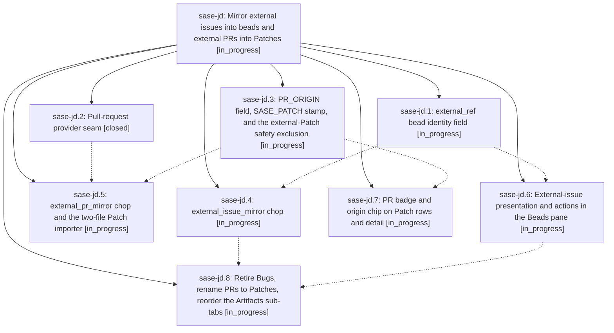

# Bead: sase-jd — Mirror external issues into beads and external PRs into Patches

[Bead Pages](../README.md) / sase-jd

**Status:** ◐ in_progress · **Type:** ▸ plan · **Tier:** epic
**Owner:** `bryanbugyi34@gmail.com` · **Created by:** [bbugyi200.athena.xp](https://github.com/sase-org/sase--agents/blob/main/agents/bbugyi200.athena.xp/README.md) · **Assignee:** `sase-jd.land`
**Created:** 2026-08-10 19:13:02 EDT
**Plan:** [202608/external\_artifact\_ingestion.md](https://github.com/sase-org/sase--plans/blob/main/202608/external_artifact_ingestion.md)

## Description

Every issue in an enabled project's external tracker has a corresponding bead and every PR not created by SASE's tracked workflow has a corresponding Patch, kept current continuously by AXE on every enabled project on the machine, and the Artifacts tab presents those relationships on one integrated surface whose sub-tabs are Stitches, Patches, Beads, Files.

## Phases

| Bead | Title | Status | Size | Created | Agents | Commits |
|---|---|---|---|---|---:|---:|
| [sase-jd.1](sase-jd.1.md) | external\_ref bead identity field | ◐ in_progress | large | 2026-08-10 | 1 | 0 |
| [sase-jd.2](sase-jd.2.md) | Pull-request provider seam | ✓ closed | medium | 2026-08-10 | 1 | 1 |
| [sase-jd.3](sase-jd.3.md) | PR\_ORIGIN field, SASE\_PATCH stamp, and the external-Patch safety exclusion | ◐ in_progress | medium | 2026-08-10 | 1 | 0 |
| [sase-jd.4](sase-jd.4.md) | external\_issue\_mirror chop | ◐ in_progress | large | 2026-08-10 | 1 | 0 |
| [sase-jd.5](sase-jd.5.md) | external\_pr\_mirror chop and the two-file Patch importer | ◐ in_progress | large | 2026-08-10 | 1 | 0 |
| [sase-jd.6](sase-jd.6.md) | External-issue presentation and actions in the Beads pane | ◐ in_progress | large | 2026-08-10 | 1 | 0 |
| [sase-jd.7](sase-jd.7.md) | PR badge and origin chip on Patch rows and detail | ◐ in_progress | medium | 2026-08-10 | 1 | 0 |
| [sase-jd.8](sase-jd.8.md) | Retire Bugs, rename PRs to Patches, reorder the Artifacts sub-tabs | ◐ in_progress | large | 2026-08-10 | 1 | 0 |

## Lineage

## Agents

| Agent | Bead | Commits |
|---|---|---:|
| [bbugyi200.athena.sase-jd.1](https://github.com/sase-org/sase--agents/blob/main/families/bbugyi200.athena.sase-jd.1.md) | [sase-jd.1](sase-jd.1.md) | 0 |
| [bbugyi200.athena.sase-jd.2](https://github.com/sase-org/sase--agents/blob/main/agents/bbugyi200.athena.sase-jd.2/README.md) | [sase-jd.2](sase-jd.2.md) | 1 |
| [bbugyi200.athena.sase-jd.3](https://github.com/sase-org/sase--agents/blob/main/agents/bbugyi200.athena.sase-jd.3/README.md) | [sase-jd.3](sase-jd.3.md) | 0 |
| [bbugyi200.athena.sase-jd.4](https://github.com/sase-org/sase--agents/blob/main/agents/bbugyi200.athena.sase-jd.4/README.md) | [sase-jd.4](sase-jd.4.md) | 0 |
| [bbugyi200.athena.sase-jd.5](https://github.com/sase-org/sase--agents/blob/main/agents/bbugyi200.athena.sase-jd.5/README.md) | [sase-jd.5](sase-jd.5.md) | 0 |
| [bbugyi200.athena.sase-jd.6](https://github.com/sase-org/sase--agents/blob/main/agents/bbugyi200.athena.sase-jd.6/README.md) | [sase-jd.6](sase-jd.6.md) | 0 |
| [bbugyi200.athena.sase-jd.7](https://github.com/sase-org/sase--agents/blob/main/agents/bbugyi200.athena.sase-jd.7/README.md) | [sase-jd.7](sase-jd.7.md) | 0 |
| [bbugyi200.athena.sase-jd.8](https://github.com/sase-org/sase--agents/blob/main/agents/bbugyi200.athena.sase-jd.8/README.md) | [sase-jd.8](sase-jd.8.md) | 0 |
| [bbugyi200.athena.sase-jd.land](https://github.com/sase-org/sase--agents/blob/main/agents/bbugyi200.athena.sase-jd.land/README.md) | [sase-jd](README.md) | 0 |

## Commits

| Repo | Commit | Subject | Bead | Committed |
|---|---|---|---|---|
| sase | [`498ef31`](https://github.com/sase-org/sase/commit/498ef310f611443e2a583ae1528107e99b176a69) | feat(vcs-provider): add pull-request listing seam and split issue capability probes | [sase-jd.2](sase-jd.2.md) | 2026-08-10 19:55:43 EDT |
