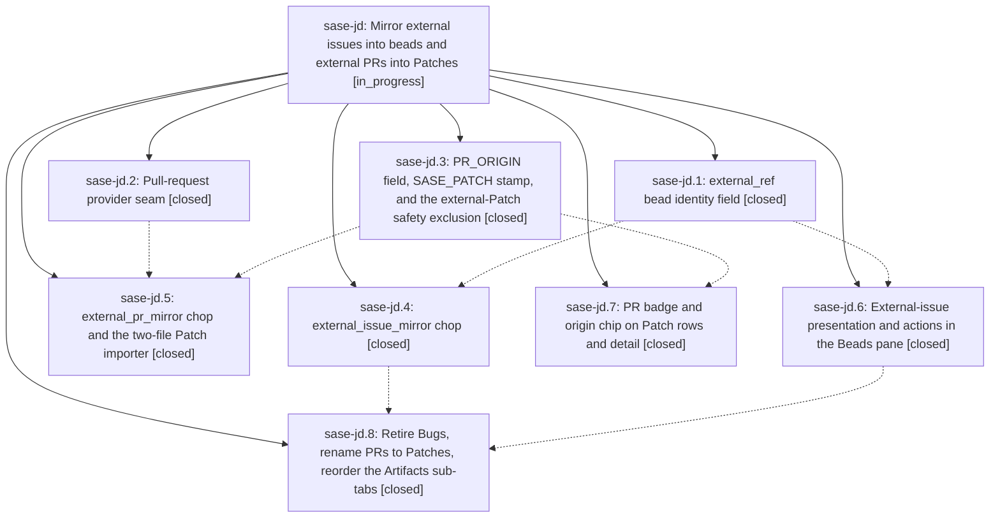

# Bead: sase-jd — Mirror external issues into beads and external PRs into Patches

[Bead Pages](../README.md) / sase-jd

**Status:** ◐ in_progress · **Type:** ▸ plan · **Tier:** epic
**Owner:** `bryanbugyi34@gmail.com` · **Created by:** [bbugyi200.athena.xp](https://github.com/sase-org/sase--agents/blob/main/agents/bbugyi200.athena.xp/README.md) · **Assignee:** `sase-jd.land`
**Created:** 2026-08-10 19:13:02 EDT
**Plan:** [202608/external\_artifact\_ingestion.md](https://github.com/sase-org/sase--plans/blob/main/202608/external_artifact_ingestion.md)

## Description

Every issue in an enabled project's external tracker has a corresponding bead and every PR not created by SASE's tracked workflow has a corresponding Patch, kept current continuously by AXE on every enabled project on the machine, and the Artifacts tab presents those relationships on one integrated surface whose sub-tabs are Stitches, Patches, Beads, Files.

## Notes

[2026-08-11T11:53:51Z · xw] DISCOVERED ISSUE: this workspace's built sase_core_rs floor (0.24.0) is missing 2 capabilities that this epic's own sase-core changes require: 'bead_external_ref_migration_sql' and 'bead_needs_external_ref_migration' (names strongly suggest phase sase-jd.1's external_ref bead identity field / SQL migration). Evidence: tests/test_check_sase_core_rs_bindings_tool.py::test_dev_extension_exposes_every_collected_name fails with 'assert missing == []' -> ['bead_external_ref_migration_sql', 'bead_needs_external_ref_migration'], and just check's core-floor-probe step reports 'blocked_unpublished: sase-core-rs==0.24.0 is missing 2 capability(s), and at least one has no containing sase-core release tag yet.' Confirmed pre-existing and unrelated to my own change (an unrelated ACE prompt *-search feature) by stashing all edits incl. untracked files and rerunning against clean HEAD 1e8b37362 -- fails identically. Same stale-core-floor pattern as sase-d7/sase-h0/sase-hz/sase-ic/sase-jj, but distinct from those: at least one of these two capabilities has NO containing sase-core release tag yet, so a floor bump alone cannot fix it until sase-core cuts a release containing it. No new task bead filed; this active epic causally owns the missing capability and can raise the floor once sase-core publishes a release containing it.

[2026-08-11T12:22:59Z · toobig-2e.split_file.src.sase.axe.run_agent_exec_plan_accept.0] DISCOVERED ISSUE: During direct fallback verification for an unrelated accepted-plan module split on 2026-08-11, '.venv/bin/ruff format --check src/ tests/' found tests/test_external_mirror_issues.py unformatted at the read_mirror_state calls around lines 293 and 381 (the file is unchanged in this workspace's git status). This is causally within active epic sase-jd's external-issue mirror scope; I left the unrelated file untouched and did not create a task bead.

## Phases

| Bead | Title | Status | Size | Created | Agents | Commits |
|---|---|---|---|---|---:|---:|
| [sase-jd.1](sase-jd.1.md) | external\_ref bead identity field | ✓ closed | large | 2026-08-10 | 1 | 2 |
| [sase-jd.2](sase-jd.2.md) | Pull-request provider seam | ✓ closed | medium | 2026-08-10 | 1 | 1 |
| [sase-jd.3](sase-jd.3.md) | PR\_ORIGIN field, SASE\_PATCH stamp, and the external-Patch safety exclusion | ✓ closed | medium | 2026-08-10 | 1 | 2 |
| [sase-jd.4](sase-jd.4.md) | external\_issue\_mirror chop | ✓ closed | large | 2026-08-10 | 1 | 2 |
| [sase-jd.5](sase-jd.5.md) | external\_pr\_mirror chop and the two-file Patch importer | ✓ closed | large | 2026-08-10 | 1 | 2 |
| [sase-jd.6](sase-jd.6.md) | External-issue presentation and actions in the Beads pane | ✓ closed | large | 2026-08-10 | 1 | 1 |
| [sase-jd.7](sase-jd.7.md) | PR badge and origin chip on Patch rows and detail | ✓ closed | medium | 2026-08-10 | 1 | 2 |
| [sase-jd.8](sase-jd.8.md) | Retire Bugs, rename PRs to Patches, reorder the Artifacts sub-tabs | ✓ closed | large | 2026-08-10 | 1 | 1 |

## Lineage

## Agents

| Agent | Bead | Commits |
|---|---|---:|
| [bbugyi200.athena.sase-jd.1](https://github.com/sase-org/sase--agents/blob/main/families/bbugyi200.athena.sase-jd.1.md) | [sase-jd.1](sase-jd.1.md) | 2 |
| [bbugyi200.athena.sase-jd.2](https://github.com/sase-org/sase--agents/blob/main/agents/bbugyi200.athena.sase-jd.2/README.md) | [sase-jd.2](sase-jd.2.md) | 1 |
| [bbugyi200.athena.sase-jd.3](https://github.com/sase-org/sase--agents/blob/main/agents/bbugyi200.athena.sase-jd.3/README.md) | [sase-jd.3](sase-jd.3.md) | 2 |
| [bbugyi200.athena.sase-jd.4](https://github.com/sase-org/sase--agents/blob/main/families/bbugyi200.athena.sase-jd.4.md) | [sase-jd.4](sase-jd.4.md) | 2 |
| [bbugyi200.athena.sase-jd.5](https://github.com/sase-org/sase--agents/blob/main/families/bbugyi200.athena.sase-jd.5.md) | [sase-jd.5](sase-jd.5.md) | 2 |
| [bbugyi200.athena.sase-jd.6](https://github.com/sase-org/sase--agents/blob/main/families/bbugyi200.athena.sase-jd.6.md) | [sase-jd.6](sase-jd.6.md) | 1 |
| [bbugyi200.athena.sase-jd.7](https://github.com/sase-org/sase--agents/blob/main/agents/bbugyi200.athena.sase-jd.7/README.md) | [sase-jd.7](sase-jd.7.md) | 2 |
| [bbugyi200.athena.sase-jd.8](https://github.com/sase-org/sase--agents/blob/main/families/bbugyi200.athena.sase-jd.8.md) | [sase-jd.8](sase-jd.8.md) | 1 |
| [bbugyi200.athena.sase-jd.land](https://github.com/sase-org/sase--agents/blob/main/agents/bbugyi200.athena.sase-jd.land/README.md) | [sase-jd](README.md) | 0 |

## Commits

| Repo | Commit | Subject | Bead | Committed |
|---|---|---|---|---|
| sase | [`498ef31`](https://github.com/sase-org/sase/commit/498ef310f611443e2a583ae1528107e99b176a69) | feat(vcs-provider): add pull-request listing seam and split issue capability probes | [sase-jd.2](sase-jd.2.md) | 2026-08-10 19:55:43 EDT |
| sase-core | [`sase-core@d0eeb48`](https://github.com/sase-org/sase-core/commit/d0eeb48324845c9d4ae946297a6b9e2d01c85c47) | feat: add Patch PR origin to core wire | [sase-jd.3](sase-jd.3.md) | 2026-08-10 20:05:45 EDT |
| sase | [`2951403`](https://github.com/sase-org/sase/commit/2951403192bb77aa7f8a9d376684f4fcf796885a) | feat: track Patch PR origin | [sase-jd.3](sase-jd.3.md) | 2026-08-10 20:07:19 EDT |
| sase-core | [`sase-core@730a78f`](https://github.com/sase-org/sase-core/commit/730a78f005b10a2b2ed99892cfed2a1111f8215f) | feat(beads): add external ref identity field | [sase-jd.1](sase-jd.1.md) | 2026-08-10 21:06:12 EDT |
| sase | [`fd93aab`](https://github.com/sase-org/sase/commit/fd93aab1d4c850d10fddb13330108d4e0627a0a1) | feat(beads): surface external refs in Python workflows | [sase-jd.1](sase-jd.1.md) | 2026-08-10 21:12:20 EDT |
| sase | [`c63b32b`](https://github.com/sase-org/sase/commit/c63b32b93c25cbbe9abc77ccf82c70b68788bb69) | feat(ace): render PR origin chip and add origin: query property | [sase-jd.7](sase-jd.7.md) | 2026-08-10 21:20:36 EDT |
| sase-core | [`sase-core@e40aa41`](https://github.com/sase-org/sase-core/commit/e40aa415e50d4e2f53da159275dc4c9516c601d0) | feat(query): add origin property to Patch query language | [sase-jd.7](sase-jd.7.md) | 2026-08-10 21:22:15 EDT |
| sase | [`1e8b373`](https://github.com/sase-org/sase/commit/1e8b373625d4f5d87921f7f171e47f0191729289) | feat(tui): surface external issues in beads | [sase-jd.6](sase-jd.6.md) | 2026-08-11 07:19:18 EDT |
| sase-core | [`sase-core@f5aa4d1`](https://github.com/sase-org/sase-core/commit/f5aa4d1d7c5b30699407192866d309cdc2f08967) | feat(external-pr): classify external pull request imports | [sase-jd.5](sase-jd.5.md) | 2026-08-11 07:29:34 EDT |
| sase | [`bdf2171`](https://github.com/sase-org/sase/commit/bdf21713a55715f5182d270201bcfa03b56c4e4a) | feat(patch): mirror external pull requests | [sase-jd.5](sase-jd.5.md) | 2026-08-11 07:30:40 EDT |
| sase-core | [`sase-core@40d0a9e`](https://github.com/sase-org/sase-core/commit/40d0a9e7ca2682e013c3208eea2659cf56066bbc) | feat(bead): collapse duplicate external\_ref issues at event-reduction time | [sase-jd.4](sase-jd.4.md) | 2026-08-11 07:38:09 EDT |
| sase | [`265fdbe`](https://github.com/sase-org/sase/commit/265fdbed82ef1638cd55bd449dd52943c33666cf) | feat(beads): mirror external tracker issues into task beads | [sase-jd.4](sase-jd.4.md) | 2026-08-11 07:51:25 EDT |
| sase | [`b5786b5`](https://github.com/sase-org/sase/commit/b5786b57f22a316af7edb5fc35789b65672d96c7) | feat(ace)!: retire the Bugs sub-tab and rename Artifacts PRs to Patches | [sase-jd.8](sase-jd.8.md) | 2026-08-11 11:36:05 EDT |
