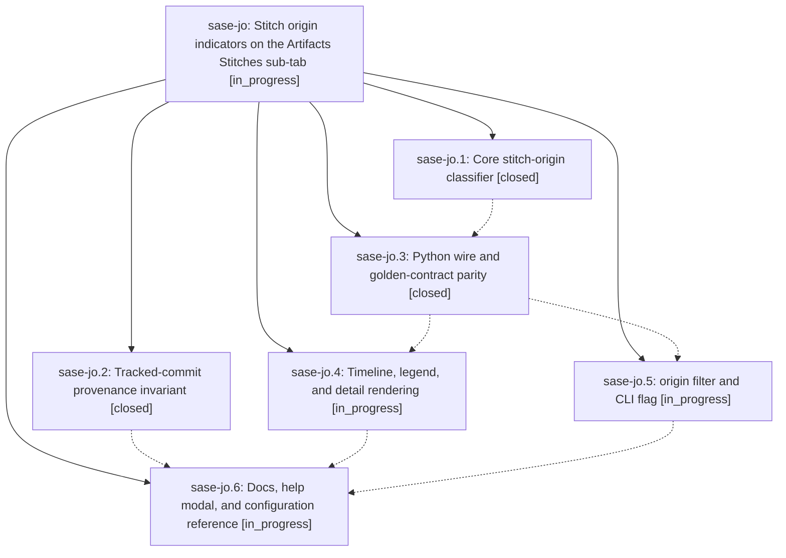

# Bead: sase-jo — Stitch origin indicators on the Artifacts Stitches sub-tab

[Bead Pages](../README.md) / sase-jo

**Status:** ◐ in_progress · **Type:** ▸ plan · **Tier:** epic
**Owner:** `bryanbugyi34@gmail.com` · **Created by:** [bbugyi200.athena.xv](https://github.com/sase-org/sase--agents/blob/main/agents/bbugyi200.athena.xv/README.md) · **Assignee:** `sase-jo.land`
**Created:** 2026-08-11 06:57:35 EDT
**Plan:** [202608/stitch\_origin\_badges.md](https://github.com/sase-org/sase--plans/blob/main/202608/stitch_origin_badges.md)

## Description

Every row on the Artifacts Stitches sub-tab carries a distinct, self-documenting indicator for how the commit was created — through `sase stitch create`, automatically by another `sase` command, or by hand — backed by a provenance invariant that makes the classification reliable rather than heuristic, and exposed through a matching `origin:` filter, the shared `sase stitch log` renderers, and the core wire.

## Notes

[2026-08-11T12:03:55Z · sase-jd.4] DISCOVERED ISSUE: the Rust-side schema bump from sase-jo.1 (vcs_log_wire_schema_version 3->4, commit dc836c491) has landed in sase-core's master ahead of the Python-side parity work in sase-jo.3, so tools/validate_sase_core_rs's hardcoded expected={'vcs_log_wire_schema_version': 3} pin now fails for every fresh 'just install'/'just fix'/'just lint' on this tree (installed sase_core_rs reports 4). This blocks 'just fix', which is the sase_git_commit pre-commit hook, so it currently blocks ALL commits repo-wide via the sanctioned commit workflow, not just work touching vcs_log. Discovered while landing an unrelated feature (external_issue_mirror, sase-jd.4) whose follow-up cleanup commit is stuck behind this. Did not attempt to fix it myself since a naive version-pin bump without the golden-contract parity work sase-jo.3 owns would likely just move the failure to a parity test.

[2026-08-11T12:21:34Z · toobig-2e.split_file.src.sase.axe.run_agent_exec_plan_accept.0] DISCOVERED ISSUE: Independent reproduction on 2026-08-11 during an unrelated split of src/sase/axe/run_agent_exec_plan_accept.py. After just install rebuilt the linked sase-core, just fmt failed in _setup because tools/validate_sase_core_rs expected vcs_log_wire_schema_version 3 but the installed linked core returned 4. The focused refactor tests still pass (97/97), and direct Ruff formatting/checks pass. This matches sase-jo.1's landed schema bump and sase-jo.3's pending Python wire/golden parity work, so no standalone task bead was filed.

## Phases

| Bead | Title | Status | Size | Created | Agents | Commits |
|---|---|---|---|---|---:|---:|
| [sase-jo.1](sase-jo.1.md) | Core stitch-origin classifier | ✓ closed | medium | 2026-08-11 | 1 | 0 |
| [sase-jo.2](sase-jo.2.md) | Tracked-commit provenance invariant | ✓ closed | medium | 2026-08-11 | 1 | 1 |
| [sase-jo.3](sase-jo.3.md) | Python wire and golden-contract parity | ✓ closed | small | 2026-08-11 | 1 | 1 |
| [sase-jo.4](sase-jo.4.md) | Timeline, legend, and detail rendering | ◐ in_progress | medium | 2026-08-11 | 1 | 0 |
| [sase-jo.5](sase-jo.5.md) | origin filter and CLI flag | ◐ in_progress | medium | 2026-08-11 | 1 | 0 |
| [sase-jo.6](sase-jo.6.md) | Docs, help modal, and configuration reference | ◐ in_progress | small | 2026-08-11 | 1 | 0 |

## Lineage

## Agents

| Agent | Bead | Commits |
|---|---|---:|
| [bbugyi200.athena.sase-jo.1](https://github.com/sase-org/sase--agents/blob/main/agents/bbugyi200.athena.sase-jo.1/README.md) | [sase-jo.1](sase-jo.1.md) | 0 |
| [bbugyi200.athena.sase-jo.2](https://github.com/sase-org/sase--agents/blob/main/agents/bbugyi200.athena.sase-jo.2/README.md) | [sase-jo.2](sase-jo.2.md) | 1 |
| [bbugyi200.athena.sase-jo.3](https://github.com/sase-org/sase--agents/blob/main/agents/bbugyi200.athena.sase-jo.3/README.md) | [sase-jo.3](sase-jo.3.md) | 1 |
| [bbugyi200.athena.sase-jo.4](https://github.com/sase-org/sase--agents/blob/main/agents/bbugyi200.athena.sase-jo.4/README.md) | [sase-jo.4](sase-jo.4.md) | 0 |
| [bbugyi200.athena.sase-jo.5](https://github.com/sase-org/sase--agents/blob/main/agents/bbugyi200.athena.sase-jo.5/README.md) | [sase-jo.5](sase-jo.5.md) | 0 |
| [bbugyi200.athena.sase-jo.6](https://github.com/sase-org/sase--agents/blob/main/agents/bbugyi200.athena.sase-jo.6/README.md) | [sase-jo.6](sase-jo.6.md) | 0 |
| [bbugyi200.athena.sase-jo.land](https://github.com/sase-org/sase--agents/blob/main/agents/bbugyi200.athena.sase-jo.land/README.md) | [sase-jo](README.md) | 0 |

## Commits

| Repo | Commit | Subject | Bead | Committed |
|---|---|---|---|---|
| sase | [`2d40e92`](https://github.com/sase-org/sase/commit/2d40e929735428a5a14d7ceae4b1ddaf2e9ee839) | feat(core): wire commit origin through Python VCS-log wire and golden parser | [sase-jo.3](sase-jo.3.md) | 2026-08-11 08:14:09 EDT |
| sase | [`050264c`](https://github.com/sase-org/sase/commit/050264c7c98f4e2efbb93efb15db10924b8e52bd) | feat(vcs): stamp SASE\_TYPE on every commit-creating call site | [sase-jo.2](sase-jo.2.md) | 2026-08-11 08:23:21 EDT |
