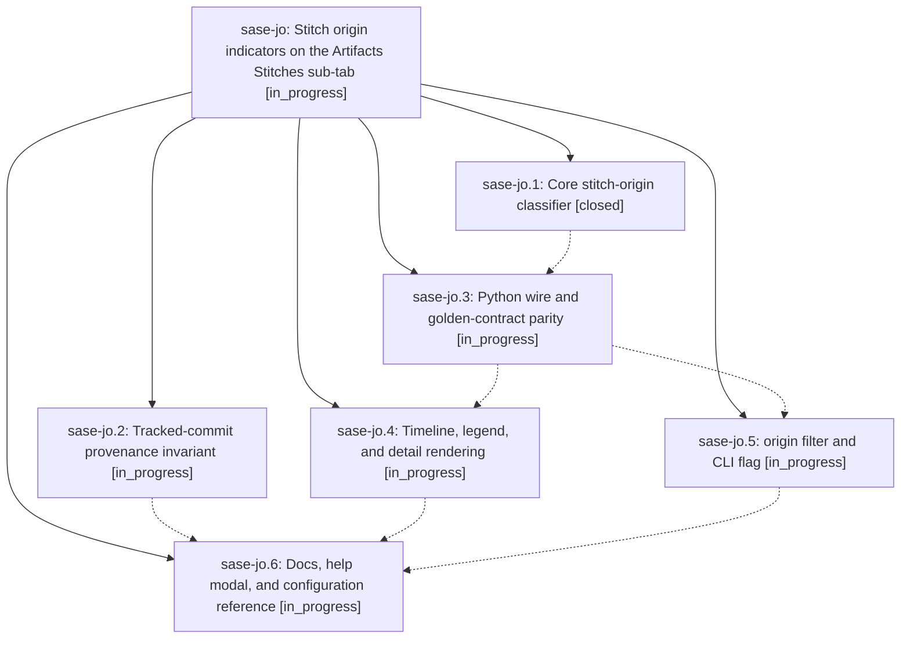

# Bead: sase-jo — Stitch origin indicators on the Artifacts Stitches sub-tab

[Bead Pages](../README.md) / sase-jo

**Status:** ◐ in_progress · **Type:** ▸ plan · **Tier:** epic
**Owner:** `bryanbugyi34@gmail.com` · **Created by:** [bbugyi200.athena.xv](https://github.com/sase-org/sase--agents/blob/main/agents/bbugyi200.athena.xv/README.md) · **Assignee:** `sase-jo.land`
**Created:** 2026-08-11 06:57:35 EDT
**Plan:** [202608/stitch\_origin\_badges.md](https://github.com/sase-org/sase--plans/blob/main/202608/stitch_origin_badges.md)

## Description

Every row on the Artifacts Stitches sub-tab carries a distinct, self-documenting indicator for how the commit was created — through `sase stitch create`, automatically by another `sase` command, or by hand — backed by a provenance invariant that makes the classification reliable rather than heuristic, and exposed through a matching `origin:` filter, the shared `sase stitch log` renderers, and the core wire.

## Phases

| Bead | Title | Status | Size | Created | Agents | Commits |
|---|---|---|---|---|---:|---:|
| [sase-jo.1](sase-jo.1.md) | Core stitch-origin classifier | ✓ closed | medium | 2026-08-11 | 1 | 1 |
| [sase-jo.2](sase-jo.2.md) | Tracked-commit provenance invariant | ◐ in_progress | medium | 2026-08-11 | 1 | 0 |
| [sase-jo.3](sase-jo.3.md) | Python wire and golden-contract parity | ◐ in_progress | small | 2026-08-11 | 1 | 0 |
| [sase-jo.4](sase-jo.4.md) | Timeline, legend, and detail rendering | ◐ in_progress | medium | 2026-08-11 | 1 | 0 |
| [sase-jo.5](sase-jo.5.md) | origin filter and CLI flag | ◐ in_progress | medium | 2026-08-11 | 1 | 0 |
| [sase-jo.6](sase-jo.6.md) | Docs, help modal, and configuration reference | ◐ in_progress | small | 2026-08-11 | 1 | 0 |

## Lineage

## Agents

| Agent | Bead | Commits |
|---|---|---:|
| [bbugyi200.athena.sase-jo.1](https://github.com/sase-org/sase--agents/blob/main/agents/bbugyi200.athena.sase-jo.1/README.md) | [sase-jo.1](sase-jo.1.md) | 1 |
| [bbugyi200.athena.sase-jo.2](https://github.com/sase-org/sase--agents/blob/main/agents/bbugyi200.athena.sase-jo.2/README.md) | [sase-jo.2](sase-jo.2.md) | 0 |
| [bbugyi200.athena.sase-jo.3](https://github.com/sase-org/sase--agents/blob/main/agents/bbugyi200.athena.sase-jo.3/README.md) | [sase-jo.3](sase-jo.3.md) | 0 |
| [bbugyi200.athena.sase-jo.4](https://github.com/sase-org/sase--agents/blob/main/agents/bbugyi200.athena.sase-jo.4/README.md) | [sase-jo.4](sase-jo.4.md) | 0 |
| [bbugyi200.athena.sase-jo.5](https://github.com/sase-org/sase--agents/blob/main/agents/bbugyi200.athena.sase-jo.5/README.md) | [sase-jo.5](sase-jo.5.md) | 0 |
| [bbugyi200.athena.sase-jo.6](https://github.com/sase-org/sase--agents/blob/main/agents/bbugyi200.athena.sase-jo.6/README.md) | [sase-jo.6](sase-jo.6.md) | 0 |
| [bbugyi200.athena.sase-jo.land](https://github.com/sase-org/sase--agents/blob/main/agents/bbugyi200.athena.sase-jo.land/README.md) | [sase-jo](README.md) | 0 |

## Commits

| Repo | Commit | Subject | Bead | Committed |
|---|---|---|---|---|
| sase-core | [`sase-core@dc836c4`](https://github.com/sase-org/sase-core/commit/dc836c491b175694563baba60f52ba839feb0e30) | feat(vcs-log): classify commit origins | [sase-jo.1](sase-jo.1.md) | 2026-08-11 07:21:57 EDT |
