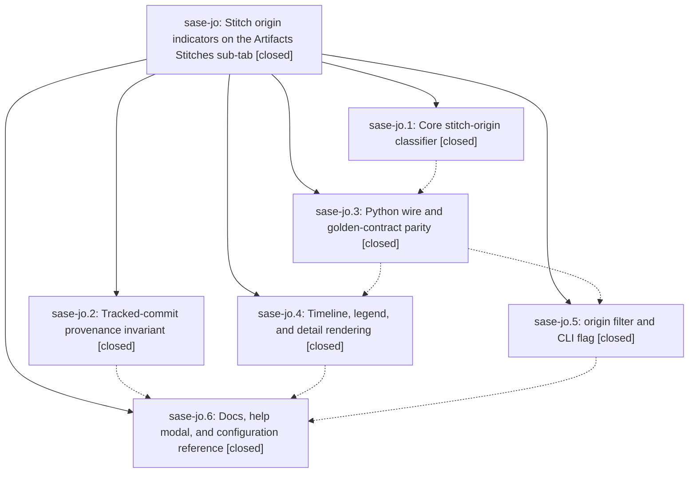

# Bead: sase-jo — Stitch origin indicators on the Artifacts Stitches sub-tab

[Bead Pages](../README.md) / sase-jo

**Status:** ✓ closed · **Resolution:** done · **Type:** ▸ plan · **Tier:** epic
**Owner:** `bryanbugyi34@gmail.com` · **Created by:** [bbugyi200.athena.xv](https://github.com/sase-org/sase--agents/blob/main/agents/bbugyi200.athena.xv/README.md) · **Assignee:** `sase-jo.land`
**Created:** 2026-08-11 06:57:35 EDT · **Closed:** 2026-08-11 11:43:44 EDT
**Plan:** [202608/stitch\_origin\_badges.md](https://github.com/sase-org/sase--plans/blob/main/202608/stitch_origin_badges.md)

## Description

Every row on the Artifacts Stitches sub-tab carries a distinct, self-documenting indicator for how the commit was created — through `sase stitch create`, automatically by another `sase` command, or by hand — backed by a provenance invariant that makes the classification reliable rather than heuristic, and exposed through a matching `origin:` filter, the shared `sase stitch log` renderers, and the core wire.

## Notes

[2026-08-11T12:03:55Z · sase-jd.4] DISCOVERED ISSUE: the Rust-side schema bump from sase-jo.1 (vcs_log_wire_schema_version 3->4, commit dc836c491) has landed in sase-core's master ahead of the Python-side parity work in sase-jo.3, so tools/validate_sase_core_rs's hardcoded expected={'vcs_log_wire_schema_version': 3} pin now fails for every fresh 'just install'/'just fix'/'just lint' on this tree (installed sase_core_rs reports 4). This blocks 'just fix', which is the sase_git_commit pre-commit hook, so it currently blocks ALL commits repo-wide via the sanctioned commit workflow, not just work touching vcs_log. Discovered while landing an unrelated feature (external_issue_mirror, sase-jd.4) whose follow-up cleanup commit is stuck behind this. Did not attempt to fix it myself since a naive version-pin bump without the golden-contract parity work sase-jo.3 owns would likely just move the failure to a parity test.

[2026-08-11T12:21:34Z · toobig-2e.split_file.src.sase.axe.run_agent_exec_plan_accept.0] DISCOVERED ISSUE: Independent reproduction on 2026-08-11 during an unrelated split of src/sase/axe/run_agent_exec_plan_accept.py. After just install rebuilt the linked sase-core, just fmt failed in _setup because tools/validate_sase_core_rs expected vcs_log_wire_schema_version 3 but the installed linked core returned 4. The focused refactor tests still pass (97/97), and direct Ruff formatting/checks pass. This matches sase-jo.1's landed schema bump and sase-jo.3's pending Python wire/golden parity work, so no standalone task bead was filed.

[2026-08-11T15:43:44Z · sase-jo.land] All six phases verified against source and the epic's commits (2d40e9297, 050264c7c, 29af892b8, e1b39c72c, 295f4e994 in this repo; dc836c4 and b6a1493 in sase-core). The amend-footer hole found during landing was fixed by this plan: vcs_amend in src/sase/vcs_provider/plugins/_git_core_ops.py now inherits HEAD's SASE_* footer tags before amending, via a new _inherit_footer_on_amend helper reusing parse_trailing_commit_tag_values/update_trailing_commit_tags. Covered by 5 new provider-level integration tests plus a workflow-level _auto_accept_proposal test; the contract-test allowlist comment for vcs_amend was rewritten to state the real reason.

PROPOSED FOLLOW-UP dispositions:
- sase-jo.2 (vcs_amend drops the footer) — fixed by this plan, and it was worse than the note described: the note assumed callers round-trip the tagged message, but all four (rewind, accept, change_actions, completer) build fresh messages.
- sase-jo.4 (Ruff drift in tests/test_external_mirror_issues.py) — declined, already resolved by commit c388b560c; ruff format --check on that file is clean.
- sase-jo.5 (2-value manual/sase core taxonomy vs the 3-value design) — declined, resolved during the epic. sase-core commit b6a1493 replaced the 2-value enum with Stitch/Auto/Manual, and 295f4e994 aligned the Python filter, parser, help text, schema, and docs. Verified live: the PyO3 binding returns stitch/auto/manual for all four precedence rules, and Python and Rust both report VCS-log wire schema 4.
- sase-jo.6 (bump the declared sase-core-rs floor) — declined by design. A checkout ahead of the published window is the normal dev state; tools/validate_sase_core_rs_version._remediation says no action is needed since editable installs build from the checkout regardless and tools/ratchet_core_window moves the published window on the release branch at release time. check-full runs that probe with --advisory for the same reason.
- The epic bead's own two DISCOVERED ISSUE notes (vcs_log_wire_schema_version 3->4 pin blocking just fix repo-wide) — resolved by 2d40e9297, which moved tools/validate_sase_core_rs to 4. just install and the SASE validation gate both pass.

Verification: just check-full ran end to end. All lint gates, SASE validation, and committed-plans validation passed. just test-cost failed once on peak_worker_rss_kib under confirmed heavy concurrent-agent/rustc/rsync contention (load avg 13-19) and passed cleanly on immediate retry with no code changes -- corroborated onto existing task sase-j0. The final selection-health --fail-on-new-flake gate flagged 6 cross-workspace historical flake records (1 already tracked by sase-iu/sase-j0's notes, 5 new test_core_vcs_log.py golden-comparison nodes filed as new task sase-jq following the sase-jb/sase-j6 node-specific routing precedent); all 6 nodes pass cleanly in a direct isolated run (50/50 in 21.57s) and are unrelated to this change's files. just symvision and the plan status update are being completed as the epic's final landing steps.

## Phases

| Bead | Title | Status | Size | Created | Agents | Commits |
|---|---|---|---|---|---:|---:|
| [sase-jo.1](sase-jo.1.md) | Core stitch-origin classifier | ✓ closed | medium | 2026-08-11 | 1 | 1 |
| [sase-jo.2](sase-jo.2.md) | Tracked-commit provenance invariant | ✓ closed | medium | 2026-08-11 | 1 | 1 |
| [sase-jo.3](sase-jo.3.md) | Python wire and golden-contract parity | ✓ closed | small | 2026-08-11 | 1 | 1 |
| [sase-jo.4](sase-jo.4.md) | Timeline, legend, and detail rendering | ✓ closed | medium | 2026-08-11 | 1 | 2 |
| [sase-jo.5](sase-jo.5.md) | origin filter and CLI flag | ✓ closed | medium | 2026-08-11 | 1 | 1 |
| [sase-jo.6](sase-jo.6.md) | Docs, help modal, and configuration reference | ✓ closed | small | 2026-08-11 | 1 | 1 |

## Lineage

## Agents

| Agent | Bead | Commits |
|---|---|---:|
| [bbugyi200.athena.sase-jo.1](https://github.com/sase-org/sase--agents/blob/main/agents/bbugyi200.athena.sase-jo.1/README.md) | [sase-jo.1](sase-jo.1.md) | 1 |
| [bbugyi200.athena.sase-jo.2](https://github.com/sase-org/sase--agents/blob/main/agents/bbugyi200.athena.sase-jo.2/README.md) | [sase-jo.2](sase-jo.2.md) | 1 |
| [bbugyi200.athena.sase-jo.3](https://github.com/sase-org/sase--agents/blob/main/agents/bbugyi200.athena.sase-jo.3/README.md) | [sase-jo.3](sase-jo.3.md) | 1 |
| [bbugyi200.athena.sase-jo.4](https://github.com/sase-org/sase--agents/blob/main/agents/bbugyi200.athena.sase-jo.4/README.md) | [sase-jo.4](sase-jo.4.md) | 2 |
| [bbugyi200.athena.sase-jo.5](https://github.com/sase-org/sase--agents/blob/main/agents/bbugyi200.athena.sase-jo.5/README.md) | [sase-jo.5](sase-jo.5.md) | 1 |
| [bbugyi200.athena.sase-jo.6](https://github.com/sase-org/sase--agents/blob/main/agents/bbugyi200.athena.sase-jo.6/README.md) | [sase-jo.6](sase-jo.6.md) | 1 |
| [bbugyi200.athena.sase-jo.land](https://github.com/sase-org/sase--agents/blob/main/families/bbugyi200.athena.sase-jo.land.md) | [sase-jo](README.md) | 1 |

## Commits

| Repo | Commit | Subject | Bead | Committed |
|---|---|---|---|---|
| sase-core | [`sase-core@dc836c4`](https://github.com/sase-org/sase-core/commit/dc836c491b175694563baba60f52ba839feb0e30) | feat(vcs-log): classify commit origins | [sase-jo.1](sase-jo.1.md) | 2026-08-11 07:21:57 EDT |
| sase | [`2d40e92`](https://github.com/sase-org/sase/commit/2d40e929735428a5a14d7ceae4b1ddaf2e9ee839) | feat(core): wire commit origin through Python VCS-log wire and golden parser | [sase-jo.3](sase-jo.3.md) | 2026-08-11 08:14:09 EDT |
| sase | [`050264c`](https://github.com/sase-org/sase/commit/050264c7c98f4e2efbb93efb15db10924b8e52bd) | feat(vcs): stamp SASE\_TYPE on every commit-creating call site | [sase-jo.2](sase-jo.2.md) | 2026-08-11 08:23:21 EDT |
| sase-core | [`sase-core@b6a1493`](https://github.com/sase-org/sase-core/commit/b6a149349a4e2fe3d920303c6aced1e552248169) | feat(vcs-log): distinguish stitch and auto commit origins | [sase-jo.4](sase-jo.4.md) | 2026-08-11 08:54:03 EDT |
| sase | [`29af892`](https://github.com/sase-org/sase/commit/29af892b857c6a70ec4ba87abc17971f083ed040) | feat(vcs-log): render commit origin in timelines | [sase-jo.4](sase-jo.4.md) | 2026-08-11 08:55:51 EDT |
| sase | [`e1b39c7`](https://github.com/sase-org/sase/commit/e1b39c72cc47309676c4bff76c8769da2a8f260f) | feat(vcs-log): add origin filter key and --origin CLI flag | [sase-jo.5](sase-jo.5.md) | 2026-08-11 09:09:34 EDT |
| sase | [`295f4e9`](https://github.com/sase-org/sase/commit/295f4e994102cc5ac3c61cfd7a127d6af1177e1f) | fix(stitch): align origin filters with canonical values | [sase-jo.6](sase-jo.6.md) | 2026-08-11 09:32:09 EDT |
| sase | [`33b8861`](https://github.com/sase-org/sase/commit/33b886150b672b85f471d0e3d1a9e9de0385cb71) | fix(vcs): preserve SASE\_TYPE footer across commit amend | [sase-jo](README.md) | 2026-08-11 11:46:11 EDT |
