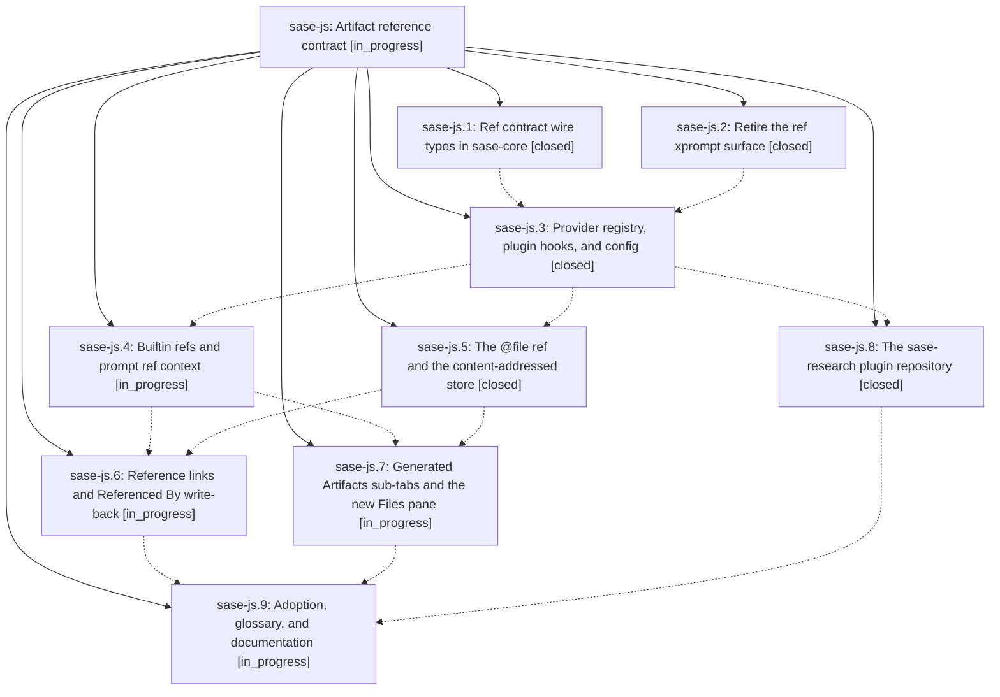

# Bead: sase-js — Artifact reference contract

[Bead Pages](../README.md) / sase-js

**Status:** ◐ in_progress · **Type:** ▸ plan · **Tier:** epic
**Owner:** `bryanbugyi34@gmail.com` · **Created by:** `bbugyi200.athena.y2` · **Assignee:** `sase-js.land`
**Created:** 2026-08-11 13:20:33 EDT
**Plan:** [202608/artifact\_ref\_contract.md](https://github.com/sase-org/sase--plans/blob/main/202608/artifact_ref_contract.md)

## Description

Artifact references stop being xprompts and become a first-class, versioned ref contract: five builtin kinds (`@stitch`, `@patch`, `@bead`, `@agent`, `@file`) plus artifact-repo document kinds (`@plan`, `@research`, ...) configured inline or with `use: <provider>` from an installed plugin. Every ref expands deterministically, is recorded per occurrence against the agent that used it, publishes as a numbered Markdown reference link, writes a `Referenced By` table back into the cited artifact, and gets a generated "Artifacts" sub-tab in ACE.

## Phases

| Bead | Title | Status | Size | Created | Agents | Commits |
|---|---|---|---|---|---:|---:|
| [sase-js.1](sase-js.1.md) | Ref contract wire types in sase-core | ✓ closed | large | 2026-08-11 | 1 | 1 |
| [sase-js.2](sase-js.2.md) | Retire the ref xprompt surface | ✓ closed | medium | 2026-08-11 | 1 | 1 |
| [sase-js.3](sase-js.3.md) | Provider registry, plugin hooks, and config | ✓ closed | large | 2026-08-11 | 1 | 1 |
| [sase-js.4](sase-js.4.md) | Builtin refs and prompt ref context | ◐ in_progress | large | 2026-08-11 | 1 | 0 |
| [sase-js.5](sase-js.5.md) | The @file ref and the content-addressed store | ✓ closed | large | 2026-08-11 | 1 | 1 |
| [sase-js.6](sase-js.6.md) | Reference links and Referenced By write-back | ◐ in_progress | large | 2026-08-11 | 1 | 0 |
| [sase-js.7](sase-js.7.md) | Generated Artifacts sub-tabs and the new Files pane | ◐ in_progress | large | 2026-08-11 | 1 | 0 |
| [sase-js.8](sase-js.8.md) | The sase-research plugin repository | ✓ closed | large | 2026-08-11 | 1 | 0 |
| [sase-js.9](sase-js.9.md) | Adoption, glossary, and documentation | ◐ in_progress | medium | 2026-08-11 | 1 | 0 |

## Lineage

## Agents

| Agent | Bead | Commits |
|---|---|---:|
| [bbugyi200.athena.sase-js.1](https://github.com/sase-org/sase--agents/blob/main/families/bbugyi200.athena.sase-js.1.md) | [sase-js.1](sase-js.1.md) | 1 |
| [bbugyi200.athena.sase-js.2](https://github.com/sase-org/sase--agents/blob/main/agents/bbugyi200.athena.sase-js.2/README.md) | [sase-js.2](sase-js.2.md) | 1 |
| [bbugyi200.athena.sase-js.3](https://github.com/sase-org/sase--agents/blob/main/families/bbugyi200.athena.sase-js.3.md) | [sase-js.3](sase-js.3.md) | 1 |
| bbugyi200.athena.sase-js.4 | [sase-js.4](sase-js.4.md) | 0 |
| bbugyi200.athena.sase-js.5 | [sase-js.5](sase-js.5.md) | 1 |
| bbugyi200.athena.sase-js.6 | [sase-js.6](sase-js.6.md) | 0 |
| bbugyi200.athena.sase-js.7 | [sase-js.7](sase-js.7.md) | 0 |
| bbugyi200.athena.sase-js.8 | [sase-js.8](sase-js.8.md) | 0 |
| bbugyi200.athena.sase-js.9 | [sase-js.9](sase-js.9.md) | 0 |
| bbugyi200.athena.sase-js.land | [sase-js](README.md) | 0 |

## Commits

| Repo | Commit | Subject | Bead | Committed |
|---|---|---|---|---|
| gh\_sase-org\_\_sase | [`cb453a5`](https://github.com/sase-org/sase/commit/cb453a529e483d4237afdfab66fd2be9e1caadeb) | feat(artifact-ref)!: bump wire schema to 5 for stitch/patch/file-path kinds | [sase-js.1](sase-js.1.md) | 2026-08-11 15:16:10 EDT |
| gh\_sase-org\_\_sase | [`e2cacbe`](https://github.com/sase-org/sase/commit/e2cacbe34ce16e3df92dc390ea11376972da5c77) | refactor(xprompt)!: retire the #ref/\<kind\> contextual renderer adapter | [sase-js.2](sase-js.2.md) | 2026-08-11 15:33:12 EDT |
| gh\_sase-org\_\_sase | [`f53e43a`](https://github.com/sase-org/sase/commit/f53e43ab139a7db2c50b75971fb7a5fc202619e5) | feat!: add artifact provider registry | [sase-js.3](sase-js.3.md) | 2026-08-11 16:21:40 EDT |
| gh\_sase-org\_\_sase | [`341fff9`](https://github.com/sase-org/sase/commit/341fff97adeea143cc243472f072d170d53eda23) | feat: add file refs to prompt artifacts | [sase-js.5](sase-js.5.md) | 2026-08-11 17:43:38 EDT |
