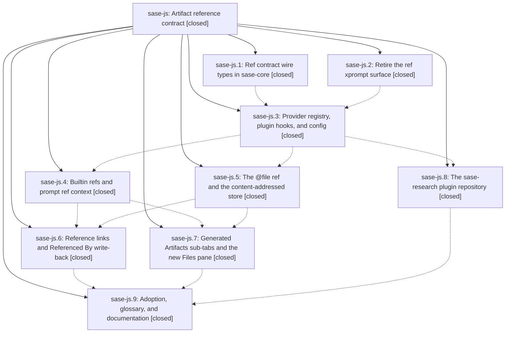

# Bead: sase-js — Artifact reference contract

[Bead Pages](../README.md) / sase-js

**Status:** ✓ closed · **Resolution:** done · **Type:** ▸ plan · **Tier:** epic
**Owner:** `bryanbugyi34@gmail.com` · **Created by:** [bbugyi200.athena.y2](https://github.com/sase-org/sase--agents/blob/main/agents/bbugyi200.athena.y2/README.md) · **Assignee:** `sase-js.land`
**Created:** 2026-08-11 13:20:33 EDT · **Closed:** 2026-08-12 12:11:58 EDT
**Plan:** [202608/artifact\_ref\_contract.md](https://github.com/sase-org/sase--plans/blob/main/202608/artifact_ref_contract.md)

## Description

Artifact references stop being xprompts and become a first-class, versioned ref contract: five builtin kinds (`@stitch`, `@patch`, `@bead`, `@agent`, `@file`) plus artifact-repo document kinds (`@plan`, `@research`, ...) configured inline or with `use: <provider>` from an installed plugin. Every ref expands deterministically, is recorded per occurrence against the agent that used it, publishes as a numbered Markdown reference link, writes a `Referenced By` table back into the cited artifact, and gets a generated "Artifacts" sub-tab in ACE.

## Notes

[2026-08-12T14:28:44Z · bryanbugyi34@gmail.com] The "Files" sub-tab has the number 4 associated with it and so should be listed after the "Beads" sub-tab, not at the end after the sidecar/artifact repo tabs.

[2026-08-12T16:10:46Z · sase-js.land] DISCOVERED ISSUE: resolve_artifacts_subtabs() in src/sase/ace/tui/artifact_tabs.py:143-149 builds descriptors = (stitches, patches, beads, *providers, files), placing the files sub-tab after all dynamically-inserted provider/sidecar tabs. But FIXED_ARTIFACTS_DIGITS assigns files the digit shortcut "4", immediately after beads ("3"), so the correct visual order places files right after beads, before any provider tabs. Reported directly by the project owner in a NOTES entry on this bead (2026-08-12T14:28:44Z), after phase sase-js.7 (Generated Artifacts sub-tabs and the new Files pane) had already closed and after the sase-js landing plan (sase/repos/plans/202608/land_artifact_ref_contract.md) had already been authored and approved, so it is not covered by that plan's three fixed defects. No duplicate task bead found (searched: files sub-tab, ARTIFACTS_ACCENTS, resolve_artifacts_subtabs). Not fixed as part of this landing pass — out of the approved plan's scope; the owner should decide whether to file it as a new task/tale or address it directly.

[2026-08-12T16:11:58Z · sase-js.land] Landing plan sase/repos/plans/202608/land_artifact_ref_contract.md (bead sase-js.land) executed and verified.

THREE LANDING DEFECTS FIXED (commit ad11756e6, fix(ace)):
1. Import cycle: sase.artifact_providers failed to import from a cold interpreter (sase.artifact_providers -> registry.py -> sase.config.core -> sase/config/__init__.py -> sase.config.file_hooks -> back to registry mid-init). Fixed by moving the ArtifactProviderRegistry annotation-only import in file_hooks.py under TYPE_CHECKING (module already carries `from __future__ import annotations`). Verified with a fresh-interpreter subprocess regression test (tests/artifact_providers/test_import_order.py) plus manual `.venv/bin/python -c "import sase.artifact_providers"` / `from sase.artifact_providers.registry import ArtifactProviderRegistry` — both exit 0.
2. Retired Artifacts Chats pane was unmounted but not deleted. Deleted all 10 widget/action modules, unwired every call site (widgets __init__/.pyi lazy exports, actions mixin, _app_action_availability, bindings, keymaps (app_keymaps/metadata/mode_keymaps), default_config.yml, command palette (_app_metadata/availability/_mode_commands), copy_targets, clipboard palette registry and target handlers, help-modal Copy Mode - Chats section, styles.tcss ChatFilterBar rules, ARTIFACTS_ACCENTS "chats" entry (LEGACY_ARTIFACTS_SUBTABS["chats"] deliberately kept as the persisted-selection fallback)), deleted/updated corresponding tests and PNG goldens, removed the two skip-marked test modules. `grep -rn 'artifacts_chats|ArtifactsChatsPane|chats_next' src/` is empty; no `pytest.mark.skip(reason="Artifacts Chats is no longer a mounted pane")` remains. sase.history.chat_* / chat_handler / chat_install left untouched (sase chat CLI, agent detail, resume/fork).
3. @chat still had payload completion in ACE despite being retired from the kind stage. Removed "chat" from _artifact_ref_completion_menu.py's hardcoded payload kind list and the folded=="chat" arm, removed load_chat_candidate_catalog() and its catalog fields/params from _artifact_ref_completion_catalog.py, dropped the chat hint/badge/model member across _artifact_ref_completion_context.py, _artifact_ref_completion_models.py, and _prompt_input_bar_completion_rows_artifacts.py. parsable_artifact_ref_kinds() still returns chat and bug so archived prompts keep rendering; added completion-stage exclusion test coverage.

VERIFICATION:
- just check: all lint gates green (fmt, keep-sorted, ruff, mypy, pyscripts, test waits, changelog, patch/stitch terminology, symvision, toobig, SASE validation); scoped test lane escalated to the full suite (core-identity-changed / rename-or-delete / src-data-asset rules) and passed.
- just check-full: all lint gates green; full suite ran; the only failing gate was flake-baseline, tripping on exactly the 6 pre-existing sase-jq/sase-iu reproducible flakes the plan named (tests/test_contract_manifest.py::test_contract_manifest_matches_marker_selection, tests/test_core_vcs_log.py x5) — corroborated as pre-existing per plan section 4, not a regression from this work.
- Integration review against commits landed since the epic started (19f827332, 63bb1a27e, 62951abcb, 09e5fc43e, 35b469d81, 46773f606): the adoption phase (sase-js.9, docs commit 56d6bd772) sits at HEAD and already reconciles both docs commits; the xprompt properties band (35b469d81) is a separate domain from ref provider properties and does not conflict.
- Deliberately out of scope (per plan section 6, verified still correct): sase-core-rs pyproject.toml floor stays at 0.24.0 (tools/ratchet_core_window / core-floor-probe confirm the release-branch reconciler handles it; no action needed on master); sase-jq/sase-iu flake investigation untouched.

FOLLOW-UPS FILED (plan section 3.4.1, all `/sase_new_task` checked for duplicates/active-epic overlap, none found, all created ready/large):
- sase-k5: migrate @stitch/@patch entry resolution from Python into sase-core (sase-js.4)
- sase-k6: extend artifact-ref use wire to schema 2, §3.7 fields (sase-js.4)
- sase-k7: sha-to-Patch/stitch-number mapping for @stitch properties (sase-js.4)
- sase-k8: surface @file capture targets in launch-approval preview (sase-js.5)
- sase-k9: provider-declared Referenced By columns (sase-js.6)
- sase-ka: publish agents/<agent>/ref-uses.json via v2 publication payload contract (sase-js.6)
- sase-kb: sase repo open plans fails applying commit b10820e6 in split_patch_handler.md (sase-js.9)

NOT FILED (per plan, by design):
- sase-js.2's six reproducible flakes: already tracked on sase-jq and sase-iu; corroborated via this landing run's check-full, not re-filed.
- sase-js.9's core-rs floor: by design, release automation ratchets it; hand-editing would fight that.

ADDITIONAL DISCOVERED ISSUE (not part of the approved plan's scope, found via a NOTES entry the owner added to this bead at 2026-08-12T14:28:44Z, after the plan was authored): Files sub-tab ordering bug in resolve_artifacts_subtabs() (artifact_tabs.py:143-149) places "files" after dynamically-inserted provider tabs instead of right after "beads" per its digit-4 shortcut. Recorded as a DISCOVERED ISSUE note on this bead rather than fixed here (outside this plan's authorized scope) — the owner should decide whether to file a task/tale or address it directly.

## Phases

| Bead | Title | Status | Size | Created | Agents | Commits |
|---|---|---|---|---|---:|---:|
| [sase-js.1](sase-js.1.md) | Ref contract wire types in sase-core | ✓ closed | large | 2026-08-11 | 1 | 2 |
| [sase-js.2](sase-js.2.md) | Retire the ref xprompt surface | ✓ closed | medium | 2026-08-11 | 1 | 2 |
| [sase-js.3](sase-js.3.md) | Provider registry, plugin hooks, and config | ✓ closed | large | 2026-08-11 | 1 | 1 |
| [sase-js.4](sase-js.4.md) | Builtin refs and prompt ref context | ✓ closed | large | 2026-08-11 | 1 | 1 |
| [sase-js.5](sase-js.5.md) | The @file ref and the content-addressed store | ✓ closed | large | 2026-08-11 | 1 | 2 |
| [sase-js.6](sase-js.6.md) | Reference links and Referenced By write-back | ✓ closed | large | 2026-08-11 | 1 | 2 |
| [sase-js.7](sase-js.7.md) | Generated Artifacts sub-tabs and the new Files pane | ✓ closed | large | 2026-08-11 | 1 | 1 |
| [sase-js.8](sase-js.8.md) | The sase-research plugin repository | ✓ closed | large | 2026-08-11 | 1 | 0 |
| [sase-js.9](sase-js.9.md) | Adoption, glossary, and documentation | ✓ closed | medium | 2026-08-11 | 1 | 1 |

## Lineage

## Agents

| Agent | Bead | Commits |
|---|---|---:|
| [bbugyi200.athena.sase-js.1](https://github.com/sase-org/sase--agents/blob/main/families/bbugyi200.athena.sase-js.1.md) | [sase-js.1](sase-js.1.md) | 2 |
| [bbugyi200.athena.sase-js.2](https://github.com/sase-org/sase--agents/blob/main/agents/bbugyi200.athena.sase-js.2/README.md) | [sase-js.2](sase-js.2.md) | 2 |
| [bbugyi200.athena.sase-js.3](https://github.com/sase-org/sase--agents/blob/main/families/bbugyi200.athena.sase-js.3.md) | [sase-js.3](sase-js.3.md) | 1 |
| [bbugyi200.athena.sase-js.4](https://github.com/sase-org/sase--agents/blob/main/families/bbugyi200.athena.sase-js.4.md) | [sase-js.4](sase-js.4.md) | 1 |
| [bbugyi200.athena.sase-js.5](https://github.com/sase-org/sase--agents/blob/main/families/bbugyi200.athena.sase-js.5.md) | [sase-js.5](sase-js.5.md) | 2 |
| [bbugyi200.athena.sase-js.6](https://github.com/sase-org/sase--agents/blob/main/families/bbugyi200.athena.sase-js.6.md) | [sase-js.6](sase-js.6.md) | 2 |
| [bbugyi200.athena.sase-js.7](https://github.com/sase-org/sase--agents/blob/main/families/bbugyi200.athena.sase-js.7.md) | [sase-js.7](sase-js.7.md) | 1 |
| [bbugyi200.athena.sase-js.8](https://github.com/sase-org/sase--agents/blob/main/families/bbugyi200.athena.sase-js.8.md) | [sase-js.8](sase-js.8.md) | 0 |
| [bbugyi200.athena.sase-js.9](https://github.com/sase-org/sase--agents/blob/main/agents/bbugyi200.athena.sase-js.9/README.md) | [sase-js.9](sase-js.9.md) | 1 |
| [bbugyi200.athena.sase-js.land](https://github.com/sase-org/sase--agents/blob/main/families/bbugyi200.athena.sase-js.land.md) | [sase-js](README.md) | 2 |

## Commits

| Repo | Commit | Subject | Bead | Committed |
|---|---|---|---|---|
| sase-core | [`sase-core@3cc5af7`](https://github.com/sase-org/sase-core/commit/3cc5af750182a7b54bb3b61dae6e2465794f0bf7) | feat(artifact-ref)!: add ref contract wire types, quoted arguments, link allocator, and Referenced By block | [sase-js.1](sase-js.1.md) | 2026-08-11 14:30:55 EDT |
| sase | [`cb453a5`](https://github.com/sase-org/sase/commit/cb453a529e483d4237afdfab66fd2be9e1caadeb) | feat(artifact-ref)!: bump wire schema to 5 for stitch/patch/file-path kinds | [sase-js.1](sase-js.1.md) | 2026-08-11 15:16:10 EDT |
| sase | [`e2cacbe`](https://github.com/sase-org/sase/commit/e2cacbe34ce16e3df92dc390ea11376972da5c77) | refactor(xprompt)!: retire the #ref/\<kind\> contextual renderer adapter | [sase-js.2](sase-js.2.md) | 2026-08-11 15:33:12 EDT |
| sase-core | [`sase-core@c0f1ca4`](https://github.com/sase-org/sase-core/commit/c0f1ca43cfa83eda2e91bb4902c132aaacfaecfe) | refactor(core)!: retire the #ref/\<kind\> xprompt-catalog adapter | [sase-js.2](sase-js.2.md) | 2026-08-11 15:34:43 EDT |
| sase | [`f53e43a`](https://github.com/sase-org/sase/commit/f53e43ab139a7db2c50b75971fb7a5fc202619e5) | feat!: add artifact provider registry | [sase-js.3](sase-js.3.md) | 2026-08-11 16:21:40 EDT |
| sase | [`341fff9`](https://github.com/sase-org/sase/commit/341fff97adeea143cc243472f072d170d53eda23) | feat: add file refs to prompt artifacts | [sase-js.5](sase-js.5.md) | 2026-08-11 17:43:38 EDT |
| sase-core | [`sase-core@a509dcc`](https://github.com/sase-org/sase-core/commit/a509dcc979db12126e26a55fc1b15fcb04785401) | feat: resolve file artifact refs in core | [sase-js.5](sase-js.5.md) | 2026-08-11 17:44:14 EDT |
| sase | [`0f3569c`](https://github.com/sase-org/sase/commit/0f3569cb4c46a1bee1629ab64ef831a3535b64d2) | feat(artifact-ref)!: resolve @stitch/@patch/@bead/@agent through an explicit prompt ref context | [sase-js.4](sase-js.4.md) | 2026-08-11 18:14:02 EDT |
| sase-core | [`sase-core@37cd14a`](https://github.com/sase-org/sase-core/commit/37cd14acffcbd52a6232dfcbffe4ff6bd1124f8c) | feat: render prompt artifact links as references | [sase-js.6](sase-js.6.md) | 2026-08-12 09:01:29 EDT |
| sase | [`9907b1d`](https://github.com/sase-org/sase/commit/9907b1d1611bb397d21237367c95acd4b5578f00) | feat(agents-sync): write referenced-by links for prompt artifacts | [sase-js.6](sase-js.6.md) | 2026-08-12 09:05:20 EDT |
| sase | [`f14b98c`](https://github.com/sase-org/sase/commit/f14b98c0872305f51f86bd07fc3e96deecf605bf) | feat(ace): add dynamic artifact panes | [sase-js.7](sase-js.7.md) | 2026-08-12 09:31:53 EDT |
| sase | [`56d6bd7`](https://github.com/sase-org/sase/commit/56d6bd772dfc16e979f44cdd737251e06eab83b8) | docs: adopt artifact reference provider docs | [sase-js.9](sase-js.9.md) | 2026-08-12 10:14:48 EDT |
| sase | [`ad11756`](https://github.com/sase-org/sase/commit/ad11756e6ed919d83f30c69fdb82d3c37c59b955) | fix(ace): break artifact-provider import cycle, delete retired Chats pane, drop @chat completion | [sase-js](README.md) | 2026-08-12 11:36:27 EDT |
| sase--plans | [`sase--plans@4718e3a`](https://github.com/sase-org/sase--plans/commit/4718e3aa2d1f53eb08da2f495790e4b66b7ef798) | docs: mark artifact reference contract epic plan done | [sase-js](README.md) | 2026-08-12 12:34:36 EDT |
