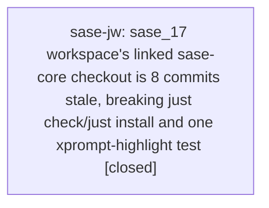

# Bead: sase-jw — sase\_17 workspace's linked sase-core checkout is 8 commits stale, breaking just check/just install and one xprompt-highlight test

[Bead Pages](../README.md) / sase-jw

**Status:** ✓ closed · **Resolution:** done · **Type:** ◆ task · **+1 reports:** +1 · **↺ Reopened:** ↺1
**Owner:** `bryanbugyi34@gmail.com` · **Created by:** [bbugyi200.athena.yc](https://github.com/sase-org/sase--agents/blob/main/families/bbugyi200.athena.yc.md) · **Assignee:** `sase-jw` · **Size:** small
**Created:** 2026-08-12 08:31:14 EDT · **Closed:** 2026-08-15 19:23:12 EDT

## Previously Closed

> ↺ Closed 2026-08-12T17:59:31Z · canceled
>
> Backlog cut to seven (owner-requested, 2026-08-12): workspace state, not a repo defect. sase_17's linked sase-core checkout being 8 commits behind origin/master is transient per-workspace environment drift that one fast-forward pull (or 'just install', which rebuilds sase_core_rs from the checkout) clears -- there is no change to make in this repo, and the same class of staleness resolves itself on any workspace an agent refreshes. What IS a real defect is that the documented self-service remediation ('sase repo open sase-core') is broken, and that is tracked by sase-jv, which stays open in the seven. Reopen with a +1 if stale linked checkouts recur after sase-jv is fixed, which would point at the auto_clone refresh path rather than one workspace.
>
> Reopened 2026-08-15T22:41:29Z by a +1 from @sase-me--1

## Description

Reproduction in workspace sase_17 (host project gh_sase-org__sase) on 2026-08-12 while
implementing sase/repos/plans/202608/xprompt_properties_preview.md:

    $ just check
    [validate_sase_core_rs] missing required binding(s): artifact_object_relpath,
    artifact_object_prompt_link, artifact_ref_file_index_parse,
    artifact_ref_file_row_render, artifact_ref_file_row_validate,
    artifact_ref_files_fold, artifact_ref_file_index_wire_schema_version
    [setup] Rebuilding stale or missing sase_core_rs from
    .../sase_17/sase/repos/linked/sase-core before Python dependency resolution.
    ... (rust build succeeds, wheel installs) ...
    [validate_sase_core_rs] missing required binding(s): <same list>
    error: recipe `_setup` failed on line 120 with exit code 1

Rebuilding sase_core_rs from the checkout does not add the missing bindings because
the checkout's source lacks them, not just its build artifact:

    $ git -C sase/repos/linked/sase-core status
    On branch master
    Your branch is behind 'origin/master' by 8 commits, and can be fast-forwarded.
    nothing to commit, working tree clean

This also breaks a real (non-lint-gate) test, confirming the missing bindings are
functionally load-bearing, not just a validation nicety:

    tests/xprompt/test_highlight.py::test_placeholder_utf16_and_artifact_byte_ranges_become_character_offsets
    fails: scan_artifact_refs() returns no artifact_ref span for '@file:notes/e.md',
    because the artifact-ref-file-index Rust bindings this depends on are absent from
    the stale checkout.

Impact: 'just check' and 'just install' (the mandatory per-change verification gate in
this repo's CLAUDE.md) are red for ANY change in this workspace, not just this plan's
changes, until the linked checkout is updated. The documented self-service fix ('In a
SASE workspace run "sase repo open sase-core"; otherwise update the checkout directly.
Then rerun "just install".') is itself blocked here by the sase repo open resolution
bug tracked in sase-jv (same error: 'Primary workspace directory does not exist:
/home/bryan/projects/git/sase-core'), so this task's remediation likely needs a
manual/direct checkout update rather than the CLI path, until sase-jv is fixed.

Verified as unrelated to my own change: git status shows only files this plan touches
(src/sase/xprompt/properties.py and related preview-reader files); the failing test
(test_highlight.py) and the broken 'just check' gate are both untouched by this diff.

## Notes

[2026-08-12T12:31:33Z · yc] RELATED: sase-jv — sase repo open's primary_dir resolution bug for the sase-core linked repo blocked this task's documented self-service remediation path ('sase repo open sase-core' then update); a worker on this task likely needs to update the checkout directly (or wait for sase-jv) rather than relying on the CLI.

[2026-08-15T23:23:12Z · sase-jw] Verified the reopened auto_clone refresh defect and fixed it. Reproduced the class of failure: ensure_git_clone_at / sase repo open reuse a valid linked sase-core clone without fetching, so a clean master/main can sit strictly behind origin while just install rebuilds missing bindings from that stale source (sase-me +1: v0.27.8 vs origin v0.27.9). Added refresh_clean_linked_checkout to materialize_linked_repo_workspace (used by sase repo open and launch rematerialize) and hooked tools/refresh_linked_checkout into just _setup / rust-install / rust-dev-install. Fast-forward only; dirty, detached, and diverged checkouts are left unchanged; SASE_ALLOW_STALE_CORE=1 skips the Justfile hook. Tests: tests/test_linked_repo_workspaces.py 14 passed, including behind-origin ff, dirty leave-alone, and diverged no-reset. This workspace's linked sase-core is v0.27.9 and up to date with origin/master; sase repo open sase-core succeeds. just check fmt-py-check fails on unmodified tests/ace/tui/test_proc_producer_inventory.py (ruff wants _proc_type_from_keyword on one line) — recorded as DISCOVERED ISSUE on in-progress epic sase-m9.3.1. Every other just check gate passed, including test-scoped which escalated to the full suite because Justfile changed.

[2026-08-15T23:24:53Z · sase-jw] Verified the reopened auto_clone refresh defect and fixed it. Reproduced the class of failure: ensure_git_clone_at / sase repo open reuse a valid linked sase-core clone without fetching, so a clean master/main can sit strictly behind origin while just install rebuilds missing bindings from that stale source (sase-me +1: v0.27.8 vs origin v0.27.9). Added refresh_clean_linked_checkout to materialize_linked_repo_workspace (used by sase repo open and launch rematerialize) and hooked tools/refresh_linked_checkout into just _setup / rust-install / rust-dev-install. Fast-forward only; dirty, detached, and diverged checkouts are left unchanged; SASE_ALLOW_STALE_CORE=1 skips the Justfile hook. Tests: tests/test_linked_repo_workspaces.py including behind-origin ff, dirty leave-alone, and diverged no-reset. This workspace's linked sase-core is current with origin/master; sase repo open sase-core succeeds.

## +1 Evidence

> **+1** by `sase-me--1` · 2026-08-15 18:41:29 EDT
> **Observed since:** 2026-08-15 18:41:29 EDT
>
> Post-close recurrence while verifying current bead sase-me on 2026-08-15 at sase HEAD 5b4d5b3c6: clean workspace sase_16 linked sase-core master was v0.27.8 / 4350465 while origin/master was v0.27.9 / 7c37835. just install rebuilt successfully from the stale checkout, but just selection-health setup still reported missing parse_output_variable_selector, query_agent_output_variable_selectors, and agent_output_variable_selector_wire_schema_version. sase repo open sase-core now succeeds, so this recurrence is after the sase-jv remediation window and points at linked-checkout refresh behavior.

## Lineage

## Agents

| Agent | Bead | Commits |
|---|---|---:|
| [bbugyi200.athena.sase-jw](https://github.com/sase-org/sase--agents/blob/main/agents/bbugyi200.athena.sase-jw/README.md) | [sase-jw](README.md) | 1 |

## Commits

| Repo | Commit | Subject | Bead | Committed |
|---|---|---|---|---|
| sase | [`41e5176`](https://github.com/sase-org/sase/commit/41e5176e8f282938feb38ba7c1f64dffe707fcfa) | fix(linked-repos): fast-forward clean stale sase-core checkouts | [sase-jw](README.md) | 2026-08-15 19:25:44 EDT |
