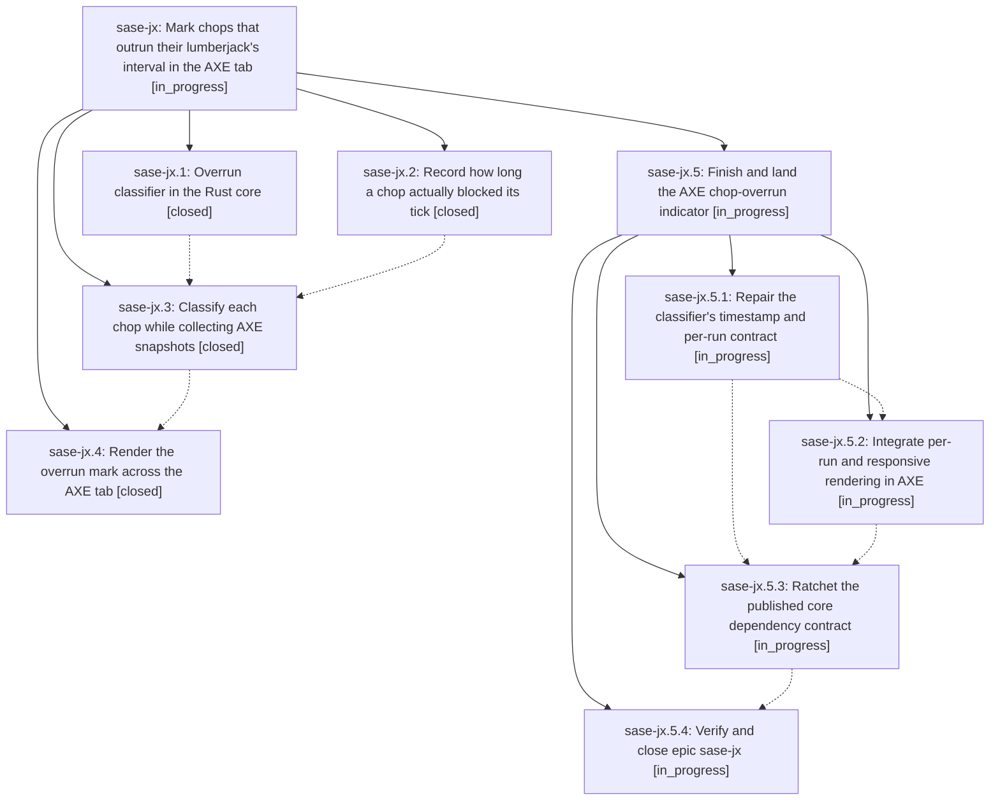

# Bead: sase-jx — Mark chops that outrun their lumberjack's interval in the AXE tab

[Bead Pages](../README.md) / sase-jx

**Status:** ◐ in_progress · **Type:** ▸ plan · **Tier:** epic
**Owner:** `bryanbugyi34@gmail.com` · **Created by:** [bbugyi200.athena.ye](https://github.com/sase-org/sase--agents/blob/main/agents/bbugyi200.athena.ye/README.md) · **Assignee:** `sase-jx.land`
**Created:** 2026-08-12 09:05:51 EDT
**Plan:** [202608/axe\_chop\_overrun\_indicator.md](https://github.com/sase-org/sase--plans/blob/main/202608/axe_chop_overrun_indicator.md)

## Description

The AXE tab visibly marks every chop whose run time reaches or exceeds its lumberjack's interval — on the sidebar row, in the lumberjack overview table, and in the chop detail header — so the operator can tell at a glance which chop is stretching its lumberjack's cycle and needs a longer interval or a lumberjack of its own.

## Phases

| Bead | Title | Status | Size | Created | Agents | Commits |
|---|---|---|---|---|---:|---:|
| [sase-jx.1](sase-jx.1.md) | Overrun classifier in the Rust core | ✓ closed | medium | 2026-08-12 | 1 | 1 |
| [sase-jx.2](sase-jx.2.md) | Record how long a chop actually blocked its tick | ✓ closed | small | 2026-08-12 | 1 | 1 |
| [sase-jx.3](sase-jx.3.md) | Classify each chop while collecting AXE snapshots | ✓ closed | medium | 2026-08-12 | 1 | 1 |
| [sase-jx.4](sase-jx.4.md) | Render the overrun mark across the AXE tab | ✓ closed | medium | 2026-08-12 | 1 | 1 |

## Lineage

## Agents

| Agent | Bead | Commits |
|---|---|---:|
| [bbugyi200.athena.sase-jx.1](https://github.com/sase-org/sase--agents/blob/main/agents/bbugyi200.athena.sase-jx.1/README.md) | [sase-jx.1](sase-jx.1.md) | 1 |
| [bbugyi200.athena.sase-jx.2](https://github.com/sase-org/sase--agents/blob/main/agents/bbugyi200.athena.sase-jx.2/README.md) | [sase-jx.2](sase-jx.2.md) | 1 |
| [bbugyi200.athena.sase-jx.3](https://github.com/sase-org/sase--agents/blob/main/agents/bbugyi200.athena.sase-jx.3/README.md) | [sase-jx.3](sase-jx.3.md) | 1 |
| [bbugyi200.athena.sase-jx.4](https://github.com/sase-org/sase--agents/blob/main/agents/bbugyi200.athena.sase-jx.4/README.md) | [sase-jx.4](sase-jx.4.md) | 1 |
| [bbugyi200.athena.sase-jx.5.1](https://github.com/sase-org/sase--agents/blob/main/agents/bbugyi200.athena.sase-jx.5.1/README.md) | [sase-jx.5.1](sase-jx.5.1.md) | 1 |
| [bbugyi200.athena.sase-jx.5.2](https://github.com/sase-org/sase--agents/blob/main/agents/bbugyi200.athena.sase-jx.5.2/README.md) | [sase-jx.5.2](sase-jx.5.2.md) | 0 |
| [bbugyi200.athena.sase-jx.5.3](https://github.com/sase-org/sase--agents/blob/main/agents/bbugyi200.athena.sase-jx.5.3/README.md) | [sase-jx.5.3](sase-jx.5.3.md) | 0 |
| [bbugyi200.athena.sase-jx.5.4](https://github.com/sase-org/sase--agents/blob/main/agents/bbugyi200.athena.sase-jx.5.4/README.md) | [sase-jx.5.4](sase-jx.5.4.md) | 0 |
| [bbugyi200.athena.sase-jx.5.land](https://github.com/sase-org/sase--agents/blob/main/agents/bbugyi200.athena.sase-jx.5.land/README.md) | [sase-jx.5](sase-jx.5.md) | 0 |
| [bbugyi200.athena.sase-jx.land](https://github.com/sase-org/sase--agents/blob/main/agents/bbugyi200.athena.sase-jx.land/README.md) | [sase-jx](README.md) | 0 |

## Commits

| Repo | Commit | Subject | Bead | Committed |
|---|---|---|---|---|
| sase | [`46773f6`](https://github.com/sase-org/sase/commit/46773f606446985acdc9ca2ca0112fbca2802d78) | feat(axe): preserve script wall-clock through chop run finalization | [sase-jx.2](sase-jx.2.md) | 2026-08-12 10:10:57 EDT |
| sase-core | [`sase-core@c1a0a73`](https://github.com/sase-org/sase-core/commit/c1a0a7361d2caf81c7255d568ed8684b1b230c2a) | feat(axe\_overrun): add chop-overrun classifier with PyO3 bindings | [sase-jx.1](sase-jx.1.md) | 2026-08-12 10:11:12 EDT |
| sase | [`2f1512c`](https://github.com/sase-org/sase/commit/2f1512c7cf527cf475ff0a618c0d96598d008238) | feat(axe): classify chop overruns in snapshots | [sase-jx.3](sase-jx.3.md) | 2026-08-12 10:38:08 EDT |
| sase | [`d4c4efd`](https://github.com/sase-org/sase/commit/d4c4efda57da358787c94801d3d8cdea038c05af) | feat(axe): render overrun indicator across AXE tab surfaces | [sase-jx.4](sase-jx.4.md) | 2026-08-12 11:49:14 EDT |
| sase-core | [`sase-core@46ce1fe`](https://github.com/sase-org/sase-core/commit/46ce1fe9f1696f869007107114502b1b27f24bf6) | fix(axe\_overrun): validate started\_at unconditionally and align per-run ratios | [sase-jx.5.1](sase-jx.5.1.md) | 2026-08-12 12:29:09 EDT |
