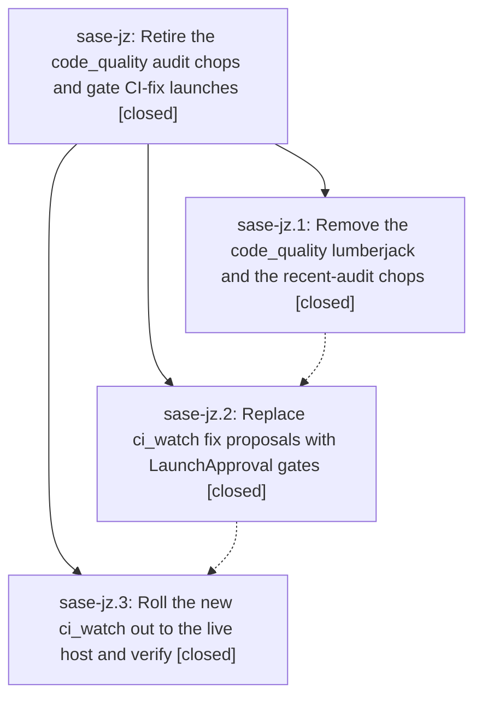

# Bead: sase-jz — Retire the code\_quality audit chops and gate CI-fix launches

[Bead Pages](../README.md) / sase-jz

**Status:** ✓ closed · **Resolution:** done · **Type:** ▸ plan · **Tier:** epic
**Owner:** `bryanbugyi34@gmail.com` · **Created by:** [bbugyi200.athena.yi](https://github.com/sase-org/sase--agents/blob/main/agents/bbugyi200.athena.yi/README.md) · **Assignee:** `sase-jz.land`
**Created:** 2026-08-12 10:38:38 EDT · **Closed:** 2026-08-12 11:48:37 EDT
**Plan:** [202608/retire\_audit\_chops\_and\_gate\_ci\_fixes.md](https://github.com/sase-org/sase--plans/blob/main/202608/retire_audit_chops_and_gate_ci_fixes.md)

## Description

The `code_quality` lumberjack and its `audit_bugs`/`audit_improvements` agents never run again, the `bugyi_chop_recent_*` scripts are gone from bugyi-chops, and `bugyi_chop_ci_watch` stops launching `ci_fix.*` agents through Axe: it files one durable LaunchApproval gate per distinct CI failure so the user approves or rejects each repair launch at their convenience, and never files a duplicate gate.

## Notes

[2026-08-12T15:48:37Z · sase-jz.land] VERIFIED (step 1). Read every child bead and note against the source and the live host. Phase 1 (c83557a, chezmoi 7473db74): code_quality lumberjack gone from sase_athena.yml and from 'sase axe lumberjack list'; recent_audits module/tests/scripts/README coverage deleted; rg finds no recent_audits/recent_bug/recent_improvement/audit_bugs/audit_improvements anywhere in bugyi-chops, and no code_quality axe reference in chezmoi or the sase repo. Phase 2 (e1dadf0): ci_watch.py emits no proposed_launches at all; LaunchGateClient files 'sase launch request -f <tmp> -o json -s ci_watch' with cwd=$HOME, polls 'sase gate show -k launch -i <id> -j' bounded by MAX_GATE_POLLS_PER_TICK=10, and the fix branch implements the planned suppression order (fix_disabled, agents_check_failed, fix_in_flight, gate_pending, already_gated, fix_cap_reached, create) with the ledger flushed immediately after each gate creation; ledger is v2 with a 'gates' map; counters are fix_gated/gate_pending_suppressed/gate_errors and actionable = fix_gated or merged; the notify-on-fix announcement is gone. Phase 3 (4d20317, chezmoi 731c0e46): 0.5.0 released and pushed, no release tag, inert 'wait_runners: 0' dropped, plugin reinstalled, axe healthy. Live end-to-end: one gate filed (launch-4d63090a, pending) whose preview prompt is exactly '#gh:sase-org/sase %i:ci_fix.sase.@ %w(runners=0)' + #pr/#actstat + evidence body; the next tick filed no second gate (gate_pending_suppressed=1); one launch notification; no ci_fix.* agent ever launched unapproved.

FIXED (epic work the phases left undone). (a) Phase 1 step 5 was never done: removed the orphaned ~/.sase/axe/lumberjacks/code_quality/ state dir (2.1M; lumberjack unconfigured, PID 2463522 dead). (b) The gate path ignored SASE_CHOP_DRY_RUN, so 'sase axe chop run ci_watch --dry-run' would file a real gate AND permanently record its dedupe key, which would then swallow the gate a later live tick owed the user - the plan required 'a dry run must not create a gate'. Fixed in bugyi-chops 3676814 (released 0.5.1, pushed, plugin updated, axe healthy): the dry-run check sits at the point of action so the preview still reports which repo would be gated. just check green (163 tests, 91% coverage, ruff/mypy/build/twine). Live re-verification after rollout: dry run reported mode='dry run', fix_gated=0, no gate created, ledger byte-identical.

INTEGRATION (step 2). Nothing landed in bugyi-chops or chezmoi during the epic window except the epic's own commits plus a33d21d (uv.lock now tracked). The sase repo gained no commits after the epic started (2f1512c7c predates it) and contains no reference to the retired chops - its only 'code_quality' hits are an unrelated mentor name - so there was nothing to integrate or de-duplicate against.

FOLLOW-UPS. sase-jz.1's PROPOSED FOLLOW-UP (track uv.lock or change the install recipe) was already resolved inside the epic by a33d21d, which tracks uv.lock; no task filed. No other phase proposed follow-ups. Filed sase-k4 (xsmall, ready) for the bugyi-chops GitHub repo description, which still advertises 'recent-commit audits' and 'proposal-emitting'; the plan put the wording out of scope as the owner's call. Not filed: publishing bugyi-chops to PyPI / pushing a version tag - that is a release decision for the user, not work to schedule, and no v0.5.1 tag was pushed.

## Phases

| Bead | Title | Status | Size | Created | Agents | Commits |
|---|---|---|---|---|---:|---:|
| [sase-jz.1](sase-jz.1.md) | Remove the code\_quality lumberjack and the recent-audit chops | ✓ closed | small | 2026-08-12 | 1 | 1 |
| [sase-jz.2](sase-jz.2.md) | Replace ci\_watch fix proposals with LaunchApproval gates | ✓ closed | medium | 2026-08-12 | 0 | 0 |
| [sase-jz.3](sase-jz.3.md) | Roll the new ci\_watch out to the live host and verify | ✓ closed | small | 2026-08-12 | 1 | 1 |

## Lineage

## Agents

| Agent | Bead | Commits |
|---|---|---:|
| [bbugyi200.athena.sase-jz.1](https://github.com/sase-org/sase--agents/blob/main/agents/bbugyi200.athena.sase-jz.1/README.md) | [sase-jz.1](sase-jz.1.md) | 1 |
| [bbugyi200.athena.sase-jz.3](https://github.com/sase-org/sase--agents/blob/main/agents/bbugyi200.athena.sase-jz.3/README.md) | [sase-jz.3](sase-jz.3.md) | 1 |
| [bbugyi200.athena.sase-jz.land](https://github.com/sase-org/sase--agents/blob/main/agents/bbugyi200.athena.sase-jz.land/README.md) | [sase-jz](README.md) | 1 |

## Commits

| Repo | Commit | Subject | Bead | Committed |
|---|---|---|---|---|
| chezmoi | [`chezmoi@7473db7`](https://github.com/bbugyi200/dotfiles/commit/7473db74bc08894ab2f4c78e9b38889693afae3a) | chore: remove retired code quality axe lane | [sase-jz.1](sase-jz.1.md) | 2026-08-12 10:51:15 EDT |
| chezmoi | [`chezmoi@731c0e4`](https://github.com/bbugyi200/dotfiles/commit/731c0e46384b74709a63a7777bf047a9855e09ca) | chore(sase): drop inert wait\_runners from ci\_watch, describe the gate flow (sase-jz.3) | [sase-jz.3](sase-jz.3.md) | 2026-08-12 11:24:45 EDT |
| sase--plans | [`sase--plans@8bba953`](https://github.com/sase-org/sase--plans/commit/8bba953c672a655b0f13eef5a506ebe7199b74ee) | docs: mark plan retire\_audit\_chops\_and\_gate\_ci\_fixes done | [sase-jz](README.md) | 2026-08-12 11:54:36 EDT |
