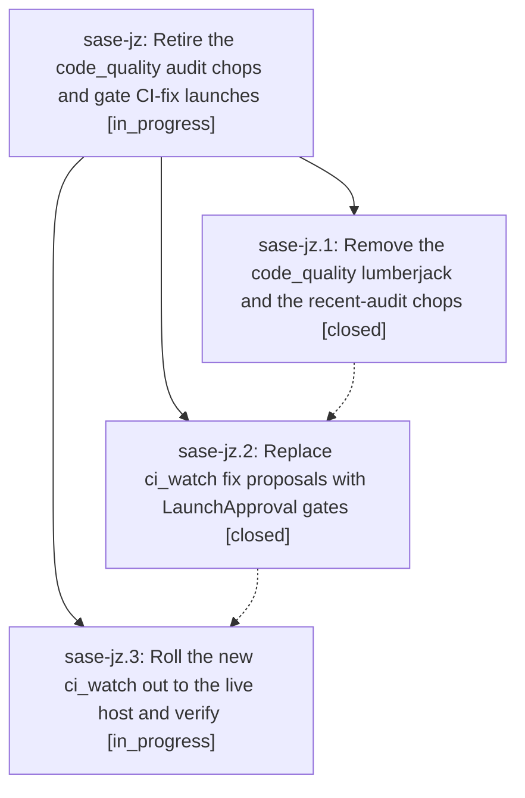

# Bead: sase-jz — Retire the code\_quality audit chops and gate CI-fix launches

[Bead Pages](../README.md) / sase-jz

**Status:** ◐ in_progress · **Type:** ▸ plan · **Tier:** epic
**Owner:** `bryanbugyi34@gmail.com` · **Created by:** [bbugyi200.athena.yi](https://github.com/sase-org/sase--agents/blob/main/agents/bbugyi200.athena.yi/README.md) · **Assignee:** `sase-jz.land`
**Created:** 2026-08-12 10:38:38 EDT
**Plan:** [202608/retire\_audit\_chops\_and\_gate\_ci\_fixes.md](https://github.com/sase-org/sase--plans/blob/main/202608/retire_audit_chops_and_gate_ci_fixes.md)

## Description

The `code_quality` lumberjack and its `audit_bugs`/`audit_improvements` agents never run again, the `bugyi_chop_recent_*` scripts are gone from bugyi-chops, and `bugyi_chop_ci_watch` stops launching `ci_fix.*` agents through Axe: it files one durable LaunchApproval gate per distinct CI failure so the user approves or rejects each repair launch at their convenience, and never files a duplicate gate.

## Phases

| Bead | Title | Status | Size | Created | Agents | Commits |
|---|---|---|---|---|---:|---:|
| [sase-jz.1](sase-jz.1.md) | Remove the code\_quality lumberjack and the recent-audit chops | ✓ closed | small | 2026-08-12 | 1 | 1 |
| [sase-jz.2](sase-jz.2.md) | Replace ci\_watch fix proposals with LaunchApproval gates | ✓ closed | medium | 2026-08-12 | 0 | 0 |
| [sase-jz.3](sase-jz.3.md) | Roll the new ci\_watch out to the live host and verify | ◐ in_progress | small | 2026-08-12 | 1 | 1 |

## Lineage

## Agents

| Agent | Bead | Commits |
|---|---|---:|
| [bbugyi200.athena.sase-jz.1](https://github.com/sase-org/sase--agents/blob/main/agents/bbugyi200.athena.sase-jz.1/README.md) | [sase-jz.1](sase-jz.1.md) | 1 |
| [bbugyi200.athena.sase-jz.3](https://github.com/sase-org/sase--agents/blob/main/agents/bbugyi200.athena.sase-jz.3/README.md) | [sase-jz.3](sase-jz.3.md) | 1 |
| [bbugyi200.athena.sase-jz.land](https://github.com/sase-org/sase--agents/blob/main/agents/bbugyi200.athena.sase-jz.land/README.md) | [sase-jz](README.md) | 0 |

## Commits

| Repo | Commit | Subject | Bead | Committed |
|---|---|---|---|---|
| chezmoi | [`chezmoi@7473db7`](https://github.com/bbugyi200/dotfiles/commit/7473db74bc08894ab2f4c78e9b38889693afae3a) | chore: remove retired code quality axe lane | [sase-jz.1](sase-jz.1.md) | 2026-08-12 10:51:15 EDT |
| chezmoi | [`chezmoi@731c0e4`](https://github.com/bbugyi200/dotfiles/commit/731c0e46384b74709a63a7777bf047a9855e09ca) | chore(sase): drop inert wait\_runners from ci\_watch, describe the gate flow (sase-jz.3) | [sase-jz.3](sase-jz.3.md) | 2026-08-12 11:24:45 EDT |
