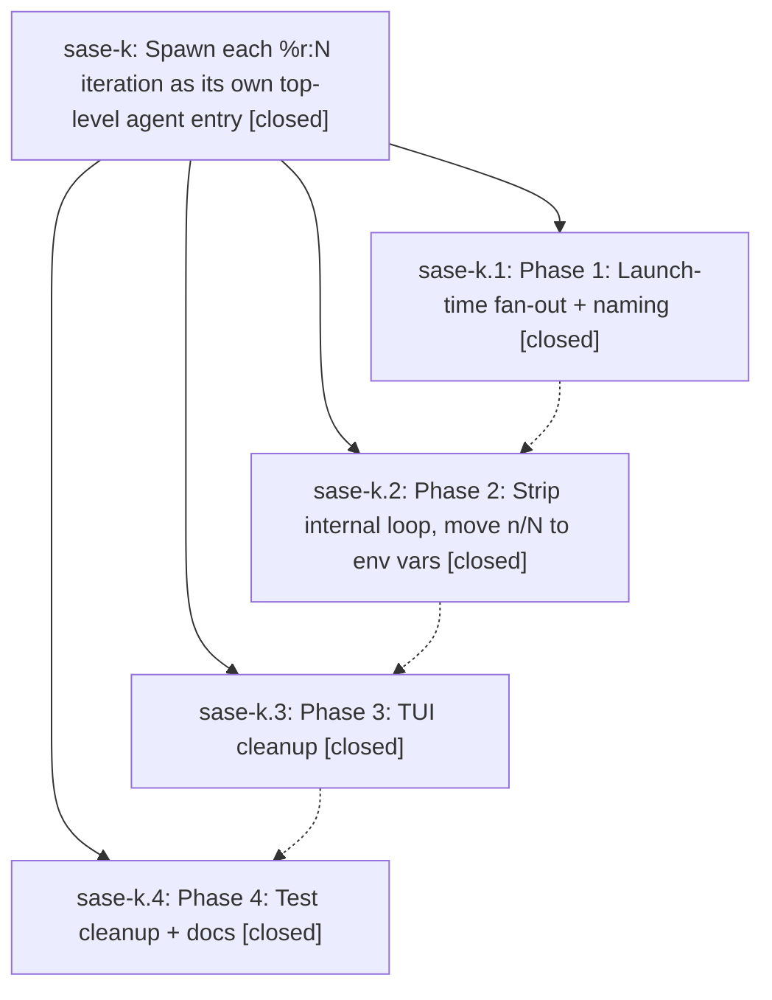

# Bead: sase-k — Spawn each %r:N iteration as its own top-level agent entry

[Bead Pages](../README.md) / sase-k

**Status:** ✓ closed · **Resolution:** (unrecorded) · **Type:** plan · **Tier:** epic
**Owner:** `bryanbugyi34@gmail.com`
**Created:** 2026-04-18 02:33:10 UTC · **Closed:** 2026-04-18 04:28:06 UTC
**Plan:** [202604/repeat\_agents\_as\_entries.md](https://github.com/sase-org/sase--plans/blob/main/202604/repeat_agents_as_entries.md)

## Phases

| Bead | Title | Status | Size | Agents | Commits |
|---|---|---|---|---:|---:|
| [sase-k.1](sase-k.1.md) | Phase 1: Launch-time fan-out + naming | ✓ closed | small | 0 | 1 |
| [sase-k.2](sase-k.2.md) | Phase 2: Strip internal loop, move n/N to env vars | ✓ closed | small | 0 | 1 |
| [sase-k.3](sase-k.3.md) | Phase 3: TUI cleanup | ✓ closed | small | 0 | 1 |
| [sase-k.4](sase-k.4.md) | Phase 4: Test cleanup + docs | ✓ closed | small | 0 | 1 |

## Lineage

## Commits

| Commit | Subject | Bead | Committed (UTC) |
|---|---|---|---|
| [`e175483`](https://github.com/sase-org/sase/commit/e175483169c7e2bc7a12ecb95f02a92f1bdbc56f) | feat: launch-time fan-out for \`%r:N\` repeat directive (sase-k.1) | [sase-k.1](sase-k.1.md) | 2026-04-18 03:52:41 |
| [`e959e36`](https://github.com/sase-org/sase/commit/e959e36a8de6defe6972fc2f75d1f7c35ab1cf21) | feat: strip internal repeat loop, move n/N to env vars (sase-k.2) | [sase-k.2](sase-k.2.md) | 2026-04-18 04:05:34 |
| [`93f2101`](https://github.com/sase-org/sase/commit/93f2101d256c6c4cb874018eede09353cb57db0a) | feat: strip repeat-iteration TUI affordances (sase-k.3) | [sase-k.3](sase-k.3.md) | 2026-04-18 04:13:38 |
| [`c3a95ec`](https://github.com/sase-org/sase/commit/c3a95ec7d3d60864212a3db73de100d6c3fbb2a4) | chore: finalize repeat-agents fan-out docs + tests (sase-k.4) | [sase-k.4](sase-k.4.md) | 2026-04-18 04:23:01 |
