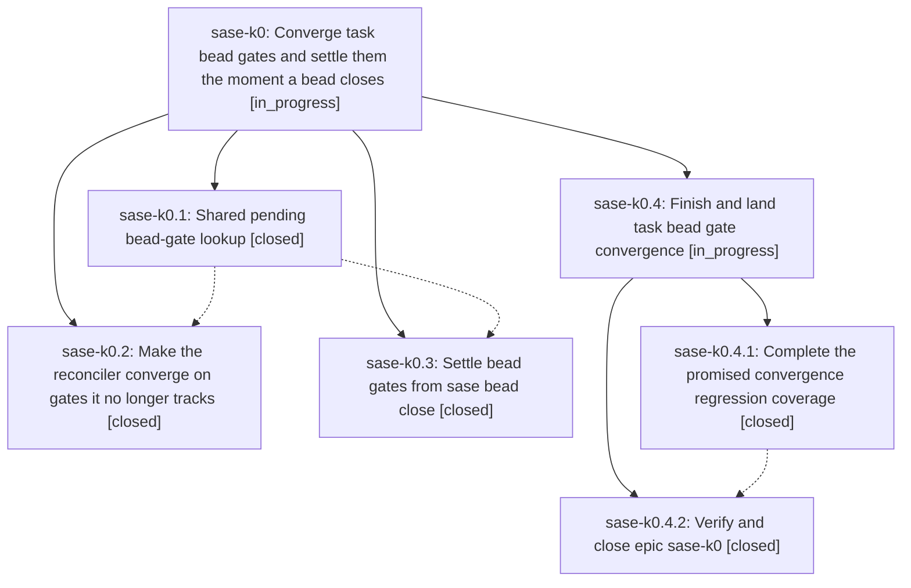

# Bead: sase-k0 — Converge task bead gates and settle them the moment a bead closes

[Bead Pages](../README.md) / sase-k0

**Status:** ◐ in_progress · **Type:** ▸ plan · **Tier:** epic
**Owner:** `bryanbugyi34@gmail.com` · **Created by:** [bbugyi200.athena.yk](https://github.com/sase-org/sase--agents/blob/main/agents/bbugyi200.athena.yk/README.md) · **Assignee:** `sase-k0.land`
**Created:** 2026-08-12 10:58:32 EDT
**Plan:** [202608/task\_gate\_convergence.md](https://github.com/sase-org/sase--plans/blob/main/202608/task_gate_convergence.md)

## Description

Live TaskTriage/BeadSnooze notifications match the set of live task beads even after a project leaves the inventory or the chop's state file is lost, and closing a task bead from the CLI clears its gate notification immediately instead of up to five minutes later.

## Phases

| Bead | Title | Status | Size | Created | Agents | Commits |
|---|---|---|---|---|---:|---:|
| [sase-k0.1](sase-k0.1.md) | Shared pending bead-gate lookup | ✓ closed | small | 2026-08-12 | 1 | 1 |
| [sase-k0.2](sase-k0.2.md) | Make the reconciler converge on gates it no longer tracks | ✓ closed | medium | 2026-08-12 | 1 | 1 |
| [sase-k0.3](sase-k0.3.md) | Settle bead gates from sase bead close | ✓ closed | medium | 2026-08-12 | 1 | 1 |

## Lineage

## Agents

| Agent | Bead | Commits |
|---|---|---:|
| [bbugyi200.athena.sase-k0.1](https://github.com/sase-org/sase--agents/blob/main/agents/bbugyi200.athena.sase-k0.1/README.md) | [sase-k0.1](sase-k0.1.md) | 1 |
| [bbugyi200.athena.sase-k0.2](https://github.com/sase-org/sase--agents/blob/main/agents/bbugyi200.athena.sase-k0.2/README.md) | [sase-k0.2](sase-k0.2.md) | 1 |
| [bbugyi200.athena.sase-k0.3](https://github.com/sase-org/sase--agents/blob/main/agents/bbugyi200.athena.sase-k0.3/README.md) | [sase-k0.3](sase-k0.3.md) | 1 |
| [bbugyi200.athena.sase-k0.4.1](https://github.com/sase-org/sase--agents/blob/main/agents/bbugyi200.athena.sase-k0.4.1/README.md) | [sase-k0.4.1](sase-k0.4.1.md) | 1 |
| [bbugyi200.athena.sase-k0.4.2](https://github.com/sase-org/sase--agents/blob/main/agents/bbugyi200.athena.sase-k0.4.2/README.md) | [sase-k0.4.2](sase-k0.4.2.md) | 1 |
| [bbugyi200.athena.sase-k0.4.land](https://github.com/sase-org/sase--agents/blob/main/agents/bbugyi200.athena.sase-k0.4.land/README.md) | [sase-k0.4](sase-k0.4.md) | 0 |
| [bbugyi200.athena.sase-k0.land](https://github.com/sase-org/sase--agents/blob/main/agents/bbugyi200.athena.sase-k0.land/README.md) | [sase-k0](README.md) | 0 |

## Commits

| Repo | Commit | Subject | Bead | Committed |
|---|---|---|---|---|
| sase | [`07f050d`](https://github.com/sase-org/sase/commit/07f050d3a28091a0b7ef28a4e7ca1502e7ec3398) | refactor(bead): share pending gate lookup | [sase-k0.1](sase-k0.1.md) | 2026-08-12 11:35:07 EDT |
| sase | [`875f67b`](https://github.com/sase-org/sase/commit/875f67b74da1e3829b9b2ec72be40df8e9be6726) | feat(bead): settle pending gates immediately on task bead close | [sase-k0.3](sase-k0.3.md) | 2026-08-12 12:11:34 EDT |
| sase | [`95a9b45`](https://github.com/sase-org/sase/commit/95a9b457502c898d74c448219eec417e6800cd11) | fix(axe): sweep stale bead task gates | [sase-k0.2](sase-k0.2.md) | 2026-08-12 12:30:24 EDT |
| sase | [`9960d74`](https://github.com/sase-org/sase/commit/9960d7444062db28ce0bf8ee08011ace31272407) | test: cover task triage project-state convergence | [sase-k0.4.1](sase-k0.4.1.md) | 2026-08-12 13:11:21 EDT |
| sase | [`1f388ed`](https://github.com/sase-org/sase/commit/1f388edee0000664e053a153f8c3a708d2c9545c) | fix(axe): remove duplicate external-mirror lumberjack chop entries | [sase-k0.4.2](sase-k0.4.2.md) | 2026-08-12 14:27:40 EDT |
