# Bead: sase-k2 — Configurable external mirror filters, its own lumberjack, and two-way bug/PR sync

[Bead Pages](../README.md) / sase-k2

**Status:** ◐ in_progress · **Type:** ▸ plan · **Tier:** epic
**Owner:** `bryanbugyi34@gmail.com` · **Created by:** [bbugyi200.athena.yn](https://github.com/sase-org/sase--agents/blob/main/agents/bbugyi200.athena.yn/README.md) · **Assignee:** `sase-k2.land`
**Created:** 2026-08-12 11:27:53 EDT
**Plan:** [202608/external\_mirror\_refinement.md](https://github.com/sase-org/sase--plans/blob/main/202608/external_mirror_refinement.md)

## Description

A user controls exactly which external bugs and pull requests become beads and Patches, release-please and release-plz PRs are excluded by default, the mirror chops run in their own generously paced lumberjack instead of overrunning the checks lane, a bead linked to a bug tracks that bug's open/closed state, an adopted external Patch tracks its PR's merge state, and the ProjectSpec corruption the mirror has been silently accumulating is fixed and repaired.

## Phases

| Bead | Title | Status | Size | Created | Agents | Commits |
|---|---|---|---|---|---:|---:|
| [sase-k2.1](sase-k2.1.md) | ProjectSpec description truncation and duplicate-block repair | ✓ closed | large | 2026-08-12 | 1 | 1 |
| [sase-k2.2](sase-k2.2.md) | Configurable bug and pull-request filters | ◐ in_progress | large | 2026-08-12 | 1 | 0 |
| [sase-k2.3](sase-k2.3.md) | Dedicated external\_mirror lumberjack and lane-independent state | ✓ closed | medium | 2026-08-12 | 1 | 1 |
| [sase-k2.4](sase-k2.4.md) | Bug state drives mirrored bead status | ◐ in_progress | large | 2026-08-12 | 1 | 0 |
| [sase-k2.5](sase-k2.5.md) | Adopted external Patches track their pull request | ◐ in_progress | large | 2026-08-12 | 1 | 0 |
| [sase-k2.6](sase-k2.6.md) | Bounded per-pass cost for the PR mirror | ◐ in_progress | medium | 2026-08-12 | 1 | 0 |

## Lineage

```mermaid
flowchart TD
    n0["sase-k2: Configurable external mirror filters, its own lumberjack, and two-way bug/PR sync [in_progress]"]
    n1["sase-k2.1: ProjectSpec description truncation and duplicate-block repair [closed]"]
    n2["sase-k2.2: Configurable bug and pull-request filters [in_progress]"]
    n3["sase-k2.3: Dedicated external_mirror lumberjack and lane-independent state [closed]"]
    n4["sase-k2.4: Bug state drives mirrored bead status [in_progress]"]
    n5["sase-k2.5: Adopted external Patches track their pull request [in_progress]"]
    n6["sase-k2.6: Bounded per-pass cost for the PR mirror [in_progress]"]
    n0 --> n1
    n0 --> n2
    n0 --> n3
    n0 --> n4
    n0 --> n5
    n0 --> n6
    n1 -.-> n5
    n1 -.-> n6
    n2 -.-> n4
    n2 -.-> n5
    n5 -.-> n6
```

## Agents

| Agent | Bead | Commits |
|---|---|---:|
| [bbugyi200.athena.sase-k2.1](https://github.com/sase-org/sase--agents/blob/main/families/bbugyi200.athena.sase-k2.1.md) | [sase-k2.1](sase-k2.1.md) | 1 |
| [bbugyi200.athena.sase-k2.2](https://github.com/sase-org/sase--agents/blob/main/families/bbugyi200.athena.sase-k2.2.md) | [sase-k2.2](sase-k2.2.md) | 0 |
| [bbugyi200.athena.sase-k2.3](https://github.com/sase-org/sase--agents/blob/main/agents/bbugyi200.athena.sase-k2.3/README.md) | [sase-k2.3](sase-k2.3.md) | 1 |
| [bbugyi200.athena.sase-k2.4](https://github.com/sase-org/sase--agents/blob/main/agents/bbugyi200.athena.sase-k2.4/README.md) | [sase-k2.4](sase-k2.4.md) | 0 |
| [bbugyi200.athena.sase-k2.5](https://github.com/sase-org/sase--agents/blob/main/agents/bbugyi200.athena.sase-k2.5/README.md) | [sase-k2.5](sase-k2.5.md) | 0 |
| [bbugyi200.athena.sase-k2.6](https://github.com/sase-org/sase--agents/blob/main/agents/bbugyi200.athena.sase-k2.6/README.md) | [sase-k2.6](sase-k2.6.md) | 0 |
| [bbugyi200.athena.sase-k2.land](https://github.com/sase-org/sase--agents/blob/main/agents/bbugyi200.athena.sase-k2.land/README.md) | [sase-k2](README.md) | 0 |

## Commits

| Repo | Commit | Subject | Bead | Committed |
|---|---|---|---|---|
| sase | [`fb33e3c`](https://github.com/sase-org/sase/commit/fb33e3c1f9ba8122392eeec67aee1b05874c0e88) | feat(external-mirror): dedicated lumberjack lane with lane-independent state | [sase-k2.3](sase-k2.3.md) | 2026-08-12 12:09:53 EDT |
| sase | [`d4139e9`](https://github.com/sase-org/sase/commit/d4139e96e2ac263f7a8af15ddcf4bc74d3f66edc) | fix: repair duplicate ProjectSpec patch blocks | [sase-k2.1](sase-k2.1.md) | 2026-08-12 12:34:55 EDT |
