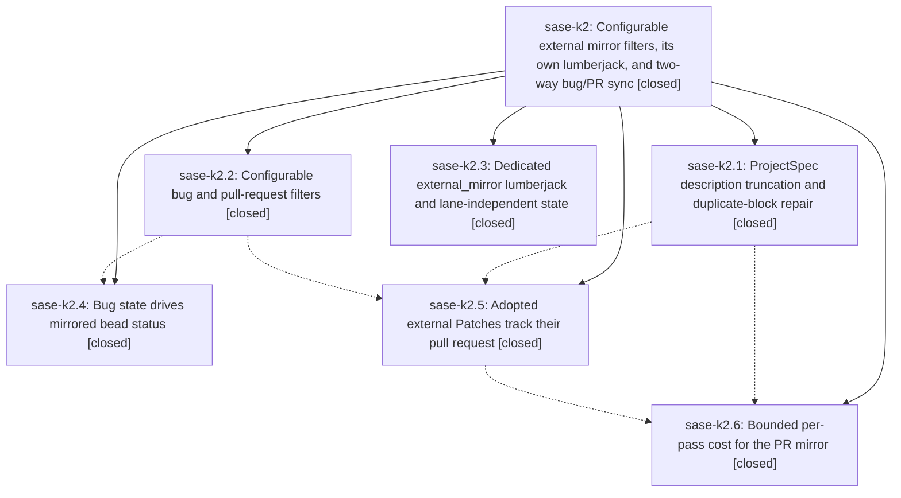

# Bead: sase-k2 — Configurable external mirror filters, its own lumberjack, and two-way bug/PR sync

[Bead Pages](../README.md) / sase-k2

**Status:** ✓ closed · **Resolution:** done · **Type:** ▸ plan · **Tier:** epic
**Owner:** `bryanbugyi34@gmail.com` · **Created by:** [bbugyi200.athena.yn](https://github.com/sase-org/sase--agents/blob/main/agents/bbugyi200.athena.yn/README.md) · **Assignee:** `sase-k2.land`
**Created:** 2026-08-12 11:27:53 EDT · **Closed:** 2026-08-12 15:19:42 EDT
**Plan:** [202608/external\_mirror\_refinement.md](https://github.com/sase-org/sase--plans/blob/main/202608/external_mirror_refinement.md)

## Description

A user controls exactly which external bugs and pull requests become beads and Patches, release-please and release-plz PRs are excluded by default, the mirror chops run in their own generously paced lumberjack instead of overrunning the checks lane, a bead linked to a bug tracks that bug's open/closed state, an adopted external Patch tracks its PR's merge state, and the ProjectSpec corruption the mirror has been silently accumulating is fixed and repaired.

## Notes

[2026-08-12T19:19:42Z · sase-k2.land] VERIFIED (step 1). Read all six phase beads and every child note, then confirmed each claim against source and the epic's six commits (fb33e3c1f, d4139e96e, 6b139a0d4, 0567ce03b, 32ccc9eb7, 67d846327) plus sase-core's 2519b42 and fb3c869.
- spec_repair: parser.py:289 now counts only truly empty lines via is_record_separator_line (storage.py:26-28, line.rstrip('\\r\\n') == ''); crates/sase_core/src/parser.rs:438 matches with line.is_empty(); format_patch_block collapses blank runs through _collapse_description_blank_runs; the raw-text repair lives in ace/patch/duplicate_repair.py behind doctor check project.duplicate_patch_blocks and 'sase doctor -F'; the shared golden corpus gained a blank-run fixture.
- filters: external_mirror/filters.py glob engine, config.py legacy fold for exclude_labels/pr_authors, schema + default_config.yml with the four release-please/release-plz head-ref exclusions, CLI Filtered column (main/patch_sync.py:109), TUI remote-only chip (_patch_list_banner.py), doctor check config.external_mirror, docs.
- lane: external_mirror lumberjack (interval 900, chop_timeout 5m) owns both chops and the checks lane owns none; pr_mirror_state_dir() migrates legacy checks-lane cursors; budget.py's LANE_CHOP_TIMEOUT_SECONDS feeds both work budgets. No hardcoded lumberjack_state_dir('checks') or ensure_lumberjack_dirs_fn remains anywhere in src/.
- bug_status: issues.py close/reopen with the documented guards, beads_closed/beads_reopened on MirrorReport and in sase bead sync-external, --dry-run lists 'would close'/'would reopen'.
- patch_status: ACTION_REFRESH end to end, guarded to pr_origin external with an under-lock re-ownership check, active-to-archive move, refreshed counter.
- perf: external_pr_import_batch holds both ProjectSpec locks once per pass over an incrementally updated in-memory index.

LIVE STATE. The external_mirror lane is running clean: 4 cycles / 2884s uptime against its 900s interval, 0 errors, and every external_pr_mirror[sase] record on 2026-08-12 (14:10 through 15:04) is status no_op with fetched=200 unmirrored=32 created=0 repaired=0 refreshed=0 errors=0 -- no timeouts, and the 32 release-please PRs are filtered rather than adopted. The checks lane is back to a healthy 320s average against its 300s interval. ('sase patch sync-external --project sase --dry-run' reports pull_requests_unsupported from a workspace venv because no plugins are installed there; the chop records are the real evidence.)

FIXED AT LANDING (step 2), two conflicts with work that landed alongside the epic:
1. Core binding floor. sase-k2.5 bumped EXTERNAL_PR_WIRE_SCHEMA_VERSION 1 -> 2 (0567ce03b, 13:29). Two minutes later 688eec2bd, from unrelated epic sase-jx, ratcheted pyproject.toml to sase-core-rs>=0.26.4 with uv.lock pinned to exactly 0.26.4 -- and 0.26.4 ships EXTERNAL_PR_WIRE_SCHEMA_VERSION: u32 = 1 and rejects any other value, while schema 2 first published in 0.26.5. Any environment resolving from the lockfile rather than a linked sase-core checkout would have failed every PR mirror pass; core/rust.py is strict with no Python fallback. Raised the floor to >=0.26.5,<0.27.0 and refreshed uv.lock.
2. Undocumented refresh behavior. docs/axe.md's external_pr_mirror counter list omitted 'refreshed' and neither it nor docs/change_spec.md described that an adopted external Patch now follows its PR to merged/closed and moves into the archive. Documented both, including the pr_origin guard, the under-lock ownership recheck, and why the daily full scan became load-bearing.
Also confirmed already-integrated: sase-k2.4 routes its mirrored-bead closes through settle_closed_task_bead_gates, matching 875f67b74; the (mtime_ns, size) Patch snapshot cache from 2d92ef6a9 invalidates correctly against the new batch writer; no AXE overrun code enumerates lane names.

ARCHIVE REPAIRED. gh_sase-org__sase-archive.sase had re-accumulated 50 duplicate blocks (25 release-please names x3) between sase-k2.1's repair at 12:32 and 12:58, written by the then-deployed build. Backed the file up to /tmp/gh_sase-org__sase-archive.sase.bak-k2land, ran 'sase doctor -F', dropped 50 blocks and reclaimed 549440 bytes. It now reads 289 raw NAME: lines / 289 parsed Patches / 289 unique names at 0.53 MB, down from the 33.8 MB and 3375-vs-289 split the plan measured. project.duplicate_patch_blocks is OK.

VERIFICATION RUN. 'just check-full' passed every lint gate (fmt, ruff, mypy, symvision, toobig, keep-sorted), SASE and committed-plans validation, and the entire pytest test-cost lane with its suite-cost budgets. It failed only at the final 'just selection-health --fail-on-new-flake' gate, which named 7 nodes over tests/reproducible_flake_baseline.txt -- all already tracked, none epic-caused, and no node failed live in the run. The same gate blocked sase-k3.6 and sase-k0.4.land on clean trees today.

FOLLOW-UP OUTCOMES. Four PROPOSED FOLLOW-UP notes were on the children, plus one deferral the plan itself directed:
- sase-k2.1 'flake baseline gate exceeds current baseline' -- duplicate of ready bead sase-jq, which already names all six nodes (five test_core_vcs_log plus test_contract_manifest_matches_marker_selection). Corroborated with a +1 carrying this landing's reproduction rather than filing again.
- sase-k2.1 'stale Symvision epic whitelist blocks just check' -- DECLINED as already resolved: filed independently as sase-kc and fixed by c30bcb012, which retired the sase-js whitelist and deleted or wired up its five symbols. No sase-k2 whitelist entries exist, so nothing expires at this close.
- sase-k2.4 'remove duplicate checks-lane mirror chops' -- DECLINED as already resolved: 1f388edee (sase-k0.4.2) removed the stale checks-lane copies that sase-k0.2's branch had reintroduced, and docs/axe.md's checks inventory correctly lists three chops.
- sase-k2.4 'decide creation policy for already-closed upstream issues' -- filed as sase-kk (large, ready). Confirmed the mechanism first: issues.py:326-328 seeds upstream_states for every newly created ref, so an issue already closed at first sight records 'closed' on the creating pass and no transition ever fires; that bead stays open permanently.
- plan-directed deferral, the perf phase's 'fetch_limit=200 deserves its own task bead' -- filed as sase-kl (large, ready), with live evidence that the limit is saturated (fetched=200, ~296 PRs on the repo) and the new note that refresh makes the up-to-24h staleness matter more than adoption delay did.
Also filed sase-km (medium, ready) for the gate gap that let conflict 1 through: probe_core_floor diagnoses staleness from binding NAMES and validate_sase_core_rs_version compares version numbers, so neither can see that a floor predates a required wire-schema constant. It carries the separate, reproduced probe_core_floor could_not_determine/PEP-695 observation that sase-jj's close reason invited filing.
Separately corrected sase-kd: its description blames a 90.0s work_seconds budget, but fb33e3c1f had already replaced that with 0.75 * LANE_CHOP_TIMEOUT_SECONDS = 225.0 twenty-five minutes before that bead was filed.

NOT COMMITTED. This landing's integration diff (pyproject.toml, uv.lock, docs/axe.md, docs/change_spec.md) is left in the working tree; per repo policy I do not commit without an explicit request or a finalizer.

[2026-08-12T19:21:51Z · sase-k2.land] LANDING FINALIZER RE-CONFIRM: epic verified (all six phases against source and commits fb33e3c1f, d4139e96e, 6b139a0d4, 0567ce03b, 32ccc9eb7, 67d846327 plus sase-core 2519b42/fb3c869), integrated (sase-core-rs floor raised to >=0.26.5,<0.27.0 for wire schema v2; refreshed counter and PR-tracked archive transition documented), live archive repaired to 289/289/289 at 0.53 MB, and follow-ups filed as sase-kk/sase-kl/sase-km with two declines recorded. Re-running close to publish-verify before committing the integration diff.

## Phases

| Bead | Title | Status | Size | Created | Agents | Commits |
|---|---|---|---|---|---:|---:|
| [sase-k2.1](sase-k2.1.md) | ProjectSpec description truncation and duplicate-block repair | ✓ closed | large | 2026-08-12 | 1 | 2 |
| [sase-k2.2](sase-k2.2.md) | Configurable bug and pull-request filters | ✓ closed | large | 2026-08-12 | 1 | 1 |
| [sase-k2.3](sase-k2.3.md) | Dedicated external\_mirror lumberjack and lane-independent state | ✓ closed | medium | 2026-08-12 | 1 | 1 |
| [sase-k2.4](sase-k2.4.md) | Bug state drives mirrored bead status | ✓ closed | large | 2026-08-12 | 1 | 1 |
| [sase-k2.5](sase-k2.5.md) | Adopted external Patches track their pull request | ✓ closed | large | 2026-08-12 | 1 | 2 |
| [sase-k2.6](sase-k2.6.md) | Bounded per-pass cost for the PR mirror | ✓ closed | medium | 2026-08-12 | 1 | 1 |

## Lineage

## Agents

| Agent | Bead | Commits |
|---|---|---:|
| [bbugyi200.athena.sase-k2.1](https://github.com/sase-org/sase--agents/blob/main/families/bbugyi200.athena.sase-k2.1.md) | [sase-k2.1](sase-k2.1.md) | 2 |
| [bbugyi200.athena.sase-k2.2](https://github.com/sase-org/sase--agents/blob/main/families/bbugyi200.athena.sase-k2.2.md) | [sase-k2.2](sase-k2.2.md) | 1 |
| [bbugyi200.athena.sase-k2.3](https://github.com/sase-org/sase--agents/blob/main/agents/bbugyi200.athena.sase-k2.3/README.md) | [sase-k2.3](sase-k2.3.md) | 1 |
| [bbugyi200.athena.sase-k2.4](https://github.com/sase-org/sase--agents/blob/main/families/bbugyi200.athena.sase-k2.4.md) | [sase-k2.4](sase-k2.4.md) | 1 |
| [bbugyi200.athena.sase-k2.5](https://github.com/sase-org/sase--agents/blob/main/families/bbugyi200.athena.sase-k2.5.md) | [sase-k2.5](sase-k2.5.md) | 2 |
| [bbugyi200.athena.sase-k2.6](https://github.com/sase-org/sase--agents/blob/main/agents/bbugyi200.athena.sase-k2.6/README.md) | [sase-k2.6](sase-k2.6.md) | 1 |
| [bbugyi200.athena.sase-k2.land](https://github.com/sase-org/sase--agents/blob/main/agents/bbugyi200.athena.sase-k2.land/README.md) | [sase-k2](README.md) | 2 |

## Commits

| Repo | Commit | Subject | Bead | Committed |
|---|---|---|---|---|
| sase | [`fb33e3c`](https://github.com/sase-org/sase/commit/fb33e3c1f9ba8122392eeec67aee1b05874c0e88) | feat(external-mirror): dedicated lumberjack lane with lane-independent state | [sase-k2.3](sase-k2.3.md) | 2026-08-12 12:09:53 EDT |
| sase | [`d4139e9`](https://github.com/sase-org/sase/commit/d4139e96e2ac263f7a8af15ddcf4bc74d3f66edc) | fix: repair duplicate ProjectSpec patch blocks | [sase-k2.1](sase-k2.1.md) | 2026-08-12 12:34:55 EDT |
| sase-core | [`sase-core@2519b42`](https://github.com/sase-org/sase-core/commit/2519b429fc25f3849fe967f191207957a66e10e8) | fix: preserve indented ProjectSpec blank lines | [sase-k2.1](sase-k2.1.md) | 2026-08-12 12:36:22 EDT |
| sase | [`6b139a0`](https://github.com/sase-org/sase/commit/6b139a0d46843de54af4ebec5d28b25925215298) | feat(external-mirror): add configurable glob filters for issues and PRs | [sase-k2.2](sase-k2.2.md) | 2026-08-12 12:41:30 EDT |
| sase | [`0567ce0`](https://github.com/sase-org/sase/commit/0567ce03be8450a991ec296494dbb8d185804d96) | feat(external-mirror): refresh adopted external Patches from PR state | [sase-k2.5](sase-k2.5.md) | 2026-08-12 13:29:25 EDT |
| sase-core | [`sase-core@fb3c869`](https://github.com/sase-org/sase-core/commit/fb3c869810eb632415d170d126d866820957a4d5) | feat(external-pr): classify refresh actions for adopted external Patches | [sase-k2.5](sase-k2.5.md) | 2026-08-12 13:31:02 EDT |
| sase | [`32ccc9e`](https://github.com/sase-org/sase/commit/32ccc9eb79ef98fa9359cdf2e1105857bbe8d57d) | perf: batch external PR mirror imports | [sase-k2.6](sase-k2.6.md) | 2026-08-12 14:11:32 EDT |
| sase | [`67d8463`](https://github.com/sase-org/sase/commit/67d84632794e9e3f1c7f1ae6fd8d1c0cc486907b) | feat(beads): sync mirrored issue status | [sase-k2.4](sase-k2.4.md) | 2026-08-12 14:39:44 EDT |
| sase | [`675c712`](https://github.com/sase-org/sase/commit/675c71279fe1c4b1695bc037d4ccefb3bcf14e76) | docs: describe the external PR mirror refresh path | [sase-k2](README.md) | 2026-08-12 15:24:27 EDT |
| sase--plans | [`sase--plans@8ffc071`](https://github.com/sase-org/sase--plans/commit/8ffc071c49ea44b9c1b07d136703cff7c4381bef) | docs(plans): mark the external mirror refinement plan done | [sase-k2](README.md) | 2026-08-12 15:25:14 EDT |
