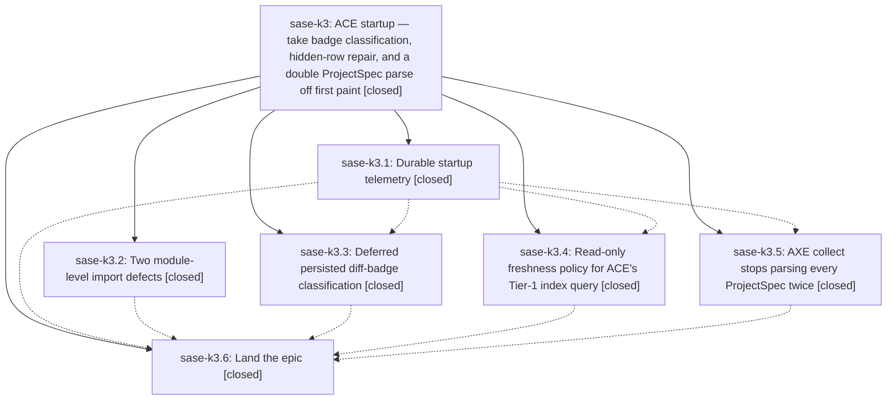

# Bead: sase-k3 — ACE startup — take badge classification, hidden-row repair, and a double ProjectSpec parse off first paint

[Bead Pages](../README.md) / sase-k3

**Status:** ✓ closed · **Resolution:** done · **Type:** ▸ plan · **Tier:** epic
**Owner:** `bryanbugyi34@gmail.com` · **Created by:** [bbugyi200.athena.yo](https://github.com/sase-org/sase--agents/blob/main/agents/bbugyi200.athena.yo/README.md) · **Assignee:** `sase-k3.land`
**Created:** 2026-08-12 11:36:00 EDT · **Closed:** 2026-08-12 15:17:15 EDT
**Plan:** [202608/ace\_startup\_critical\_path.md](https://github.com/sase-org/sase--plans/blob/main/202608/ace_startup_critical_path.md)

## Description

Warm `sase ace` time-to-interactive drops from roughly 3.5–4 s to under 2 s on athena, the part of startup that grows with every dismissed agent stops growing, and a durable startup telemetry record makes both claims checkable in a real terminal instead of modelled from component measurements.

## Notes

[2026-08-12T18:56:19Z · sase-k3.6] LAND PHASE COMPLETE (sase-k3.6, 2026-08-12), epic intentionally left open: my launch prompt forbade closing the parent epic, so the re-measured budget, the honest per-phase reading, and the two corrections to the research report that an epic close should carry are recorded in full on sase-k3.6's close note instead. Headline: real-terminal A/B (n=8 baseline 59967cc06 vs n=9 master 1f388edee, athena at loadavg ~30/64) puts visible_ready at p50 4.573 s -> 3.284 s (-28%) and p95 6.327 s -> 3.575 s (-43%); the <2 s p50 / <2.5 s p95 target is MISSED by 1.28 s / 1.08 s. Phase repair was the dominant win and was under-projected ~4-5x (Tier-1 query revalidate 1.861 s -> cached 0.28-0.29 s); phase axe's attribution is right but its magnitude does not reproduce (~0.05-0.07 s, not ~0.4 s, because the ProjectSpec archive now parses in 0.027 s). Follow-ups sase-kf/kg/kh/ki/kj filed ready; named follow-up 6 declined because it did not reproduce. just check-full is green except the pre-existing flake-baseline gate (sase-jq, sase-kd corroborated; sase-iu correctly not reopened).

[2026-08-12T19:17:15Z · sase-k3.land] LANDED epic sase-k3 (sase-k3.land, 2026-08-12). Phase sase-k3.6 did the re-measurement and follow-up filing but was forbidden by its prompt from closing the parent; this close carries the verification, the integration work that phase could not do, and the disposition of every outstanding proposal.

== 1. VERIFIED ==
All six phases closed done. Read every child note and confirmed each against the source at HEAD 67d846327, not against the reports:
- k3.1 telemetry: _startup_telemetry.py records one tui_startup.jsonl row per session (agents_ready/axe_ready/visible_ready/all_surfaces_ready + tier/artifact_source/record_count); env-overridable loader-stage threshold; docs/perf_runbook.md capture recipe. Present and wired into startup.py.
- k3.2 imports: toast_log.py has no module-scope sase.axe import; patch/_loading.py uses the sys.modules-guarded _is_mock() (validation.py:58-66) with no module-level unittest.mock. tests/ace/tui/test_lazy_imports.py guards both.
- k3.3 badges: _loading_diff_badges.py implements the deferred coalesced pass; both loader call sites pass classify_diff_badges=False (_agent_loader_normalization.py:86,118 and _loading_compute_merge.py:186); carry_over_diff_badges is wired into _loading_apply.py:399.
- k3.4 repair: freshness threaded end to end (_loading_state.py -> agent_loader.py -> _agent_loader_artifacts.py -> wire) defaulting to 'cached', with the deferred post-paint revalidating reconcile in _loading_refresh_polling.py. Rust side confirmed in the linked sase-core checkout (AgentArtifactIndexQueryWire.freshness, index.rs:83/442).
- k3.5 axe: count_hook_and_agent_runners_global() loads the archive once via find_all_patches_cached; _startup_visible_surface_ready() gates the stopwatch on the initially visible tab.
The epic's five commits are e4391c373, 59967cc06, 2d92ef6a9, 8f9c5c3ff, 14fcbc21a. I did not re-run the A/B; sase-k3.6's numbers stand as recorded, including the honest finding that the plan's <2s p50 / <2.5s p95 target was MISSED by 1.28s / 1.08s while the epic still bought p50 -28% and p95 -43%.

== 2. INTEGRATED ==
Reviewed all 14 non-epic commits landed since the epic's first commit (e4391c373, 12:15) through HEAD. Only two files overlap the epic's 33: ace/patch/__init__.py and ace/tui/actions/patch/_loading.py, both additive and non-conflicting (duplicate-block exports from d4139e96e; external-mirror glob filters from 6b139a0d4). No post-epic commit added a call to anything the epic optimized, and none introduced competing Patch caching. The mtime+size-keyed PatchSnapshotCache self-invalidates, so the new ProjectSpec writers (32ccc9eb7, 0567ce03b, d4139e96e) cannot serve stale runner counts.

Two integration items were real and are handled:

(a) FIXED IN THIS LANDING. count_all_runners_global() in ace/patch/validation.py was still 'count_hook_runners_global() + count_agent_runners_global()' -- two independent uncached full-archive parses, which is exactly the defect phase k3.5 created count_hook_and_agent_runners_global() to remove, and that helper's own docstring names this caller shape. k3.5 migrated the AXE status collector but left this one. It is not cosmetic: axe/runner_pool.py calls it at 8 sites for per-tick admission control, twice inside an fcntl LOCK_EX critical section (reserve_slot, is_at_limit), so the second parse was pure latency inside a cross-process lock, and the two separate parses could observe different on-disk states (a torn read). Now routed through the shared cached snapshot; arithmetic unchanged. Added tests/test_patch_runner_counters.py pinning one cached load / zero uncached loads, equality with the old expression, and the 2/3 hook/agent split. Existing callers patch at the import site (sase.axe.runner_pool.count_all_runners_global), so no test churn.

(b) ALREADY FIXED UPSTREAM, corroborated. Phase k3.4 depends on a core API first published in sase-core-rs 0.26.5 (61cc793, shipped by release commit d2a418d which bumps Cargo.toml 0.26.4->0.26.5 despite its 'release v0.26.4' subject), but commit 688eec2bd had pinned the floor to '>=0.26.4,<0.27.0' 21 minutes before k3.4 landed. Because AgentArtifactIndexQueryWire.freshness is #[serde(default)] with no deny_unknown_fields, 0.26.4 would silently drop it and revalidate on every startup -- no error, just the silent loss of the epic's largest win. origin/master b4c6038e6 has since raised the floor to >=0.26.5, which covers this wire too. Recorded as an independent +1 on task sase-km (the missing floor-gate), with the specific finding that sase-km's proposed round-trip-assertion remedy would NOT catch this instance and that grepping *_WIRE_SCHEMA_VERSION misses it because this wire never bumped a schema version. NOTE: this workspace is 2 commits behind origin/master (abc8a9ea8, b4c6038e6); the floor fix is upstream, not here.
Checked and found NOT to be a defect: pyproject's floor lagging the sase-core checkout is the designed dev state -- tools/validate_sase_core_rs_version's own remediation text and the Justfile both say tools/ratchet_core_window owns the published window at release time.

== 3. FOLLOW-UP DISPOSITION ==
Every PROPOSED FOLLOW-UP across all six children, plus k3.6's six named ones:
- k3.1 #1 (stale symvision --epic-symbol sase-js whitelist breaking just lint): ALREADY RESOLVED. Was filed as task sase-kc (closed) and fixed by commit c30bcb012. Confirmed zero --epic-symbol entries remain in the Justfile, and no sase-k3 whitelist was ever added.
- k3.1 #2 and k3.5 #1 (test_multi_prompt_launcher_xprompt_groups.py::test_launcher_qualifies_research_swarm_per_dispatch, order-dependent full-lane flake): recorded as a DISCOVERED ISSUE on in-progress epic sase-j7, whose scope is precisely this class (process-global state leaking between tests) and whose phase sase-j7.5 owns the flake baseline. Deliberately NOT filed against sase-ct: its close reason retires it as an umbrella and forbids +1, directing narrow records elsewhere. Honest status recorded there: four observations 2026-08-08 (closed sase-hj called it a tracked flake) through 2026-08-12, but no live reproduction in either of the two most recent full lanes (k3.6's check-full, or my escalated check) -- intermittent, not deterministic.
- k3.6 #1 (the unattributed agents-loader 'disk' stage): FILED as task sase-kn (large, ready) via /sase_new_task. No semantic duplicate; sase-kf is import-only (process_start->on_mount) and k3.6 explicitly flagged the overlap question, so the two were kept disjoint. Cross-noted RELATED to sase-kf, sase-kj, sase-kh, sase-ki. This is the single largest remaining startup cost at p50 2.250s of a 3.284s visible_ready.
- k3.6's named follow-ups 1-5: already filed ready as sase-kf, sase-kg, sase-kh, sase-ki, sase-kj. Verified present.
- k3.6's named follow-up 6 (plans-sidecar AA merge conflict / sase repo open plans failure): DECLINED, per the plan's own 'file only if it reproduces on a clean workspace' condition. Independently re-checked in this workspace today: git -C sase/repos/plans diff --diff-filter=U is empty and sase repo open plans succeeded. Prior-agent local state, not a defect.

== 4. VERIFICATION ==
just install, then just check on the landing tree: all 15 gates green (fmt python+markdown, keep-sorted, ruff, mypy, pyscripts, test waits, changelog, patch/stitch terminology, symvision, toobig, SASE validation, committed plans, test scoped). The scoped lane escalated to the full suite (rule: core-identity-changed) and passed. No flake-baseline failures in this run.

CARRIED FORWARD: the working tree holds the item (a) change (src/sase/ace/patch/validation.py + tests/test_patch_runner_counters.py) uncommitted for the commit finalizer.

[2026-08-12T19:19:35Z · sase-k3.land] Land verification for epic sase-k3 (ACE startup critical path).

VERIFIED (step 1): All six phases closed. Confirmed each against source at HEAD
rather than trusting reports: startup telemetry (_startup_telemetry.py); both
lazy-import fixes, guarded by test_lazy_imports.py; the deferred diff-badge
classification pass with both loader call sites passing classify_diff_badges=False;
the 'freshness' knob threaded end-to-end into the Rust wire; and the shared cached
runner snapshot. All present and wired. Did not re-run the A/B; sase-k3.6's numbers
stand, including its honest finding that the epic bought p50 -28% / p95 -43% but
missed the <2s p50 target by 1.28s.

INTEGRATED (step 2): Reviewed all 14 non-epic commits since the epic started. Only
two files overlapped, both additively; the mtime/size-keyed patch cache means the
new ProjectSpec writers self-invalidate and cannot serve stale data. Two real items:

1. FIXED HERE. count_all_runners_global() was still two independent uncached
   full-archive parses - exactly the defect k3.5 introduced
   count_hook_and_agent_runners_global() to remove, and that helper

… and 1653 more characters

## Phases

| Bead | Title | Status | Size | Created | Agents | Commits |
|---|---|---|---|---|---:|---:|
| [sase-k3.1](sase-k3.1.md) | Durable startup telemetry | ✓ closed | small | 2026-08-12 | 1 | 1 |
| [sase-k3.2](sase-k3.2.md) | Two module-level import defects | ✓ closed | xsmall | 2026-08-12 | 1 | 1 |
| [sase-k3.3](sase-k3.3.md) | Deferred persisted diff-badge classification | ✓ closed | medium | 2026-08-12 | 1 | 1 |
| [sase-k3.4](sase-k3.4.md) | Read-only freshness policy for ACE's Tier-1 index query | ✓ closed | medium | 2026-08-12 | 1 | 2 |
| [sase-k3.5](sase-k3.5.md) | AXE collect stops parsing every ProjectSpec twice | ✓ closed | small | 2026-08-12 | 1 | 1 |
| [sase-k3.6](sase-k3.6.md) | Land the epic | ✓ closed | small | 2026-08-12 | 1 | 0 |

## Lineage

## Agents

| Agent | Bead | Commits |
|---|---|---:|
| [bbugyi200.athena.sase-k3.1](https://github.com/sase-org/sase--agents/blob/main/agents/bbugyi200.athena.sase-k3.1/README.md) | [sase-k3.1](sase-k3.1.md) | 1 |
| [bbugyi200.athena.sase-k3.2](https://github.com/sase-org/sase--agents/blob/main/agents/bbugyi200.athena.sase-k3.2/README.md) | [sase-k3.2](sase-k3.2.md) | 1 |
| [bbugyi200.athena.sase-k3.3](https://github.com/sase-org/sase--agents/blob/main/agents/bbugyi200.athena.sase-k3.3/README.md) | [sase-k3.3](sase-k3.3.md) | 1 |
| [bbugyi200.athena.sase-k3.4](https://github.com/sase-org/sase--agents/blob/main/agents/bbugyi200.athena.sase-k3.4/README.md) | [sase-k3.4](sase-k3.4.md) | 2 |
| [bbugyi200.athena.sase-k3.5](https://github.com/sase-org/sase--agents/blob/main/agents/bbugyi200.athena.sase-k3.5/README.md) | [sase-k3.5](sase-k3.5.md) | 1 |
| [bbugyi200.athena.sase-k3.6](https://github.com/sase-org/sase--agents/blob/main/agents/bbugyi200.athena.sase-k3.6/README.md) | [sase-k3.6](sase-k3.6.md) | 0 |
| [bbugyi200.athena.sase-k3.land](https://github.com/sase-org/sase--agents/blob/main/agents/bbugyi200.athena.sase-k3.land/README.md) | [sase-k3](README.md) | 2 |

## Commits

| Repo | Commit | Subject | Bead | Committed |
|---|---|---|---|---|
| sase | [`e4391c3`](https://github.com/sase-org/sase/commit/e4391c373df946f87fe6f48b37338a0d3f7f25c7) | fix(ace,logs): move axe.state import into function scope, guard Mock isinstance checks via sys.modules | [sase-k3.2](sase-k3.2.md) | 2026-08-12 12:15:12 EDT |
| sase | [`59967cc`](https://github.com/sase-org/sase/commit/59967cc062a72e179f66188b7a106644656fb61c) | feat(ace): record durable per-session startup telemetry (sase-k3.1) | [sase-k3.1](sase-k3.1.md) | 2026-08-12 12:46:08 EDT |
| sase | [`2d92ef6`](https://github.com/sase-org/sase/commit/2d92ef6a92762eb07948d64c0b91f95491827829) | feat(ace,axe): share one cached Patch snapshot for runner counts, gate startup stopwatch on the visible tab (sase-k3.5) | [sase-k3.5](sase-k3.5.md) | 2026-08-12 13:33:35 EDT |
| sase-core | [`sase-core@61cc793`](https://github.com/sase-org/sase-core/commit/61cc7937e08e0d4cb629a1e04cf79cddd7924f3f) | perf(agent-scan): add cached artifact index freshness mode | [sase-k3.4](sase-k3.4.md) | 2026-08-12 13:51:20 EDT |
| sase | [`8f9c5c3`](https://github.com/sase-org/sase/commit/8f9c5c3ff30a424fc8c7236f2d13fa319afe4895) | perf(ace): use cached Tier 1 artifact index loads | [sase-k3.4](sase-k3.4.md) | 2026-08-12 13:52:24 EDT |
| sase | [`14fcbc2`](https://github.com/sase-org/sase/commit/14fcbc21a104c2252270ea0be97324231a221b50) | perf(ace): defer persisted diff-badge classification off the loader (sase-k3.3) | [sase-k3.3](sase-k3.3.md) | 2026-08-12 14:12:11 EDT |
| sase | [`2c1b875`](https://github.com/sase-org/sase/commit/2c1b8750a9e84bc0296075e8075cde4112fa57a4) | perf(ace): count all global runners from one cached snapshot (sase-k3) | [sase-k3](README.md) | 2026-08-12 15:21:02 EDT |
| sase--plans | [`sase--plans@2681850`](https://github.com/sase-org/sase--plans/commit/26818509cd6abad37e1069fc22a51b1bd4ff81e9) | docs(plans): mark ace\_startup\_critical\_path done | [sase-k3](README.md) | 2026-08-12 15:22:32 EDT |
