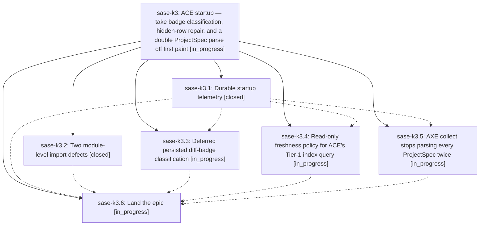

# Bead: sase-k3 — ACE startup — take badge classification, hidden-row repair, and a double ProjectSpec parse off first paint

[Bead Pages](../README.md) / sase-k3

**Status:** ◐ in_progress · **Type:** ▸ plan · **Tier:** epic
**Owner:** `bryanbugyi34@gmail.com` · **Created by:** [bbugyi200.athena.yo](https://github.com/sase-org/sase--agents/blob/main/agents/bbugyi200.athena.yo/README.md) · **Assignee:** `sase-k3.land`
**Created:** 2026-08-12 11:36:00 EDT
**Plan:** [202608/ace\_startup\_critical\_path.md](https://github.com/sase-org/sase--plans/blob/main/202608/ace_startup_critical_path.md)

## Description

Warm `sase ace` time-to-interactive drops from roughly 3.5–4 s to under 2 s on athena, the part of startup that grows with every dismissed agent stops growing, and a durable startup telemetry record makes both claims checkable in a real terminal instead of modelled from component measurements.

## Phases

| Bead | Title | Status | Size | Created | Agents | Commits |
|---|---|---|---|---|---:|---:|
| [sase-k3.1](sase-k3.1.md) | Durable startup telemetry | ✓ closed | small | 2026-08-12 | 1 | 1 |
| [sase-k3.2](sase-k3.2.md) | Two module-level import defects | ✓ closed | xsmall | 2026-08-12 | 1 | 1 |
| [sase-k3.3](sase-k3.3.md) | Deferred persisted diff-badge classification | ◐ in_progress | medium | 2026-08-12 | 1 | 0 |
| [sase-k3.4](sase-k3.4.md) | Read-only freshness policy for ACE's Tier-1 index query | ◐ in_progress | medium | 2026-08-12 | 1 | 0 |
| [sase-k3.5](sase-k3.5.md) | AXE collect stops parsing every ProjectSpec twice | ◐ in_progress | small | 2026-08-12 | 1 | 0 |
| [sase-k3.6](sase-k3.6.md) | Land the epic | ◐ in_progress | small | 2026-08-12 | 1 | 0 |

## Lineage

## Agents

| Agent | Bead | Commits |
|---|---|---:|
| [bbugyi200.athena.sase-k3.1](https://github.com/sase-org/sase--agents/blob/main/agents/bbugyi200.athena.sase-k3.1/README.md) | [sase-k3.1](sase-k3.1.md) | 1 |
| [bbugyi200.athena.sase-k3.2](https://github.com/sase-org/sase--agents/blob/main/agents/bbugyi200.athena.sase-k3.2/README.md) | [sase-k3.2](sase-k3.2.md) | 1 |
| [bbugyi200.athena.sase-k3.3](https://github.com/sase-org/sase--agents/blob/main/agents/bbugyi200.athena.sase-k3.3/README.md) | [sase-k3.3](sase-k3.3.md) | 0 |
| [bbugyi200.athena.sase-k3.4](https://github.com/sase-org/sase--agents/blob/main/agents/bbugyi200.athena.sase-k3.4/README.md) | [sase-k3.4](sase-k3.4.md) | 0 |
| [bbugyi200.athena.sase-k3.5](https://github.com/sase-org/sase--agents/blob/main/agents/bbugyi200.athena.sase-k3.5/README.md) | [sase-k3.5](sase-k3.5.md) | 0 |
| [bbugyi200.athena.sase-k3.6](https://github.com/sase-org/sase--agents/blob/main/agents/bbugyi200.athena.sase-k3.6/README.md) | [sase-k3.6](sase-k3.6.md) | 0 |
| [bbugyi200.athena.sase-k3.land](https://github.com/sase-org/sase--agents/blob/main/agents/bbugyi200.athena.sase-k3.land/README.md) | [sase-k3](README.md) | 0 |

## Commits

| Repo | Commit | Subject | Bead | Committed |
|---|---|---|---|---|
| sase | [`e4391c3`](https://github.com/sase-org/sase/commit/e4391c373df946f87fe6f48b37338a0d3f7f25c7) | fix(ace,logs): move axe.state import into function scope, guard Mock isinstance checks via sys.modules | [sase-k3.2](sase-k3.2.md) | 2026-08-12 12:15:12 EDT |
| sase | [`59967cc`](https://github.com/sase-org/sase/commit/59967cc062a72e179f66188b7a106644656fb61c) | feat(ace): record durable per-session startup telemetry (sase-k3.1) | [sase-k3.1](sase-k3.1.md) | 2026-08-12 12:46:08 EDT |
