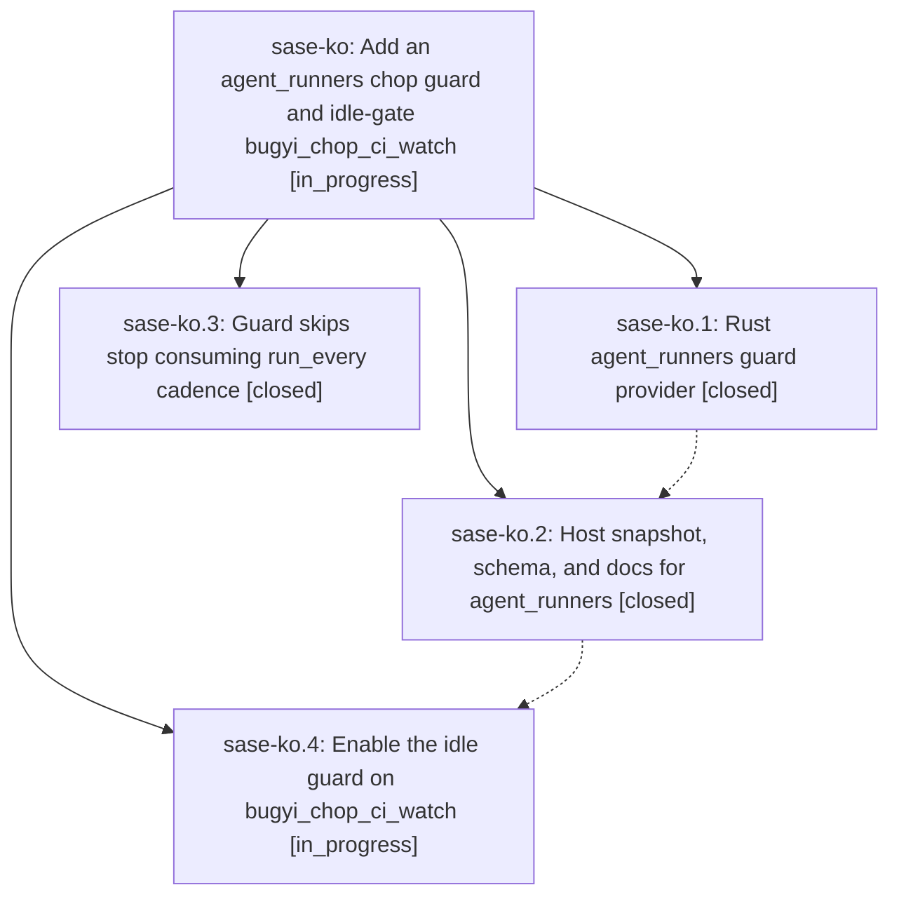

# Bead: sase-ko — Add an agent\_runners chop guard and idle-gate bugyi\_chop\_ci\_watch

[Bead Pages](../README.md) / sase-ko

**Status:** ◐ in_progress · **Type:** ▸ plan · **Tier:** epic
**Owner:** `bryanbugyi34@gmail.com` · **Created by:** [bbugyi200.athena.yx](https://github.com/sase-org/sase--agents/blob/main/agents/bbugyi200.athena.yx/README.md) · **Assignee:** `sase-ko.land`
**Created:** 2026-08-12 15:59:53 EDT
**Plan:** [202608/chop\_agent\_runners\_guard.md](https://github.com/sase-org/sase--plans/blob/main/202608/chop_agent_runners_guard.md)

## Description

A declarative `inhibit_if: {agent_runners: {max: N}}` chop guard exists end to end, and `bugyi_chop_ci_watch` uses it so the chop only runs while no SASE agent holds a runner slot.

## Phases

| Bead | Title | Status | Size | Created | Agents | Commits |
|---|---|---|---|---|---:|---:|
| [sase-ko.1](sase-ko.1.md) | Rust agent\_runners guard provider | ✓ closed | medium | 2026-08-12 | 1 | 1 |
| [sase-ko.2](sase-ko.2.md) | Host snapshot, schema, and docs for agent\_runners | ✓ closed | medium | 2026-08-12 | 1 | 1 |
| [sase-ko.3](sase-ko.3.md) | Guard skips stop consuming run\_every cadence | ✓ closed | small | 2026-08-12 | 1 | 1 |
| [sase-ko.4](sase-ko.4.md) | Enable the idle guard on bugyi\_chop\_ci\_watch | ◐ in_progress | xsmall | 2026-08-12 | 1 | 1 |

## Lineage

## Agents

| Agent | Bead | Commits |
|---|---|---:|
| [bbugyi200.athena.sase-ko.1](https://github.com/sase-org/sase--agents/blob/main/agents/bbugyi200.athena.sase-ko.1/README.md) | [sase-ko.1](sase-ko.1.md) | 1 |
| [bbugyi200.athena.sase-ko.2](https://github.com/sase-org/sase--agents/blob/main/agents/bbugyi200.athena.sase-ko.2/README.md) | [sase-ko.2](sase-ko.2.md) | 1 |
| [bbugyi200.athena.sase-ko.3](https://github.com/sase-org/sase--agents/blob/main/agents/bbugyi200.athena.sase-ko.3/README.md) | [sase-ko.3](sase-ko.3.md) | 1 |
| [bbugyi200.athena.sase-ko.4](https://github.com/sase-org/sase--agents/blob/main/agents/bbugyi200.athena.sase-ko.4/README.md) | [sase-ko.4](sase-ko.4.md) | 1 |
| [bbugyi200.athena.sase-ko.land](https://github.com/sase-org/sase--agents/blob/main/agents/bbugyi200.athena.sase-ko.land/README.md) | [sase-ko](README.md) | 0 |

## Commits

| Repo | Commit | Subject | Bead | Committed |
|---|---|---|---|---|
| sase-core | [`sase-core@a0a6ca4`](https://github.com/sase-org/sase-core/commit/a0a6ca4aaa7bc883433c66693773abf21f14e5d3) | feat(axe-chop): add the agent\_runners inhibit\_if guard provider | [sase-ko.1](sase-ko.1.md) | 2026-08-12 16:10:05 EDT |
| sase | [`e5b0b5f`](https://github.com/sase-org/sase/commit/e5b0b5f5ca301def9941ac49f67b5f8a017ee899) | fix(axe): stop guard skips from consuming run\_every cadence | [sase-ko.3](sase-ko.3.md) | 2026-08-12 16:13:27 EDT |
| sase | [`7e8f528`](https://github.com/sase-org/sase/commit/7e8f528b2f3f235ca7a4e3916af404065b728150) | feat(axe): add agent\_runners chop guard preflight | [sase-ko.2](sase-ko.2.md) | 2026-08-12 16:39:18 EDT |
| chezmoi | [`chezmoi@54de26c`](https://github.com/bbugyi200/dotfiles/commit/54de26c31e34fea58fe40bd9a71d155c222c4c15) | feat(axe): idle-gate bugyi\_chop\_ci\_watch on the agent\_runners guard | [sase-ko.4](sase-ko.4.md) | 2026-08-12 16:50:38 EDT |
