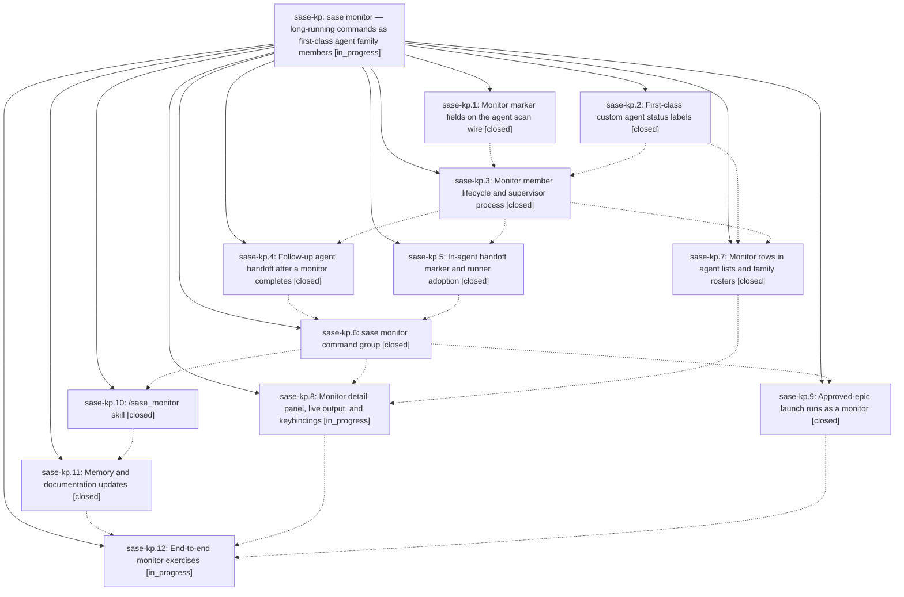

# Bead: sase-kp — sase monitor — long-running commands as first-class agent family members

[Bead Pages](../README.md) / sase-kp

**Status:** ◐ in_progress · **Type:** ▸ plan · **Tier:** epic
**Owner:** `bryanbugyi34@gmail.com` · **Created by:** [bbugyi200.athena.yy](https://github.com/sase-org/sase--agents/blob/main/agents/bbugyi200.athena.yy/README.md) · **Assignee:** `sase-kp.land`
**Created:** 2026-08-12 17:27:55 EDT
**Plan:** [202608/sase\_monitor.md](https://github.com/sase-org/sase--plans/blob/main/202608/sase_monitor.md)

## Description

Agents can hand a slow command (`just check-full`, a CI wait, `sase bead work`) to `sase monitor start` and be killed cleanly, while the command keeps running as a live, first-class monitor member of their agent family — with streaming output, live runtime, custom start/stop statuses, a timeout, and an optional follow-up agent that resumes the same workspace and conversation when the command finishes.

## Phases

| Bead | Title | Status | Size | Created | Agents | Commits |
|---|---|---|---|---|---:|---:|
| [sase-kp.1](sase-kp.1.md) | Monitor marker fields on the agent scan wire | ✓ closed | small | 2026-08-12 | 1 | 2 |
| [sase-kp.10](sase-kp.10.md) | /sase\_monitor skill | ✓ closed | small | 2026-08-12 | 1 | 1 |
| [sase-kp.11](sase-kp.11.md) | Memory and documentation updates | ✓ closed | small | 2026-08-12 | 1 | 1 |
| [sase-kp.12](sase-kp.12.md) | End-to-end monitor exercises | ◐ in_progress | xsmall | 2026-08-12 | 1 | 0 |
| [sase-kp.2](sase-kp.2.md) | First-class custom agent status labels | ✓ closed | medium | 2026-08-12 | 1 | 1 |
| [sase-kp.3](sase-kp.3.md) | Monitor member lifecycle and supervisor process | ✓ closed | medium | 2026-08-12 | 1 | 1 |
| [sase-kp.4](sase-kp.4.md) | Follow-up agent handoff after a monitor completes | ✓ closed | medium | 2026-08-12 | 1 | 1 |
| [sase-kp.5](sase-kp.5.md) | In-agent handoff marker and runner adoption | ✓ closed | medium | 2026-08-12 | 1 | 1 |
| [sase-kp.6](sase-kp.6.md) | sase monitor command group | ✓ closed | medium | 2026-08-12 | 1 | 1 |
| [sase-kp.7](sase-kp.7.md) | Monitor rows in agent lists and family rosters | ✓ closed | medium | 2026-08-12 | 1 | 1 |
| [sase-kp.8](sase-kp.8.md) | Monitor detail panel, live output, and keybindings | ◐ in_progress | medium | 2026-08-12 | 1 | 0 |
| [sase-kp.9](sase-kp.9.md) | Approved-epic launch runs as a monitor | ✓ closed | medium | 2026-08-12 | 1 | 1 |

## Lineage

## Agents

| Agent | Bead | Commits |
|---|---|---:|
| [bbugyi200.athena.sase-kp.1](https://github.com/sase-org/sase--agents/blob/main/agents/bbugyi200.athena.sase-kp.1/README.md) | [sase-kp.1](sase-kp.1.md) | 2 |
| [bbugyi200.athena.sase-kp.10](https://github.com/sase-org/sase--agents/blob/main/agents/bbugyi200.athena.sase-kp.10/README.md) | [sase-kp.10](sase-kp.10.md) | 1 |
| [bbugyi200.athena.sase-kp.11](https://github.com/sase-org/sase--agents/blob/main/agents/bbugyi200.athena.sase-kp.11/README.md) | [sase-kp.11](sase-kp.11.md) | 1 |
| [bbugyi200.athena.sase-kp.12](https://github.com/sase-org/sase--agents/blob/main/agents/bbugyi200.athena.sase-kp.12/README.md) | [sase-kp.12](sase-kp.12.md) | 0 |
| [bbugyi200.athena.sase-kp.2](https://github.com/sase-org/sase--agents/blob/main/agents/bbugyi200.athena.sase-kp.2/README.md) | [sase-kp.2](sase-kp.2.md) | 1 |
| [bbugyi200.athena.sase-kp.3](https://github.com/sase-org/sase--agents/blob/main/agents/bbugyi200.athena.sase-kp.3/README.md) | [sase-kp.3](sase-kp.3.md) | 1 |
| [bbugyi200.athena.sase-kp.4](https://github.com/sase-org/sase--agents/blob/main/agents/bbugyi200.athena.sase-kp.4/README.md) | [sase-kp.4](sase-kp.4.md) | 1 |
| [bbugyi200.athena.sase-kp.5](https://github.com/sase-org/sase--agents/blob/main/agents/bbugyi200.athena.sase-kp.5/README.md) | [sase-kp.5](sase-kp.5.md) | 1 |
| [bbugyi200.athena.sase-kp.6](https://github.com/sase-org/sase--agents/blob/main/agents/bbugyi200.athena.sase-kp.6/README.md) | [sase-kp.6](sase-kp.6.md) | 1 |
| [bbugyi200.athena.sase-kp.7](https://github.com/sase-org/sase--agents/blob/main/agents/bbugyi200.athena.sase-kp.7/README.md) | [sase-kp.7](sase-kp.7.md) | 1 |
| [bbugyi200.athena.sase-kp.8](https://github.com/sase-org/sase--agents/blob/main/agents/bbugyi200.athena.sase-kp.8/README.md) | [sase-kp.8](sase-kp.8.md) | 0 |
| [bbugyi200.athena.sase-kp.9](https://github.com/sase-org/sase--agents/blob/main/agents/bbugyi200.athena.sase-kp.9/README.md) | [sase-kp.9](sase-kp.9.md) | 1 |
| [bbugyi200.athena.sase-kp.land](https://github.com/sase-org/sase--agents/blob/main/agents/bbugyi200.athena.sase-kp.land/README.md) | [sase-kp](README.md) | 0 |

## Commits

| Repo | Commit | Subject | Bead | Committed |
|---|---|---|---|---|
| sase-core | [`sase-core@cb91149`](https://github.com/sase-org/sase-core/commit/cb91149efa64a9ba0c342ac8b7e3ba0d5e650b10) | feat(agent-scan): add monitor marker fields to the agent scan wire | [sase-kp.1](sase-kp.1.md) | 2026-08-12 17:45:57 EDT |
| sase | [`3c37f8e`](https://github.com/sase-org/sase/commit/3c37f8e3651bae1f0b53b759efdafffa86a5e2fd) | feat(agent-scan): mirror monitor marker fields on the Python wire | [sase-kp.1](sase-kp.1.md) | 2026-08-12 18:03:25 EDT |
| sase | [`9bfdaed`](https://github.com/sase-org/sase/commit/9bfdaedd4561b38e8522f716ac4e11c19cdf5d13) | feat(agent): honor custom status bucket overrides | [sase-kp.2](sase-kp.2.md) | 2026-08-12 18:15:00 EDT |
| sase | [`b32167c`](https://github.com/sase-org/sase/commit/b32167c31bca2e28d6dfbd6e8cd5dd86a07a883f) | feat(monitor): add monitor member lifecycle and supervisor process | [sase-kp.3](sase-kp.3.md) | 2026-08-12 19:21:48 EDT |
| sase | [`2aff0a0`](https://github.com/sase-org/sase/commit/2aff0a03e6b7d4c6e0a5579993867da30cc327aa) | feat: adopt monitor handoffs in agent runner | [sase-kp.5](sase-kp.5.md) | 2026-08-12 19:44:17 EDT |
| sase | [`10d3527`](https://github.com/sase-org/sase/commit/10d3527dd5c0fb103a2a49594f51a19bf0a5d771) | feat(monitor): launch follow-up agent after monitor completion | [sase-kp.4](sase-kp.4.md) | 2026-08-12 19:57:30 EDT |
| sase | [`1d3b20f`](https://github.com/sase-org/sase/commit/1d3b20fad227be8a6631ac58826c51caa3989969) | feat(tui): show monitor rows in agent rosters | [sase-kp.7](sase-kp.7.md) | 2026-08-12 20:01:17 EDT |
| sase | [`8340b45`](https://github.com/sase-org/sase/commit/8340b457af2d9b6f3f8348bdf8057ab41077c9ef) | feat(monitor): add sase monitor start\|stop\|list\|show CLI | [sase-kp.6](sase-kp.6.md) | 2026-08-13 06:36:37 EDT |
| sase | [`22319c5`](https://github.com/sase-org/sase/commit/22319c52d901f91b9c2d917c63f707e3562aa121) | docs: add sase monitor skill source | [sase-kp.10](sase-kp.10.md) | 2026-08-13 06:48:58 EDT |
| sase | [`4479603`](https://github.com/sase-org/sase/commit/44796037a560316e1945b8a5e6d0482d61f15191) | feat(epic-launch): launch approved epics through monitors | [sase-kp.9](sase-kp.9.md) | 2026-08-13 07:05:01 EDT |
| sase | [`73ec160`](https://github.com/sase-org/sase/commit/73ec160bbd1815f072b6cb14a1b34458b534fcb6) | docs(monitors): document sase monitor and cross-link the memory/docs surface | [sase-kp.11](sase-kp.11.md) | 2026-08-13 07:05:38 EDT |
