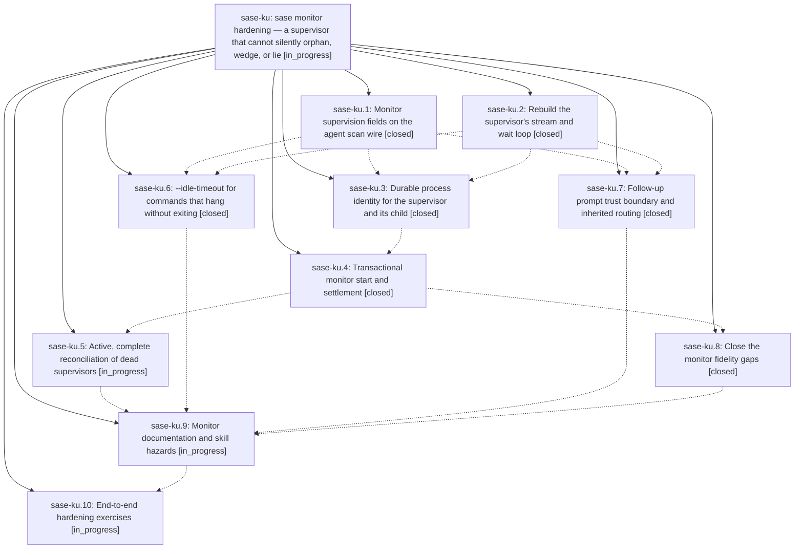

# Bead: sase-ku — sase monitor hardening — a supervisor that cannot silently orphan, wedge, or lie

[Bead Pages](../README.md) / sase-ku

**Status:** ◐ in_progress · **Type:** ▸ plan · **Tier:** epic
**Owner:** `bryanbugyi34@gmail.com` · **Created by:** [bbugyi200.athena.sase-kp.land.w1](https://github.com/sase-org/sase--agents/blob/main/families/bbugyi200.athena.sase-kp.land.w1.md) · **Assignee:** `sase-ku.land`
**Created:** 2026-08-13 09:02:19 EDT
**Plan:** [202608/monitor\_hardening.md](https://github.com/sase-org/sase--plans/blob/main/202608/monitor_hardening.md)

## Description

The monitor supervisor survives every command shape a real build throws at it — continuous output, partial lines, binary bytes, backgrounded grandchildren, TERM-ignoring children — enforces its deadline on every tick, never leaves a live process group behind when it dies, reconciles wedged lanes without a human, and only reports a monitor terminal once the claim, the log, and the follow-up have actually been settled.

## Notes

[2026-08-13T13:39:31Z · zd] HEADS-UP FROM ADJACENT WORK (no conflict expected): on 2026-08-13 the project owner asked for the monitor command string to be removed from the ACE Agents-tab LEFT PANE row. Rows previously rendered '⏱ <monitor_label> · <monitor_command> (<STATUS>)'; e.g. an epic-launch monitor read '⏱ Epic launch · artifacts_tab_icons · sase bead work /home/bryan/.sase/plans/202608/artifacts_tab_icons.md --ye', which swamped the tree at normal terminal widths. They now render '⏱ <monitor_label> (<STATUS>)'. monitor_label always exists (src/sase/monitor/start.py:113 falls back to _default_label(command)), and the full command is unchanged in the right-hand detail panel (src/sase/ace/tui/widgets/prompt_panel/_agent_monitor_section.py:67-70).

Files touched: src/sase/ace/tui/widgets/_agent_list_render_agent.py (dropped the ' · <command>' append), _agent_list_render_cache.py (dropped agent.monitor_command from agent_render_key, now unread by the row renderer), src/sase/ace/tui/modals/help_modal/agents_bindings.py:421 ('Monitor member (command)' -> 'Monitor member (label)'), and tests/ace/tui/widgets/test_agent_list_monitor_rows.py.

Why sase-ku should know: none of these files appear in plans:202608/monitor_hardening.md, and the phases landed so far (afa8178ce, dc9da5576) touch src/sase/monitor/**, src/sase/logs/pipe.py, and the scan wire — disjoint from this diff, so no merge conflict is expected. But phase sase-ku.10's end-to-end exercises inspect the live monitor row ('the monitor row shows live runtime', 'the row shows timeout' — plan lines 749/752). Those behaviors are all preserved: the ⏱ glyph, the label, the status parens, live runtime, and the ✗<exit>/⧖ badges are untouched. Only the command annotation is gone, so sase-ku.10's agent should not report its absence as a regression.

[2026-08-13T14:36:44Z · zg] ADJACENT WORK LANDED (no conflict expected, one overlap deliberately skipped): the approved plan '.sase/artifacts/home/.sase/plans/202608/monitor_wait_resolution.md' fixed a defect this epic does not cover -- a lane that ever started a monitor could never resolve %wait.

Root cause: every terminal monitor writes done.json {"outcome": "monitored"}, and "monitored" was absent from the wait-dependency outcome vocabulary in src/sase/core/dismissed_agent_completion.py. A finished monitor member was therefore neither resolved, done, failed, nor identity-success, so family_candidate() computed is_resolved=False forever and sase_chop_wait_checks never wrote ready.json. Confirmed against the live store: smoke-sleep and smoke-stop now resolve; smoke-fail and smoke-timeout correctly stay blocked because those monitors genuinely failed.

What landed:
- src/sase/core/dismissed_agent_completion.py: MONITOR_OUTCOME, MONITOR_SUCCESS_STATES ({completed, stopped}), FAILURE_OUTCOME, "monitored" added to KNOWN_DONE_OUTCOMES, and a new public effective_done_outcome() that maps a monitored marker through monitor_state (fail-closed to "failed" when monitor_state is missing or unrecognized). It keys off monitor_state, never status_label, because --stop-status is user-configurable.
- src/sase/core/wait_dependency_resolution/_artifact_state.py: done_outcome_from_data() routes through that helper, so ArtifactCandidate.outcome carries the EFFECTIVE outcome. A failed monitor now reads 'outcome=failed' in the chop's 'Terminal dependency still blocks waiter' line instead of tripping the 'Unknown done outcome' alarm.
- src/sase/monitor_state.py: new DEFAULT_MONITOR_STOP_STATUS = 'MONITORED'; src/sase/monitor/start.py DEFAULT_STOP_STATUS now points at it.
- src/sase/monitor/start.py: the supervisor is spawned with stdout=<artifacts>/supervisor.log and stderr=STDOUT instead of DEVNULL (SUPERVISOR_LOG_NAME). start_new_session, stdin=DEVNULL, and close_fds are unchanged.
- Tests: tests/monitor/test_monitor_wait_resolution.py, tests/test_axe_chop_wait_checks_monitor_family.py, plus additions to tests/monitor/test_monitor_start.py and tests/test_dismissed_agent_completion.py.

DELIBERATELY NOT IMPLEMENTED: the plan's step 4 (periodically reap a dead monitor supervisor into monitor_state 'failed'). That is sase-ku.5's 'reconcile' phase, which is IN_PROGRESS and strictly broader (kill the surviving tree, release the claim, dispose the follow-up, run from list/TUI/axe, add the 'lost' state). Implementing it here would have conflicted. See the note on sase-ku.5.

Contract this fix establishes for sase-ku.5 and sase-ku.4: monitor_state 'completed' and 'stopped' resolve a waiter; 'failed', 'timeout', anything unrecognized, and a missing monitor_state block it. A new state such as 'lost' blocks by default with no change needed -- but if any future state should RELEASE a waiter it must be added to MONITOR_SUCCESS_STATES in src/sase/core/dismissed_agent_completion.py.

[2026-08-13T15:00:36Z · zg] ADJACENT PLAN SCOPE REVIEW (monitor_wait_resolution.md): this epic does not completely obsolete the approved plan. Phase sase-ku.5 fully owns its step 4 (automatic dead-supervisor reconciliation), so that step will be skipped here to avoid conflicting work. Steps 1-3 (effective wait classification for outcome 'monitored') are complementary; step 5 adds supervisor.log capture in start.py and must be preserved by sase-ku.4's transactional spawn rewrite. Detailed handoff notes are already present on sase-ku.4 and sase-ku.5.

[2026-08-13T15:15:55Z · zg] LIVE-STORE CORRECTION to the 2026-08-13T14:36:44Z adjacent-work note: with effective monitor classification installed, z2 is_resolved=False, not True, because z2--mon's persisted done.json is {'outcome': 'monitored', 'monitor_state': 'failed', 'monitor_exit_code': 1}. Its family candidate is_failed=True and terminal_blocking_artifacts_for_name('z2') reports z2--mon outcome='failed', which matches the approved contract that failed monitors keep blocking. The positive live controls do resolve: smoke-sleep=True and smoke-stop=True; smoke-fail=False and smoke-timeout=False. sase-kp.land remains false because its dead-supervisor reaping is owned by sase-ku.5.

## Phases

| Bead | Title | Status | Size | Created | Agents | Commits |
|---|---|---|---|---|---:|---:|
| [sase-ku.1](sase-ku.1.md) | Monitor supervision fields on the agent scan wire | ✓ closed | small | 2026-08-13 | 1 | 2 |
| [sase-ku.10](sase-ku.10.md) | End-to-end hardening exercises | ◐ in_progress | xsmall | 2026-08-13 | 1 | 0 |
| [sase-ku.2](sase-ku.2.md) | Rebuild the supervisor's stream and wait loop | ✓ closed | medium | 2026-08-13 | 1 | 1 |
| [sase-ku.3](sase-ku.3.md) | Durable process identity for the supervisor and its child | ✓ closed | small | 2026-08-13 | 1 | 1 |
| [sase-ku.4](sase-ku.4.md) | Transactional monitor start and settlement | ✓ closed | medium | 2026-08-13 | 1 | 1 |
| [sase-ku.5](sase-ku.5.md) | Active, complete reconciliation of dead supervisors | ◐ in_progress | medium | 2026-08-13 | 1 | 0 |
| [sase-ku.6](sase-ku.6.md) | --idle-timeout for commands that hang without exiting | ✓ closed | small | 2026-08-13 | 1 | 1 |
| [sase-ku.7](sase-ku.7.md) | Follow-up prompt trust boundary and inherited routing | ✓ closed | medium | 2026-08-13 | 1 | 1 |
| [sase-ku.8](sase-ku.8.md) | Close the monitor fidelity gaps | ✓ closed | small | 2026-08-13 | 1 | 1 |
| [sase-ku.9](sase-ku.9.md) | Monitor documentation and skill hazards | ◐ in_progress | small | 2026-08-13 | 1 | 0 |

## Lineage

## Agents

| Agent | Bead | Commits |
|---|---|---:|
| [bbugyi200.athena.sase-ku.1](https://github.com/sase-org/sase--agents/blob/main/agents/bbugyi200.athena.sase-ku.1/README.md) | [sase-ku.1](sase-ku.1.md) | 2 |
| [bbugyi200.athena.sase-ku.10](https://github.com/sase-org/sase--agents/blob/main/agents/bbugyi200.athena.sase-ku.10/README.md) | [sase-ku.10](sase-ku.10.md) | 0 |
| [bbugyi200.athena.sase-ku.2](https://github.com/sase-org/sase--agents/blob/main/agents/bbugyi200.athena.sase-ku.2/README.md) | [sase-ku.2](sase-ku.2.md) | 1 |
| [bbugyi200.athena.sase-ku.3](https://github.com/sase-org/sase--agents/blob/main/agents/bbugyi200.athena.sase-ku.3/README.md) | [sase-ku.3](sase-ku.3.md) | 1 |
| [bbugyi200.athena.sase-ku.4](https://github.com/sase-org/sase--agents/blob/main/agents/bbugyi200.athena.sase-ku.4/README.md) | [sase-ku.4](sase-ku.4.md) | 1 |
| [bbugyi200.athena.sase-ku.5](https://github.com/sase-org/sase--agents/blob/main/agents/bbugyi200.athena.sase-ku.5/README.md) | [sase-ku.5](sase-ku.5.md) | 0 |
| [bbugyi200.athena.sase-ku.6](https://github.com/sase-org/sase--agents/blob/main/agents/bbugyi200.athena.sase-ku.6/README.md) | [sase-ku.6](sase-ku.6.md) | 1 |
| [bbugyi200.athena.sase-ku.7](https://github.com/sase-org/sase--agents/blob/main/agents/bbugyi200.athena.sase-ku.7/README.md) | [sase-ku.7](sase-ku.7.md) | 1 |
| [bbugyi200.athena.sase-ku.8](https://github.com/sase-org/sase--agents/blob/main/agents/bbugyi200.athena.sase-ku.8/README.md) | [sase-ku.8](sase-ku.8.md) | 1 |
| [bbugyi200.athena.sase-ku.9](https://github.com/sase-org/sase--agents/blob/main/agents/bbugyi200.athena.sase-ku.9/README.md) | [sase-ku.9](sase-ku.9.md) | 0 |
| [bbugyi200.athena.sase-ku.land](https://github.com/sase-org/sase--agents/blob/main/agents/bbugyi200.athena.sase-ku.land/README.md) | [sase-ku](README.md) | 0 |

## Commits

| Repo | Commit | Subject | Bead | Committed |
|---|---|---|---|---|
| sase-core | [`sase-core@87e4a4f`](https://github.com/sase-org/sase-core/commit/87e4a4f455192dd1f930925e2d46a67caacd25c0) | feat(agent-scan): add monitor supervision fields to the agent scan wire | [sase-ku.1](sase-ku.1.md) | 2026-08-13 09:30:37 EDT |
| sase | [`afa8178`](https://github.com/sase-org/sase/commit/afa8178ceec76e7fbbe94110c3af9ed4b7ba6d39) | fix(monitor): decouple supervisor waits from output reads | [sase-ku.2](sase-ku.2.md) | 2026-08-13 09:31:19 EDT |
| sase | [`dc9da55`](https://github.com/sase-org/sase/commit/dc9da557631a7ecb8e16dc5ebefd24cc1f0fda4c) | feat(agent-scan): mirror monitor supervision fields on the Python wire | [sase-ku.1](sase-ku.1.md) | 2026-08-13 09:31:37 EDT |
| sase | [`49f6b98`](https://github.com/sase-org/sase/commit/49f6b98a49614be766b6d03edca49762daba075a) | feat(monitor): add idle timeout support | [sase-ku.6](sase-ku.6.md) | 2026-08-13 10:01:00 EDT |
| sase | [`9566a13`](https://github.com/sase-org/sase/commit/9566a13113e3d96461a075805ca4ad4f964ec782) | feat(monitor): fence untrusted output in follow-up prompts and carry starter routing | [sase-ku.7](sase-ku.7.md) | 2026-08-13 10:05:41 EDT |
| sase | [`40d9a4d`](https://github.com/sase-org/sase/commit/40d9a4d98cb255904a84edf493ab84f998c90cc5) | feat(monitor): give the supervisor and its child a durable identity | [sase-ku.3](sase-ku.3.md) | 2026-08-13 10:29:07 EDT |
| sase | [`a54aec6`](https://github.com/sase-org/sase/commit/a54aec6ab7f43b1d874828e3c7ca54cbb06fe160) | fix(monitor): make monitor startup transactional | [sase-ku.4](sase-ku.4.md) | 2026-08-13 11:15:44 EDT |
| sase | [`df17a07`](https://github.com/sase-org/sase/commit/df17a078a430834d5113051d1712e54b139d97fd) | fix(monitor): close fidelity gaps between monitor output and reality | [sase-ku.8](sase-ku.8.md) | 2026-08-13 11:38:56 EDT |
