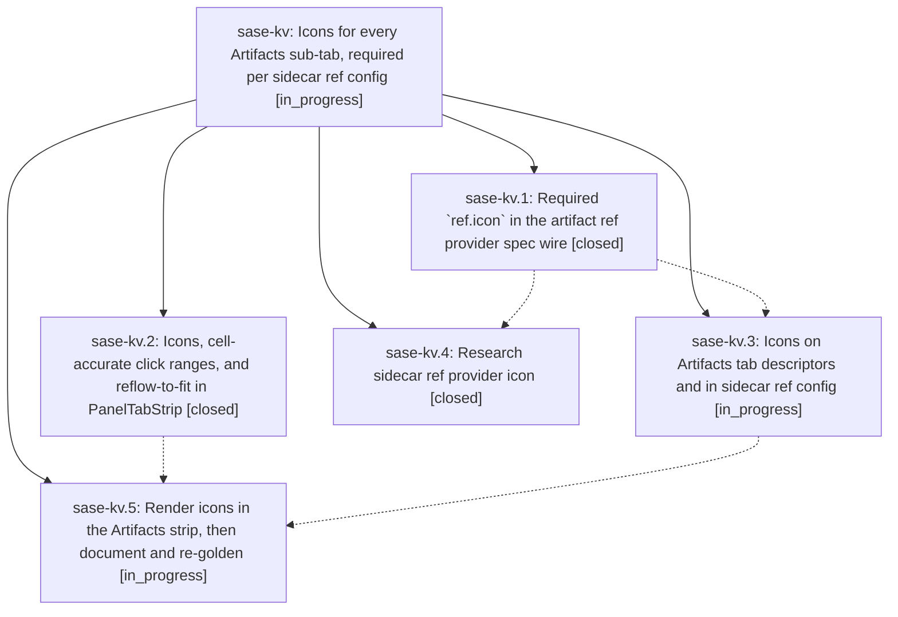

# Bead: sase-kv — Icons for every Artifacts sub-tab, required per sidecar ref config

[Bead Pages](../README.md) / sase-kv

**Status:** ◐ in_progress · **Type:** ▸ plan · **Tier:** epic
**Owner:** `bryanbugyi34@gmail.com` · **Created by:** [bbugyi200.athena.z6.f2](https://github.com/sase-org/sase--agents/blob/main/families/bbugyi200.athena.z6.f2.md) · **Assignee:** `sase-kv.land`
**Created:** 2026-08-13 09:16:19 EDT
**Plan:** [202608/artifacts\_tab\_icons.md](https://github.com/sase-org/sase--plans/blob/main/202608/artifacts_tab_icons.md)

## Description

Every Artifacts sub-tab renders a colored icon beside its name. The four fixed panes carry built-in marks, and every document-provider pane carries a mark declared as a required `ref.icon` field in its sidecar ref provider spec, so a sidecar repo chooses its own tab icon and the strip stays readable at any terminal width.

## Phases

| Bead | Title | Status | Size | Created | Agents | Commits |
|---|---|---|---|---|---:|---:|
| [sase-kv.1](sase-kv.1.md) | Required \`ref.icon\` in the artifact ref provider spec wire | ✓ closed | small | 2026-08-13 | 1 | 0 |
| [sase-kv.2](sase-kv.2.md) | Icons, cell-accurate click ranges, and reflow-to-fit in PanelTabStrip | ✓ closed | medium | 2026-08-13 | 1 | 1 |
| [sase-kv.3](sase-kv.3.md) | Icons on Artifacts tab descriptors and in sidecar ref config | ◐ in_progress | medium | 2026-08-13 | 1 | 0 |
| [sase-kv.4](sase-kv.4.md) | Research sidecar ref provider icon | ✓ closed | xsmall | 2026-08-13 | 1 | 0 |
| [sase-kv.5](sase-kv.5.md) | Render icons in the Artifacts strip, then document and re-golden | ◐ in_progress | medium | 2026-08-13 | 1 | 0 |

## Lineage

## Agents

| Agent | Bead | Commits |
|---|---|---:|
| [bbugyi200.athena.sase-kv.1](https://github.com/sase-org/sase--agents/blob/main/agents/bbugyi200.athena.sase-kv.1/README.md) | [sase-kv.1](sase-kv.1.md) | 0 |
| [bbugyi200.athena.sase-kv.2](https://github.com/sase-org/sase--agents/blob/main/agents/bbugyi200.athena.sase-kv.2/README.md) | [sase-kv.2](sase-kv.2.md) | 1 |
| [bbugyi200.athena.sase-kv.3](https://github.com/sase-org/sase--agents/blob/main/agents/bbugyi200.athena.sase-kv.3/README.md) | [sase-kv.3](sase-kv.3.md) | 0 |
| [bbugyi200.athena.sase-kv.4](https://github.com/sase-org/sase--agents/blob/main/agents/bbugyi200.athena.sase-kv.4/README.md) | [sase-kv.4](sase-kv.4.md) | 0 |
| [bbugyi200.athena.sase-kv.5](https://github.com/sase-org/sase--agents/blob/main/agents/bbugyi200.athena.sase-kv.5/README.md) | [sase-kv.5](sase-kv.5.md) | 0 |
| [bbugyi200.athena.sase-kv.land](https://github.com/sase-org/sase--agents/blob/main/agents/bbugyi200.athena.sase-kv.land/README.md) | [sase-kv](README.md) | 0 |

## Commits

| Repo | Commit | Subject | Bead | Committed |
|---|---|---|---|---|
| sase | [`2ff6a22`](https://github.com/sase-org/sase/commit/2ff6a221a11513724f7e1002aa1d4eaee6a89df1) | feat(ace): add icons, cell-accurate clicks, and fit-reflow to PanelTabStrip | [sase-kv.2](sase-kv.2.md) | 2026-08-13 09:48:12 EDT |
