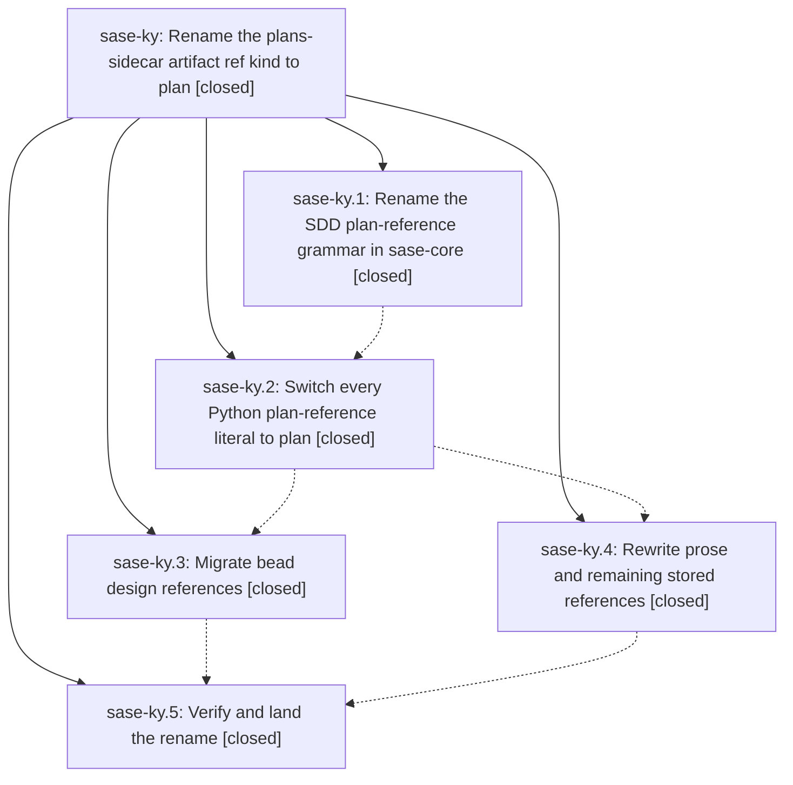

# Bead: sase-ky — Rename the plans-sidecar artifact ref kind to plan

[Bead Pages](../README.md) / sase-ky

**Status:** ✓ closed · **Resolution:** done · **Type:** ▸ plan · **Tier:** epic
**Owner:** `bryanbugyi34@gmail.com` · **Created by:** [bbugyi200.athena.zl.f1](https://github.com/sase-org/sase--agents/blob/main/families/bbugyi200.athena.zl.f1.md) · **Assignee:** `sase-ky.land`
**Created:** 2026-08-13 12:21:26 EDT · **Closed:** 2026-08-13 20:19:26 EDT
**Plan:** [202608/plan\_ref\_kind\_rename.md](https://github.com/sase-org/sase--plans/blob/main/202608/plan_ref_kind_rename.md)

## Description

The plans sidecar's document reference kind is spelled `plan` everywhere SASE writes it — `plan:<path>` in machine fields and `@plan:<path>` in prose — the `plans:` spelling is never emitted again, and every live `plans:` reference on this machine has been migrated.

## Notes

[2026-08-13T17:55:57Z · zs] DISCOVERED ISSUE: During unrelated Wait modal field-navigation work on 2026-08-13, just check escalated to the full scoped suite (rule: core-identity-changed) after all lint/SASE/committed-plan gates passed. The full 14-worker pytest lane failed 27 plan/SDD/bead nodes clustered around plan reference resolution and SDD sidecar path handling: tests/plan_show/test_resolve.py::test_miss_carries_close_match_suggestions, tests/sdd/test_hosted_links.py::{test_plan_url_resolves_logical_reference_to_blob_url,test_plan_url_accepts_legacy_repo_relative_reference,test_resolution_is_cached_across_many_plans}, tests/sdd/test_plan_archive.py::test_archive_rebases_authored_parent_for_destination, tests/sdd/test_plan_associations.py::{test_builds_sorted_rendering_records_from_one_history_walk,test_family_members_collapse_to_one_lane_with_member_link_hint,test_legacy_member_tag_uses_its_recorded_destination,test_artifact_metadata_paths_collapse_to_one_plan_key,test_epic_rollup_reads_bullets_and_legacy_parent_without_changing_tales,test_epic_rollup_ignores_parent_cycles,test_history_failure_keeps_artifact_results_and_reports_diagnostic}, tests/sdd/test_plan_links_refresh.py::test_refresh_dry_run_write_and_second_write_are_idempotent, tests/test_bead/test_design_ref_repair.py::{test_repair_planner_uses_owner_then_root_order,test_repair_planner_migrates_resolving_legacy_and_keeps_canonical,test_repair_planner_recovers_malformed_canonical_by_basename}, tests/test_sdd_file_writes.py::test_write_sdd_files_rebases_seeded_parent_section, tests/agents_sync/test_committed_plan_header.py::test_committed_plan_header_refresh_is_idempotent, tests/test_bead/test_cli_changespec.py::test_create_plan_stores_sibling_workspace_plan_path_relative_to_primary, tests/plan_show/test_load.py::{test_canonical_reference_present_in_root_and_none_outside,test_load_ambiguity_candidate_builds_lightweight_row}, tests/plan_show/test_resolve.py::test_rung_ref_resolves_plans_reference, tests/test_bead/test_cli_resolution.py::test_find_beads_location_split_sidecar_uses_repository_root, tests/test_bead/test_cli_doctor.py::test_confirmed_fix_uses_update_events_and_one_aggregate_commit, tests/test_bead/test_cli_work_from_plan.py::test_plan_file_mode_creates_links_and_launches_in_tree, tests/test_bead/test_cli_work_from_plan_publication.py::test_git_sidecar_fresh_clone_sees_complete_graph_before_launch, and tests/test_bead/test_cli_work_from_plan_store.py::test_plan_file_mode_uses_sidecar_store. My diff only touches src/sase/ace/tui/modals/wait_modal.py, src/sase/ace/tui/modals/help_modal/agents_bindings.py, and tests/ace/tui/test_wait_modal.py. Two representative nodes passed immediately in isolation after the failed lane: tests/plan_show/test_resolve.py::test_miss_carries_close_match_suggestions and tests/sdd/test_hosted_links.py::test_plan_url_resolves_logical_reference_to_blob_url. Routed here via /sase_new_task because this epic is actively renaming the plans-sidecar artifact reference kind from plans to plan and is the credible causal owner for this failure cluster.

[2026-08-14T00:19:26Z · sase-ky.land] LANDED by sase-ky.land (workspace sase_11, HEAD 4183f3d4d).

VERIFIED (step 1). All 5 phases closed with notes addressed. Read every child note and the epic's commits (cbd47ed11, 7240436e8, b5e1ac88c, 4183f3d4d) plus the sase-core side. Core: crates/sase_core/src/plan/refs.rs renders PLAN_REFERENCE_KIND/PREFIX as plan/plan: with plans: retained only as a read-only alias (LEGACY_PLAN_REFERENCE_*) that re-renders canonically. Python: src/sase/sdd/plan_refs.py owns the shared constants and grep finds ZERO hardcoded plan:/plans: literals anywhere else in src/ -- every functional site imports the constants; the only surviving plans: strings are 3 read-side .removeprefix('plans:') calls carrying immutable-history comments (design_ref_repair.py, plan_show/resolve.py, prompt_archive validation/preparation), Python parameter names, YAML role keys, and the deliberate docs compat sentences. Bead store: 0 design plans: rows, 461 design plan: rows (up from the 460 sase-ky.3 left, i.e. beads created since the migration are already minting plan:), 0 refs[] plans:; the only 2 remaining plans: tokens store-wide are inside note prose describing this rename. 'sase bead doctor' reports no legacy design-ref or plans:-ref warnings (remaining missing/mismatch/unknown warnings are pre-existing non-goals). Prose: repo-wide grep over *.md/*.yml finds zero path-form plans: references; both plan trees (sidecar and ~/.sase/plans) are clean except the 4 files with deliberate immutable-history/legacy-input exceptions; ~/.sase/file_reference_history.json has 0 hits; the only machine-local hits left are archived run transcripts and an old migration backup. The epic's own DISCOVERED ISSUE (27 plan/SDD/bead nodes failing for agent zs) is resolved: all 116 tests across that cluster pass (tests/plan_show, tests/sdd hosted_links/plan_archive/plan_associations/plan_links_refresh, test_design_ref_repair, test_sdd_file_writes, test_committed_plan_header, test_sidecar_ref_kind_naming, sdd_store/test_plan_refs).

INTEGRATED (step 2). Reviewed all 38 commits landed since cbd47ed11. Found and FIXED a defect this epic's own landing commit introduced: 4183f3d4d added a public stream_and_parse_messages_json_output wrapper to src/sase/llm_provider/_subprocess_claude.py without noticing that the Grok provider commit 3085a0d28 had already added a byte-identical one at line 42, so the file carried two definitions of the same name and 'ruff check src/ tests/ tools/' reported F811 as the ONLY lint error in the repo -- just lint was red on master. Removed the duplicate this epic added and kept 3085a0d28's, which grok.py:19,349 genuinely calls; ruff is now clean repo-wide and tests/llm_provider passes 571/571. Status recorded on task sase-lg, whose ImportError report this resolves the tail of. Also confirmed no post-epic commit reintroduced a plans: emitter, that the research-plugin rename (04cd96971) and this epic's docs/artifact_references.md rewrite coexist coherently, and that the new ACE prompt-panel hint modules all funnel through the shared PLAN_REFERENCE_PREFIX.

TEST STATE. 'just check' with sase-core-rs 0.26.11 (the newest version satisfying pyproject's >=0.26.10,<0.27.0): all lint gates green, 29,818 passed / 10 skipped / 6 failed. The 6 are tests/notification_store TestMarkTabRead + test_core_facade mark_tab_read, caused by commit aea9bf645 (a Grok DOCS commit for bead sase-l3.7) having swept in another agent's half-finished notification work whose mark_tab_read wire variant exists in NO sase-core release -- corroborated on task sase-ln with that impact evidence. With the workspace-linked sase-core at origin/master (v0.27.0) the count is 69 instead, the extra 63 being 'task wire schema mismatch: got 2, expected 1' -- corroborated on task sase-lm, owned by in-progress epic sase-lh. Neither failure set is attributable to this epic; nothing in either touches plan references.

FOLLOW-UP DISPOSITIONS (step 3), all 8 PROPOSED FOLLOW-UP entries from the child beads:
- sase-ky.2 wholesale visual-snapshot update rewriting 211 unrelated goldens -> NEW task sase-lo (medium, ready), root-caused to png_diff.py:202-204 + Justfile:480, with RELATED notes to sase-la/sase-l7/sase-l8/sase-l9.
- sase-ky.3 stale Symvision epic-symbol whitelist for closed bead sase-kz.5 -> ALREADY FIXED, no task filed: commit 53c87b758 removed those entries during this epic and the Justfile now carries no --epic-symbol entries at all.
- sase-ky.3 batch design-ref repair for differing per-bead values -> NEW task sase-lp (large, ready), root-caused to the per-bead update loop at cli_admin.py:99-103, flagged as probably needing a sase-core batch primitive.
- sase-ky.4 and sase-ky.5 monitor FamilyAttachError from a phase-bead lane (2 entries, same defect) -> +1 on existing task sase-ll with both reproductions, plus a DISCOVERED ISSUE note on in-progress epic sase-kp, which owns the lane/family-attach path.
- sase-ky.5 cost budgets failing under concurrent suite load (2 entries, same defect) -> +1 on in-progress task sase-j0 with the contention-specific evidence.
- sase-ky.5 logs-pane detail-scroll flake -> NOT reopened: task sase-jb covers this exact node and its close reason permits reopening only if the node needs de-baselining or fails outside the parallel lane; sase-ky.5 saw the baselined fails-under-parallel/passes-in-isolation signature, so the recurrence was recorded as a note and the close stands.

NOTE: the one-line lint fix described above is in the working tree of workspace sase_11, not yet committed.

[2026-08-14T00:25:18Z · sase-ky.land] Land verification: confirmed all 5 phases complete against source (core plan/refs.rs canonical plan: rendering with read-only plans: alias; zero hardcoded plan-ref literals in Python outside sdd/plan_refs.py; 461 design plan: rows and 0 plans: rows; bead doctor clean; zero path-form plans: prose refs). Integration: the epic's own landing commit 4183f3d4d left just lint red on master by re-adding a duplicate stream_and_parse_messages_json_output wrapper already defined by Grok commit 3085a0d28 (ruff F811, the only lint error repo-wide); removed the epic's duplicate and kept Grok's, which grok.py calls. Ruff clean repo-wide, tests/llm_provider 571/571. Remaining 6 just check failures traced to commit aea9bf645 (sase-ln/sase-lm), not this epic. All 8 child PROPOSED FOLLOW-UPs dispositioned: new tasks sase-lo and sase-lp; +1 corroboration on sase-ll, sase-j0; DISCOVERED ISSUE on sase-kp; note on sase-jb (deliberately not reopened, its close reason's reopen conditions were not met); stale sase-kz.5 whitelist already fixed by 53c87b758.

## Phases

| Bead | Title | Status | Size | Created | Agents | Commits |
|---|---|---|---|---|---:|---:|
| [sase-ky.1](sase-ky.1.md) | Rename the SDD plan-reference grammar in sase-core | ✓ closed | small | 2026-08-13 | 1 | 1 |
| [sase-ky.2](sase-ky.2.md) | Switch every Python plan-reference literal to plan | ✓ closed | medium | 2026-08-13 | 1 | 1 |
| [sase-ky.3](sase-ky.3.md) | Migrate bead design references | ✓ closed | medium | 2026-08-13 | 1 | 2 |
| [sase-ky.4](sase-ky.4.md) | Rewrite prose and remaining stored references | ✓ closed | medium | 2026-08-13 | 1 | 2 |
| [sase-ky.5](sase-ky.5.md) | Verify and land the rename | ✓ closed | small | 2026-08-13 | 1 | 1 |

## Lineage

## Agents

| Agent | Bead | Commits |
|---|---|---:|
| [bbugyi200.athena.sase-ky.1](https://github.com/sase-org/sase--agents/blob/main/agents/bbugyi200.athena.sase-ky.1/README.md) | [sase-ky.1](sase-ky.1.md) | 1 |
| [bbugyi200.athena.sase-ky.2](https://github.com/sase-org/sase--agents/blob/main/agents/bbugyi200.athena.sase-ky.2/README.md) | [sase-ky.2](sase-ky.2.md) | 1 |
| [bbugyi200.athena.sase-ky.3](https://github.com/sase-org/sase--agents/blob/main/agents/bbugyi200.athena.sase-ky.3/README.md) | [sase-ky.3](sase-ky.3.md) | 2 |
| [bbugyi200.athena.sase-ky.4](https://github.com/sase-org/sase--agents/blob/main/agents/bbugyi200.athena.sase-ky.4/README.md) | [sase-ky.4](sase-ky.4.md) | 2 |
| [bbugyi200.athena.sase-ky.5](https://github.com/sase-org/sase--agents/blob/main/agents/bbugyi200.athena.sase-ky.5/README.md) | [sase-ky.5](sase-ky.5.md) | 1 |
| [bbugyi200.athena.sase-ky.land](https://github.com/sase-org/sase--agents/blob/main/agents/bbugyi200.athena.sase-ky.land/README.md) | [sase-ky](README.md) | 0 |

## Commits

| Repo | Commit | Subject | Bead | Committed |
|---|---|---|---|---|
| sase-core | [`sase-core@f08e5ad`](https://github.com/sase-org/sase-core/commit/f08e5ad0b289bf07c503fe6f848fdc131fdfde89) | feat: canonicalize plan references with plan prefix | [sase-ky.1](sase-ky.1.md) | 2026-08-13 12:35:26 EDT |
| sase | [`cbd47ed`](https://github.com/sase-org/sase/commit/cbd47ed11055e5de11522050499b8c2a7137a145) | refactor(sdd): rename plans: reference literal to plan: across Python | [sase-ky.2](sase-ky.2.md) | 2026-08-13 14:25:51 EDT |
| sase | [`b5e1ac8`](https://github.com/sase-org/sase/commit/b5e1ac88cbb7304f9457abf8d9aed0c353535e44) | docs: describe plan: grammar and migrate remaining plans: prose citations | [sase-ky.4](sase-ky.4.md) | 2026-08-13 15:08:25 EDT |
| sase--plans | [`sase--plans@4b6ccf9`](https://github.com/sase-org/sase--plans/commit/4b6ccf9afec381d3110ef060ced46e7358d554f5) | docs: migrate plans: prose citations to @plan: across plan files | [sase-ky.4](sase-ky.4.md) | 2026-08-13 15:12:08 EDT |
| sase--beads | [`sase--beads@7bf4316`](https://github.com/sase-org/sase--beads/commit/7bf43168ab31cda946e3b1cb63eac9f587d4102c) | chore(beads): migrate plan artifact refs | [sase-ky.3](sase-ky.3.md) | 2026-08-13 16:56:26 EDT |
| sase | [`7240436`](https://github.com/sase-org/sase/commit/7240436e83016eabe711e37c64c029cc89fc56c8) | fix(beads): repair alias-spelled design refs | [sase-ky.3](sase-ky.3.md) | 2026-08-13 17:02:21 EDT |
| sase | [`4183f3d`](https://github.com/sase-org/sase/commit/4183f3d4df9a588cea52a838e405c99d9c00fef1) | fix: stabilize plan ref landing verification | [sase-ky.5](sase-ky.5.md) | 2026-08-13 19:26:01 EDT |
