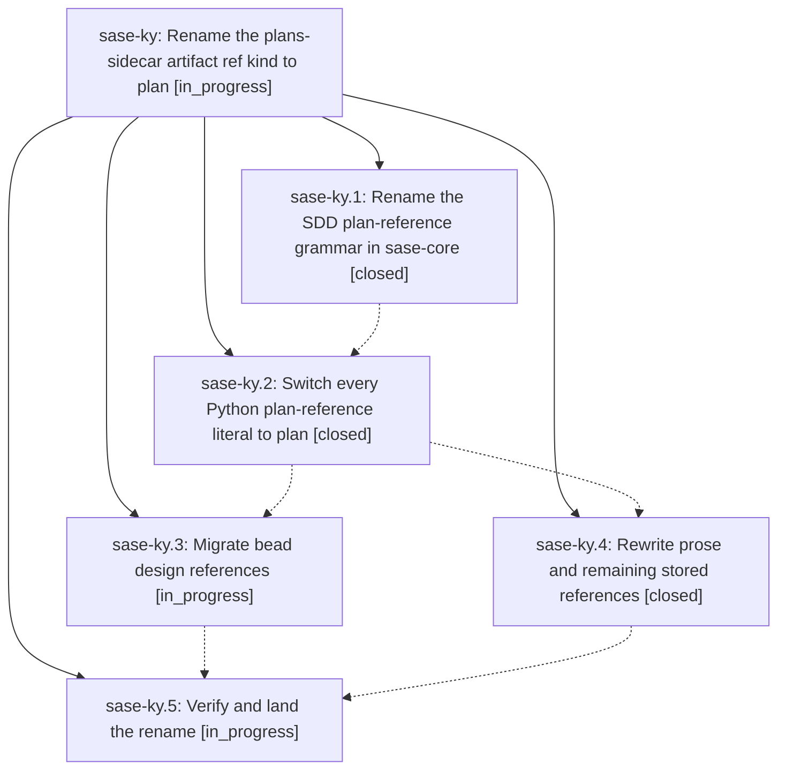

# Bead: sase-ky — Rename the plans-sidecar artifact ref kind to plan

[Bead Pages](../README.md) / sase-ky

**Status:** ◐ in_progress · **Type:** ▸ plan · **Tier:** epic
**Owner:** `bryanbugyi34@gmail.com` · **Created by:** [bbugyi200.athena.zl.f1](https://github.com/sase-org/sase--agents/blob/main/families/bbugyi200.athena.zl.f1.md) · **Assignee:** `sase-ky.land`
**Created:** 2026-08-13 12:21:26 EDT
**Plan:** [202608/plan\_ref\_kind\_rename.md](https://github.com/sase-org/sase--plans/blob/main/202608/plan_ref_kind_rename.md)

## Description

The plans sidecar's document reference kind is spelled `plan` everywhere SASE writes it — `plan:<path>` in machine fields and `@plan:<path>` in prose — the `plans:` spelling is never emitted again, and every live `plans:` reference on this machine has been migrated.

## Notes

[2026-08-13T17:55:57Z · zs] DISCOVERED ISSUE: During unrelated Wait modal field-navigation work on 2026-08-13, just check escalated to the full scoped suite (rule: core-identity-changed) after all lint/SASE/committed-plan gates passed. The full 14-worker pytest lane failed 27 plan/SDD/bead nodes clustered around plan reference resolution and SDD sidecar path handling: tests/plan_show/test_resolve.py::test_miss_carries_close_match_suggestions, tests/sdd/test_hosted_links.py::{test_plan_url_resolves_logical_reference_to_blob_url,test_plan_url_accepts_legacy_repo_relative_reference,test_resolution_is_cached_across_many_plans}, tests/sdd/test_plan_archive.py::test_archive_rebases_authored_parent_for_destination, tests/sdd/test_plan_associations.py::{test_builds_sorted_rendering_records_from_one_history_walk,test_family_members_collapse_to_one_lane_with_member_link_hint,test_legacy_member_tag_uses_its_recorded_destination,test_artifact_metadata_paths_collapse_to_one_plan_key,test_epic_rollup_reads_bullets_and_legacy_parent_without_changing_tales,test_epic_rollup_ignores_parent_cycles,test_history_failure_keeps_artifact_results_and_reports_diagnostic}, tests/sdd/test_plan_links_refresh.py::test_refresh_dry_run_write_and_second_write_are_idempotent, tests/test_bead/test_design_ref_repair.py::{test_repair_planner_uses_owner_then_root_order,test_repair_planner_migrates_resolving_legacy_and_keeps_canonical,test_repair_planner_recovers_malformed_canonical_by_basename}, tests/test_sdd_file_writes.py::test_write_sdd_files_rebases_seeded_parent_section, tests/agents_sync/test_committed_plan_header.py::test_committed_plan_header_refresh_is_idempotent, tests/test_bead/test_cli_changespec.py::test_create_plan_stores_sibling_workspace_plan_path_relative_to_primary, tests/plan_show/test_load.py::{test_canonical_reference_present_in_root_and_none_outside,test_load_ambiguity_candidate_builds_lightweight_row}, tests/plan_show/test_resolve.py::test_rung_ref_resolves_plans_reference, tests/test_bead/test_cli_resolution.py::test_find_beads_location_split_sidecar_uses_repository_root, tests/test_bead/test_cli_doctor.py::test_confirmed_fix_uses_update_events_and_one_aggregate_commit, tests/test_bead/test_cli_work_from_plan.py::test_plan_file_mode_creates_links_and_launches_in_tree, tests/test_bead/test_cli_work_from_plan_publication.py::test_git_sidecar_fresh_clone_sees_complete_graph_before_launch, and tests/test_bead/test_cli_work_from_plan_store.py::test_plan_file_mode_uses_sidecar_store. My diff only touches src/sase/ace/tui/modals/wait_modal.py, src/sase/ace/tui/modals/help_modal/agents_bindings.py, and tests/ace/tui/test_wait_modal.py. Two representative nodes passed immediately in isolation after the failed lane: tests/plan_show/test_resolve.py::test_miss_carries_close_match_suggestions and tests/sdd/test_hosted_links.py::test_plan_url_resolves_logical_reference_to_blob_url. Routed here via /sase_new_task because this epic is actively renaming the plans-sidecar artifact reference kind from plans to plan and is the credible causal owner for this failure cluster.

## Phases

| Bead | Title | Status | Size | Created | Agents | Commits |
|---|---|---|---|---|---:|---:|
| [sase-ky.1](sase-ky.1.md) | Rename the SDD plan-reference grammar in sase-core | ✓ closed | small | 2026-08-13 | 1 | 1 |
| [sase-ky.2](sase-ky.2.md) | Switch every Python plan-reference literal to plan | ✓ closed | medium | 2026-08-13 | 1 | 1 |
| [sase-ky.3](sase-ky.3.md) | Migrate bead design references | ◐ in_progress | medium | 2026-08-13 | 1 | 1 |
| [sase-ky.4](sase-ky.4.md) | Rewrite prose and remaining stored references | ✓ closed | medium | 2026-08-13 | 1 | 1 |
| [sase-ky.5](sase-ky.5.md) | Verify and land the rename | ◐ in_progress | small | 2026-08-13 | 1 | 0 |

## Lineage

## Agents

| Agent | Bead | Commits |
|---|---|---:|
| [bbugyi200.athena.sase-ky.1](https://github.com/sase-org/sase--agents/blob/main/agents/bbugyi200.athena.sase-ky.1/README.md) | [sase-ky.1](sase-ky.1.md) | 1 |
| [bbugyi200.athena.sase-ky.2](https://github.com/sase-org/sase--agents/blob/main/agents/bbugyi200.athena.sase-ky.2/README.md) | [sase-ky.2](sase-ky.2.md) | 1 |
| [bbugyi200.athena.sase-ky.3](https://github.com/sase-org/sase--agents/blob/main/agents/bbugyi200.athena.sase-ky.3/README.md) | [sase-ky.3](sase-ky.3.md) | 1 |
| [bbugyi200.athena.sase-ky.4](https://github.com/sase-org/sase--agents/blob/main/agents/bbugyi200.athena.sase-ky.4/README.md) | [sase-ky.4](sase-ky.4.md) | 1 |
| [bbugyi200.athena.sase-ky.5](https://github.com/sase-org/sase--agents/blob/main/agents/bbugyi200.athena.sase-ky.5/README.md) | [sase-ky.5](sase-ky.5.md) | 0 |
| [bbugyi200.athena.sase-ky.land](https://github.com/sase-org/sase--agents/blob/main/agents/bbugyi200.athena.sase-ky.land/README.md) | [sase-ky](README.md) | 0 |

## Commits

| Repo | Commit | Subject | Bead | Committed |
|---|---|---|---|---|
| sase-core | [`sase-core@f08e5ad`](https://github.com/sase-org/sase-core/commit/f08e5ad0b289bf07c503fe6f848fdc131fdfde89) | feat: canonicalize plan references with plan prefix | [sase-ky.1](sase-ky.1.md) | 2026-08-13 12:35:26 EDT |
| sase | [`cbd47ed`](https://github.com/sase-org/sase/commit/cbd47ed11055e5de11522050499b8c2a7137a145) | refactor(sdd): rename plans: reference literal to plan: across Python | [sase-ky.2](sase-ky.2.md) | 2026-08-13 14:25:51 EDT |
| sase--plans | [`sase--plans@4b6ccf9`](https://github.com/sase-org/sase--plans/commit/4b6ccf9afec381d3110ef060ced46e7358d554f5) | docs: migrate plans: prose citations to @plan: across plan files | [sase-ky.4](sase-ky.4.md) | 2026-08-13 15:12:08 EDT |
| sase--beads | [`sase--beads@7bf4316`](https://github.com/sase-org/sase--beads/commit/7bf43168ab31cda946e3b1cb63eac9f587d4102c) | chore(beads): migrate plan artifact refs | [sase-ky.3](sase-ky.3.md) | 2026-08-13 16:56:26 EDT |
