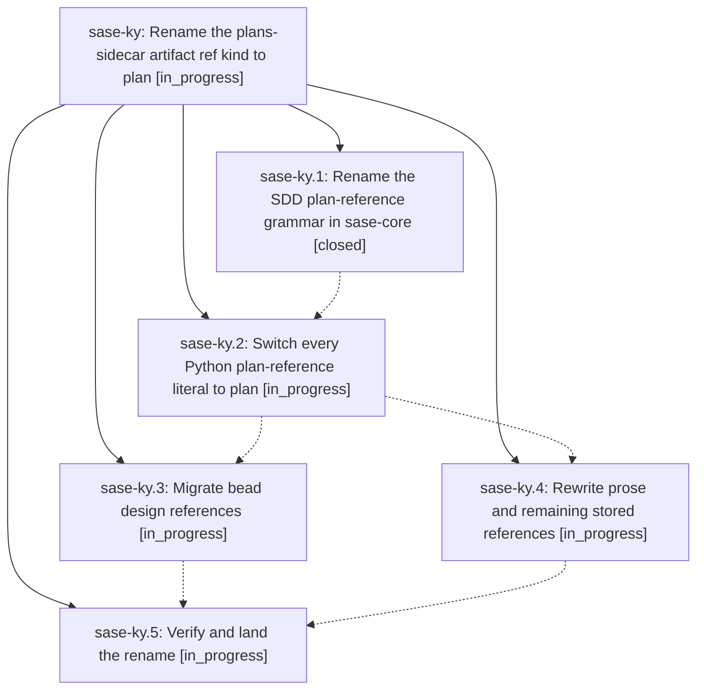

# Bead: sase-ky — Rename the plans-sidecar artifact ref kind to plan

[Bead Pages](../README.md) / sase-ky

**Status:** ◐ in_progress · **Type:** ▸ plan · **Tier:** epic
**Owner:** `bryanbugyi34@gmail.com` · **Created by:** [bbugyi200.athena.zl.f1](https://github.com/sase-org/sase--agents/blob/main/families/bbugyi200.athena.zl.f1.md) · **Assignee:** `sase-ky.land`
**Created:** 2026-08-13 12:21:26 EDT
**Plan:** [202608/plan\_ref\_kind\_rename.md](https://github.com/sase-org/sase--plans/blob/main/202608/plan_ref_kind_rename.md)

## Description

The plans sidecar's document reference kind is spelled `plan` everywhere SASE writes it — `plan:<path>` in machine fields and `@plan:<path>` in prose — the `plans:` spelling is never emitted again, and every live `plans:` reference on this machine has been migrated.

## Phases

| Bead | Title | Status | Size | Created | Agents | Commits |
|---|---|---|---|---|---:|---:|
| [sase-ky.1](sase-ky.1.md) | Rename the SDD plan-reference grammar in sase-core | ✓ closed | small | 2026-08-13 | 1 | 1 |
| [sase-ky.2](sase-ky.2.md) | Switch every Python plan-reference literal to plan | ◐ in_progress | medium | 2026-08-13 | 1 | 0 |
| [sase-ky.3](sase-ky.3.md) | Migrate bead design references | ◐ in_progress | medium | 2026-08-13 | 1 | 0 |
| [sase-ky.4](sase-ky.4.md) | Rewrite prose and remaining stored references | ◐ in_progress | medium | 2026-08-13 | 1 | 0 |
| [sase-ky.5](sase-ky.5.md) | Verify and land the rename | ◐ in_progress | small | 2026-08-13 | 1 | 0 |

## Lineage

## Agents

| Agent | Bead | Commits |
|---|---|---:|
| [bbugyi200.athena.sase-ky.1](https://github.com/sase-org/sase--agents/blob/main/agents/bbugyi200.athena.sase-ky.1/README.md) | [sase-ky.1](sase-ky.1.md) | 1 |
| [bbugyi200.athena.sase-ky.2](https://github.com/sase-org/sase--agents/blob/main/agents/bbugyi200.athena.sase-ky.2/README.md) | [sase-ky.2](sase-ky.2.md) | 0 |
| [bbugyi200.athena.sase-ky.3](https://github.com/sase-org/sase--agents/blob/main/agents/bbugyi200.athena.sase-ky.3/README.md) | [sase-ky.3](sase-ky.3.md) | 0 |
| [bbugyi200.athena.sase-ky.4](https://github.com/sase-org/sase--agents/blob/main/agents/bbugyi200.athena.sase-ky.4/README.md) | [sase-ky.4](sase-ky.4.md) | 0 |
| [bbugyi200.athena.sase-ky.5](https://github.com/sase-org/sase--agents/blob/main/agents/bbugyi200.athena.sase-ky.5/README.md) | [sase-ky.5](sase-ky.5.md) | 0 |
| [bbugyi200.athena.sase-ky.land](https://github.com/sase-org/sase--agents/blob/main/agents/bbugyi200.athena.sase-ky.land/README.md) | [sase-ky](README.md) | 0 |

## Commits

| Repo | Commit | Subject | Bead | Committed |
|---|---|---|---|---|
| sase-core | [`sase-core@f08e5ad`](https://github.com/sase-org/sase-core/commit/f08e5ad0b289bf07c503fe6f848fdc131fdfde89) | feat: canonicalize plan references with plan prefix | [sase-ky.1](sase-ky.1.md) | 2026-08-13 12:35:26 EDT |
