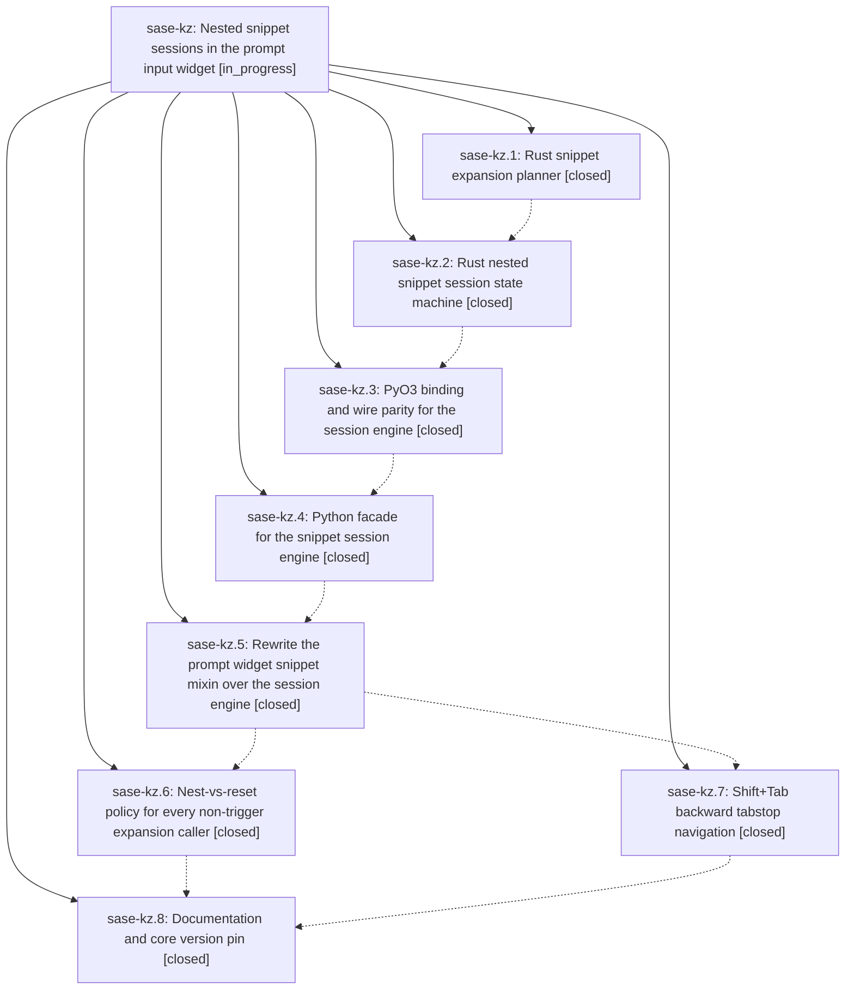

# Bead: sase-kz — Nested snippet sessions in the prompt input widget

[Bead Pages](../README.md) / sase-kz

**Status:** ◐ in_progress · **Type:** ▸ plan · **Tier:** epic
**Owner:** `bryanbugyi34@gmail.com` · **Created by:** [bbugyi200.athena.zm](https://github.com/sase-org/sase--agents/blob/main/families/bbugyi200.athena.zm.md) · **Assignee:** `sase-kz.land`
**Created:** 2026-08-13 12:27:37 EDT
**Plan:** [plans:202608/nested\_snippet\_sessions.md](https://github.com/sase-org/sase--plans/blob/main/202608/nested_snippet_sessions.md)

## Description

Expanding a snippet while another snippet's tabstops are still pending suspends the outer snippet instead of destroying it: the nested snippet's tabstops are visited first, and once they are exhausted `Tab` resumes the enclosing snippet at the stop after the one that was nested into. Tabstop anchors survive arbitrary editing because they are remapped from real document deltas, `Shift+Tab` steps backwards through the visited stops, and the whole session state machine lives in the Rust core so any future frontend gets the same behavior.

## Notes

[2026-08-13T19:15:45Z · sase-l2.land] DISCOVERED ISSUE: Proposed by sase-l2.2 during epic sase-l2 landing. Current SASE master still declares sase-core-rs>=0.26.6,<0.27.0 and uv.lock resolves 0.26.6, but tools/validate_sase_core_rs requires apply_snippet_session_event, first available in released v0.26.10; just check's advisory core-floor probe reports stale_actionable. This is causally owned by sase-kz, whose phase sase-kz.8 explicitly includes raising the core version pin once the release lands.

[2026-08-13T19:16:13Z · sase-l2.land] DISCOVERED ISSUE: Proposed by sase-l2.3 during epic sase-l2 landing. Justfile still passes --epic-symbol sase-kz.5(apply_snippet_session_event) even though phase sase-kz.5 is closed, so just symvision rejects the stale phase-scoped exemption before tests run. The parent epic remains active and phase sase-kz.8 owns the related core pin/landing cleanup; remove or retarget the exemption and resolve any underlying symbol finding before sase-kz closes.

[2026-08-13T19:16:29Z · sase-l2.land] DISCOVERED ISSUE: Proposed by sase-l2.3 during epic sase-l2 landing. Justfile still passes --epic-symbol sase-kz.5(apply_snippet_session_event) even though phase sase-kz.5 is closed, so just symvision rejects the stale phase-scoped exemption before tests run. The parent epic remains active and phase sase-kz.8 owns the related core pin/landing cleanup; remove or retarget the exemption and resolve any underlying symbol finding before sase-kz closes.

[2026-08-13T19:36:52Z · zx] DISCOVERED ISSUE: On 2026-08-13 at this workspace's current HEAD, just check deterministically fails in _lint-symvision because Justfile still passes seven --epic-symbol exemptions for closed phase sase-kz.5: SnippetExpansionPlan, SnippetSessionTransition, SnippetSpan, SnippetStop, apply_snippet_session_event, clear_snippet_session, and retreat_snippet_session. This extends the existing phase-cleanup note from one symbol to the full failing set; the prompt-pane-frame diff does not touch Justfile or snippet-session symbols.

[2026-08-13T19:43:43Z · zv--2] DISCOVERED ISSUE: Corroborating the sase-l2 note above. Hit the same blocker landing an unrelated plan (monitor_duplicate_rows, sase_16 workspace): just check fails at lint (symvision) because the Justfile's --epic-symbol 'sase-kz.5(...)' entries reference closed bead sase-kz.5 ("Error: --epic-symbol 'sase-kz.5(...)': bead 'sase-kz.5' is closed."). Confirmed this blocks just check on a clean, unmodified master (git stash + rerun), so it is repo-wide, not specific to my diff. I also confirmed the underlying symbols are not all safe to whitelist-drop as-is: after removing the epic-symbol entries locally to test, symvision additionally reports SnippetExpansionPlan, SnippetSessionTransition, SnippetSpan, SnippetStop, apply_snippet_session_event, and clear_snippet_session as unused public symbols in src/sase/core/snippet_session_facade.py (only retreat_snippet_session now has a real non-test consumer, from the Shift+Tab commit). I reverted my Justfile edit rather than fix this, since sase-kz.8 already owns it. Leaving this for sase-kz.8's worker: SnippetSpan/SnippetStop/SnippetExpansionPlan/SnippetSessionTransition/apply_snippet_session_event appear to be used only within snippet_session_facade.py itself (candidates for '_'-prefix per the symvision decision hierarchy), while clear_snippet_session has zero callers anywhere including tests (candidate for deletion) -- but I have not verified this exhaustively.

## Phases

| Bead | Title | Status | Size | Created | Agents | Commits |
|---|---|---|---|---|---:|---:|
| [sase-kz.1](sase-kz.1.md) | Rust snippet expansion planner | ✓ closed | medium | 2026-08-13 | 1 | 1 |
| [sase-kz.2](sase-kz.2.md) | Rust nested snippet session state machine | ✓ closed | medium | 2026-08-13 | 1 | 1 |
| [sase-kz.3](sase-kz.3.md) | PyO3 binding and wire parity for the session engine | ✓ closed | small | 2026-08-13 | 1 | 1 |
| [sase-kz.4](sase-kz.4.md) | Python facade for the snippet session engine | ✓ closed | small | 2026-08-13 | 1 | 1 |
| [sase-kz.5](sase-kz.5.md) | Rewrite the prompt widget snippet mixin over the session engine | ✓ closed | medium | 2026-08-13 | 1 | 1 |
| [sase-kz.6](sase-kz.6.md) | Nest-vs-reset policy for every non-trigger expansion caller | ✓ closed | small | 2026-08-13 | 1 | 1 |
| [sase-kz.7](sase-kz.7.md) | Shift+Tab backward tabstop navigation | ✓ closed | small | 2026-08-13 | 1 | 1 |
| [sase-kz.8](sase-kz.8.md) | Documentation and core version pin | ✓ closed | small | 2026-08-13 | 1 | 1 |

## Lineage

## Agents

| Agent | Bead | Commits |
|---|---|---:|
| [bbugyi200.athena.sase-kz.1](https://github.com/sase-org/sase--agents/blob/main/agents/bbugyi200.athena.sase-kz.1/README.md) | [sase-kz.1](sase-kz.1.md) | 1 |
| [bbugyi200.athena.sase-kz.2](https://github.com/sase-org/sase--agents/blob/main/agents/bbugyi200.athena.sase-kz.2/README.md) | [sase-kz.2](sase-kz.2.md) | 1 |
| [bbugyi200.athena.sase-kz.3](https://github.com/sase-org/sase--agents/blob/main/agents/bbugyi200.athena.sase-kz.3/README.md) | [sase-kz.3](sase-kz.3.md) | 1 |
| [bbugyi200.athena.sase-kz.4](https://github.com/sase-org/sase--agents/blob/main/agents/bbugyi200.athena.sase-kz.4/README.md) | [sase-kz.4](sase-kz.4.md) | 1 |
| [bbugyi200.athena.sase-kz.5](https://github.com/sase-org/sase--agents/blob/main/agents/bbugyi200.athena.sase-kz.5/README.md) | [sase-kz.5](sase-kz.5.md) | 1 |
| [bbugyi200.athena.sase-kz.6](https://github.com/sase-org/sase--agents/blob/main/agents/bbugyi200.athena.sase-kz.6/README.md) | [sase-kz.6](sase-kz.6.md) | 1 |
| [bbugyi200.athena.sase-kz.7](https://github.com/sase-org/sase--agents/blob/main/agents/bbugyi200.athena.sase-kz.7/README.md) | [sase-kz.7](sase-kz.7.md) | 1 |
| [bbugyi200.athena.sase-kz.8](https://github.com/sase-org/sase--agents/blob/main/agents/bbugyi200.athena.sase-kz.8/README.md) | [sase-kz.8](sase-kz.8.md) | 1 |
| [bbugyi200.athena.sase-kz.land](https://github.com/sase-org/sase--agents/blob/main/agents/bbugyi200.athena.sase-kz.land/README.md) | [sase-kz](README.md) | 0 |

## Commits

| Repo | Commit | Subject | Bead | Committed |
|---|---|---|---|---|
| sase-core | [`sase-core@d46bba3`](https://github.com/sase-org/sase-core/commit/d46bba314a349a6ffb3df55467b68c464c579e84) | feat: add Rust snippet expansion planner | [sase-kz.1](sase-kz.1.md) | 2026-08-13 12:51:09 EDT |
| sase-core | [`sase-core@ca59ed9`](https://github.com/sase-org/sase-core/commit/ca59ed9b42159feeeaa12fe015d094c64179fedf) | feat(snippet-session): add nested snippet session state machine | [sase-kz.2](sase-kz.2.md) | 2026-08-13 13:11:51 EDT |
| sase-core | [`sase-core@0a8eeea`](https://github.com/sase-org/sase-core/commit/0a8eeea99d6f2360729fad4354383a5d6dc3b847) | feat(snippet-session): dispatch session events and bind to Python | [sase-kz.3](sase-kz.3.md) | 2026-08-13 13:25:59 EDT |
| sase | [`6d21fbb`](https://github.com/sase-org/sase/commit/6d21fbbef36aaaa19b7e2c069f2bb69b7ea7bbd0) | feat(core): add snippet session facade | [sase-kz.4](sase-kz.4.md) | 2026-08-13 13:51:14 EDT |
| sase | [`16dc502`](https://github.com/sase-org/sase/commit/16dc502695d4b6025fbc4e034611ea266e38f6bf) | feat(ace): rewrite prompt snippet mixin over the facade-backed session engine | [sase-kz.5](sase-kz.5.md) | 2026-08-13 15:02:18 EDT |
| sase | [`1004f9e`](https://github.com/sase-org/sase/commit/1004f9eb33d6401374e837f068ebef0260eec0e5) | feat(ace): retreat through visited snippet tabstops with Shift+Tab | [sase-kz.7](sase-kz.7.md) | 2026-08-13 15:20:41 EDT |
| sase | [`53c87b7`](https://github.com/sase-org/sase/commit/53c87b7585ed872e05ee125b74b65bf71dd6270e) | fix: make snippet expansion session policy explicit | [sase-kz.6](sase-kz.6.md) | 2026-08-13 15:35:37 EDT |
| sase | [`026de34`](https://github.com/sase-org/sase/commit/026de34f6b312a8be4244281facc74b295791faf) | build(deps): require sase-core-rs 0.26.10 | [sase-kz.8](sase-kz.8.md) | 2026-08-13 15:53:18 EDT |
