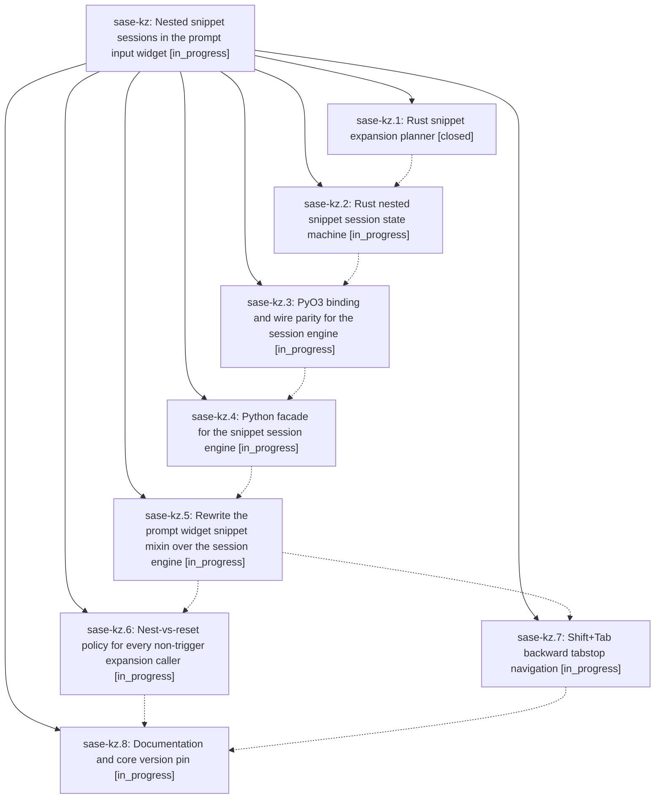

# Bead: sase-kz — Nested snippet sessions in the prompt input widget

[Bead Pages](../README.md) / sase-kz

**Status:** ◐ in_progress · **Type:** ▸ plan · **Tier:** epic
**Owner:** `bryanbugyi34@gmail.com` · **Created by:** [bbugyi200.athena.zm](https://github.com/sase-org/sase--agents/blob/main/families/bbugyi200.athena.zm.md) · **Assignee:** `sase-kz.land`
**Created:** 2026-08-13 12:27:37 EDT
**Plan:** [202608/nested\_snippet\_sessions.md](https://github.com/sase-org/sase--plans/blob/main/202608/nested_snippet_sessions.md)

## Description

Expanding a snippet while another snippet's tabstops are still pending suspends the outer snippet instead of destroying it: the nested snippet's tabstops are visited first, and once they are exhausted `Tab` resumes the enclosing snippet at the stop after the one that was nested into. Tabstop anchors survive arbitrary editing because they are remapped from real document deltas, `Shift+Tab` steps backwards through the visited stops, and the whole session state machine lives in the Rust core so any future frontend gets the same behavior.

## Phases

| Bead | Title | Status | Size | Created | Agents | Commits |
|---|---|---|---|---|---:|---:|
| [sase-kz.1](sase-kz.1.md) | Rust snippet expansion planner | ✓ closed | medium | 2026-08-13 | 1 | 1 |
| [sase-kz.2](sase-kz.2.md) | Rust nested snippet session state machine | ◐ in_progress | medium | 2026-08-13 | 1 | 0 |
| [sase-kz.3](sase-kz.3.md) | PyO3 binding and wire parity for the session engine | ◐ in_progress | small | 2026-08-13 | 1 | 0 |
| [sase-kz.4](sase-kz.4.md) | Python facade for the snippet session engine | ◐ in_progress | small | 2026-08-13 | 1 | 0 |
| [sase-kz.5](sase-kz.5.md) | Rewrite the prompt widget snippet mixin over the session engine | ◐ in_progress | medium | 2026-08-13 | 1 | 0 |
| [sase-kz.6](sase-kz.6.md) | Nest-vs-reset policy for every non-trigger expansion caller | ◐ in_progress | small | 2026-08-13 | 1 | 0 |
| [sase-kz.7](sase-kz.7.md) | Shift+Tab backward tabstop navigation | ◐ in_progress | small | 2026-08-13 | 1 | 0 |
| [sase-kz.8](sase-kz.8.md) | Documentation and core version pin | ◐ in_progress | small | 2026-08-13 | 1 | 0 |

## Lineage

## Agents

| Agent | Bead | Commits |
|---|---|---:|
| [bbugyi200.athena.sase-kz.1](https://github.com/sase-org/sase--agents/blob/main/agents/bbugyi200.athena.sase-kz.1/README.md) | [sase-kz.1](sase-kz.1.md) | 1 |
| [bbugyi200.athena.sase-kz.2](https://github.com/sase-org/sase--agents/blob/main/agents/bbugyi200.athena.sase-kz.2/README.md) | [sase-kz.2](sase-kz.2.md) | 0 |
| [bbugyi200.athena.sase-kz.3](https://github.com/sase-org/sase--agents/blob/main/agents/bbugyi200.athena.sase-kz.3/README.md) | [sase-kz.3](sase-kz.3.md) | 0 |
| [bbugyi200.athena.sase-kz.4](https://github.com/sase-org/sase--agents/blob/main/agents/bbugyi200.athena.sase-kz.4/README.md) | [sase-kz.4](sase-kz.4.md) | 0 |
| [bbugyi200.athena.sase-kz.5](https://github.com/sase-org/sase--agents/blob/main/agents/bbugyi200.athena.sase-kz.5/README.md) | [sase-kz.5](sase-kz.5.md) | 0 |
| [bbugyi200.athena.sase-kz.6](https://github.com/sase-org/sase--agents/blob/main/agents/bbugyi200.athena.sase-kz.6/README.md) | [sase-kz.6](sase-kz.6.md) | 0 |
| [bbugyi200.athena.sase-kz.7](https://github.com/sase-org/sase--agents/blob/main/agents/bbugyi200.athena.sase-kz.7/README.md) | [sase-kz.7](sase-kz.7.md) | 0 |
| [bbugyi200.athena.sase-kz.8](https://github.com/sase-org/sase--agents/blob/main/agents/bbugyi200.athena.sase-kz.8/README.md) | [sase-kz.8](sase-kz.8.md) | 0 |
| [bbugyi200.athena.sase-kz.land](https://github.com/sase-org/sase--agents/blob/main/agents/bbugyi200.athena.sase-kz.land/README.md) | [sase-kz](README.md) | 0 |

## Commits

| Repo | Commit | Subject | Bead | Committed |
|---|---|---|---|---|
| sase-core | [`sase-core@d46bba3`](https://github.com/sase-org/sase-core/commit/d46bba314a349a6ffb3df55467b68c464c579e84) | feat: add Rust snippet expansion planner | [sase-kz.1](sase-kz.1.md) | 2026-08-13 12:51:09 EDT |
