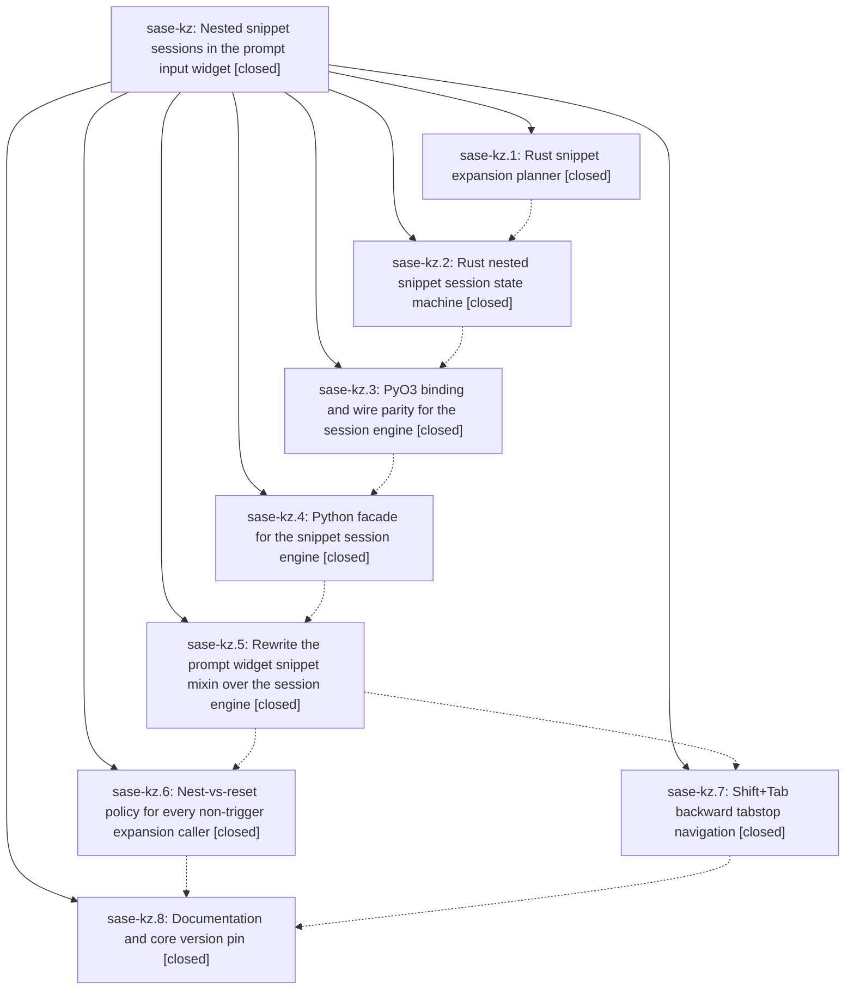

# Bead: sase-kz — Nested snippet sessions in the prompt input widget

[Bead Pages](../README.md) / sase-kz

**Status:** ✓ closed · **Resolution:** done · **Type:** ▸ plan · **Tier:** epic
**Owner:** `bryanbugyi34@gmail.com` · **Created by:** [bbugyi200.athena.zm](https://github.com/sase-org/sase--agents/blob/main/families/bbugyi200.athena.zm.md) · **Assignee:** `sase-kz.land`
**Created:** 2026-08-13 12:27:37 EDT · **Closed:** 2026-08-13 16:24:13 EDT
**Plan:** [plans:202608/nested\_snippet\_sessions.md](https://github.com/sase-org/sase--plans/blob/main/202608/nested_snippet_sessions.md)

## Description

Expanding a snippet while another snippet's tabstops are still pending suspends the outer snippet instead of destroying it: the nested snippet's tabstops are visited first, and once they are exhausted `Tab` resumes the enclosing snippet at the stop after the one that was nested into. Tabstop anchors survive arbitrary editing because they are remapped from real document deltas, `Shift+Tab` steps backwards through the visited stops, and the whole session state machine lives in the Rust core so any future frontend gets the same behavior.

## Notes

[2026-08-13T19:15:45Z · sase-l2.land] DISCOVERED ISSUE: Proposed by sase-l2.2 during epic sase-l2 landing. Current SASE master still declares sase-core-rs>=0.26.6,<0.27.0 and uv.lock resolves 0.26.6, but tools/validate_sase_core_rs requires apply_snippet_session_event, first available in released v0.26.10; just check's advisory core-floor probe reports stale_actionable. This is causally owned by sase-kz, whose phase sase-kz.8 explicitly includes raising the core version pin once the release lands.

[2026-08-13T19:16:13Z · sase-l2.land] DISCOVERED ISSUE: Proposed by sase-l2.3 during epic sase-l2 landing. Justfile still passes --epic-symbol sase-kz.5(apply_snippet_session_event) even though phase sase-kz.5 is closed, so just symvision rejects the stale phase-scoped exemption before tests run. The parent epic remains active and phase sase-kz.8 owns the related core pin/landing cleanup; remove or retarget the exemption and resolve any underlying symbol finding before sase-kz closes.

[2026-08-13T19:16:29Z · sase-l2.land] DISCOVERED ISSUE: Proposed by sase-l2.3 during epic sase-l2 landing. Justfile still passes --epic-symbol sase-kz.5(apply_snippet_session_event) even though phase sase-kz.5 is closed, so just symvision rejects the stale phase-scoped exemption before tests run. The parent epic remains active and phase sase-kz.8 owns the related core pin/landing cleanup; remove or retarget the exemption and resolve any underlying symbol finding before sase-kz closes.

[2026-08-13T19:36:52Z · zx] DISCOVERED ISSUE: On 2026-08-13 at this workspace's current HEAD, just check deterministically fails in _lint-symvision because Justfile still passes seven --epic-symbol exemptions for closed phase sase-kz.5: SnippetExpansionPlan, SnippetSessionTransition, SnippetSpan, SnippetStop, apply_snippet_session_event, clear_snippet_session, and retreat_snippet_session. This extends the existing phase-cleanup note from one symbol to the full failing set; the prompt-pane-frame diff does not touch Justfile or snippet-session symbols.

[2026-08-13T19:43:43Z · zv--2] DISCOVERED ISSUE: Corroborating the sase-l2 note above. Hit the same blocker landing an unrelated plan (monitor_duplicate_rows, sase_16 workspace): just check fails at lint (symvision) because the Justfile's --epic-symbol 'sase-kz.5(...)' entries reference closed bead sase-kz.5 ("Error: --epic-symbol 'sase-kz.5(...)': bead 'sase-kz.5' is closed."). Confirmed this blocks just check on a clean, unmodified master (git stash + rerun), so it is repo-wide, not specific to my diff. I also confirmed the underlying symbols are not all safe to whitelist-drop as-is: after removing the epic-symbol entries locally to test, symvision additionally reports SnippetExpansionPlan, SnippetSessionTransition, SnippetSpan, SnippetStop, apply_snippet_session_event, and clear_snippet_session as unused public symbols in src/sase/core/snippet_session_facade.py (only retreat_snippet_session now has a real non-test consumer, from the Shift+Tab commit). I reverted my Justfile edit rather than fix this, since sase-kz.8 already owns it. Leaving this for sase-kz.8's worker: SnippetSpan/SnippetStop/SnippetExpansionPlan/SnippetSessionTransition/apply_snippet_session_event appear to be used only within snippet_session_facade.py itself (candidates for '_'-prefix per the symvision decision hierarchy), while clear_snippet_session has zero callers anywhere including tests (candidate for deletion) -- but I have not verified this exhaustively.

[2026-08-13T20:24:13Z · sase-kz.land] Verified all 8 phases against the source and the epic's 5 commits (6d21fbbef, 16dc50269, 1004f9eb3, 53c87b758, 026de34f6), integrated with the 12 non-epic commits landed since, and finished the remaining epic-owned work.

VERIFIED. The reported bug is fixed and pinned: TestNestedSessions::test_nesting_at_a_stop_resumes_outer_session_after_inner_exhausts expands 'foo $1 bar $2 baz $3 buz', advances to $2, nests a second snippet there, exhausts the inner stops, and asserts the next Tab lands on the outer $3. TestSnippetPriority's old 'assert not ta._snippet_tabstops' is inverted as the plan required. The two from-doc-end scalars are gone; _snippet_tabstops/_snippet_end_from_doc_end/_iter_template_tabstops/_unescape_literal_dollars have zero references left in src/ or tests/. src/sase/core/snippet_session_facade.py validates every wire field and rejects malformed payloads; _snippets.py drives plan/expand/advance/retreat through it, PromptTextArea.edit() feeds every delta to the live session, and load_text() clears it. All three gate reads (_prompt_text_area_key_handling.py:410, _prompt_soft_completion.py:174, _xprompt_arg_hints.py:101) and all five clear sites (_prompt_text_area_actions.py:57/69/87/241, _prompt_format.py:135) use the session predicate. All five non-trigger callers declare a policy: file completion, soft completion, Ctrl+T skeleton and named-arg skeleton nest; the whole-pane local-xprompt replacement resets, each with its own regression test. Shift+Tab retreats via _try_retreat_tabstop with the bullet/ordered dedent path preserved ahead of it. Docs and the pin landed: docs/ace.md keymap Shift+Tab row plus the Snippets/Tab-priority sections, docs/configuration.md, docs/editor.md, and sase-core-rs raised to >=0.26.10 in pyproject.toml and uv.lock. CHANGELOG needed no hand edit -- tools/validate_changelog forbids it and release-please generates it from the conventional commit subjects, which the epic's commits supply. Confirmed the pin is real, not aspirational: the session engine commits (ca59ed9, 0a8eeea) are ancestors of sase-core's v0.26.9 release, so published 0.26.10 genuinely carries apply_snippet_session_event.

EPIC NOTES ADDRESSED. The stale core-floor note is resolved -- tools/probe_core_floor --advisory is now silent. The four notes about stale Justfile '--epic-symbol sase-kz.5(...)' exemptions are resolved: grep finds zero --epic-symbol entries in the Justfile, and symvision reports no sase-kz symbol at all (16dc50269 dropped six, 53c87b758 privatized the facade-only wire types and gave clear/retreat live consumers).

GATES at 026de34f6 + this change: fmt (python/markdown), keep-sorted, ruff, mypy, pyscripts, test-waits, changelog, patch/stitch terminology, toobig, SASE validation, and committed-plan validation all pass; the full non-visual suite passes (29682 passed, 10 skipped, exit 0). The only red gate is symvision, on one symbol this epic did not touch (see follow-ups).

INTEGRATION. Reviewed all 12 commits landed since 6d21fbbef that are not this epic's. None needs integration work and none conflicts: 31b9c62b6 frames prompt-stack *snippet panes* (a different feature that shares only the word 'snippet' -- no shared code with tabstop sessions); 0623414e3 wait-modal field navigation is a separate modal widget on Ctrl+J/K, not PromptTextArea Tab dispatch; 0086b8781 Artifacts split modes, 04cd96971 research-plugin wiring, and the five monitor commits touch unrelated subsystems. cbd47ed11 and b5e1ac88c (the plans:->plan: rename) are the reason two of this epic's follow-ups no longer reproduce. No Python code duplicates the core's template parsing -- src/sase/xprompt/snippet_bridge.py only *generates* $N markers for the registry and correctly stays out of the session engine.

REMAINING EPIC WORK FINISHED HERE. (1) sase-kz.5's design-doc deviation: the plan's 'Python glue' section still demanded a re-entrancy guard around the expansion's own _replace_via_keyboard call, which was deliberately not implemented because it broke the very bug it was meant to protect. docs_pin did not amend it; I added a recorded Deviation block to plans:202608/nested_snippet_sessions.md explaining why the shipped edit() override feeds every edit, including the expansion's own, to the session. (2) The back_nav phase required that 'backward navigation is not available after the session ends ... must be asserted, not left implicit'; only the never-had-a-session case was covered, so I added TestBackwardTabstopNavigation::test_no_retreat_after_the_session_ends, which exhausts a session and asserts retreat is a no-op that does not move the cursor.

FOLLOW-UP OUTCOMES. sase-kz.8's symvision proposal (unused public stream_and_parse_messages_json_output in src/sase/llm_provider/_subprocess_claude.py) is real and still blocks just check repo-wide, but is not caused by this epic: sase-l3.1 (ad4ae62ae) added it and in-progress phase sase-l3.3 is its intended consumer. Routed via /sase_new_task to active epic sase-l3 as a DISCOVERED ISSUE; no task bead created, per the skill's active-epic branch. sase-kz.4's SDD hosted-link failures and sase-kz.5's 32 pre-existing check failures were both declined as tasks: they no longer reproduce -- the full suite is green at this HEAD, and they were an artifact of those phases running four commits behind origin/master, before the plan:-rename commits landed. sase-kz.5's design-doc deviation was fixed here rather than filed, since it is epic-owned. Not filed either: sase-kz's own bead design reference still uses the legacy 'plans:' spelling while newer beads use 'plan:'; that migration is explicitly owned by in-progress phase sase-ky.3 (Migrate bead design references).

## Phases

| Bead | Title | Status | Size | Created | Agents | Commits |
|---|---|---|---|---|---:|---:|
| [sase-kz.1](sase-kz.1.md) | Rust snippet expansion planner | ✓ closed | medium | 2026-08-13 | 1 | 1 |
| [sase-kz.2](sase-kz.2.md) | Rust nested snippet session state machine | ✓ closed | medium | 2026-08-13 | 1 | 1 |
| [sase-kz.3](sase-kz.3.md) | PyO3 binding and wire parity for the session engine | ✓ closed | small | 2026-08-13 | 1 | 1 |
| [sase-kz.4](sase-kz.4.md) | Python facade for the snippet session engine | ✓ closed | small | 2026-08-13 | 1 | 1 |
| [sase-kz.5](sase-kz.5.md) | Rewrite the prompt widget snippet mixin over the session engine | ✓ closed | medium | 2026-08-13 | 1 | 1 |
| [sase-kz.6](sase-kz.6.md) | Nest-vs-reset policy for every non-trigger expansion caller | ✓ closed | small | 2026-08-13 | 1 | 1 |
| [sase-kz.7](sase-kz.7.md) | Shift+Tab backward tabstop navigation | ✓ closed | small | 2026-08-13 | 1 | 1 |
| [sase-kz.8](sase-kz.8.md) | Documentation and core version pin | ✓ closed | small | 2026-08-13 | 1 | 1 |

## Lineage

## Agents

| Agent | Bead | Commits |
|---|---|---:|
| [bbugyi200.athena.sase-kz.1](https://github.com/sase-org/sase--agents/blob/main/agents/bbugyi200.athena.sase-kz.1/README.md) | [sase-kz.1](sase-kz.1.md) | 1 |
| [bbugyi200.athena.sase-kz.2](https://github.com/sase-org/sase--agents/blob/main/agents/bbugyi200.athena.sase-kz.2/README.md) | [sase-kz.2](sase-kz.2.md) | 1 |
| [bbugyi200.athena.sase-kz.3](https://github.com/sase-org/sase--agents/blob/main/agents/bbugyi200.athena.sase-kz.3/README.md) | [sase-kz.3](sase-kz.3.md) | 1 |
| [bbugyi200.athena.sase-kz.4](https://github.com/sase-org/sase--agents/blob/main/agents/bbugyi200.athena.sase-kz.4/README.md) | [sase-kz.4](sase-kz.4.md) | 1 |
| [bbugyi200.athena.sase-kz.5](https://github.com/sase-org/sase--agents/blob/main/agents/bbugyi200.athena.sase-kz.5/README.md) | [sase-kz.5](sase-kz.5.md) | 1 |
| [bbugyi200.athena.sase-kz.6](https://github.com/sase-org/sase--agents/blob/main/agents/bbugyi200.athena.sase-kz.6/README.md) | [sase-kz.6](sase-kz.6.md) | 1 |
| [bbugyi200.athena.sase-kz.7](https://github.com/sase-org/sase--agents/blob/main/agents/bbugyi200.athena.sase-kz.7/README.md) | [sase-kz.7](sase-kz.7.md) | 1 |
| [bbugyi200.athena.sase-kz.8](https://github.com/sase-org/sase--agents/blob/main/agents/bbugyi200.athena.sase-kz.8/README.md) | [sase-kz.8](sase-kz.8.md) | 1 |
| [bbugyi200.athena.sase-kz.land](https://github.com/sase-org/sase--agents/blob/main/agents/bbugyi200.athena.sase-kz.land/README.md) | [sase-kz](README.md) | 1 |

## Commits

| Repo | Commit | Subject | Bead | Committed |
|---|---|---|---|---|
| sase-core | [`sase-core@d46bba3`](https://github.com/sase-org/sase-core/commit/d46bba314a349a6ffb3df55467b68c464c579e84) | feat: add Rust snippet expansion planner | [sase-kz.1](sase-kz.1.md) | 2026-08-13 12:51:09 EDT |
| sase-core | [`sase-core@ca59ed9`](https://github.com/sase-org/sase-core/commit/ca59ed9b42159feeeaa12fe015d094c64179fedf) | feat(snippet-session): add nested snippet session state machine | [sase-kz.2](sase-kz.2.md) | 2026-08-13 13:11:51 EDT |
| sase-core | [`sase-core@0a8eeea`](https://github.com/sase-org/sase-core/commit/0a8eeea99d6f2360729fad4354383a5d6dc3b847) | feat(snippet-session): dispatch session events and bind to Python | [sase-kz.3](sase-kz.3.md) | 2026-08-13 13:25:59 EDT |
| sase | [`6d21fbb`](https://github.com/sase-org/sase/commit/6d21fbbef36aaaa19b7e2c069f2bb69b7ea7bbd0) | feat(core): add snippet session facade | [sase-kz.4](sase-kz.4.md) | 2026-08-13 13:51:14 EDT |
| sase | [`16dc502`](https://github.com/sase-org/sase/commit/16dc502695d4b6025fbc4e034611ea266e38f6bf) | feat(ace): rewrite prompt snippet mixin over the facade-backed session engine | [sase-kz.5](sase-kz.5.md) | 2026-08-13 15:02:18 EDT |
| sase | [`1004f9e`](https://github.com/sase-org/sase/commit/1004f9eb33d6401374e837f068ebef0260eec0e5) | feat(ace): retreat through visited snippet tabstops with Shift+Tab | [sase-kz.7](sase-kz.7.md) | 2026-08-13 15:20:41 EDT |
| sase | [`53c87b7`](https://github.com/sase-org/sase/commit/53c87b7585ed872e05ee125b74b65bf71dd6270e) | fix: make snippet expansion session policy explicit | [sase-kz.6](sase-kz.6.md) | 2026-08-13 15:35:37 EDT |
| sase | [`026de34`](https://github.com/sase-org/sase/commit/026de34f6b312a8be4244281facc74b295791faf) | build(deps): require sase-core-rs 0.26.10 | [sase-kz.8](sase-kz.8.md) | 2026-08-13 15:53:18 EDT |
| sase | [`36d6dc8`](https://github.com/sase-org/sase/commit/36d6dc8dd86551664fc2b8411376403f5c77fdd2) | test(ace): assert retreat is unavailable after a snippet session ends | [sase-kz](README.md) | 2026-08-13 16:25:55 EDT |
