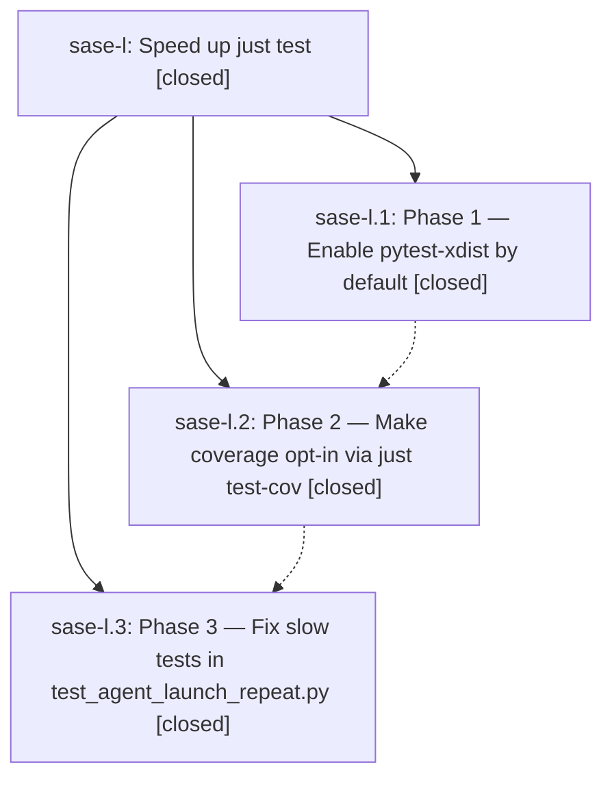

# Bead: sase-l — Speed up just test

[Bead Pages](../README.md) / sase-l

**Status:** ✓ closed · **Resolution:** (unrecorded) · **Type:** plan · **Tier:** epic
**Owner:** `bryanbugyi34@gmail.com`
**Created:** 2026-04-24 00:32:39 UTC · **Closed:** 2026-04-24 01:08:54 UTC
**Plan:** [202604/test\_suite\_speedup.md](https://github.com/sase-org/sase--plans/blob/main/202604/test_suite_speedup.md)

## Phases

| Bead | Title | Status | Size | Agents | Commits |
|---|---|---|---|---:|---:|
| [sase-l.1](sase-l.1.md) | Phase 1 — Enable pytest-xdist by default | ✓ closed | small | 0 | 1 |
| [sase-l.2](sase-l.2.md) | Phase 2 — Make coverage opt-in via just test-cov | ✓ closed | small | 0 | 1 |
| [sase-l.3](sase-l.3.md) | Phase 3 — Fix slow tests in test\_agent\_launch\_repeat.py | ✓ closed | small | 0 | 1 |

## Lineage

## Commits

| Commit | Subject | Bead | Committed (UTC) |
|---|---|---|---|
| [`361257d`](https://github.com/sase-org/sase/commit/361257d743c50c0fc148d9951d0aa41e9c7aec91) | feat: Run \`just test\` in parallel by default via pytest-xdist (sase-l.1) | [sase-l.1](sase-l.1.md) | 2026-04-24 00:47:03 |
| [`a2bb0bc`](https://github.com/sase-org/sase/commit/a2bb0bc870076c0243ef8a90d5668df5bf94725b) | feat: Make coverage opt-in via \`just test-cov\` (sase-l.2) | [sase-l.2](sase-l.2.md) | 2026-04-24 00:55:43 |
| [`1927734`](https://github.com/sase-org/sase/commit/192773438e2a72cdcdb808672464f4ff7d1a6018) | feat: Zero the inter-spawn sleep in repeat-agent tests (sase-l.3) | [sase-l.3](sase-l.3.md) | 2026-04-24 01:07:34 |
