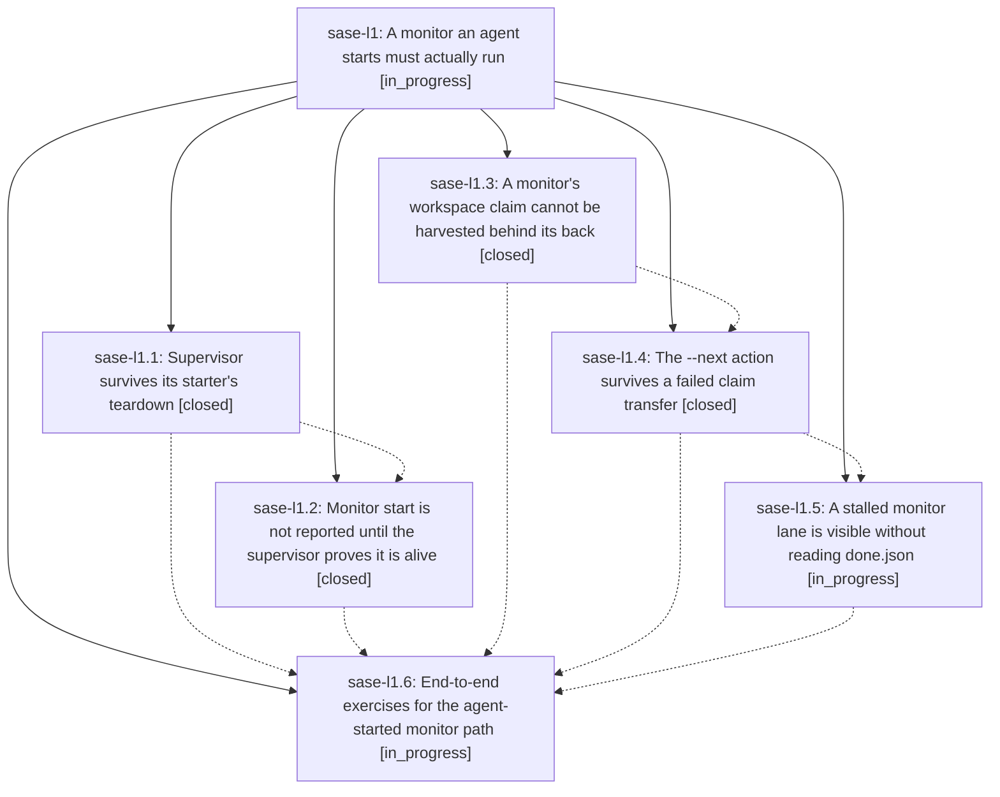

# Bead: sase-l1 — A monitor an agent starts must actually run

[Bead Pages](../README.md) / sase-l1

**Status:** ◐ in_progress · **Type:** ▸ plan · **Tier:** epic
**Owner:** `bryanbugyi34@gmail.com` · **Created by:** [bbugyi200.athena.zo](https://github.com/sase-org/sase--agents/blob/main/families/bbugyi200.athena.zo.md) · **Assignee:** `sase-l1.land`
**Created:** 2026-08-13 13:37:24 EDT
**Plan:** [202608/monitor\_supervisor\_survival.md](https://github.com/sase-org/sase--plans/blob/main/202608/monitor_supervisor_survival.md)

## Description

A monitor started from inside an agent survives that agent's own runner teardown, and when it cannot, the failure is loud and immediate: `sase monitor start` refuses to return success for a supervisor that is not provably alive, a monitor's workspace is never harvested out from under it, and a monitor's `--next` action is never silently dropped.

## Phases

| Bead | Title | Status | Size | Created | Agents | Commits |
|---|---|---|---|---|---:|---:|
| [sase-l1.1](sase-l1.1.md) | Supervisor survives its starter's teardown | ✓ closed | medium | 2026-08-13 | 1 | 1 |
| [sase-l1.2](sase-l1.2.md) | Monitor start is not reported until the supervisor proves it is alive | ✓ closed | medium | 2026-08-13 | 1 | 1 |
| [sase-l1.3](sase-l1.3.md) | A monitor's workspace claim cannot be harvested behind its back | ✓ closed | small | 2026-08-13 | 1 | 1 |
| [sase-l1.4](sase-l1.4.md) | The --next action survives a failed claim transfer | ✓ closed | medium | 2026-08-13 | 1 | 1 |
| [sase-l1.5](sase-l1.5.md) | A stalled monitor lane is visible without reading done.json | ◐ in_progress | small | 2026-08-13 | 1 | 0 |
| [sase-l1.6](sase-l1.6.md) | End-to-end exercises for the agent-started monitor path | ◐ in_progress | xsmall | 2026-08-13 | 1 | 0 |

## Lineage

## Agents

| Agent | Bead | Commits |
|---|---|---:|
| [bbugyi200.athena.sase-l1.1](https://github.com/sase-org/sase--agents/blob/main/agents/bbugyi200.athena.sase-l1.1/README.md) | [sase-l1.1](sase-l1.1.md) | 1 |
| [bbugyi200.athena.sase-l1.2](https://github.com/sase-org/sase--agents/blob/main/agents/bbugyi200.athena.sase-l1.2/README.md) | [sase-l1.2](sase-l1.2.md) | 1 |
| [bbugyi200.athena.sase-l1.3](https://github.com/sase-org/sase--agents/blob/main/agents/bbugyi200.athena.sase-l1.3/README.md) | [sase-l1.3](sase-l1.3.md) | 1 |
| [bbugyi200.athena.sase-l1.4](https://github.com/sase-org/sase--agents/blob/main/agents/bbugyi200.athena.sase-l1.4/README.md) | [sase-l1.4](sase-l1.4.md) | 1 |
| [bbugyi200.athena.sase-l1.5](https://github.com/sase-org/sase--agents/blob/main/agents/bbugyi200.athena.sase-l1.5/README.md) | [sase-l1.5](sase-l1.5.md) | 0 |
| [bbugyi200.athena.sase-l1.6](https://github.com/sase-org/sase--agents/blob/main/agents/bbugyi200.athena.sase-l1.6/README.md) | [sase-l1.6](sase-l1.6.md) | 0 |
| [bbugyi200.athena.sase-l1.land](https://github.com/sase-org/sase--agents/blob/main/agents/bbugyi200.athena.sase-l1.land/README.md) | [sase-l1](README.md) | 0 |

## Commits

| Repo | Commit | Subject | Bead | Committed |
|---|---|---|---|---|
| sase | [`3bb9bd1`](https://github.com/sase-org/sase/commit/3bb9bd1d1c35a49dbe7cba51d5c16a0d6fc9a3a8) | fix(ace): block stale-running claim release on monitor reconcile failure | [sase-l1.3](sase-l1.3.md) | 2026-08-13 14:11:11 EDT |
| sase | [`d11dfd6`](https://github.com/sase-org/sase/commit/d11dfd6ebb68c5c9840363db92f22f625439109b) | fix(monitor): detach supervisor from starter teardown | [sase-l1.1](sase-l1.1.md) | 2026-08-13 14:15:56 EDT |
| sase | [`90b2628`](https://github.com/sase-org/sase/commit/90b26289f73a00fbecc7fba12233ca5bdf661682) | fix(monitor): preserve follow-up launches after claim transfer failure | [sase-l1.4](sase-l1.4.md) | 2026-08-13 14:55:33 EDT |
| sase | [`b454213`](https://github.com/sase-org/sase/commit/b4542139aadc55073a8909e44961d269116f0693) | fix(monitor): block start\_monitor until the supervisor acks startup | [sase-l1.2](sase-l1.2.md) | 2026-08-13 15:08:53 EDT |
