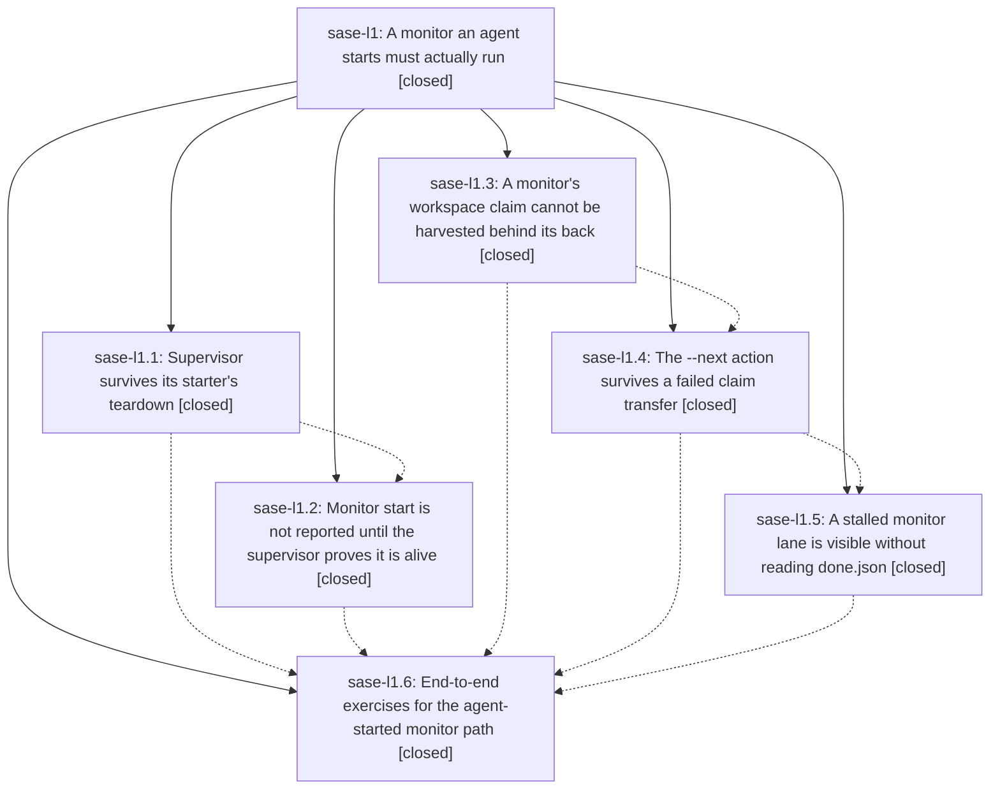

# Bead: sase-l1 — A monitor an agent starts must actually run

[Bead Pages](../README.md) / sase-l1

**Status:** ✓ closed · **Resolution:** done · **Type:** ▸ plan · **Tier:** epic
**Owner:** `bryanbugyi34@gmail.com` · **Created by:** [bbugyi200.athena.zo](https://github.com/sase-org/sase--agents/blob/main/families/bbugyi200.athena.zo.md) · **Assignee:** `sase-l1.land`
**Created:** 2026-08-13 13:37:24 EDT · **Closed:** 2026-08-13 19:08:50 EDT
**Plan:** [202608/monitor\_supervisor\_survival.md](https://github.com/sase-org/sase--plans/blob/main/202608/monitor_supervisor_survival.md)

## Description

A monitor started from inside an agent survives that agent's own runner teardown, and when it cannot, the failure is loud and immediate: `sase monitor start` refuses to return success for a supervisor that is not provably alive, a monitor's workspace is never harvested out from under it, and a monitor's `--next` action is never silently dropped.

## Notes

[2026-08-13T23:08:50Z · sase-l1.land] VERIFIED (steps 1-2 of the land workflow).

PHASES. All six children closed `done`. Read every child note and confirmed each against source and the epic's five commits (3bb9bd1d1, d11dfd6eb, 90b26289f, b4542139a, 1b7ce6194), all on master:
- detach (sase-l1.1, d11dfd6eb): src/sase/monitor/supervisor_bootstrap.py double-forks; SIGHUP=SIG_IGN and SIGTERM/SIGINT recorders are installed at module scope before the sase import; start_monitor records the grandchild pid then its identity; _terminate_supervisor signals the grandchild.
- ack (sase-l1.2, b4542139a): supervisor writes .monitor_started; _wait_for_start_acknowledgement blocks on it for MONITOR_START_ACK_TIMEOUT_SECONDS=20s while polling supervisor liveness; on failure it terminates the supervisor, hands the claim back to the still-live starter via _undo_workspace_claim (never into the free pool), tears the member down terminal-failed, and raises MonitorError.
- claim (sase-l1.3, 3bb9bd1d1): hook_jobs.run_stale_running_cleanup passes skip_monitor_claims=True whenever _reconcile_dead_monitor_supervisors() raises, and cleanup_stale_running_entries._monitor_claim_is_releasable requires the owning member to be terminal, failing closed on any read error.
- followup (sase-l1.4, 90b26289f): fresh-claim then workspace-0 fallbacks, FollowupLaunchResult/degraded_reason plumbed into three explicit settlement outcomes, prompt persisted as a durable artifact when unlaunchable.
- visibility (sase-l1.5, 1b7ce6194): ACE and CLI badges plus wire plumbing; docs and skill source extended.
- exercises (sase-l1.6): a real claude-runtime agent-started monitor (9yeer0htvj79) survived the handoff, streamed real pytest output, settled timeout/exit -15, and its follow-up ran in the same workspace (sase_10). Only the claude row -- the reported regression -- was driven end to end; the deliberate startup-window kill is covered deterministically by tests instead.
180 monitor/visibility/claim tests pass in this workspace.

INTEGRATION with commits landed since the epic started (3bb9bd1d1..d9c685e86):
- c5935856a ("make monitors notification-neutral", plan 202608/silent_monitors.md) deliberately deleted notify_monitor_complete and the notify_monitor_followup_dropped alarm this epic's visibility phase added -- an intentional owner-directed reversal of visibility item 3, not a regression. It updated no docs, so docs/monitors.md still promised an alarm-tagged notification for a dropped --next. Corrected: that paragraph now states monitors are notification-neutral and names the durable signals instead.
- FIXED, epic-caused defect: the ⚑ flag never appeared for a *degraded* follow-up. docs/monitors.md, the sase_monitor skill, and the code's own comments all promised "did not launch **or launched degraded**", but every check keyed on followup_error, which a launched-degraded outcome never sets (it records monitor_followup_degraded_reason). Added MonitorRecord.followup_needs_attention plus MONITOR_FOLLOWUP_DEGRADED_OUTCOME, used it in sase monitor list's table and markdown cells and in the ACE agent row, added a "Follow-up degraded" row to sase monitor show and followup_degraded_reason to both JSON envelopes, and covered all of it with five new tests.
- Documented the new ⚠/⚑ monitor badges in docs/ace.md's Agent Row Glyphs section (the visibility phase added glyphs without listing them there).
- 2e2facb94 already consumes this epic's outcomes correctly (SUCCESSFUL_MONITOR_FOLLOWUP_OUTCOMES includes launched-degraded). ab7deab66 and 0083d1e10 layer cleanly on the claim/settlement changes; 0083d1e10's sase.monitor.claims leaf module re-exports through sase.monitor.start, which the epic's sweeper still imports and which is covered by an explicit re-export test. 093088abb, the Grok provider commits, and the ACE snippet/SASE-CONTEXT work do not touch monitors.

PROPOSED FOLLOW-UPs collected from child notes (6 distinct):
1. plan-show `plans:`/`plan:` reference spelling failures (sase-l1.1, .2, .4) -- ALREADY FIXED by cbd47ed11 and b5e1ac88c; tests/plan_show/test_resolve.py + tests/sdd/test_hosted_links.py now 49 passed. No task filed.
2. sase-core-rs floor 0.26.6 lacking scan_agent_artifacts (sase-l1.1) -- ALREADY FIXED by 026de34f6 (floor 0.26.10); tools/probe_core_floor is silent. No task filed.
3. tight wall-clock assertions in test_monitor_supervise.py (sase-l1.2) -- ALREADY FIXED by this epic's own 90b26289f, which widened all three named tests to _NO_HANG_TIMEOUT = 5.0 against observed 1.22/2.98/2.09. No task filed.
4. ~28 check-full failures on unmodified master across tests/sdd, tests/plan_show, tests/test_bead (sase-l1.3) -- RESOLVED by the same plan:/plans: rename; re-ran all three (tests/test_bead: 1689 passed). No task filed.
5. stale symvision --epic-symbol whitelist for closed epic sase-kz.5 (sase-l1.5) -- ALREADY RESOLVED; the Justfile carries no --epic-symbol entries and just symvision is clean. No task filed.
6. bead event stream lost an event during a concurrent sync (sase-l1.5) -- genuinely distinct and unresolved; filed via /sase_new_task as sase-li (large, ready), with a RELATED note to sase-f0. Not a duplicate of any task bead and not causally linked to any in-progress epic.

ALSO RECORDED: a DISCOVERED ISSUE note on active epic sase-lh. With sase-lh.1 (Rust procs rename) closed and sase-lh.2 (Python) still open, the linked sase-core checkout builds task wire schema 2 while this repo pins version 1, so 63 tests across tests/main/test_task_handler_*, tests/test_tasks_*, and tests/ace/tui/test_task*.py fail in every workspace. Reproduced on clean master via git stash, so it is not this epic's diff -- it is the only reason just check is red here. just lint is green (exit 0, symvision included) and the scoped lane is otherwise 29726 passed.

DEFERRED: 31 provider skill files remain out of sync with their rendered sources (sase validate warns "redeploy is deferred until land"). This turn's src/sase/xprompts/skills/sase_monitor.md correction is still uncommitted, and the commit-first-then-deploy policy forbids deploying from a dirty xprompts tree, so `sase init skills` must be rerun from a clean merged tree once this lands.

[2026-08-13T23:11:23Z · sase-l1.land] VERIFIED (land steps 1-2). All six phases closed done; every child note re-read and checked against source plus the epic's five commits (3bb9bd1d1, d11dfd6eb, 90b26289f, b4542139a, 1b7ce6194). INTEGRATION: c5935856a removed the visibility phase's notification without updating docs/monitors.md (corrected); the followup attention flag never fired for a launched-degraded outcome because every check keyed on followup_error, so added MonitorRecord.followup_needs_attention and wired it through sase monitor list/show and the ACE row. Six follow-up proposals triaged: five already fixed by commits landed during the epic, one new task filed as sase-li.

## Phases

| Bead | Title | Status | Size | Created | Agents | Commits |
|---|---|---|---|---|---:|---:|
| [sase-l1.1](sase-l1.1.md) | Supervisor survives its starter's teardown | ✓ closed | medium | 2026-08-13 | 1 | 1 |
| [sase-l1.2](sase-l1.2.md) | Monitor start is not reported until the supervisor proves it is alive | ✓ closed | medium | 2026-08-13 | 1 | 1 |
| [sase-l1.3](sase-l1.3.md) | A monitor's workspace claim cannot be harvested behind its back | ✓ closed | small | 2026-08-13 | 1 | 1 |
| [sase-l1.4](sase-l1.4.md) | The --next action survives a failed claim transfer | ✓ closed | medium | 2026-08-13 | 1 | 1 |
| [sase-l1.5](sase-l1.5.md) | A stalled monitor lane is visible without reading done.json | ✓ closed | small | 2026-08-13 | 1 | 2 |
| [sase-l1.6](sase-l1.6.md) | End-to-end exercises for the agent-started monitor path | ✓ closed | xsmall | 2026-08-13 | 1 | 0 |

## Lineage

## Agents

| Agent | Bead | Commits |
|---|---|---:|
| [bbugyi200.athena.sase-l1.1](https://github.com/sase-org/sase--agents/blob/main/agents/bbugyi200.athena.sase-l1.1/README.md) | [sase-l1.1](sase-l1.1.md) | 1 |
| [bbugyi200.athena.sase-l1.2](https://github.com/sase-org/sase--agents/blob/main/agents/bbugyi200.athena.sase-l1.2/README.md) | [sase-l1.2](sase-l1.2.md) | 1 |
| [bbugyi200.athena.sase-l1.3](https://github.com/sase-org/sase--agents/blob/main/agents/bbugyi200.athena.sase-l1.3/README.md) | [sase-l1.3](sase-l1.3.md) | 1 |
| [bbugyi200.athena.sase-l1.4](https://github.com/sase-org/sase--agents/blob/main/agents/bbugyi200.athena.sase-l1.4/README.md) | [sase-l1.4](sase-l1.4.md) | 1 |
| [bbugyi200.athena.sase-l1.5](https://github.com/sase-org/sase--agents/blob/main/agents/bbugyi200.athena.sase-l1.5/README.md) | [sase-l1.5](sase-l1.5.md) | 2 |
| [bbugyi200.athena.sase-l1.6](https://github.com/sase-org/sase--agents/blob/main/families/bbugyi200.athena.sase-l1.6.md) | [sase-l1.6](sase-l1.6.md) | 0 |
| [bbugyi200.athena.sase-l1.land](https://github.com/sase-org/sase--agents/blob/main/agents/bbugyi200.athena.sase-l1.land/README.md) | [sase-l1](README.md) | 2 |

## Commits

| Repo | Commit | Subject | Bead | Committed |
|---|---|---|---|---|
| sase | [`3bb9bd1`](https://github.com/sase-org/sase/commit/3bb9bd1d1c35a49dbe7cba51d5c16a0d6fc9a3a8) | fix(ace): block stale-running claim release on monitor reconcile failure | [sase-l1.3](sase-l1.3.md) | 2026-08-13 14:11:11 EDT |
| sase | [`d11dfd6`](https://github.com/sase-org/sase/commit/d11dfd6ebb68c5c9840363db92f22f625439109b) | fix(monitor): detach supervisor from starter teardown | [sase-l1.1](sase-l1.1.md) | 2026-08-13 14:15:56 EDT |
| sase | [`90b2628`](https://github.com/sase-org/sase/commit/90b26289f73a00fbecc7fba12233ca5bdf661682) | fix(monitor): preserve follow-up launches after claim transfer failure | [sase-l1.4](sase-l1.4.md) | 2026-08-13 14:55:33 EDT |
| sase | [`b454213`](https://github.com/sase-org/sase/commit/b4542139aadc55073a8909e44961d269116f0693) | fix(monitor): block start\_monitor until the supervisor acks startup | [sase-l1.2](sase-l1.2.md) | 2026-08-13 15:08:53 EDT |
| sase-core | [`sase-core@cac5d34`](https://github.com/sase-org/sase-core/commit/cac5d349baba318206a51162c3b1cd50128fa8fe) | feat(agent\_scan): carry monitor follow-up disposition in scan wire | [sase-l1.5](sase-l1.5.md) | 2026-08-13 15:39:51 EDT |
| sase | [`1b7ce61`](https://github.com/sase-org/sase/commit/1b7ce6194e9ff4ceaae5f1fb55575a1acca7e3ed) | feat(monitor): surface dropped follow-ups and dead monitors without done.json | [sase-l1.5](sase-l1.5.md) | 2026-08-13 15:40:51 EDT |
| sase | [`153e2a1`](https://github.com/sase-org/sase/commit/153e2a137524837bc7ac3d83a632a6afa8f61045) | fix(monitor): flag a degraded follow-up as a stalled lane | [sase-l1](README.md) | 2026-08-13 19:17:48 EDT |
| sase--plans | [`sase--plans@a479f73`](https://github.com/sase-org/sase--plans/commit/a479f73d8622346be9b63064077505dd05e265a2) | chore: mark the monitor supervisor survival epic plan done | [sase-l1](README.md) | 2026-08-13 19:18:45 EDT |
