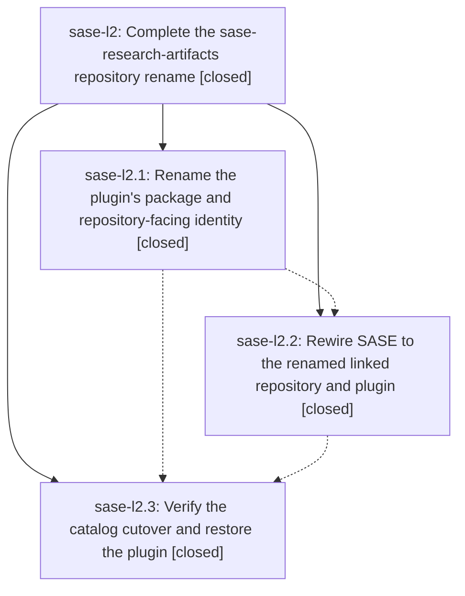

# Bead: sase-l2 — Complete the sase-research-artifacts repository rename

[Bead Pages](../README.md) / sase-l2

**Status:** ✓ closed · **Resolution:** done · **Type:** ▸ plan · **Tier:** epic
**Owner:** `bryanbugyi34@gmail.com` · **Created by:** [bbugyi200.athena.zt](https://github.com/sase-org/sase--agents/blob/main/families/bbugyi200.athena.zt.md) · **Assignee:** `sase-l2.land`
**Created:** 2026-08-13 14:11:56 EDT · **Closed:** 2026-08-13 15:35:46 EDT
**Plan:** [202608/research\_artifacts\_rename.md](https://github.com/sase-org/sase--plans/blob/main/202608/research_artifacts_rename.md)

## Description

The renamed research-artifacts plugin has one coherent repository, distribution, module, release, catalog, and linked-repository identity; SASE still exposes the existing research artifact-reference, hook, and xprompt contracts; obsolete warnings that distinguish the plugin from the sase--research content sidecar are gone; and the renamed plugin is installable and verified under its new name.

## Notes

[2026-08-13T19:35:46Z · sase-l2.land--1] VERIFY: All 3 phases closed done; every child note addressed; the epic bead carried no notes of its own. Read the epic's only sase-repo commit 04cd96971 (linked-repo config, generated AGENTS/provider shims, sase/memory, docs/artifact_references.md, sase/sase.yml, provider provenance fixtures) and the plugin repo's 807e209 "feat!: rename research plugin identity". Confirmed at HEAD that the rename is complete, not just reported: repo-wide rg for `sase-research` not followed by `-artifacts`, `sase_research` not followed by `_artifacts`, and `SASE_RESEARCH` not followed by `_ARTIFACTS` all return zero hits, while the separate `sase--research` content sidecar is correctly preserved.

LIVE CHECKS: `sase plugin show research-artifacts` reports built-in sase-org/sase-research-artifacts v0.1.0 installed with sase_artifact_refs/sase_config/sase_file_hooks/sase_xprompts entry points; the uv receipt names sase-research-artifacts from git+https://github.com/sase-org/sase-research-artifacts; `sase repo list` shows the linked sase-research-artifacts row and no old row; `sase doctor -C config.repos` OK; artifact kind `research` resolves (research:202602/sase_plugin_specifics.md -> correct candidate path, status `missing` only because that sidecar is not cloned in this workspace); all five xprompts present (#research, #research/image, #research/more, #research/prompt, and #research_swarm sourced from plugin:sase_research_artifacts/research_swarm.md); the research-highlights file hook is loaded. `just test-wheel` in the plugin repo passed 4/4 (renamed distribution identity, wheel + sdist contents with provider defaults and all five xprompts, fresh-venv install with discoverable entry points) via monitor ddfv36qqw4xy in 2m7s. Both repos are clean and level with origin.

INTEGRATE: Reviewed all 5 commits landed after 04cd96971 (b4542139a, b5e1ac88c, 0086b8781, 16dc50269, 90b26289f). Four are monitor/ACE work touching no rename surface. b5e1ac88c is the only overlap - it edited docs/artifact_references.md and src/sase/artifact_providers/builtin_entries.py, but solely for the `plan:`/`@plan:` grammar migration; the rename's lines survived intact. No integration edits were required and nothing duplicates or conflicts with what this epic added.

FOLLOW-UPS (4 proposals, all routed):
1. sase-l2.2 "bump the sase-core-rs floor" -> NOT filed as a task. Reproduced at HEAD with just check's exact invocation: stale_actionable, sase-core-rs==0.26.6 missing apply_snippet_session_event, first released in v0.26.10. That symbol belongs to epic sase-kz, whose phase sase-kz.8 ("Documentation and core version pin") is IN_PROGRESS and explicitly owns raising the pin, so it is recorded as a DISCOVERED ISSUE on sase-kz. Hand-bumping the window is also the remediation the owner retired in sase-jj's close (the release-branch ratchet owns it).
2. sase-l2.2 "make sase repo list honor workspace-local repo config" -> task sase-l5 (READY, medium), root cause traced to repo_handler_list.py + repo_inventory.py. sase-l2.land had filed this twice; I closed the duplicate draft sase-l4 as superseded so only one triage gate remains.
3. sase-l2.3 "remove stale symvision epic-symbol entries for closed sase-kz.5" -> NOT filed as a task. Recorded as a DISCOVERED ISSUE on active epic sase-kz. `just symvision` fails only on the seven sase-kz.5 entries; sase-l2 contributed no --epic-symbol entries at all, so nothing expires at this close and there is no sase-l2 code to clean up. I deliberately did not edit another active epic's whitelist.
4. Self-check, not filed: an earlier probe_core_floor run of mine reported could_not_determine (PEP 695 SyntaxError). That was my own mis-invocation (no --sase-core-dir, shebang interpreter), not a defect - the correct invocation works.

Also repaired the plans sidecar, which was in detached HEAD and blocking all bead writes, via `sase repo open plans`.

[2026-08-13T19:36:48Z · sase-l2.land--1] POST-CLOSE SYMVISION: ran `just symvision` after the close. Output is identical to the pre-close run - the only failures are the seven stale --epic-symbol 'sase-kz.5(...)' entries owned by still-active epic sase-kz (already recorded there as a DISCOVERED ISSUE). `rg -n 'sase-l2' Justfile` returns nothing, confirming this epic contributed no epic-symbol whitelist entries, so none expired at close and there is no unused sase-l2 code for symvision to report.

## Phases

| Bead | Title | Status | Size | Created | Agents | Commits |
|---|---|---|---|---|---:|---:|
| [sase-l2.1](sase-l2.1.md) | Rename the plugin's package and repository-facing identity | ✓ closed | medium | 2026-08-13 | 1 | 0 |
| [sase-l2.2](sase-l2.2.md) | Rewire SASE to the renamed linked repository and plugin | ✓ closed | small | 2026-08-13 | 1 | 1 |
| [sase-l2.3](sase-l2.3.md) | Verify the catalog cutover and restore the plugin | ✓ closed | small | 2026-08-13 | 1 | 0 |

## Lineage

## Agents

| Agent | Bead | Commits |
|---|---|---:|
| [bbugyi200.athena.sase-l2.1](https://github.com/sase-org/sase--agents/blob/main/agents/bbugyi200.athena.sase-l2.1/README.md) | [sase-l2.1](sase-l2.1.md) | 0 |
| [bbugyi200.athena.sase-l2.2](https://github.com/sase-org/sase--agents/blob/main/agents/bbugyi200.athena.sase-l2.2/README.md) | [sase-l2.2](sase-l2.2.md) | 1 |
| [bbugyi200.athena.sase-l2.3](https://github.com/sase-org/sase--agents/blob/main/agents/bbugyi200.athena.sase-l2.3/README.md) | [sase-l2.3](sase-l2.3.md) | 0 |
| [bbugyi200.athena.sase-l2.land](https://github.com/sase-org/sase--agents/blob/main/families/bbugyi200.athena.sase-l2.land.md) | [sase-l2](README.md) | 1 |

## Commits

| Repo | Commit | Subject | Bead | Committed |
|---|---|---|---|---|
| sase | [`04cd969`](https://github.com/sase-org/sase/commit/04cd969719ab3c2237a122efe1289b8016270109) | chore: rename research artifact plugin wiring | [sase-l2.2](sase-l2.2.md) | 2026-08-13 14:53:19 EDT |
| sase--plans | [`sase--plans@1fa9ad7`](https://github.com/sase-org/sase--plans/commit/1fa9ad77dbb08b3a4ca653a0e1db2d78ee95452a) | chore: mark the research artifacts rename epic plan done | [sase-l2](README.md) | 2026-08-13 15:38:20 EDT |
