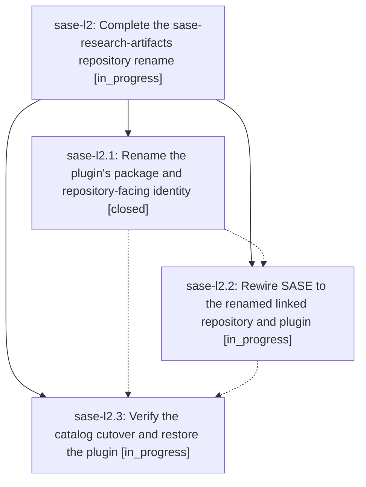

# Bead: sase-l2 — Complete the sase-research-artifacts repository rename

[Bead Pages](../README.md) / sase-l2

**Status:** ◐ in_progress · **Type:** ▸ plan · **Tier:** epic
**Owner:** `bryanbugyi34@gmail.com` · **Created by:** [bbugyi200.athena.zt](https://github.com/sase-org/sase--agents/blob/main/families/bbugyi200.athena.zt.md) · **Assignee:** `sase-l2.land`
**Created:** 2026-08-13 14:11:56 EDT
**Plan:** [202608/research\_artifacts\_rename.md](https://github.com/sase-org/sase--plans/blob/main/202608/research_artifacts_rename.md)

## Description

The renamed research-artifacts plugin has one coherent repository, distribution, module, release, catalog, and linked-repository identity; SASE still exposes the existing research artifact-reference, hook, and xprompt contracts; obsolete warnings that distinguish the plugin from the sase--research content sidecar are gone; and the renamed plugin is installable and verified under its new name.

## Phases

| Bead | Title | Status | Size | Created | Agents | Commits |
|---|---|---|---|---|---:|---:|
| [sase-l2.1](sase-l2.1.md) | Rename the plugin's package and repository-facing identity | ✓ closed | medium | 2026-08-13 | 1 | 0 |
| [sase-l2.2](sase-l2.2.md) | Rewire SASE to the renamed linked repository and plugin | ◐ in_progress | small | 2026-08-13 | 1 | 0 |
| [sase-l2.3](sase-l2.3.md) | Verify the catalog cutover and restore the plugin | ◐ in_progress | small | 2026-08-13 | 1 | 0 |

## Lineage

## Agents

| Agent | Bead | Commits |
|---|---|---:|
| [bbugyi200.athena.sase-l2.1](https://github.com/sase-org/sase--agents/blob/main/agents/bbugyi200.athena.sase-l2.1/README.md) | [sase-l2.1](sase-l2.1.md) | 0 |
| [bbugyi200.athena.sase-l2.2](https://github.com/sase-org/sase--agents/blob/main/agents/bbugyi200.athena.sase-l2.2/README.md) | [sase-l2.2](sase-l2.2.md) | 0 |
| [bbugyi200.athena.sase-l2.3](https://github.com/sase-org/sase--agents/blob/main/agents/bbugyi200.athena.sase-l2.3/README.md) | [sase-l2.3](sase-l2.3.md) | 0 |
| [bbugyi200.athena.sase-l2.land](https://github.com/sase-org/sase--agents/blob/main/agents/bbugyi200.athena.sase-l2.land/README.md) | [sase-l2](README.md) | 0 |
