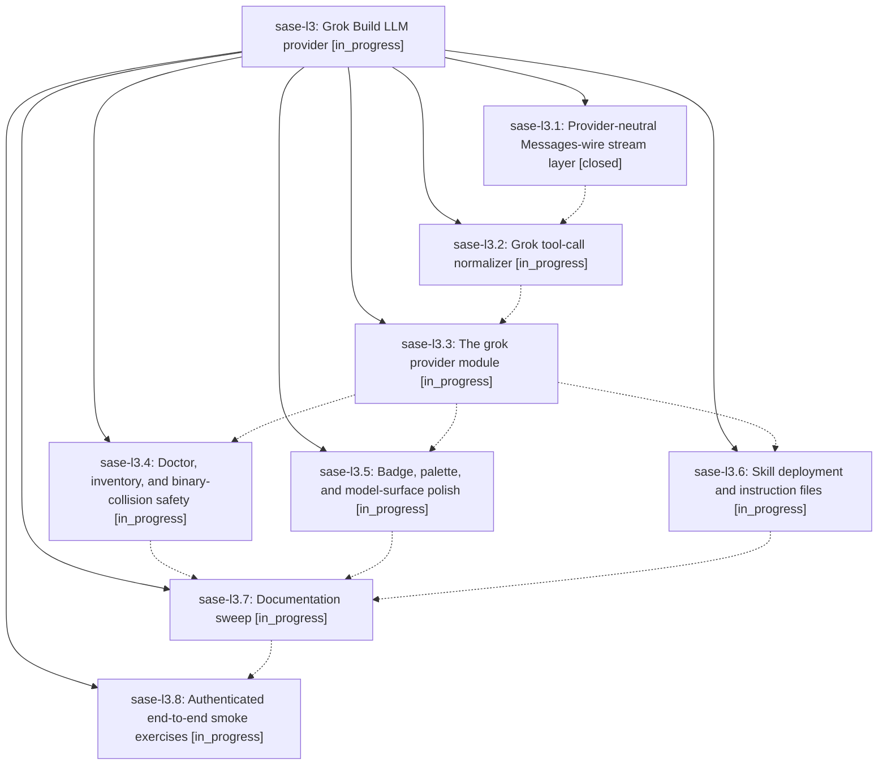

# Bead: sase-l3 — Grok Build LLM provider

[Bead Pages](../README.md) / sase-l3

**Status:** ◐ in_progress · **Type:** ▸ plan · **Tier:** epic
**Owner:** `bryanbugyi34@gmail.com` · **Created by:** [bbugyi200.athena.zu](https://github.com/sase-org/sase--agents/blob/main/families/bbugyi200.athena.zu.md) · **Assignee:** `sase-l3.land`
**Created:** 2026-08-13 14:40:33 EDT
**Plan:** [202608/grok\_provider.md](https://github.com/sase-org/sase--plans/blob/main/202608/grok_provider.md)

## Description

SASE gains a first-class `grok` LLM provider driving xAI's Grok Build CLI, supported everywhere the existing providers are — invocation, streaming text, reasoning pane, Tools panel, usage/cost accounting, doctor, agent-cli inventory and updates, model routing, skill deployment, TUI theming, and docs — with tool rows and reasoning that render as richly as Claude's rather than degrading to opaque key lists.

## Phases

| Bead | Title | Status | Size | Created | Agents | Commits |
|---|---|---|---|---|---:|---:|
| [sase-l3.1](sase-l3.1.md) | Provider-neutral Messages-wire stream layer | ✓ closed | medium | 2026-08-13 | 1 | 1 |
| [sase-l3.2](sase-l3.2.md) | Grok tool-call normalizer | ◐ in_progress | medium | 2026-08-13 | 1 | 0 |
| [sase-l3.3](sase-l3.3.md) | The grok provider module | ◐ in_progress | medium | 2026-08-13 | 1 | 0 |
| [sase-l3.4](sase-l3.4.md) | Doctor, inventory, and binary-collision safety | ◐ in_progress | small | 2026-08-13 | 1 | 0 |
| [sase-l3.5](sase-l3.5.md) | Badge, palette, and model-surface polish | ◐ in_progress | small | 2026-08-13 | 1 | 0 |
| [sase-l3.6](sase-l3.6.md) | Skill deployment and instruction files | ◐ in_progress | small | 2026-08-13 | 1 | 0 |
| [sase-l3.7](sase-l3.7.md) | Documentation sweep | ◐ in_progress | medium | 2026-08-13 | 1 | 0 |
| [sase-l3.8](sase-l3.8.md) | Authenticated end-to-end smoke exercises | ◐ in_progress | xsmall | 2026-08-13 | 1 | 0 |

## Lineage

## Agents

| Agent | Bead | Commits |
|---|---|---:|
| [bbugyi200.athena.sase-l3.1](https://github.com/sase-org/sase--agents/blob/main/families/bbugyi200.athena.sase-l3.1.md) | [sase-l3.1](sase-l3.1.md) | 1 |
| [bbugyi200.athena.sase-l3.2](https://github.com/sase-org/sase--agents/blob/main/agents/bbugyi200.athena.sase-l3.2/README.md) | [sase-l3.2](sase-l3.2.md) | 0 |
| [bbugyi200.athena.sase-l3.3](https://github.com/sase-org/sase--agents/blob/main/agents/bbugyi200.athena.sase-l3.3/README.md) | [sase-l3.3](sase-l3.3.md) | 0 |
| [bbugyi200.athena.sase-l3.4](https://github.com/sase-org/sase--agents/blob/main/agents/bbugyi200.athena.sase-l3.4/README.md) | [sase-l3.4](sase-l3.4.md) | 0 |
| [bbugyi200.athena.sase-l3.5](https://github.com/sase-org/sase--agents/blob/main/agents/bbugyi200.athena.sase-l3.5/README.md) | [sase-l3.5](sase-l3.5.md) | 0 |
| [bbugyi200.athena.sase-l3.6](https://github.com/sase-org/sase--agents/blob/main/agents/bbugyi200.athena.sase-l3.6/README.md) | [sase-l3.6](sase-l3.6.md) | 0 |
| [bbugyi200.athena.sase-l3.7](https://github.com/sase-org/sase--agents/blob/main/agents/bbugyi200.athena.sase-l3.7/README.md) | [sase-l3.7](sase-l3.7.md) | 0 |
| [bbugyi200.athena.sase-l3.8](https://github.com/sase-org/sase--agents/blob/main/agents/bbugyi200.athena.sase-l3.8/README.md) | [sase-l3.8](sase-l3.8.md) | 0 |
| [bbugyi200.athena.sase-l3.land](https://github.com/sase-org/sase--agents/blob/main/agents/bbugyi200.athena.sase-l3.land/README.md) | [sase-l3](README.md) | 0 |

## Commits

| Repo | Commit | Subject | Bead | Committed |
|---|---|---|---|---|
| sase--beads | [`sase--beads@db722fb`](https://github.com/sase-org/sase--beads/commit/db722fbec1a17d7e613e1649ac22fd6179664ffc) | chore(beads): publish sase-l6 plan records | [sase-l3.1](sase-l3.1.md) | 2026-08-13 15:31:38 EDT |
