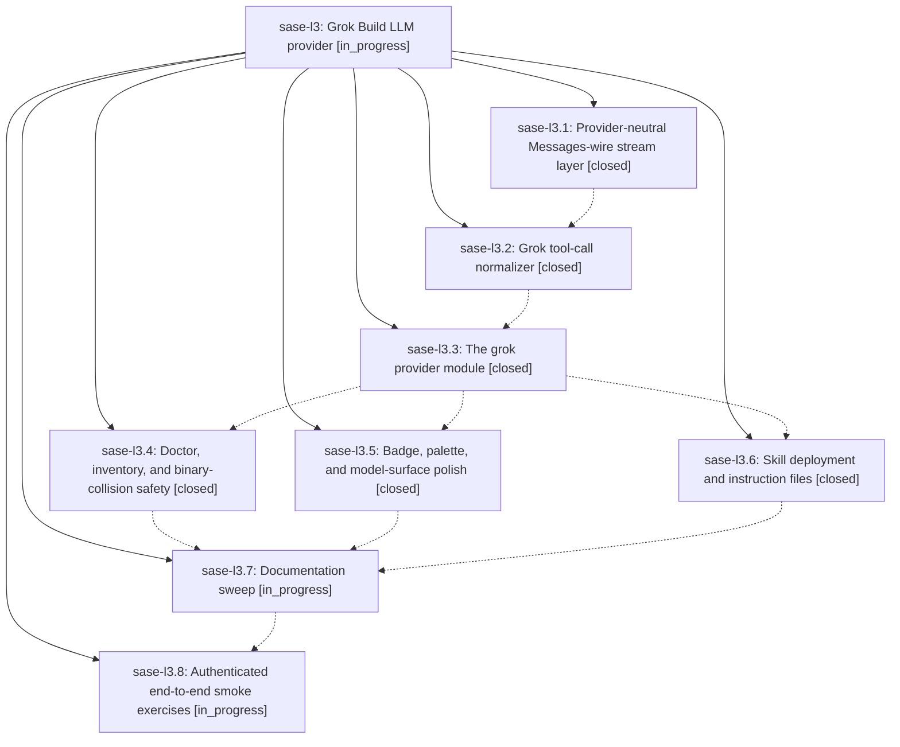

# Bead: sase-l3 — Grok Build LLM provider

[Bead Pages](../README.md) / sase-l3

**Status:** ◐ in_progress · **Type:** ▸ plan · **Tier:** epic
**Owner:** `bryanbugyi34@gmail.com` · **Created by:** [bbugyi200.athena.zu](https://github.com/sase-org/sase--agents/blob/main/families/bbugyi200.athena.zu.md) · **Assignee:** `sase-l3.land`
**Created:** 2026-08-13 14:40:33 EDT
**Plan:** [202608/grok\_provider.md](https://github.com/sase-org/sase--plans/blob/main/202608/grok_provider.md)

## Description

SASE gains a first-class `grok` LLM provider driving xAI's Grok Build CLI, supported everywhere the existing providers are — invocation, streaming text, reasoning pane, Tools panel, usage/cost accounting, doctor, agent-cli inventory and updates, model routing, skill deployment, TUI theming, and docs — with tool rows and reasoning that render as richly as Claude's rather than degrading to opaque key lists.

## Notes

[2026-08-13T20:22:58Z · sase-kz.land] DISCOVERED ISSUE: Proposed by sase-kz.8 during epic sase-kz landing, and independently reproduced by sase-kz.land at master 026de34f6 on a clean tree. `just _lint-symvision` fails repo-wide with exactly one finding: 'stream_and_parse_messages_json_output in src/sase/llm_provider/_subprocess_claude.py' (unused public function). Because symvision runs before the test lanes in both `just check` and `just check-full`, this blocks the whole-repo gate for every agent, not just this epic's. Causally owned here: phase sase-l3.1 (ad4ae62ae) introduced the symbol as a provider-parameterized seam and re-exported it from src/sase/llm_provider/_subprocess.py:50; its only current callers are _subprocess_claude.py:36 and tests/llm_provider/test_messages_wire.py. The second real consumer is phase sase-l3.3 (src/sase/llm_provider/grok.py), which is still in progress -- so the finding should clear on its own when l3.3 lands. If l3.3 will not consume it directly, the symvision decision hierarchy applies instead ('_'-prefix it, since today it is used only within _subprocess_claude.py plus the re-export). All other gates are green at 026de34f6: every other lint gate, SASE validation, committed-plan validation, and the full test suite (29682 passed, 10 skipped, exit 0).

[2026-08-13T21:28:55Z · toobig-2l.split_file.tests.monitor.test_monitor_store.0] DISCOVERED ISSUE: During unrelated monitor-store test-file splitting, all 28 affected tests collected but failed in shared setup because src/sase/llm_provider/_subprocess.py imports the absent public stream_and_parse_messages_json_output; _subprocess_claude.py now defines only the private _stream_and_parse_messages_json_output. Corroborated exact duplicate task sase-lg. This also belongs here because the regression is causally tied to phase sase-l3.1's provider-neutral stream layer and its collision with the private rename from sase-ld.

## Phases

| Bead | Title | Status | Size | Created | Agents | Commits |
|---|---|---|---|---|---:|---:|
| [sase-l3.1](sase-l3.1.md) | Provider-neutral Messages-wire stream layer | ✓ closed | medium | 2026-08-13 | 1 | 2 |
| [sase-l3.2](sase-l3.2.md) | Grok tool-call normalizer | ✓ closed | medium | 2026-08-13 | 1 | 1 |
| [sase-l3.3](sase-l3.3.md) | The grok provider module | ✓ closed | medium | 2026-08-13 | 1 | 1 |
| [sase-l3.4](sase-l3.4.md) | Doctor, inventory, and binary-collision safety | ✓ closed | small | 2026-08-13 | 1 | 1 |
| [sase-l3.5](sase-l3.5.md) | Badge, palette, and model-surface polish | ✓ closed | small | 2026-08-13 | 1 | 1 |
| [sase-l3.6](sase-l3.6.md) | Skill deployment and instruction files | ✓ closed | small | 2026-08-13 | 1 | 1 |
| [sase-l3.7](sase-l3.7.md) | Documentation sweep | ◐ in_progress | medium | 2026-08-13 | 1 | 0 |
| [sase-l3.8](sase-l3.8.md) | Authenticated end-to-end smoke exercises | ◐ in_progress | xsmall | 2026-08-13 | 1 | 0 |

## Lineage

## Agents

| Agent | Bead | Commits |
|---|---|---:|
| [bbugyi200.athena.sase-l3.1](https://github.com/sase-org/sase--agents/blob/main/families/bbugyi200.athena.sase-l3.1.md) | [sase-l3.1](sase-l3.1.md) | 2 |
| [bbugyi200.athena.sase-l3.2](https://github.com/sase-org/sase--agents/blob/main/agents/bbugyi200.athena.sase-l3.2/README.md) | [sase-l3.2](sase-l3.2.md) | 1 |
| [bbugyi200.athena.sase-l3.3](https://github.com/sase-org/sase--agents/blob/main/agents/bbugyi200.athena.sase-l3.3/README.md) | [sase-l3.3](sase-l3.3.md) | 1 |
| [bbugyi200.athena.sase-l3.4](https://github.com/sase-org/sase--agents/blob/main/agents/bbugyi200.athena.sase-l3.4/README.md) | [sase-l3.4](sase-l3.4.md) | 1 |
| [bbugyi200.athena.sase-l3.5](https://github.com/sase-org/sase--agents/blob/main/agents/bbugyi200.athena.sase-l3.5/README.md) | [sase-l3.5](sase-l3.5.md) | 1 |
| [bbugyi200.athena.sase-l3.6](https://github.com/sase-org/sase--agents/blob/main/agents/bbugyi200.athena.sase-l3.6/README.md) | [sase-l3.6](sase-l3.6.md) | 1 |
| [bbugyi200.athena.sase-l3.7](https://github.com/sase-org/sase--agents/blob/main/agents/bbugyi200.athena.sase-l3.7/README.md) | [sase-l3.7](sase-l3.7.md) | 0 |
| [bbugyi200.athena.sase-l3.8](https://github.com/sase-org/sase--agents/blob/main/agents/bbugyi200.athena.sase-l3.8/README.md) | [sase-l3.8](sase-l3.8.md) | 0 |
| [bbugyi200.athena.sase-l3.land](https://github.com/sase-org/sase--agents/blob/main/agents/bbugyi200.athena.sase-l3.land/README.md) | [sase-l3](README.md) | 0 |

## Commits

| Repo | Commit | Subject | Bead | Committed |
|---|---|---|---|---|
| sase | [`ad4ae62`](https://github.com/sase-org/sase/commit/ad4ae62aef705022872998254613c72e068a6d43) | feat(llm-provider): add provider-neutral messages parser | [sase-l3.1](sase-l3.1.md) | 2026-08-13 15:23:41 EDT |
| sase--beads | [`sase--beads@db722fb`](https://github.com/sase-org/sase--beads/commit/db722fbec1a17d7e613e1649ac22fd6179664ffc) | chore(beads): publish sase-l6 plan records | [sase-l3.1](sase-l3.1.md) | 2026-08-13 15:31:38 EDT |
| sase | [`4d36d6d`](https://github.com/sase-org/sase/commit/4d36d6d3d6632859ddc5cf78ab9f621f9cc92ccb) | feat: normalize Grok tool-call stream artifacts | [sase-l3.2](sase-l3.2.md) | 2026-08-13 17:04:01 EDT |
| sase | [`3085a0d`](https://github.com/sase-org/sase/commit/3085a0d287adadc52aa44a31cbd38896fe10fbc9) | feat(llm): add Grok provider | [sase-l3.3](sase-l3.3.md) | 2026-08-13 17:32:54 EDT |
| sase | [`fbcf643`](https://github.com/sase-org/sase/commit/fbcf64399ee06d516bc4298a22afe71956595bf0) | fix(doctor): flag grok executables that aren't Grok Build | [sase-l3.4](sase-l3.4.md) | 2026-08-13 17:53:42 EDT |
| sase | [`c1b2724`](https://github.com/sase-org/sase/commit/c1b2724a1fc46e264f1900395b2023644eb40552) | test: cover Grok skill deployment | [sase-l3.6](sase-l3.6.md) | 2026-08-13 18:06:36 EDT |
| sase | [`d9c685e`](https://github.com/sase-org/sase/commit/d9c685e86b808e481bb826e24ac7f0f27e91baa0) | feat: polish Grok provider presentation | [sase-l3.5](sase-l3.5.md) | 2026-08-13 18:17:52 EDT |
