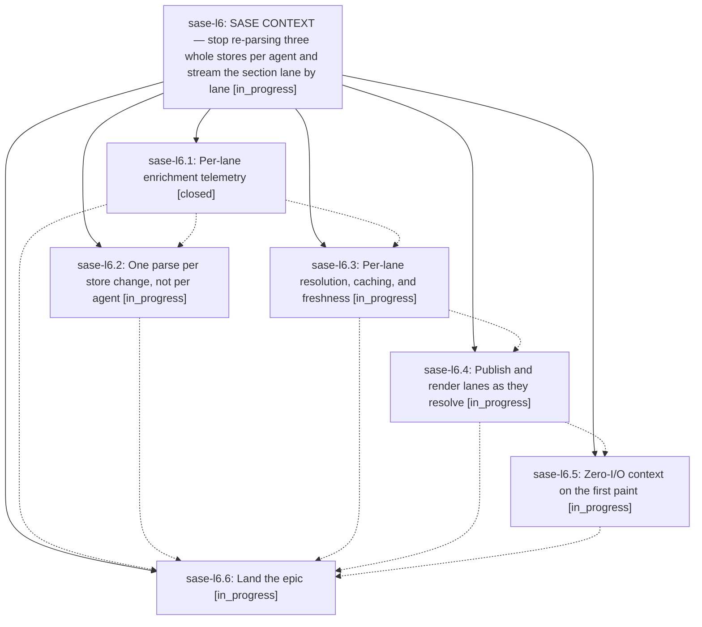

# Bead: sase-l6 — SASE CONTEXT — stop re-parsing three whole stores per agent and stream the section lane by lane

[Bead Pages](../README.md) / sase-l6

**Status:** ◐ in_progress · **Type:** ▸ plan · **Tier:** epic
**Owner:** `bryanbugyi34@gmail.com` · **Created by:** [bbugyi200.athena.zw](https://github.com/sase-org/sase--agents/blob/main/families/bbugyi200.athena.zw.md) · **Assignee:** `sase-l6.land`
**Created:** 2026-08-13 15:23:28 EDT
**Plan:** [202608/sase\_context\_incremental.md](https://github.com/sase-org/sase--plans/blob/main/202608/sase_context_incremental.md)

## Description

The SASE CONTEXT section in the Agents metadata panel shows commit context on the first paint and every remaining lane within a few tens of milliseconds instead of after one all-or-nothing enrichment pass, the per-agent cost stops scaling with the size of the artifact-file index and the memory/skill audit logs, and none of it moves work onto the Textual event loop.

## Phases

| Bead | Title | Status | Size | Created | Agents | Commits |
|---|---|---|---|---|---:|---:|
| [sase-l6.1](sase-l6.1.md) | Per-lane enrichment telemetry | ✓ closed | small | 2026-08-13 | 1 | 1 |
| [sase-l6.2](sase-l6.2.md) | One parse per store change, not per agent | ◐ in_progress | medium | 2026-08-13 | 1 | 0 |
| [sase-l6.3](sase-l6.3.md) | Per-lane resolution, caching, and freshness | ◐ in_progress | medium | 2026-08-13 | 1 | 0 |
| [sase-l6.4](sase-l6.4.md) | Publish and render lanes as they resolve | ◐ in_progress | medium | 2026-08-13 | 1 | 0 |
| [sase-l6.5](sase-l6.5.md) | Zero-I/O context on the first paint | ◐ in_progress | small | 2026-08-13 | 1 | 0 |
| [sase-l6.6](sase-l6.6.md) | Land the epic | ◐ in_progress | small | 2026-08-13 | 1 | 0 |

## Lineage

## Agents

| Agent | Bead | Commits |
|---|---|---:|
| [bbugyi200.athena.sase-l6.1](https://github.com/sase-org/sase--agents/blob/main/agents/bbugyi200.athena.sase-l6.1/README.md) | [sase-l6.1](sase-l6.1.md) | 1 |
| [bbugyi200.athena.sase-l6.2](https://github.com/sase-org/sase--agents/blob/main/agents/bbugyi200.athena.sase-l6.2/README.md) | [sase-l6.2](sase-l6.2.md) | 0 |
| [bbugyi200.athena.sase-l6.3](https://github.com/sase-org/sase--agents/blob/main/agents/bbugyi200.athena.sase-l6.3/README.md) | [sase-l6.3](sase-l6.3.md) | 0 |
| [bbugyi200.athena.sase-l6.4](https://github.com/sase-org/sase--agents/blob/main/agents/bbugyi200.athena.sase-l6.4/README.md) | [sase-l6.4](sase-l6.4.md) | 0 |
| [bbugyi200.athena.sase-l6.5](https://github.com/sase-org/sase--agents/blob/main/agents/bbugyi200.athena.sase-l6.5/README.md) | [sase-l6.5](sase-l6.5.md) | 0 |
| [bbugyi200.athena.sase-l6.6](https://github.com/sase-org/sase--agents/blob/main/agents/bbugyi200.athena.sase-l6.6/README.md) | [sase-l6.6](sase-l6.6.md) | 0 |
| [bbugyi200.athena.sase-l6.land](https://github.com/sase-org/sase--agents/blob/main/agents/bbugyi200.athena.sase-l6.land/README.md) | [sase-l6](README.md) | 0 |

## Commits

| Repo | Commit | Subject | Bead | Committed |
|---|---|---|---|---|
| sase | [`15cdba4`](https://github.com/sase-org/sase/commit/15cdba4aa619b0367d50a68c45efbe0761f600d3) | feat(ace): add per-lane trace spans for detail-header enrichment | [sase-l6.1](sase-l6.1.md) | 2026-08-13 16:02:19 EDT |
