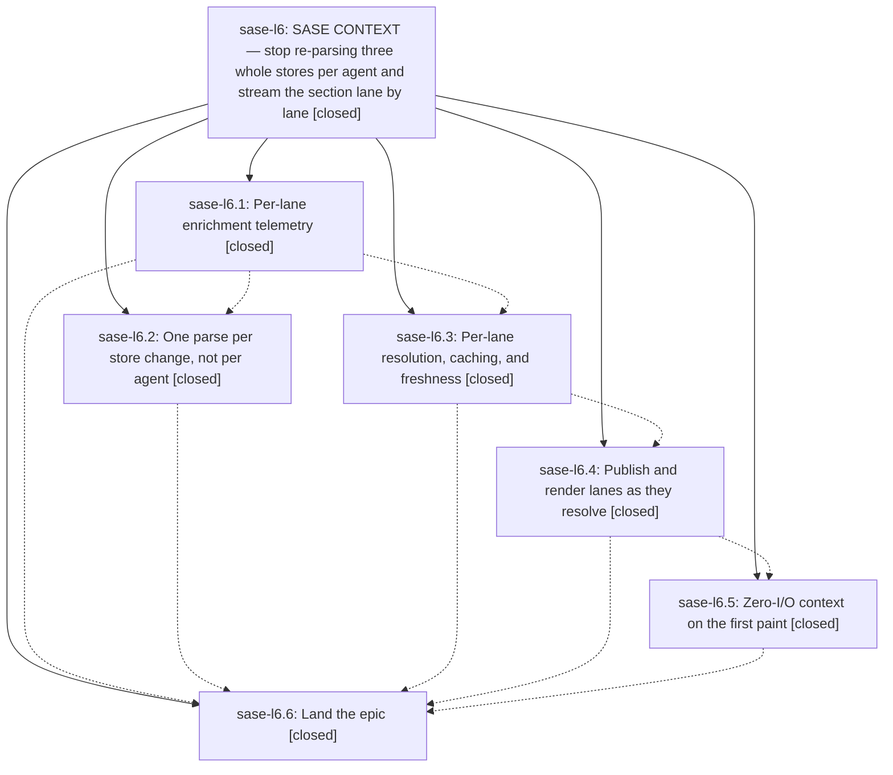

# Bead: sase-l6 — SASE CONTEXT — stop re-parsing three whole stores per agent and stream the section lane by lane

[Bead Pages](../README.md) / sase-l6

**Status:** ✓ closed · **Resolution:** done · **Type:** ▸ plan · **Tier:** epic
**Owner:** `bryanbugyi34@gmail.com` · **Created by:** [bbugyi200.athena.zw](https://github.com/sase-org/sase--agents/blob/main/families/bbugyi200.athena.zw.md) · **Assignee:** `sase-l6.land`
**Created:** 2026-08-13 15:23:28 EDT · **Closed:** 2026-08-14 08:39:01 EDT
**Plan:** [202608/sase\_context\_incremental.md](https://github.com/sase-org/sase--plans/blob/main/202608/sase_context_incremental.md)

## Description

The SASE CONTEXT section in the Agents metadata panel shows commit context on the first paint and every remaining lane within a few tens of milliseconds instead of after one all-or-nothing enrichment pass, the per-agent cost stops scaling with the size of the artifact-file index and the memory/skill audit logs, and none of it moves work onto the Textual event loop.

## Notes

[2026-08-14T12:39:01Z · sase-l6.land] LAND VERIFICATION (agent sase-l6.land, workspace sase_11, master HEAD d1e88155b).

1. PHASE VERIFICATION — read every child bead's notes and checked the claims against the
   actual source, not the reports:
   - sase-l6.1 (trace): parent span widget.prompt_panel.build_detail_header_summary plus
     one child span per resolver are present in _agent_display_header_summary.py; the
     cache_state marker, tests/perf/bench_detail_header_summary.py, the docs/perf_runbook.md
     section, and test_agent_display_header_summary_trace.py all exist as reported.
   - sase-l6.2 (stores): all three snapshot caches exist and are shaped as the plan asked —
     memory_reads.py/skill_uses.py hold per-project (mtime_ns, size)-keyed OrderedDict
     snapshots bounded at 8 projects with the per-agent result caches kept on top and the
     _MIN_REREAD_INTERVAL_S throttle intact; artifact_file_explicit.py holds a lock-guarded
     path+(mtime_ns,size)-keyed index cache bounded at 32 paths, returns a defensive copy,
     and invalidates explicitly from the write path.
   - sase-l6.3 (lanes): 9 DetailContextLane values, ready_lanes on DetailHeaderSummary,
     should_refresh_detail_header_summary returning a stale-lane frozenset, per-lane
     cadences (wait-beads no TTL, slow-tools 5 s, the rest 10 s, hint session widening to
     30 s) replacing the blanket 1 s, and merge-not-replace caching.
   - sase-l6.4 (stream): LANE_RESOLUTION_BATCHES with all 9 lanes in exactly one batch,
     _publish_partial_detail_header_summary via call_from_thread, the dim 'resolving…'
     pending affordance keyed off _LANE_LABEL_BACKING for all six CONTEXT_LANE_ORDER labels,
     and header_enrichment_pending redefined as 'not detail_header_summary_is_complete'.
   - sase-l6.5 (immediate): immediate_detail_header_summary() exists, is wired into
     update_header_only, is deliberately never written back to the widget cache, and the
     render gate is now 'summary is not None' rather than 'not cheap and ...'.
   - sase-l6.6 (land measurement): its re-measured table, target check, and follow-up
     filings are all corroborated — sase-lr/ls/lt/lu/lv/lw exist and are open, and the two
     +1 corroborations (sase-le, sase-lm) are recorded.

2. THREE UNMET PLAN DELIVERABLES FOUND AND CLOSED OUT BY THIS LAND PASS:
   a. Phase stream named 'Add a PNG snapshot for the partial state' — never done; sase-l6.4
      only confirmed the complete-state goldens were byte-identical. Added
      test_agents_partially_streamed_context_lanes_png_snapshot plus golden
      agents_partially_streamed_context_lanes_120x40.png. It withholds the memory and skills
      lanes through the existing _should_refresh_detail_header_summary patch point, so the
      enrichment worker still runs to completion (the page reaches visual idle) but the frame
      is the real mid-stream state: PLAN and ARTIFACTS resolved with content, MEMORY and
      SKILLS showing the dim 'resolving…' affordance, in stable CONTEXT_LANE_ORDER. Passed
      4/4 consecutive runs of just test-visual with exact pixel equality.
   b. Phase immediate named 'pytest -s -m slow tests/ace/tui/bench_tui_jk.py ... measure it,
      do not assume it' — never run; sase-l6.5 recorded no j/k figures. Ran it. The gate that
      phase immediate actually put at risk, test_bench_agents_jk_and_panel_navigation (the
      Agents-tab row j/k 16 ms budget), PASSES, as do the Patches, AXE, and clan-fold
      scenarios. test_bench_selected_tribe_jk_at_each_fold_level fails its 40 ms budget at
      fold level 1 (p95 46.7-55.5 ms, p50 28-34 ms, 3/3 runs) — established NOT caused by
      this epic by reverting ffa63b5ed and re-running: statistically identical (p95 46.2-53.1
      ms, 2/2 runs). Filed as sase-lx.
   c. Phase stores named an opened_workspaces.py audit with 'if it is already correct, say so
      in the close note' — sase-l6.2 never said so. Audited: it stats two per-agent marker
      files rather than parsing a shared append-only log, and already has mtime-keyed
      per-agent and per-context caches with the same throttle. Correct as the plan predicted;
      no change needed, and no shared snapshot applies because there is no shared file.

3. INTEGRATION — 37 non-epic commits landed between 15cdba4aa and HEAD. Reviewed all of them
   for overlap with what this epic added:
   - a9642c63c is the only non-epic commit touching the epic's source. It hardens
     sase-l6.1's cache_state marker so the trace cache is not mutated when tracing is off.
     Coherent with the epic's design and already on master; nothing to reconcile.
   - 9e8742b2b, 4d1d81423 and c24d6ede7 already split the epic's own tests into per-concern
     files (test_agent_context_lanes.py, test_agent_display_header_enrichment_lanes_async.py,
     test_memory_reads_loader_cache.py), so later work has already integrated with this epic.
   - c1970b5a0 made stream_and_parse_messages_json_output private, which is what actually
     resolved the sase-l6.2/sase-l6.3 follow-ups.
   - The Procs rename (62fb94129, a0e9ae4ed, 8ca241c59, 5ec926227, eca7753b5, 2b64c5582) is
     the largest post-epic change but touches only actions/agents/* in this area, nothing on
     the SASE CONTEXT enrichment or render path; no terminology or API drift to fix up.
   - 0083d1e10 and 10e33da42 changed monitor-row classification and Agent.is_monitor but not
     Agent.identity, which is the detail-header summary cache key, so cache invalidation is
     unaffected.
   - No commit since the epic added a second cache over the three stores or a competing
     lane/pending-affordance mechanism, and no new caller of build_detail_header_summary
     bypasses the lanes= API (the clan-aggregation caller still passes a narrowed set).

4. PROPOSED FOLLOW-UP OUTCOMES (every entry across all children):
   - sase-l6.1's stale --epic-symbol whitelist for closed bead sase-kz.5: ALREADY RESOLVED.
     Justfile's _lint-symvision recipe carries zero --epic-symbol entries today and this
     pass's own just check passed the symvision gate. No task.
   - sase-l6.2's and sase-l6.3's symvision unused-public stream_and_parse_messages_json_output:
     ALREADY RESOLVED by c1970b5a0; tracked and closed as task sase-ld. No new task.
   - sase-l6.4's order-dependent test_prompt_panel_header.py flake: duplicate of open task
     sase-le, already +1'd by sase-l6.6. No new task.
   - sase-l6.5's 'TaskSubmitError: task wire schema mismatch' (63 failures): duplicate of open
     task sase-lm, already +1'd by sase-l6.6. Not reproducing in this workspace today.
   - NEW from this pass: sase-lx (large, ready) — the selected-tribe j/k p95 budget failure
     above, with the ffa63b5ed A/B recorded as evidence that it is not this epic's, plus a
     RELATED note to closed sase-dx (same class of finding for the Artifacts scenario).
     Sized large rather than medium because the root cause is genuinely undetermined: the
     measuring host was loaded (load avg ~18, several 99%-CPU processes), so the bead's first
     step is an idle-host re-measure to decide real regression vs host sensitivity.

5. VERIFICATION: just check green at HEAD d1e88155b with the new test in the tree — fmt
   (python+markdown), keep-sorted, ruff, mypy, pyscripts, test-waits, changelog,
   patch/stitch terminology, symvision, toobig, SASE validation, committed plans, and the
   scoped test lane all pass. just test-visual green 4/4 on the new snapshot. The
   core-floor probe's stale_actionable advisory is the already-tracked sase-lm floor lag,
   not a gate failure. The new test and golden are in the land agent's working tree for the
   run finalizer to commit; every other artifact described above is already on master.

[2026-08-14T12:40:44Z · sase-l6.land] Land verification: all six children closed done; verified each child note against source (trace spans, three snapshot caches, 9 DetailContextLane values with per-lane TTLs, LANE_RESOLUTION_BATCHES with resolving pending affordance, immediate_detail_header_summary). Closed out three unmet plan deliverables as epic work: added the phase-stream partial-state PNG snapshot test plus golden (green 4/4 at exact pixel equality); ran phase-immediate's j/k gate (Agents j/k, Patches, AXE, clan-fold all pass; selected-tribe p95 failure proved pre-existing by reverting ffa63b5ed); audited opened_workspaces.py (mtime-keyed caches already correct, no change needed). Integration: reviewed 37 non-epic commits since epic start; only a9642c63c touches epic source (coherent trace cache-state hardening), no duplication or conflict. Follow-ups: symvision proposals already resolved on master, flake and schema-mismatch proposals already corroborated onto sase-le and sase-lm, new task sase-lx filed for the selected-tribe p95 regression. just check green; post-close just symvision clean.

## Phases

| Bead | Title | Status | Size | Created | Agents | Commits |
|---|---|---|---|---|---:|---:|
| [sase-l6.1](sase-l6.1.md) | Per-lane enrichment telemetry | ✓ closed | small | 2026-08-13 | 1 | 1 |
| [sase-l6.2](sase-l6.2.md) | One parse per store change, not per agent | ✓ closed | medium | 2026-08-13 | 1 | 1 |
| [sase-l6.3](sase-l6.3.md) | Per-lane resolution, caching, and freshness | ✓ closed | medium | 2026-08-13 | 1 | 1 |
| [sase-l6.4](sase-l6.4.md) | Publish and render lanes as they resolve | ✓ closed | medium | 2026-08-13 | 1 | 1 |
| [sase-l6.5](sase-l6.5.md) | Zero-I/O context on the first paint | ✓ closed | small | 2026-08-13 | 1 | 1 |
| [sase-l6.6](sase-l6.6.md) | Land the epic | ✓ closed | small | 2026-08-13 | 1 | 0 |

## Lineage

## Agents

| Agent | Bead | Commits |
|---|---|---:|
| [bbugyi200.athena.sase-l6.1](https://github.com/sase-org/sase--agents/blob/main/agents/bbugyi200.athena.sase-l6.1/README.md) | [sase-l6.1](sase-l6.1.md) | 1 |
| [bbugyi200.athena.sase-l6.2](https://github.com/sase-org/sase--agents/blob/main/agents/bbugyi200.athena.sase-l6.2/README.md) | [sase-l6.2](sase-l6.2.md) | 1 |
| [bbugyi200.athena.sase-l6.3](https://github.com/sase-org/sase--agents/blob/main/agents/bbugyi200.athena.sase-l6.3/README.md) | [sase-l6.3](sase-l6.3.md) | 1 |
| [bbugyi200.athena.sase-l6.4](https://github.com/sase-org/sase--agents/blob/main/agents/bbugyi200.athena.sase-l6.4/README.md) | [sase-l6.4](sase-l6.4.md) | 1 |
| [bbugyi200.athena.sase-l6.5](https://github.com/sase-org/sase--agents/blob/main/agents/bbugyi200.athena.sase-l6.5/README.md) | [sase-l6.5](sase-l6.5.md) | 1 |
| [bbugyi200.athena.sase-l6.6](https://github.com/sase-org/sase--agents/blob/main/agents/bbugyi200.athena.sase-l6.6/README.md) | [sase-l6.6](sase-l6.6.md) | 0 |
| [bbugyi200.athena.sase-l6.land](https://github.com/sase-org/sase--agents/blob/main/agents/bbugyi200.athena.sase-l6.land/README.md) | [sase-l6](README.md) | 2 |

## Commits

| Repo | Commit | Subject | Bead | Committed |
|---|---|---|---|---|
| sase | [`15cdba4`](https://github.com/sase-org/sase/commit/15cdba4aa619b0367d50a68c45efbe0761f600d3) | feat(ace): add per-lane trace spans for detail-header enrichment | [sase-l6.1](sase-l6.1.md) | 2026-08-13 16:02:19 EDT |
| sase | [`093088a`](https://github.com/sase-org/sase/commit/093088abb9ed95e592b190778f420d654374b1b8) | perf: cache shared store snapshots | [sase-l6.2](sase-l6.2.md) | 2026-08-13 16:23:25 EDT |
| sase | [`932277b`](https://github.com/sase-org/sase/commit/932277b2691a35c3f2a5dee2257b205679585d13) | refactor(ace): split detail-header summary into per-lane resolution and caching | [sase-l6.3](sase-l6.3.md) | 2026-08-13 16:55:01 EDT |
| sase | [`4ff3a41`](https://github.com/sase-org/sase/commit/4ff3a41619fa3e9d1b075cb363e0b020cbdf6b4a) | feat(ace): stream SASE CONTEXT lanes cheapest-first as they resolve | [sase-l6.4](sase-l6.4.md) | 2026-08-13 18:15:52 EDT |
| sase | [`ffa63b5`](https://github.com/sase-org/sase/commit/ffa63b5edd65fe1e45ee2aee41c9a3b554f5f95f) | feat(ace): paint SASE CONTEXT commit lane on first frame, zero I/O | [sase-l6.5](sase-l6.5.md) | 2026-08-13 18:45:08 EDT |
| sase | [`443566f`](https://github.com/sase-org/sase/commit/443566f7d058562d01111f63c904aa084059c2a4) | test(ace): pin the mid-stream SASE CONTEXT frame with a PNG snapshot | [sase-l6](README.md) | 2026-08-14 08:42:13 EDT |
| sase--plans | [`sase--plans@ccdd981`](https://github.com/sase-org/sase--plans/commit/ccdd981c88021be0e21be082dd110de851dd10c7) | chore: mark the SASE CONTEXT streaming epic plan done | [sase-l6](README.md) | 2026-08-14 08:43:50 EDT |
