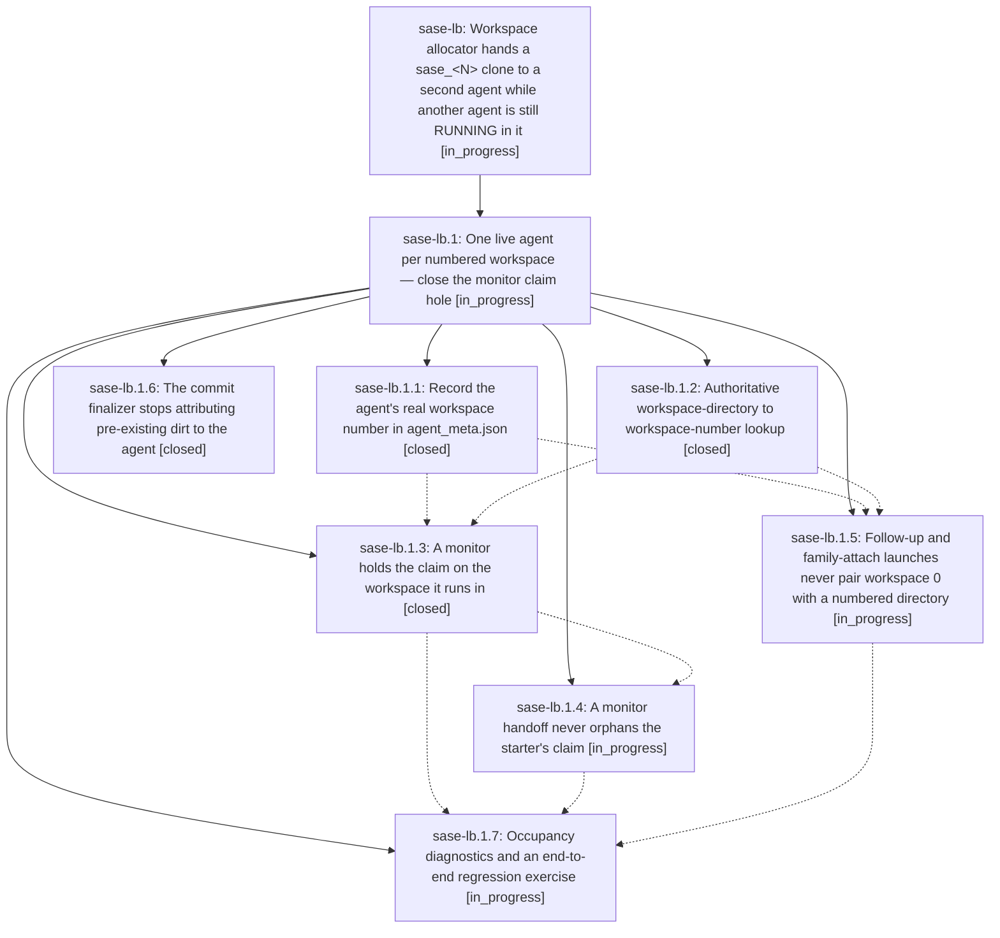

# Bead: sase-lb — Workspace allocator hands a sase\_\<N\> clone to a second agent while another agent is still RUNNING in it

[Bead Pages](../README.md) / sase-lb

**Status:** ◐ in_progress · **Type:** ◆ task
**Owner:** `bryanbugyi34@gmail.com` · **Created by:** [bbugyi200.athena.sase-l2.land--1](https://github.com/sase-org/sase--agents/blob/main/families/bbugyi200.athena.sase-l2.land.md) · **Assignee:** `015` · **Size:** large
**Created:** 2026-08-13 15:43:31 EDT

## Description

Proposed by epic bead sase-l2 (land agent sase-l2.land) during the sase-l2 landing.

REPRODUCTION (observed live, 2026-08-13 ~19:40 UTC):
- Land agent sase-l2.land was allocated /home/bryan/.local/state/sase/workspaces/sase-org/sase/sase_14.
- Concurrently, phase worker sase-l6.1 was RUNNING (duration 426s) with workspace_num=14 in `sase agent list -j`.
- Confirmed not by the ws column alone but directly from the OS: `readlink /proc/2140006/cwd` (PID 2140006 = agent sase-l6.1, status RUNNING) resolved to exactly /home/bryan/.local/state/sase/workspaces/sase-org/sase/sase_14 — byte-identical to the land agent's cwd.
- Both agents are the same project (gh_sase-org__sase), so this is not a per-project numbering coincidence.

IMPACT:
sase-l6.1's in-flight, uncommitted edit to src/sase/ace/tui/widgets/prompt_panel/_agent_display_header_summary.py (tui_trace instrumentation, docstring self-attributed to 'bead sase-l6.1') was visible in the land agent's working tree from the very first git status of its session. This tripped the land agent's post-completion commit finalizer twice (pass 1 of 2 and pass 2 of 2). The finalizer's pass-2 text states the run fails unless the listed changes are committed, so the failure mode this creates is an agent committing another bead's incomplete, unverified, in-flight work under an unrelated landing commit — and racing the owning agent's own commit workflow. The land agent correctly declined, but only because the change happened to self-identify its bead in a docstring; a change without that tell would be far harder to attribute.

SCOPE:
Workspace allocation must not hand a sase_<N> directory to a second agent while another agent is still RUNNING in it. Investigate the allocator's liveness check (a stale-lock/PID-liveness gap, or allocation keyed on something other than 'currently running' is the likely root cause) and decide whether the fix is exclusive leasing, a liveness probe before reuse, or per-agent workspaces. Consider also hardening the commit finalizer so a dirty path that predates the agent's own session is not attributed to it.

## Notes

[2026-08-13T19:44:02Z · sase-l2.land--1] RELATED: sase-hc — 'sase commit's before-commit hook closes a phase bead while its agent is still working' is the same class of defect (SASE acting on a resource whose owning agent is still live); its liveness-check approach may be reusable here.

[2026-08-13T19:44:23Z · sase-l2.land--1] RELATED: sase-l6.1 — the concurrently-RUNNING phase worker whose in-flight edit surfaced this. Its uncommitted change was deliberately left untouched by sase-l2.land; sase-l6.1 owns and will commit it.

## Lineage

## Agents

| Agent | Bead | Commits |
|---|---|---:|
| [bbugyi200.athena.sase-lb.1.1](https://github.com/sase-org/sase--agents/blob/main/agents/bbugyi200.athena.sase-lb.1.1/README.md) | [sase-lb.1.1](sase-lb.1.1.md) | 1 |
| [bbugyi200.athena.sase-lb.1.2](https://github.com/sase-org/sase--agents/blob/main/agents/bbugyi200.athena.sase-lb.1.2/README.md) | [sase-lb.1.2](sase-lb.1.2.md) | 1 |
| [bbugyi200.athena.sase-lb.1.3](https://github.com/sase-org/sase--agents/blob/main/agents/bbugyi200.athena.sase-lb.1.3/README.md) | [sase-lb.1.3](sase-lb.1.3.md) | 1 |
| [bbugyi200.athena.sase-lb.1.4](https://github.com/sase-org/sase--agents/blob/main/agents/bbugyi200.athena.sase-lb.1.4/README.md) | [sase-lb.1.4](sase-lb.1.4.md) | 0 |
| [bbugyi200.athena.sase-lb.1.5](https://github.com/sase-org/sase--agents/blob/main/agents/bbugyi200.athena.sase-lb.1.5/README.md) | [sase-lb.1.5](sase-lb.1.5.md) | 0 |
| [bbugyi200.athena.sase-lb.1.6](https://github.com/sase-org/sase--agents/blob/main/agents/bbugyi200.athena.sase-lb.1.6/README.md) | [sase-lb.1.6](sase-lb.1.6.md) | 1 |
| [bbugyi200.athena.sase-lb.1.7](https://github.com/sase-org/sase--agents/blob/main/agents/bbugyi200.athena.sase-lb.1.7/README.md) | [sase-lb.1.7](sase-lb.1.7.md) | 0 |
| [bbugyi200.athena.sase-lb.1.land](https://github.com/sase-org/sase--agents/blob/main/agents/bbugyi200.athena.sase-lb.1.land/README.md) | [sase-lb.1](sase-lb.1.md) | 0 |

## Commits

| Repo | Commit | Subject | Bead | Committed |
|---|---|---|---|---|
| sase | [`a720153`](https://github.com/sase-org/sase/commit/a7201532bc3c67245d3331359aeaa3c934a4c2e7) | fix: persist claimed workspace number in agent metadata | [sase-lb.1.1](sase-lb.1.1.md) | 2026-08-14 11:44:27 EDT |
| sase | [`8a0fd07`](https://github.com/sase-org/sase/commit/8a0fd07a062b87ecce619d4779a8707631d5cf81) | feat(workspace\_provider): add directory-to-workspace-number lookup helper | [sase-lb.1.2](sase-lb.1.2.md) | 2026-08-14 11:46:39 EDT |
| sase | [`645875d`](https://github.com/sase-org/sase/commit/645875d536b9f5f92f0b9fc59eda28e0b2640aa4) | fix(llm\_provider): stop attributing pre-existing dirt to the agent | [sase-lb.1.6](sase-lb.1.6.md) | 2026-08-14 12:00:26 EDT |
| sase | [`631701d`](https://github.com/sase-org/sase/commit/631701dd44ebd60e5eb9b84b8dac56a6ce7093b9) | fix(monitor): claim the command workspace on start | [sase-lb.1.3](sase-lb.1.3.md) | 2026-08-14 12:07:34 EDT |
