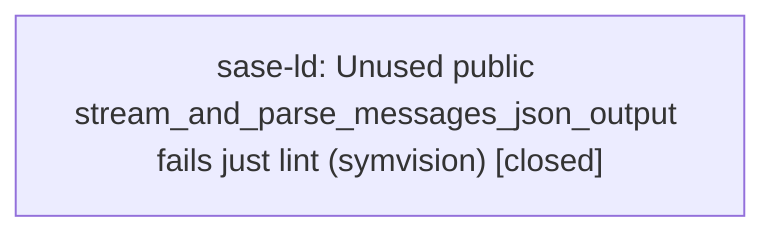

# Bead: sase-ld — Unused public stream\_and\_parse\_messages\_json\_output fails just lint (symvision)

[Bead Pages](../README.md) / sase-ld

**Status:** ✓ closed · **Resolution:** done · **Type:** ◆ task · **+1 reports:** +1
**Owner:** `bryanbugyi34@gmail.com` · **Created by:** [bbugyi200.athena.zy](https://github.com/sase-org/sase--agents/blob/main/families/bbugyi200.athena.zy.md) · **Assignee:** `sase-ld` · **Size:** small
**Created:** 2026-08-13 16:25:47 EDT · **Closed:** 2026-08-13 16:50:08 EDT

## Description

just check's lint (symvision) step fails on a clean master checkout (verified via git stash with no other changes applied) with: 'Unused public functions/classes... stream_and_parse_messages_json_output in src/sase/llm_provider/_subprocess_claude.py'. Command: SASE_SYMVISION_BEAD_STATUS_ONLY=1 BD_COMMAND=tools/sase_bead .venv/bin/symvision src/sase --exclude-decorator gate_command_entrypoint --exclude-decorator builtin_chop. This blocks just check for every agent in this repo until resolved. Fix by making the function private if only used within its own file, deleting it if genuinely unused, or adding a symvision allowlist/pragma if it is a false positive (e.g. used only via dynamic dispatch or from tests). Discovered while implementing the phantom_starting_agent_rows plan and running just check on an otherwise-unrelated diff.

## Notes

[2026-08-13T20:50:08Z · sase-ld] Renamed stream_and_parse_messages_json_output to _stream_and_parse_messages_json_output in _subprocess_claude.py (only used internally by stream_and_parse_json_output in the same file); updated the private re-export/__all__ in _subprocess.py and the test import in tests/llm_provider/test_messages_wire.py. Verified: grep confirms no remaining references to the old public name; just install + just check pass, including lint (symvision) and the scoped test lane (237/2604 files selected, all green).

## +1 Evidence

> **+1** by `zz` · 2026-08-13 16:31:41 EDT
> **Observed since:** 2026-08-13 16:25:34 EDT
>
> Independently reproduced while implementing the silent_monitors plan: git stash to a clean master (093088abb) checkout and the symvision gate fails identically on stream_and_parse_messages_json_output in src/sase/llm_provider/_subprocess_claude.py, confirming it's unrelated to my monitor-notification changes.

## Lineage

## Agents

| Agent | Bead | Commits |
|---|---|---:|
| [bbugyi200.athena.sase-ld](https://github.com/sase-org/sase--agents/blob/main/agents/bbugyi200.athena.sase-ld/README.md) | [sase-ld](README.md) | 1 |

## Commits

| Repo | Commit | Subject | Bead | Committed |
|---|---|---|---|---|
| sase | [`c1970b5`](https://github.com/sase-org/sase/commit/c1970b5a0b826738883c2fbed902a0e012b30ba0) | fix(llm\_provider): make stream\_and\_parse\_messages\_json\_output private | [sase-ld](README.md) | 2026-08-13 16:51:07 EDT |
