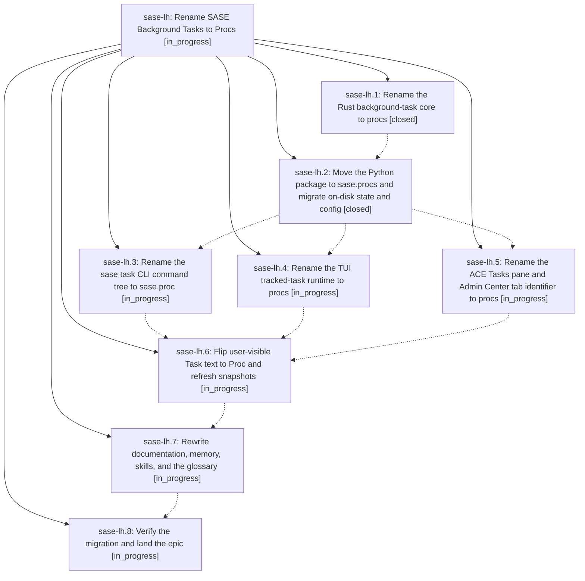

# Bead: sase-lh — Rename SASE Background Tasks to Procs

[Bead Pages](../README.md) / sase-lh

**Status:** ◐ in_progress · **Type:** ▸ plan · **Tier:** epic
**Owner:** `bryanbugyi34@gmail.com` · **Created by:** [bbugyi200.athena.000](https://github.com/sase-org/sase--agents/blob/main/families/bbugyi200.athena.000.md) · **Assignee:** `sase-lh.land`
**Created:** 2026-08-13 17:18:18 EDT
**Plan:** [202608/background\_tasks\_to\_procs.md](https://github.com/sase-org/sase--plans/blob/main/202608/background_tasks_to_procs.md)

## Description

SASE's durable background-execution feature is named **Proc** end to end — Rust wire types and bindings, the `sase.procs` Python package, the `sase proc` CLI (with `task` kept as a legacy alias), the ACE Procs tab and proc indicator, the `procs.history_limit` config key, the `~/.sase/procs/procs.jsonl` store, docs, memory, skills, and the project glossary — while task beads, asyncio/Textual worker tasks, and the Muse `task.lifecycle.*` provider protocol keep the word "task" untouched.

## Notes

[2026-08-13T23:04:51Z · sase-l1.land] DISCOVERED ISSUE (from sase-l1 land agent, 2026-08-13): now that sase-lh.1 is closed, the linked sase-core checkout builds task wire schema 2 (procs) while this repo's Python still pins TASK_WIRE_SCHEMA_VERSION = 1, so every workspace that runs 'just install' then 'just check' is red with 63 failures across tests/main/test_task_handler_{list,run,show}.py, tests/test_tasks_facade.py, tests/test_tasks_runner.py, tests/ace/tui/test_task_mirror.py, and tests/ace/tui/test_tasks_store_rows.py. Representative error: 'ValueError: task wire schema mismatch: got 2, expected 1' from src/sase/tasks/models.py:_require_schema via src/sase/tasks/store.py:85. Reproduced on clean master (d9c685e86, verified via git stash), so it is not any one agent's diff. sase-lh.2 closes the gap; until it lands, other epics' land agents cannot get a green 'just check' and have to triage these 63 by hand.

## Phases

| Bead | Title | Status | Size | Created | Agents | Commits |
|---|---|---|---|---|---:|---:|
| [sase-lh.1](sase-lh.1.md) | Rename the Rust background-task core to procs | ✓ closed | medium | 2026-08-13 | 1 | 1 |
| [sase-lh.2](sase-lh.2.md) | Move the Python package to sase.procs and migrate on-disk state and config | ✓ closed | medium | 2026-08-13 | 1 | 1 |
| [sase-lh.3](sase-lh.3.md) | Rename the sase task CLI command tree to sase proc | ◐ in_progress | medium | 2026-08-13 | 1 | 0 |
| [sase-lh.4](sase-lh.4.md) | Rename the TUI tracked-task runtime to procs | ◐ in_progress | medium | 2026-08-13 | 1 | 0 |
| [sase-lh.5](sase-lh.5.md) | Rename the ACE Tasks pane and Admin Center tab identifier to procs | ◐ in_progress | medium | 2026-08-13 | 1 | 0 |
| [sase-lh.6](sase-lh.6.md) | Flip user-visible Task text to Proc and refresh snapshots | ◐ in_progress | medium | 2026-08-13 | 1 | 0 |
| [sase-lh.7](sase-lh.7.md) | Rewrite documentation, memory, skills, and the glossary | ◐ in_progress | medium | 2026-08-13 | 1 | 0 |
| [sase-lh.8](sase-lh.8.md) | Verify the migration and land the epic | ◐ in_progress | small | 2026-08-13 | 1 | 0 |

## Lineage

## Agents

| Agent | Bead | Commits |
|---|---|---:|
| [bbugyi200.athena.sase-lh.1](https://github.com/sase-org/sase--agents/blob/main/agents/bbugyi200.athena.sase-lh.1/README.md) | [sase-lh.1](sase-lh.1.md) | 1 |
| [bbugyi200.athena.sase-lh.2](https://github.com/sase-org/sase--agents/blob/main/agents/bbugyi200.athena.sase-lh.2/README.md) | [sase-lh.2](sase-lh.2.md) | 1 |
| [bbugyi200.athena.sase-lh.3](https://github.com/sase-org/sase--agents/blob/main/agents/bbugyi200.athena.sase-lh.3/README.md) | [sase-lh.3](sase-lh.3.md) | 0 |
| [bbugyi200.athena.sase-lh.4](https://github.com/sase-org/sase--agents/blob/main/agents/bbugyi200.athena.sase-lh.4/README.md) | [sase-lh.4](sase-lh.4.md) | 0 |
| [bbugyi200.athena.sase-lh.5](https://github.com/sase-org/sase--agents/blob/main/agents/bbugyi200.athena.sase-lh.5/README.md) | [sase-lh.5](sase-lh.5.md) | 0 |
| [bbugyi200.athena.sase-lh.6](https://github.com/sase-org/sase--agents/blob/main/agents/bbugyi200.athena.sase-lh.6/README.md) | [sase-lh.6](sase-lh.6.md) | 0 |
| [bbugyi200.athena.sase-lh.7](https://github.com/sase-org/sase--agents/blob/main/agents/bbugyi200.athena.sase-lh.7/README.md) | [sase-lh.7](sase-lh.7.md) | 0 |
| [bbugyi200.athena.sase-lh.8](https://github.com/sase-org/sase--agents/blob/main/agents/bbugyi200.athena.sase-lh.8/README.md) | [sase-lh.8](sase-lh.8.md) | 0 |
| [bbugyi200.athena.sase-lh.land](https://github.com/sase-org/sase--agents/blob/main/agents/bbugyi200.athena.sase-lh.land/README.md) | [sase-lh](README.md) | 0 |

## Commits

| Repo | Commit | Subject | Bead | Committed |
|---|---|---|---|---|
| sase-core | [`sase-core@c69a2f8`](https://github.com/sase-org/sase-core/commit/c69a2f885b327f92c55687defd23c577dfe74f70) | feat(core)!: rename background task core to procs | [sase-lh.1](sase-lh.1.md) | 2026-08-13 18:02:21 EDT |
| sase | [`62fb941`](https://github.com/sase-org/sase/commit/62fb94129662db94663cf5156c09e87223af4068) | refactor(procs): move sase.tasks to sase.procs and migrate on-disk state | [sase-lh.2](sase-lh.2.md) | 2026-08-13 20:11:56 EDT |
