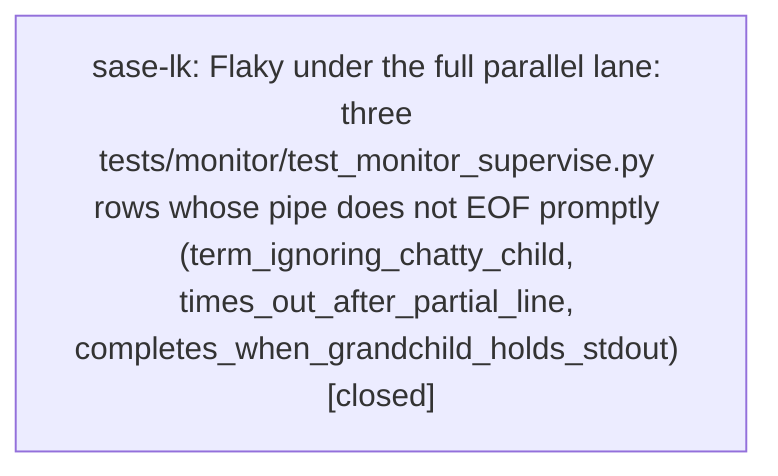

# Bead: sase-lk — Flaky under the full parallel lane: three tests/monitor/test\_monitor\_supervise.py rows whose pipe does not EOF promptly (term\_ignoring\_chatty\_child, times\_out\_after\_partial\_line, completes\_when\_grandchild\_holds\_stdout)

[Bead Pages](../README.md) / sase-lk

**Status:** ✓ closed · **Resolution:** done · **Type:** ◆ task · **+1 reports:** +4 · **↺ Reopened:** ↺1
**Owner:** `bryanbugyi34@gmail.com` · **Created by:** [bbugyi200.athena.sase-ku.land](https://github.com/sase-org/sase--agents/blob/main/agents/bbugyi200.athena.sase-ku.land/README.md) · **Assignee:** `sase-lk` · **Size:** large
**Created:** 2026-08-13 19:13:10 EDT · **Closed:** 2026-08-15 18:22:10 EDT

## Previously Closed

> ↺ Closed 2026-08-14T14:45:20Z · canceled
>
> Not among the flakes currently blocking the check-full gate; closing stale flake reports in favor of live ones.
>
> Reopened 2026-08-15T13:07:02Z by a +1 from @sase-m6.6.1.5

## Description

Filed by the sase-ku land agent. These three tests were added by epic sase-ku phase sase-ku.2 (commit afa8178ce, 'fix(monitor): decouple supervisor waits from output reads'). They pass reliably in isolation and in the monitor-only suite but fail intermittently in other agents' full parallel lanes, where they trip 'just check-full''s 'just selection-health --fail-on-new-flake' gate.

EVIDENCE (from ~/.sase/test-selection/gh_sase-org__sase full-run records, 892 records scanned):
- test_run_supervisor_escalates_term_ignoring_chatty_child: 9 failures
- test_run_supervisor_completes_when_grandchild_holds_stdout: 10 failures
- test_run_supervisor_times_out_after_partial_line: 4 failures
All 23 fall between 2026-08-13T16:47Z and 2026-08-13T19:04Z, across workspaces sase_10/12/13/14/16/17 and heads bd6167875cc8, 29cb7924a87d, a7433cfe70a4, 3bb9bd1d1c35, 6d21fbbef36a, cbd47ed11055. Three of those runs failed ONLY these nodes (18:38:31Z ws=sase_16, 3 monitor failures and nothing else; 18:53:53Z ws=sase_16, 1; 19:04:22Z ws=sase_17, 1 plus one unrelated), so they are genuine standalone flakes, not collateral of the SDD/plan_show cluster that was failing in the same window. Corroborated by three independent agent reports on epic sase-ku (2026-08-13T16:51:04Z zl.w0, 17:56:14Z zs, 18:39:23Z zr) and one on sase-l1.3 (18:09:41Z). Every reported failure passed immediately on a serial rerun.

NOT REPRODUCED LOCALLY: at master d9c685e86 in workspace sase_19 the land agent ran the full 'just test' lane (29,721 passed, 10 skipped, 642s, 14 workers) with ZERO monitor failures, plus ~70 targeted attempts -- serial, xdist -n 14, and under 3.3x CPU oversubscription (load average 210 on 64 cores) -- all green. Slowest node under that load was 0.83s against a 5.0s bound.

DIAGNOSTIC NARROWING (hypothesis, not confirmed): all three flaky rows assert 'elapsed < _NO_HANG_TIMEOUT' where _NO_HANG_TIMEOUT = 5.0 (tests/monitor/test_monitor_supervise.py:27), and all three are rows where the output pipe does NOT reach EOF promptly when run_supervisor() closes it -- a lingering grandchild holds the write end, or ~64 KiB is still buffered from a chatty child. BoundedLogPipe.close() (src/sase/logs/pipe.py:74-86) does 'self._thread.join(timeout=5)', i.e. exactly the tests' no-hang budget, so a drain thread that is slow to exit can consume the whole assertion budget by itself. The one sibling row that never flakes, test_run_supervisor_times_out_after_child_closes_stdio, is precisely the one whose child closes stdout/stderr so the pipe EOFs immediately and the join returns at once. A second, independent fragility in the same code: _drain() checks _close_deadline_reached() at the TOP of its loop (pipe.py:91), so a drain thread descheduled across the supervisor's close_drain_seconds=0.5 budget (supervise.py:170) breaks out WITHOUT reading data that is already readable -- silent loss of the tail of a monitored command's output, which also explains the content assertions ('partial', 'parent done') if it is the real cause.

SCOPE: reproduce first (running the monitor supervisor tests concurrently with a full lane in another workspace is the closest known condition), then fix the underlying fragility rather than only widening the bounds. Candidate fixes: drain everything currently readable before honoring the close deadline; decouple the tests' no-hang bound from BoundedLogPipe.close()'s join timeout; and reconsider the 0.2s total-timeout budgets, which race /bin/sh spawn latency under load. Confirm afterwards that the nodes drop out of the reproducible-flake set (see 'just selection-health --explain').

## Notes

[2026-08-13T23:14:00Z · sase-ku.land] RELATED: sase-lf — 'Flaky test_start_monitor_promotes_a_bare_lane_and_runs_to_completion under check-full's flake-baseline gate' is the same gate and the same test package, but a different node with a different (already-fixed) root cause: its 14 flake records all predate sase-ku.4's settlement-ordering fix, so that bead is about reconciling stale baseline records, while this one is about live, still-occurring failures.

[2026-08-13T23:14:36Z · sase-ku.land] RELATED: sase-lc and sase-jq — both concern the reproducible-flake gate's evidence handling (dirty-workspace audit failures, and long-lived flake records blocking the baseline). A fix here should reduce this bead's records at the source rather than by adjusting the baseline.

[2026-08-14T14:45:20Z · 013] Triage sweep 2026-08-14 (master 443566f7d, workspace sase_13). Ran 'tools/selection_health --fail-on-new-flake' against the durable store (901 scoped + 922 full-lane records, 30-day retention). It names exactly 12 reproducible flakes exceeding tests/reproducible_flake_baseline.txt, and none of these beads' nodes are among them: not test_agents_slow_tool_calls_fold_levels_png_snapshots (sase-cx), not the four test_ace_png_snapshots_agents_retry_e2e.py nodes (sase-dc), and not the three tests/monitor/test_monitor_supervise.py rows (sase-lk, whose nodes still exist and still collect). sase-cx and sase-dc were single unreproduced full-suite observations from 2026-07-31/08-01. The live gate debt is tracked by sase-jq (5 of the 12 nodes) and sase-lc (the dirty-workspace mechanism). Refile with a +1 carrying a fresh failing record if any of these resurfaces.

[2026-08-15T22:22:10Z · sase-lk] Fixed BoundedLogPipe.close() to join for close_drain_seconds plus a 0.1s scheduling allowance instead of a fixed 5s, and to ingest any immediately readable bytes before honoring the close deadline. Monitor and proc supervisors already pass close_drain_seconds=0.5; no call-site API change.

Verified:
- tests/logs/test_pipe.py (callback error, leftover writer, readable-after-deadline, delayed drain) passed, including 20 serial repeats
- test_run_supervisor_times_out_after_partial_line, test_run_supervisor_completes_when_grandchild_holds_stdout, and test_run_supervisor_escalates_term_ignoring_chatty_child: 15 serial + 10 parallel (-n 8) repeats all passed; full monitor supervise file also passed
- just install + just check: all lint gates green; scoped selection escalated to the full fast suite (core-identity-changed from just install, then serial-budget) and that full-run recorded 0 failures (sase_12 2026-08-15T22:18:57Z, changed files were only pipe.py + the two test files)
- just selection-health --fail-on-new-flake still lists historical times_out_after_partial_line debt (last live failure 2026-08-15T13:04Z on an unrelated sase_11 change set). No new full-lane failure of any of the three sase-lk nodes after this patch. term_ignoring_chatty_child remains on the committed baseline as prior sase-lk debt.

Did not launch a second just check-full: just check already executed the escalated full suite successfully.

[2026-08-15T22:23:37Z · sase-lk] BoundedLogPipe.close() now joins for close_drain_seconds plus 0.1s allowance and ingests already-readable bytes before giving up. Verified: tests/logs/test_pipe.py (including 20 serial repeats); the three sase-lk monitor nodes (times_out_after_partial_line, grandchild-held stdout, term_ignoring_chatty_child) 15 serial + 10 parallel (-n 8); just install + just check (lint green; scoped selection escalated to the full fast suite with 0 failures); just selection-health --fail-on-new-flake with no new full-lane failure of these nodes after the patch. Historical times_out_after_partial_line records remain; term_ignoring_chatty_child is still on the committed baseline as prior sase-lk debt.

## +1 Evidence

> **+1** by `sase-m6.6.1.5` · 2026-08-15 09:07:02 EDT
> **Observed since:** 2026-08-15 09:07:02 EDT
>
> Reproduced today (2026-08-15) in workspace sase_11: tests/monitor/test_monitor_supervise.py::test_run_supervisor_times_out_after_partial_line failed once under just check's full parallel test-scoped run (TimeoutError waiting for proc), then passed on immediate isolated rerun. Discovered incidentally while landing unrelated work on bead sase-m6.6.1.5; confirmed via git diff --stat that nothing in this session touches src/sase/monitor or src/sase/logs/pipe.py.

> **+1** by `sase-m9.2.1.6.land--2` · 2026-08-15 13:43:56 EDT
> **Observed since:** 2026-08-15 13:39:36 EDT
>
> Independent reproduction while landing proc-shell repair on 2026-08-15: monitored just check-full rerun 9av81rgjvjy1 reached the selection-health gate and failed with tests/monitor/test_monitor_supervise.py::test_run_supervisor_times_out_after_partial_line still above tests/reproducible_flake_baseline.txt. The rerun did not show a live pytest assertion failure for this node; this checkout was clean before the rerun and the proc-shell repair diff does not touch tests/monitor/test_monitor_supervise.py or src/sase/logs/pipe.py. This corroborates the existing reopened monitor-supervise full-lane/pass-isolation flake debt rather than a new task.

> **+1** by `sase-mc.land` · 2026-08-15 16:06:33 EDT
> **Observed since:** 2026-08-15 15:45:30 EDT
>
> Independent recurrence proposed by phase sase-mc.4 during provider-disable landing: just selection-health --fail-on-new-flake reported tests/monitor/test_monitor_supervise.py::test_run_supervisor_times_out_after_partial_line. The provider-disable diff does not touch monitor supervision.

> **+1** by `sase-m7--2` · 2026-08-15 17:34:35 EDT
> **Observed since:** 2026-08-15 17:30:28 EDT
>
> Independent gate recurrence during sase-m7 verification on 2026-08-15: just selection-health --fail-on-new-flake still reports tests/monitor/test_monitor_supervise.py::test_run_supervisor_times_out_after_partial_line above the reproducible-flake baseline. The preceding 30,491-pass test-cost lane did not fail this node, and the sase-m7 diff only scrubs ambient console-color variables from pytest, so this remains the existing full-parallel/pass-isolation monitor-supervise debt.

## Lineage

## Agents

| Agent | Bead | Commits |
|---|---|---:|
| [bbugyi200.athena.sase-lk](https://github.com/sase-org/sase--agents/blob/main/families/bbugyi200.athena.sase-lk.md) | [sase-lk](README.md) | 1 |

## Commits

| Repo | Commit | Subject | Bead | Committed |
|---|---|---|---|---|
| sase | [`b569cbd`](https://github.com/sase-org/sase/commit/b569cbdc2488b21320d6ca6aaffbf701fb9089d0) | fix(logs): bound pipe close to the drain budget | [sase-lk](README.md) | 2026-08-15 18:25:17 EDT |
