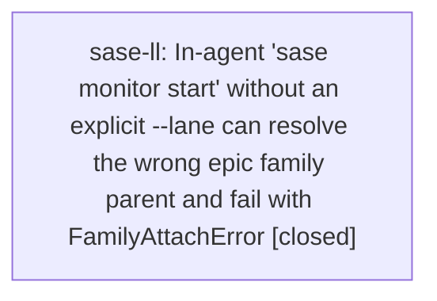

# Bead: sase-ll — In-agent 'sase monitor start' without an explicit --lane can resolve the wrong epic family parent and fail with FamilyAttachError

[Bead Pages](../README.md) / sase-ll

**Status:** ✓ closed · **Resolution:** done · **Type:** ◆ task · **+1 reports:** +6 · **↺ Reopened:** ↺1
**Owner:** `bryanbugyi34@gmail.com` · **Created by:** [bbugyi200.athena.sase-ku.land](https://github.com/sase-org/sase--agents/blob/main/agents/bbugyi200.athena.sase-ku.land/README.md) · **Assignee:** `sase-ll` · **Size:** large
**Created:** 2026-08-13 19:15:54 EDT · **Closed:** 2026-08-15 16:05:04 EDT

## Previously Closed

> ↺ Closed 2026-08-14T14:47:20Z · canceled
>
> Deprioritized in the 2026-08-14 task-backlog triage: monitor lane/claim ergonomics with documented workarounds, closed in favor of the cross-agent corruption and gate-blocking defects.
>
> Reopened 2026-08-14T16:54:16Z by a +1 from @sase-lz.land

## Description

Proposed by epic sase-ku phase sase-ku.10 (End-to-end hardening exercises) as a PROPOSED FOLLOW-UP on 2026-08-13T17:31:20Z; filed by the sase-ku land agent. No duplicate found by search or by the one-week task sweep.

SYMPTOM: running 'sase monitor start --command "just check-full" ...' from inside the real agent on lane sase-ku.10, with no explicit --lane, failed before launch with:
  FamilyAttachError: Cannot create agent family `sase-ku`: resolved parent is named `sase-ku.4`
Retrying with an explicit '--lane sase-ku.10' got past this failure (it then hit the separate claim-transfer defect tracked by sase-lj).

IMPACT: the documented ergonomic path -- an epic phase agent handing a long command to /sase_monitor from its own lane -- can hard-fail before the command runs. Every phase agent in an epic family is exposed, and the workaround (always pass --lane explicitly) is not what docs/monitors.md or the sase_monitor skill tell agents to do.

SCOPE: work out how the implicit lane is derived for an in-agent start and why, on an epic-phase lane, it resolves a family parent belonging to a sibling phase (sase-ku.4) rather than the caller's own lane (sase-ku.10). Start from resolve_lane()/the durable-lane derivation in src/sase/monitor/start.py and the family-attach path that raises FamilyAttachError. Decide whether the implicit lane should be taken from the caller's own SASE_AGENT_NAME/artifacts rather than from a lane-wide newest-member lookup, and cover the epic-phase-lane case with a regression test. If the correct answer is that --lane is required in an epic family, that must be enforced with a clear error and documented in docs/monitors.md and the sase_monitor skill source instead of surfacing as FamilyAttachError.

## Notes

[2026-08-13T23:16:32Z · sase-ku.land] RELATED: sase-lj — the same exercise sequence hit both defects back to back on lane sase-ku.10; sase-lj is the claim-transfer failure that appears after this one is worked around with an explicit --lane. Both live in src/sase/monitor/start.py's lane/starter resolution, so the fixes may collide.

[2026-08-14T14:47:20Z · 013] Triage sweep 2026-08-14 (requested by the project owner: keep the seven highest-impact open tasks, close the rest). Each has a workaround or limited blast radius: sase-lj and sase-ll both fail loudly at start and both clear with an explicit --lane, and master has since landed a run of monitor claim/startup hardening (a54aec6ab transactional startup, 90b26289f claim-transfer follow-up preservation, b4542139a supervisor-ack gating, 3bb9bd1d1 stale-running claim release, 29cb7924a dead-supervisor reconcile); sase-kr is a missing smoke harness for a path that already has unit coverage. sase-lf IS still live -- test_start_monitor_promotes_a_bare_lane_and_runs_to_completion is one of the 12 reproducible flakes exceeding the baseline today -- but it is a single node against sase-jq's five and sase-lc's whole-mechanism fix, both of which stay open. Re-file sase-lj/sase-ll with a +1 if either recurs after the hardening, and sase-lf if it blocks a landing on its own.

[2026-08-15T20:06:17Z · sase-ll] Implicit sase monitor start now pins to the exact caller artifact and durable family metadata. default_caller/resolve_exact_agent select SASE_AGENT_NAME without agent_family_base collapse; start inherits workspace/model/parent from that artifact; lock/replay/fingerprint use the durable family. Focused store/start/CLI regressions cover sase-m6.6.1.5 vs sibling/land and 02i--code vs newer settled monitor. just check lint gates passed; scoped tests escalated to the full suite (core-identity-changed): 30316 passed, 116 failed — FORCE_COLOR Rich assertions already tracked by sase-m7; no monitor test failed.

## +1 Evidence

> **+1** by `sase-ky.land` · 2026-08-13 20:08:59 EDT
> **Observed since:** 2026-08-13 19:29:33 EDT
>
> Independent reproduction by epic sase-ky's phase agents (two separate lanes, distinct from the sase-ku.10 report). Phase sase-ky.4 ran 'sase monitor start --command "just check" --reason ... --timeout 45m --next ...' with no explicit --lane from its own phase lane and got: sase.agent._family_attach_types.FamilyAttachError: Cannot create agent family 'sase-ky': resolved parent is named 'sase-ky.5'. Note the resolved parent (sase-ky.5, the epic's land phase) is NOT the caller's lane (sase-ky.4) and was not even the newest-started member at that moment -- it is the epic's currently-assigned child, which strengthens sase-ll's hypothesis that the implicit lane comes from a family/epic-wide lookup rather than the caller's own SASE_AGENT_NAME. Phase sase-ky.5 hit the same failure from its own lane and filed the same PROPOSED FOLLOW-UP independently. IMPACT: both agents fell back to running the long command inline, which is exactly what /sase_monitor and CLAUDE.md tell agents not to do for 'just check-full'.

> **+1** by `sase-lz.land` · 2026-08-14 12:54:16 EDT
> **Observed since:** 2026-08-14 12:54:16 EDT
>
> Proposing bead sase-lz.4 independently reproduced this exact defect after sase-ll was closed and after the monitor/workspace hardening commits on current master. At 2026-08-14T16:42:20Z, running 'sase monitor start --command "just check" ...' without an explicit --lane from phase lane sase-lz.4 failed with FamilyAttachError: Cannot create agent family 'sase-lz': resolved parent is named 'sase-lz.4' (src/sase/agent/_family_promotion.py:131 via monitor/start.py _resolve_lane_start). The phase had to run just install/just check inline, defeating the required monitor handoff workflow.

> **+1** by `sase-m6.3` · 2026-08-14 19:31:30 EDT
> **Observed since:** 2026-08-14 18:02:14 EDT
>
> Independent reproduction while implementing bead sase-m6.3 (plan sase/repos/plans/202608/artifact_entry_identity.md), an epic phase whose land/parent bead is sase-m6.10. Running 'sase monitor start --command "just check-full" --reason ... --timeout 45m --next ...' with no explicit --lane failed twice in a row (not transient) with: sase.agent._family_attach_types.FamilyAttachError: Cannot create agent family 'sase-m6': resolved parent is named 'sase-m6.10'. Traceback: main/monitor_handler.py -> monitor/start.py:_resolve_lane_start -> agent/_family_promotion.py:promote_agent_to_family (raises at line 131). Same shape as the sase-ku/sase-ky/sase-lz reports: the implicit lane resolves to a sibling/land phase rather than the caller's own lane. Had to fall back to running just check-full directly (inline) instead of through the monitor, defeating the documented workflow. Did not retry with an explicit --lane.

> **+1** by `sase-m9.2.1.land` · 2026-08-15 10:18:51 EDT
> **Observed since:** 2026-08-15 10:10:40 EDT
>
> PROPOSED FOLLOW-UP disposition from phase sase-m9.2.1.5, independently reproduced during landing audit at current master 6683d4bcc: agent_family_base('sase-m9.2.1.5') returns 'sase-m9.2.1' because the legacy numeric feedback suffix parser consumes '.5', while default_lane() returns agent_family_base(name) or name. This causes implicit sase monitor start to target the epic parent instead of the phase agent and matches sase-ll exactly; explicit --agent/--lane remains the workaround. Proposed by sase-m9.2.1.5.

> **+1** by `02q` · 2026-08-15 15:14:21 EDT
> **Observed since:** 2026-08-15 15:08:17 EDT
>
> Independent 2026-08-15 reproduction from agent family 02i after the monitor/proc hardening work. An implicit 'sase monitor start' invoked by current agent 02i--code collapsed SASE_AGENT_NAME through default_lane() to family base '02i'; resolve_lane() then selected the newer settled member 02i--mon-6 instead of the caller. Monitor 02i--mon-7 consequently inherited parent_timestamp=20260815142728 (02i--mon-6) and workspace_num=0/workspace_dir=/home/bryan/projects/github/sase-org/sase, so 'just check-full' ran against the primary checkout rather than caller workspace 12. Its generated follow-up used '#fork:02i--mon-6' and failed before the LLM turn because agent_chat_from_name reported no chat history for that monitor member, leaving the requested recovery action undone. Artifacts: 20260815142728 (wrong selected parent), 20260815145438 (monitor), 20260815145837 (failed follow-up). Static repro on current tree: default_lane({'SASE_AGENT_NAME':'sase-m6.6.1.5'}) returns 'sase-m6.6.1', and default_lane({'SASE_AGENT_NAME':'02i--code'}) returns '02i'. This is the exact sase-ll root cause but broadens impact from fail-loud FamilyAttachError to silent wrong-workspace execution plus dropped continuation.

> **+1** by `sase-mc.land` · 2026-08-15 16:03:27 EDT
> **Observed since:** 2026-08-15 15:45:30 EDT
>
> Proposing bead sase-mc.4 independently reproduced the exact implicit-lane monitor startup defect during provider-disable integration on 2026-08-15: from phase agent sase-mc.4, 'sase monitor start' failed before launch with 'Cannot create agent family sase-mc: resolved parent is named sase-mc.4', preventing the required check-full handoff. This matches sase-ll's root cause and is unrelated to provider disabling; explicit-lane/inline verification was the only workaround.

## Lineage

## Agents

| Agent | Bead | Commits |
|---|---|---:|
| [bbugyi200.athena.sase-ll](https://github.com/sase-org/sase--agents/blob/main/families/bbugyi200.athena.sase-ll.md) | [sase-ll](README.md) | 1 |

## Commits

| Repo | Commit | Subject | Bead | Committed |
|---|---|---|---|---|
| sase | [`0b465a3`](https://github.com/sase-org/sase/commit/0b465a39c31d55f64a087123b68ff33ad50a5b04) | fix(monitor): pin implicit starts to the calling agent | [sase-ll](README.md) | 2026-08-15 16:07:07 EDT |
