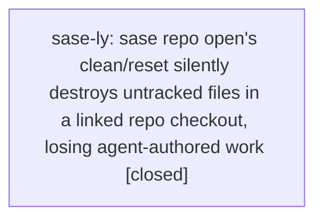

# Bead: sase-ly — sase repo open's clean/reset silently destroys untracked files in a linked repo checkout, losing agent-authored work

[Bead Pages](../README.md) / sase-ly

**Status:** ✓ closed · **Resolution:** done · **Type:** ◆ task
**Owner:** `bryanbugyi34@gmail.com` · **Created by:** [bbugyi200.athena.research.0i.final](https://github.com/sase-org/sase--agents/blob/main/agents/bbugyi200.athena.research.0i.final/README.md) · **Assignee:** `sase-ly` · **Size:** large
**Created:** 2026-08-14 09:14:25 EDT · **Closed:** 2026-08-14 11:16:40 EDT

## Description

REPRODUCTION (2026-08-14, host project gh_sase-org__sase, linked repo 'research'):

Research clan research.0i dispatched two agents with the same prompt, which told each to write a report under $(sase repo path research --ensure)/$(date +%Y%m)/. Both chose the same filename.

- research.0i.cdx (codex/gpt-5.6-sol) ran in workspace sase_10 and wrote
  sase_10/sase/repos/research/202608/supergrok_subscription_tiers.md at 12:57:45Z.
- At 13:04:09Z, during its OWN commit finalizer, cdx invoked 'sase repo open research'.
  That command cleans the linked-repo checkout and resets it to origin/main. The report
  was still untracked, so the clean DELETED IT.
- The finalizer then recorded, in
  artifacts/ace-run/202608/14/20260814084958/commit_finalizer_result.json:
  {"changed_files": [], "reason": "clean_after_pass", "status": "finalized"}
- cdx then reported commit 21654c8 as its own. That commit is research.0i.cld's
  (authored [bbugyi200.athena.research.0i.cld][1]). cdx committed nothing.

The work is UNRECOVERABLE. Confirmed exhausted:
- git fsck --dangling / --lost-found: empty (checkout is a fresh clone; the file never
  entered any object store). git stash and reflog: clone-only.
- tool_calls.jsonl records the Write call but only as a summary with
  'content_length: 0' -- no content is captured.
- codex_thinking.jsonl: 0 bytes. No commit_diff.diff for that run. No rendered
  markdown_pdfs/ for that run (only for cld's).

IMPACT
An agent that writes a file into a linked repo checkout and then opens that same repo
(exactly what the /sase_repo skill instructs it to do before committing) destroys its
own uncommitted work, silently, and then reports success. This is not specific to
research clans -- any agent that produces a file in a linked repo and follows the
mandatory /sase_repo workflow before committing is exposed. The failure is invisible:
the finalizer's empty diff looks identical to 'nothing to do'.

SCOPE / DESIGN QUESTIONS FOR THE WORKER
- 'sase repo open' should not silently discard untracked files. Options: refuse to clean
  when the checkout has untracked/modified paths and report them; stash and report;
  preserve untracked files across the reset; or clean only when the caller explicitly
  asks. Pick one and make the default non-destructive.
- The finalizer should distinguish 'clean because nothing was written' from 'clean
  because a reset discarded what was written', and must not let an agent report a commit
  hash it did not author (cdx reported another agent's HEAD as its own).
- Separately, the multi-agent research prompt template points concurrent agents at the
  same output path in a shared linked repo. Even with the clean fixed, two agents writing
  one path race. Consider per-agent filenames or per-agent checkouts.

DISCOVERED BY the lead researcher consolidating that clan's reports; the loss was found
because only one of the two expected reports existed.

## Notes

[2026-08-14T13:14:44Z · research.0i.final] RELATED: sase-lb — 'Workspace allocator hands a sase_<N> clone to a second agent while another agent is still RUNNING in it'. Same family of concurrent-agent workspace-safety defects; a fix that makes repo open non-destructive should be checked against the allocator's reuse behavior.

[2026-08-14T13:14:57Z · research.0i.final] RELATED: sase-ln — 'sase stitch create's _stage_all_except swept a concurrent agent's uncommitted work into an unrelated commit'. The mirror-image defect on the commit side (one agent's uncommitted work absorbed rather than destroyed); both stem from shared checkouts treating another actor's uncommitted files as free to act on.

[2026-08-14T13:15:08Z · research.0i.final] RELATED: sase-g5 (closed) — traced an agents-sidecar manifest truncation to vcs_clean_workspace (git reset --hard HEAD + git clean -fd) followed by a branch checkout, running against a clone shared by all sase_<N> workspaces. Same destructive clean primitive, different call site and different repo; that bead's reflog-signature analysis is a useful starting point.

[2026-08-14T15:16:40Z · sase-ly] Implemented repo-open/finalizer safety fix. Non-destructive reopen coverage: dirty tracked and untracked files survive `sase repo open`, the checkout is still audited/recorded, and the runner preparation helper is skipped for `repo open` while deprecated `workspace open` retains the old preparation behavior. Finalizer coverage: reset/deletion without a commit now fails with `dirty_work_discarded`, a foreign-agent commit does not satisfy clean-after-pass when current agent provenance is available, and a valid current-agent commit still finalizes successfully. Adjusted existing finalizer success fixtures to make real commits instead of simulating success by deleting or reverting dirty files. Routed the independent concurrent research same-output-path race as ready follow-up task `sase-m0`. Verification: `just install`; focused pytest set covering repo-open and finalizer regressions passed (55 tests); `just _lint-symvision` passed after the private evidence-type fix; `just check` passed.

[2026-08-14T15:17:52Z · sase-ly] Implemented repo open safety and commit finalizer lost-work detection; verified with just install, focused pytest set (55 passed), just _lint-symvision, and just check.

## References

- file:explicit:b2230a5f3dd3fdc68b2d523d

## Lineage

## Agents

| Agent | Bead | Commits |
|---|---|---:|
| [bbugyi200.athena.sase-ly](https://github.com/sase-org/sase--agents/blob/main/families/bbugyi200.athena.sase-ly.md) | [sase-ly](README.md) | 1 |

## Commits

| Repo | Commit | Subject | Bead | Committed |
|---|---|---|---|---|
| sase | [`21633ba`](https://github.com/sase-org/sase/commit/21633ba1bf044b08bd3bf8dcc4e225e8e81a6d77) | fix: protect dirty work during repo open and finalization | [sase-ly](README.md) | 2026-08-14 11:19:29 EDT |
