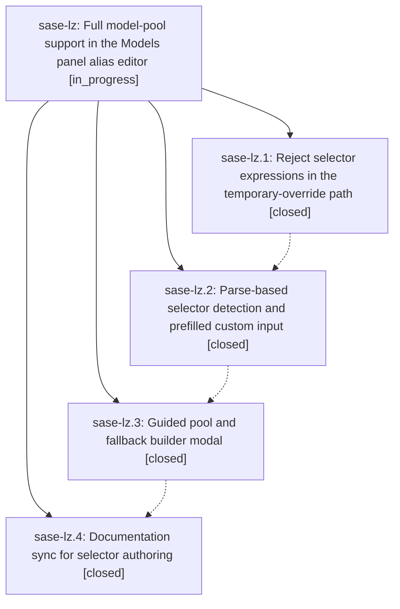

# Bead: sase-lz — Full model-pool support in the Models panel alias editor

[Bead Pages](../README.md) / sase-lz

**Status:** ◐ in_progress · **Type:** ▸ plan · **Tier:** epic
**Owner:** `bryanbugyi34@gmail.com` · **Created by:** [bbugyi200.athena.014](https://github.com/sase-org/sase--agents/blob/main/families/bbugyi200.athena.014.md) · **Assignee:** `sase-lz.land`
**Created:** 2026-08-14 10:49:15 EDT
**Plan:** [202608/models\_panel\_pool\_authoring.md](https://github.com/sase-org/sase--plans/blob/main/202608/models_panel_pool_authoring.md)

## Description

Model alias definitions overridden from the ACE Models panel can specify round-robin pools and ordered fallback chains through a guided, keyboard-driven builder instead of hand-typed free text, the temporary-override path refuses selector expressions instead of silently persisting a corrupted single target, and the docs describe the shipped behavior.

## Phases

| Bead | Title | Status | Size | Created | Agents | Commits |
|---|---|---|---|---|---:|---:|
| [sase-lz.1](sase-lz.1.md) | Reject selector expressions in the temporary-override path | ✓ closed | small | 2026-08-14 | 1 | 1 |
| [sase-lz.2](sase-lz.2.md) | Parse-based selector detection and prefilled custom input | ✓ closed | small | 2026-08-14 | 1 | 1 |
| [sase-lz.3](sase-lz.3.md) | Guided pool and fallback builder modal | ✓ closed | medium | 2026-08-14 | 1 | 1 |
| [sase-lz.4](sase-lz.4.md) | Documentation sync for selector authoring | ✓ closed | small | 2026-08-14 | 1 | 1 |

## Lineage

## Agents

| Agent | Bead | Commits |
|---|---|---:|
| [bbugyi200.athena.sase-lz.1](https://github.com/sase-org/sase--agents/blob/main/agents/bbugyi200.athena.sase-lz.1/README.md) | [sase-lz.1](sase-lz.1.md) | 1 |
| [bbugyi200.athena.sase-lz.2](https://github.com/sase-org/sase--agents/blob/main/agents/bbugyi200.athena.sase-lz.2/README.md) | [sase-lz.2](sase-lz.2.md) | 1 |
| [bbugyi200.athena.sase-lz.3](https://github.com/sase-org/sase--agents/blob/main/agents/bbugyi200.athena.sase-lz.3/README.md) | [sase-lz.3](sase-lz.3.md) | 1 |
| [bbugyi200.athena.sase-lz.4](https://github.com/sase-org/sase--agents/blob/main/agents/bbugyi200.athena.sase-lz.4/README.md) | [sase-lz.4](sase-lz.4.md) | 1 |
| [bbugyi200.athena.sase-lz.land](https://github.com/sase-org/sase--agents/blob/main/agents/bbugyi200.athena.sase-lz.land/README.md) | [sase-lz](README.md) | 0 |

## Commits

| Repo | Commit | Subject | Bead | Committed |
|---|---|---|---|---|
| sase | [`adea6b1`](https://github.com/sase-org/sase/commit/adea6b1dfcc250fe7cfc8f4e756d105338f4e2da) | fix(ace): reject selector expressions in the temporary-override picker | [sase-lz.1](sase-lz.1.md) | 2026-08-14 11:01:28 EDT |
| sase | [`a605d5c`](https://github.com/sase-org/sase/commit/a605d5c09e4e43007d8a019c34aaab233d078fac) | refactor(ace): parse selector expressions instead of sniffing substrings in alias Edit | [sase-lz.2](sase-lz.2.md) | 2026-08-14 11:43:11 EDT |
| sase | [`877465a`](https://github.com/sase-org/sase/commit/877465a5ad4478e9fdc068c3668be928f72daf66) | feat(ace): add guided selector builder modal for model pools | [sase-lz.3](sase-lz.3.md) | 2026-08-14 12:27:54 EDT |
| sase | [`4d5598e`](https://github.com/sase-org/sase/commit/4d5598eaf4fffd6ba3c4f5904e95f7dbec4a9749) | docs(ace): correct selector authoring docs for Edit/Override and builder | [sase-lz.4](sase-lz.4.md) | 2026-08-14 12:43:46 EDT |
