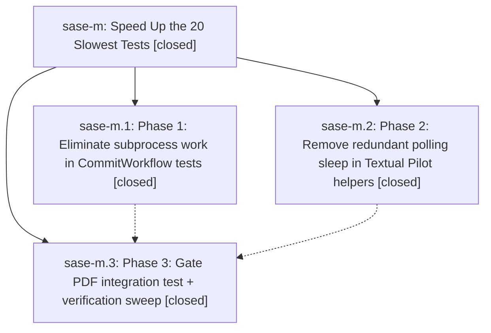

# Bead: sase-m — Speed Up the 20 Slowest Tests

[Bead Pages](../README.md) / sase-m

**Status:** ✓ closed · **Resolution:** (unrecorded) · **Type:** plan · **Tier:** epic
**Owner:** `bryanbugyi34@gmail.com`
**Created:** 2026-04-24 14:30:42 UTC · **Closed:** 2026-04-24 14:57:35 UTC
**Plan:** [202604/speed\_up\_slow\_tests.md](https://github.com/sase-org/sase--plans/blob/main/202604/speed_up_slow_tests.md)

## Description

Reduce wall-clock of just test by cutting the slowest-20 test durations by >=60% without losing coverage or introducing flakiness.

## Phases

| Bead | Title | Status | Size | Agents | Commits |
|---|---|---|---|---:|---:|
| [sase-m.1](sase-m.1.md) | Phase 1: Eliminate subprocess work in CommitWorkflow tests | ✓ closed | small | 0 | 0 |
| [sase-m.2](sase-m.2.md) | Phase 2: Remove redundant polling sleep in Textual Pilot helpers | ✓ closed | small | 0 | 1 |
| [sase-m.3](sase-m.3.md) | Phase 3: Gate PDF integration test + verification sweep | ✓ closed | small | 0 | 1 |

## Lineage

## Commits

| Commit | Subject | Bead | Committed (UTC) |
|---|---|---|---|
| [`3af8a17`](https://github.com/sase-org/sase/commit/3af8a17cceb3ad2d33f9240911033b4345438524) | ref: drop redundant polling sleep in Textual Pilot helpers (sase-m.2) | [sase-m.2](sase-m.2.md) | 2026-04-24 14:49:19 |
| [`4c78426`](https://github.com/sase-org/sase/commit/4c7842661642ae6e6bb0cca48ec1d21cd93d2810) | chore: gate PDF integration test behind a \`slow\` marker (sase-m.3) | [sase-m.3](sase-m.3.md) | 2026-04-24 14:54:26 |
