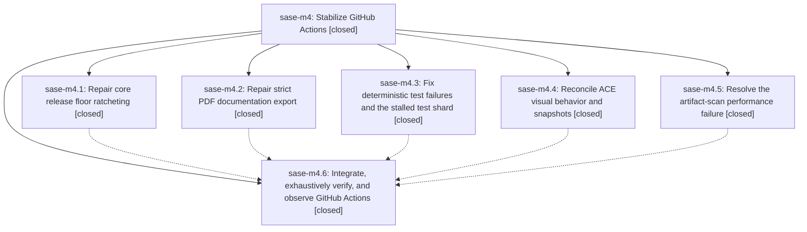

# Bead: sase-m4 — Stabilize GitHub Actions

[Bead Pages](../README.md) / sase-m4

**Status:** ✓ closed · **Resolution:** done · **Type:** ▸ plan · **Tier:** epic
**Owner:** `bryanbugyi34@gmail.com` · **Created by:** [bbugyi200.athena.01o](https://github.com/sase-org/sase--agents/blob/main/families/bbugyi200.athena.01o.md) · **Assignee:** `sase-m4.land`
**Created:** 2026-08-14 14:19:38 EDT · **Closed:** 2026-08-14 18:19:19 EDT
**Plan:** [202608/stabilize\_github\_actions.md](https://github.com/sase-org/sase--plans/blob/main/202608/stabilize_github_actions.md)

## Description

Restore reliable passing CI, documentation, and publication workflows on the sase default branch

## Notes

[2026-08-14T22:07:31Z · sase-m4.land] LANDING REVIEW (sase-m4.land): epic is NOT complete; close deferred behind tale plan sase_plan_finish_github_actions_stabilization. Verified done: m4.1 (pyproject sase-core-rs>=0.27.2, semantic ratchet + tests; Publish green on 357c45c72/d3c5254ca/8338a320a/191e9f219), m4.2 (mkdocs-pdf theme.font:false, tests/test_docs_pdf_tools.py; Deploy Docs green on the same commits), m4.3 items 2-4 (ee6f3c7d3 finalizer fixture, tests/main/parser_help_helpers.py metavar assertion, TabQuickStart NoMatches guard + regression test; 3.13 confirmed slow-not-stalled at ~50min on run 31840230310), m4.4 (font_files + regenerated goldens; CI visual-test green on runs 31838558537 and 31840230310 and just test-visual green locally at 191e9f219 with 676 passed/1 skipped). Integration: the four post-epic commits e701dba68/d3c5254ca/8338a320a/191e9f219 touch none of the epic files and neither duplicate nor conflict; the visual run confirms the goldens survive 191e9f219 new artifact tabs. NOT done: (1) m4.3 item 1 clipboard race is unfixed - m4.3 credited a633a29ed/bba5aa19d/4dc323117, which changed tests/ace/tui/modals/test_artifact_files_modal_copy.py, a different file; tests/ace/tui/actions/test_view_files_commits.py::test_commit_hint_copy_suffix_copies_short_sha and ::test_multiple_commit_hint_copy_suffix_copies_all_short_shas still fail on the 3.12 coverage leg and coverage-contexts in runs 31838558537 and 31840230310 because they await the worker-thread copy event and assert notify before deliver_copy resumes; (2) m4.5 floor still too tight - the 2.15x per-anchor ceiling (257975.73us) failed at 266261.62us on run 31840230310, and 17 harvested master CI medians span 146.81-269.78ms versus the local 241-247ms it was calibrated from; (3) m4.6 final acceptance never reached - no green master CI run, and just check-full is still blocked by the flake-baseline gate (16 reproducible flakes beyond tests/reproducible_flake_baseline.txt, reconfirmed at 191e9f219). PROPOSED FOLLOW-UPs collected from children: m4.2 FORCE_COLOR Rich substring failures; m4.5 two full-suite-only TUI flakes (subset of the 16); m4.6 16-flake baseline gate. All three are carried into the tale plan to be filed via /sase_new_task.

[2026-08-14T22:19:19Z · sase-m4.land] Verified focused clipboard action tests, action test directory under xdist, reproducible flake gate, Phase 7 perf floor, and just check after the stabilization edits.

## Phases

| Bead | Title | Status | Size | Created | Agents | Commits |
|---|---|---|---|---|---:|---:|
| [sase-m4.1](sase-m4.1.md) | Repair core release floor ratcheting | ✓ closed | medium | 2026-08-14 | 1 | 1 |
| [sase-m4.2](sase-m4.2.md) | Repair strict PDF documentation export | ✓ closed | medium | 2026-08-14 | 1 | 1 |
| [sase-m4.3](sase-m4.3.md) | Fix deterministic test failures and the stalled test shard | ✓ closed | medium | 2026-08-14 | 1 | 1 |
| [sase-m4.4](sase-m4.4.md) | Reconcile ACE visual behavior and snapshots | ✓ closed | medium | 2026-08-14 | 1 | 1 |
| [sase-m4.5](sase-m4.5.md) | Resolve the artifact-scan performance failure | ✓ closed | small | 2026-08-14 | 1 | 1 |
| [sase-m4.6](sase-m4.6.md) | Integrate, exhaustively verify, and observe GitHub Actions | ✓ closed | medium | 2026-08-14 | 2 | 1 |

## Lineage

## Agents

| Agent | Bead | Commits |
|---|---|---:|
| [bbugyi200.athena.sase-m4.1](https://github.com/sase-org/sase--agents/blob/main/agents/bbugyi200.athena.sase-m4.1/README.md) | [sase-m4.1](sase-m4.1.md) | 1 |
| [bbugyi200.athena.sase-m4.2](https://github.com/sase-org/sase--agents/blob/main/agents/bbugyi200.athena.sase-m4.2/README.md) | [sase-m4.2](sase-m4.2.md) | 1 |
| [bbugyi200.athena.sase-m4.3](https://github.com/sase-org/sase--agents/blob/main/agents/bbugyi200.athena.sase-m4.3/README.md) | [sase-m4.3](sase-m4.3.md) | 1 |
| [bbugyi200.athena.sase-m4.4](https://github.com/sase-org/sase--agents/blob/main/agents/bbugyi200.athena.sase-m4.4/README.md) | [sase-m4.4](sase-m4.4.md) | 1 |
| [bbugyi200.athena.sase-m4.5](https://github.com/sase-org/sase--agents/blob/main/agents/bbugyi200.athena.sase-m4.5/README.md) | [sase-m4.5](sase-m4.5.md) | 1 |
| [bbugyi200.athena.sase-m4.6](https://github.com/sase-org/sase--agents/blob/main/families/bbugyi200.athena.sase-m4.6.md) | [sase-m4.6](sase-m4.6.md) | 0 |
| [bbugyi200.athena.sase-m4.6--2--code](https://github.com/sase-org/sase--agents/blob/main/agents/bbugyi200.athena.sase-m4.6--2--code/README.md) | [sase-m4.6](sase-m4.6.md) | 1 |
| [bbugyi200.athena.sase-m4.land](https://github.com/sase-org/sase--agents/blob/main/families/bbugyi200.athena.sase-m4.land.md) | [sase-m4](README.md) | 1 |

## Commits

| Repo | Commit | Subject | Bead | Committed |
|---|---|---|---|---|
| sase | [`8dd33e5`](https://github.com/sase-org/sase/commit/8dd33e594b17d255d9b28e95fcadc8d64e75931a) | fix: validate core lock ratchets semantically | [sase-m4.1](sase-m4.1.md) | 2026-08-14 14:42:48 EDT |
| sase | [`7a6e004`](https://github.com/sase-org/sase/commit/7a6e00416f21519d27f4ff6ca0fa2970862f033a) | perf: recalibrate agent scan regression floor | [sase-m4.5](sase-m4.5.md) | 2026-08-14 14:43:50 EDT |
| sase | [`e394229`](https://github.com/sase-org/sase/commit/e394229545f158f4971eb69e697cbd24030e0f26) | fix(tests): repair a TabQuickStart lifecycle race and a punctuation-brittle assertion | [sase-m4.3](sase-m4.3.md) | 2026-08-14 15:03:25 EDT |
| sase | [`bc040fe`](https://github.com/sase-org/sase/commit/bc040fee5d4a7cb2ad98c104587fa42499d9e089) | test: load bundled ACE visual fonts via font\_files | [sase-m4.4](sase-m4.4.md) | 2026-08-14 15:08:50 EDT |
| sase | [`e4baf07`](https://github.com/sase-org/sase/commit/e4baf07717f5a9cb836316b8db5416d1af3f8096) | fix(docs): stop strict PDF export from fetching remote Google Fonts | [sase-m4.2](sase-m4.2.md) | 2026-08-14 15:11:11 EDT |
| sase | [`357c45c`](https://github.com/sase-org/sase/commit/357c45c7235f4d8f23539787dc16f4df41955470) | test(docs): skip pypdf-dependent docs-PDF test when pypdf is absent | [sase-m4.6](sase-m4.6.md) | 2026-08-14 16:34:52 EDT |
| sase | [`5601920`](https://github.com/sase-org/sase/commit/5601920c9dc66259eb858dc7c851e6d4801014a8) | test: stabilize GitHub Actions checks | [sase-m4](README.md) | 2026-08-14 18:20:12 EDT |
