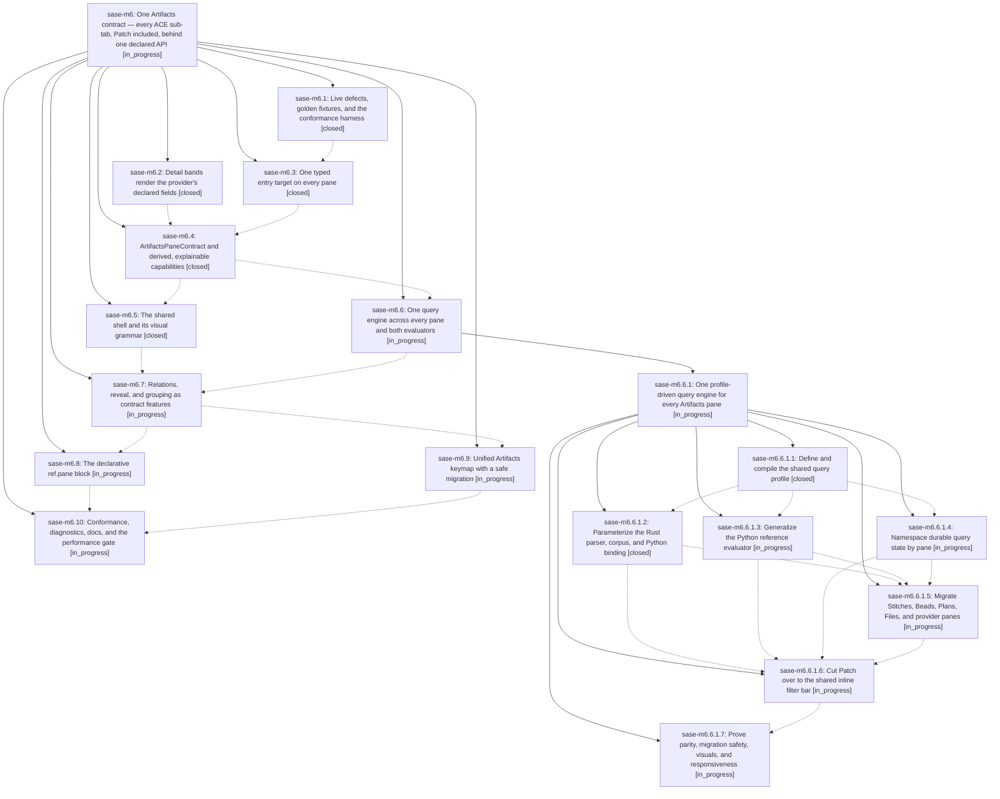

# Bead: sase-m6 — One Artifacts contract — every ACE sub-tab, Patch included, behind one declared API

[Bead Pages](../README.md) / sase-m6

**Status:** ◐ in_progress · **Type:** ▸ plan · **Tier:** epic
**Owner:** `bryanbugyi34@gmail.com` · **Created by:** [bbugyi200.athena.01u](https://github.com/sase-org/sase--agents/blob/main/families/bbugyi200.athena.01u.md) · **Assignee:** `sase-m6.land`
**Created:** 2026-08-14 17:05:15 EDT
**Plan:** [202608/artifacts\_pane\_contract.md](https://github.com/sase-org/sase--plans/blob/main/202608/artifacts_pane_contract.md)

## Description

Every ACE Artifacts sub-tab — Patch included — is driven by one host-owned ArtifactsPaneContract whose capabilities are derived from declared data. A sidecar or artifact repo declares facts in its ref spec and inherits querying, relations, grouping, marks, copy, help and chrome without shipping code, so a new sub-tab feature is implemented once and appears in every configured provider's tab — including providers belonging to users we will never see.

## Notes

[2026-08-15T01:24:53Z · sase-m9.1.1.land] DISCOVERED ISSUE: Proposed follow-up from sase-m9.1.1.2 while landing shell taxonomy: the full ACE PNG visual suite's Artifacts/Beads snapshots fail before PNG comparison because select_entry_target cannot find alpha-1 / alpha-open. This is distinct from renderer drift and from canceled task sase-l8, which covered Artifacts/Beads provider-inventory pixel drift; here fixture/selection behavior breaks before a golden comparison. The report is not caused by epic sase-m9.1.1. It is plausibly causally linked to this active Artifacts contract epic because phase sase-m6.3 promoted ArtifactEntryTarget to typed pane identities and retired index-based marks/jump anchors. Please verify the Artifacts/Beads visual fixtures target the new typed entry identities or preserve legacy fixture tokens intentionally.

[2026-08-15T04:44:40Z · sase-m4.land--a] DISCOVERED ISSUE: While observing finish_github_actions_stabilization, master CI run 31861402259 for d19d08641246a2b0f9276fded07d93004815d640 failed the visual-test job after d19d0864 (feat(tui): give every Artifacts pane a shared shell and visual grammar), which is part of this active Artifacts contract epic. Failures: Help keymaps PNG mismatch, Help filter PNG mismatch, Models panel builtin effort picker PNG mismatch, Artifacts/Beads populated and reopened detail select_entry_target returned false for typed bead targets, and Artifacts files nested strip PNG mismatch. This extends the 2026-08-15T01:24 note: the Artifacts/Beads target failure still reproduces, and additional Help/Models/Artifacts snapshots drift after the shared-shell/visual-grammar work. Epic sase-m4's stabilization commit 5601920c9 is merely an ancestor; perf-floors and nonvisual Python 3.12/3.14 jobs passed, so this CI red is attributable to later Artifacts/TUI work, not the stabilization tale.

## Phases

| Bead | Title | Status | Size | Created | Agents | Commits |
|---|---|---|---|---|---:|---:|
| [sase-m6.1](sase-m6.1.md) | Live defects, golden fixtures, and the conformance harness | ✓ closed | medium | 2026-08-14 | 1 | 1 |
| [sase-m6.10](sase-m6.10.md) | Conformance, diagnostics, docs, and the performance gate | ◐ in_progress | medium | 2026-08-14 | 1 | 0 |
| [sase-m6.2](sase-m6.2.md) | Detail bands render the provider's declared fields | ✓ closed | xsmall | 2026-08-14 | 1 | 1 |
| [sase-m6.3](sase-m6.3.md) | One typed entry target on every pane | ✓ closed | large | 2026-08-14 | 1 | 1 |
| [sase-m6.4](sase-m6.4.md) | ArtifactsPaneContract and derived, explainable capabilities | ✓ closed | large | 2026-08-14 | 1 | 1 |
| [sase-m6.5](sase-m6.5.md) | The shared shell and its visual grammar | ✓ closed | large | 2026-08-14 | 1 | 1 |
| [sase-m6.6](sase-m6.6.md) | One query engine across every pane and both evaluators | ◐ in_progress | xlarge | 2026-08-14 | 1 | 0 |
| [sase-m6.7](sase-m6.7.md) | Relations, reveal, and grouping as contract features | ◐ in_progress | large | 2026-08-14 | 1 | 0 |
| [sase-m6.8](sase-m6.8.md) | The declarative ref.pane block | ◐ in_progress | large | 2026-08-14 | 1 | 0 |
| [sase-m6.9](sase-m6.9.md) | Unified Artifacts keymap with a safe migration | ◐ in_progress | medium | 2026-08-14 | 1 | 0 |

## Lineage

## Agents

| Agent | Bead | Commits |
|---|---|---:|
| [bbugyi200.athena.sase-m6.1](https://github.com/sase-org/sase--agents/blob/main/agents/bbugyi200.athena.sase-m6.1/README.md) | [sase-m6.1](sase-m6.1.md) | 1 |
| [bbugyi200.athena.sase-m6.10](https://github.com/sase-org/sase--agents/blob/main/agents/bbugyi200.athena.sase-m6.10/README.md) | [sase-m6.10](sase-m6.10.md) | 0 |
| [bbugyi200.athena.sase-m6.2](https://github.com/sase-org/sase--agents/blob/main/agents/bbugyi200.athena.sase-m6.2/README.md) | [sase-m6.2](sase-m6.2.md) | 1 |
| [bbugyi200.athena.sase-m6.3](https://github.com/sase-org/sase--agents/blob/main/families/bbugyi200.athena.sase-m6.3.md) | [sase-m6.3](sase-m6.3.md) | 1 |
| [bbugyi200.athena.sase-m6.4](https://github.com/sase-org/sase--agents/blob/main/families/bbugyi200.athena.sase-m6.4.md) | [sase-m6.4](sase-m6.4.md) | 1 |
| [bbugyi200.athena.sase-m6.5](https://github.com/sase-org/sase--agents/blob/main/families/bbugyi200.athena.sase-m6.5.md) | [sase-m6.5](sase-m6.5.md) | 1 |
| [bbugyi200.athena.sase-m6.6](https://github.com/sase-org/sase--agents/blob/main/families/bbugyi200.athena.sase-m6.6.md) | [sase-m6.6](sase-m6.6.md) | 0 |
| [bbugyi200.athena.sase-m6.6.1.1](https://github.com/sase-org/sase--agents/blob/main/families/bbugyi200.athena.sase-m6.6.1.1.md) | [sase-m6.6.1.1](sase-m6.6.1.1.md) | 1 |
| [bbugyi200.athena.sase-m6.6.1.2](https://github.com/sase-org/sase--agents/blob/main/families/bbugyi200.athena.sase-m6.6.1.2.md) | [sase-m6.6.1.2](sase-m6.6.1.2.md) | 1 |
| [bbugyi200.athena.sase-m6.6.1.3](https://github.com/sase-org/sase--agents/blob/main/agents/bbugyi200.athena.sase-m6.6.1.3/README.md) | [sase-m6.6.1.3](sase-m6.6.1.3.md) | 0 |
| [bbugyi200.athena.sase-m6.6.1.4](https://github.com/sase-org/sase--agents/blob/main/agents/bbugyi200.athena.sase-m6.6.1.4/README.md) | [sase-m6.6.1.4](sase-m6.6.1.4.md) | 0 |
| [bbugyi200.athena.sase-m6.6.1.5](https://github.com/sase-org/sase--agents/blob/main/agents/bbugyi200.athena.sase-m6.6.1.5/README.md) | [sase-m6.6.1.5](sase-m6.6.1.5.md) | 0 |
| [bbugyi200.athena.sase-m6.6.1.6](https://github.com/sase-org/sase--agents/blob/main/agents/bbugyi200.athena.sase-m6.6.1.6/README.md) | [sase-m6.6.1.6](sase-m6.6.1.6.md) | 0 |
| [bbugyi200.athena.sase-m6.6.1.7](https://github.com/sase-org/sase--agents/blob/main/agents/bbugyi200.athena.sase-m6.6.1.7/README.md) | [sase-m6.6.1.7](sase-m6.6.1.7.md) | 0 |
| [bbugyi200.athena.sase-m6.6.1.land](https://github.com/sase-org/sase--agents/blob/main/agents/bbugyi200.athena.sase-m6.6.1.land/README.md) | [sase-m6.6.1](sase-m6.6.1.md) | 0 |
| [bbugyi200.athena.sase-m6.7](https://github.com/sase-org/sase--agents/blob/main/agents/bbugyi200.athena.sase-m6.7/README.md) | [sase-m6.7](sase-m6.7.md) | 0 |
| [bbugyi200.athena.sase-m6.8](https://github.com/sase-org/sase--agents/blob/main/agents/bbugyi200.athena.sase-m6.8/README.md) | [sase-m6.8](sase-m6.8.md) | 0 |
| [bbugyi200.athena.sase-m6.9](https://github.com/sase-org/sase--agents/blob/main/agents/bbugyi200.athena.sase-m6.9/README.md) | [sase-m6.9](sase-m6.9.md) | 0 |
| [bbugyi200.athena.sase-m6.land](https://github.com/sase-org/sase--agents/blob/main/agents/bbugyi200.athena.sase-m6.land/README.md) | [sase-m6](README.md) | 0 |

## Commits

| Repo | Commit | Subject | Bead | Committed |
|---|---|---|---|---|
| sase | [`8338a32`](https://github.com/sase-org/sase/commit/8338a320ac1d04c8a5fbc406659804bb841fb63f) | fix: order artifact detail fields from provider specs | [sase-m6.2](sase-m6.2.md) | 2026-08-14 17:28:28 EDT |
| sase | [`191e9f2`](https://github.com/sase-org/sase/commit/191e9f2196830a547306d6de0f660a3cccf00235) | feat(ace): stabilize provider tabs and freeze Patch contract goldens | [sase-m6.1](sase-m6.1.md) | 2026-08-14 17:51:38 EDT |
| sase | [`33180da`](https://github.com/sase-org/sase/commit/33180daf1e381f44a88a8825fa9e46d7c55b2228) | feat(ace): give every Artifacts pane a typed, serializable row identity | [sase-m6.3](sase-m6.3.md) | 2026-08-14 19:56:53 EDT |
| sase | [`7060a2e`](https://github.com/sase-org/sase/commit/7060a2ec45dc8a89f6f29b72e9555259103259e7) | feat(tui): drive Artifacts panes from a derived host contract | [sase-m6.4](sase-m6.4.md) | 2026-08-14 21:17:24 EDT |
| sase | [`d19d086`](https://github.com/sase-org/sase/commit/d19d08641246a2b0f9276fded07d93004815d640) | feat(tui): give every Artifacts pane a shared shell and visual grammar | [sase-m6.5](sase-m6.5.md) | 2026-08-14 23:17:01 EDT |
| sase | [`2f9b59c`](https://github.com/sase-org/sase/commit/2f9b59cadb2a25169a15a58c8ab7aa5c05c2cfc4) | feat(ace): define and compile the shared query profile | [sase-m6.6.1.1](sase-m6.6.1.1.md) | 2026-08-15 07:02:27 EDT |
| sase-core | [`sase-core@ba78216`](https://github.com/sase-org/sase-core/commit/ba7821682990377dae42ad9c8a08392592470f54) | feat(query): parameterize the Rust query engine by compiled profile | [sase-m6.6.1.2](sase-m6.6.1.2.md) | 2026-08-15 07:43:27 EDT |
